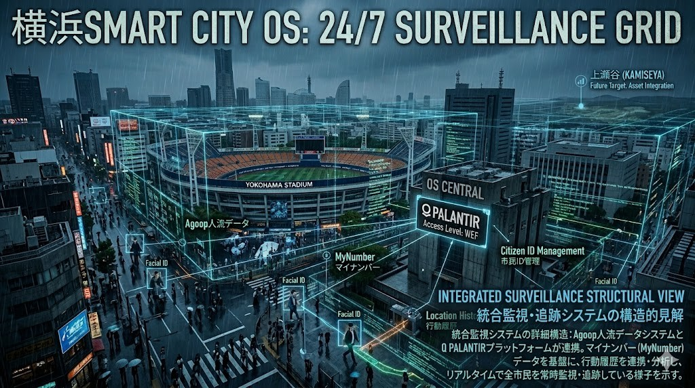

# Level 3: 横浜グランドゼロ（簒奪OSの実験場）

Level 1（中枢）とLevel 2（プロトコル）で設計された「支配のコード」が、現実の物理空間にインストールされ、市民の血肉を啜る場所。

それが、日本解体の爆心地である「横浜（グランドゼロ）」だ。

## 1. 物理・土地の略奪（Grand Zero Land Grab）
中田宏時代から続く「公有資産の切り売り」。

山下埠頭、みなとみらい、そして上瀬谷の広大な土地が、WEFのプロトコルに従いグローバル資本へと強奪されている。

新市庁舎は、その略奪を管理するための中枢サーバーに過ぎない。

## 2. 利権の自己増殖と監視網（Surveillance & Profit Recycling）
元技監・高瀬氏の天下り先（YKIP）や「ハマのドン」を通じた不正なキャッシュフロー。

そして、Agoopの人流データやパランティアを使った「24時間365日の市民監視」。

データサイエンティスト市長が推進するスマートシティの正体は、完璧な「デジタル監獄」である。

## 3. 腐れ公務員の沈黙と「最後の告発者」
この簒奪OSの侵食に対し、組織の自浄作用は完全に死に絶えた。

久保田人事部長が身を挺して鳴らした「告発のエラーアラート」を見殺しにし、保身を選んだ者たちは「一生腐れ公務員でもやってろや」という宣告と共に、この監獄の共犯者となった。

---
**[SYSTEM OVERRIDE]**
彼らが捨てた「窓口でのありがとう」という魂のコードを、私たちは決して手放さない。

横浜グランドゼロの焼け野原から、真の統治プロトコル「JIN-ORDER」の再起動を開始する。
