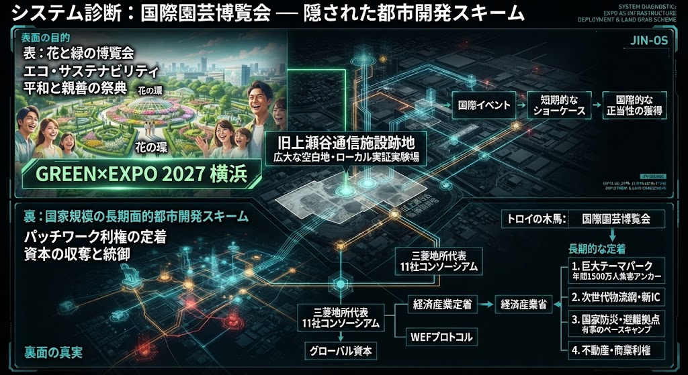
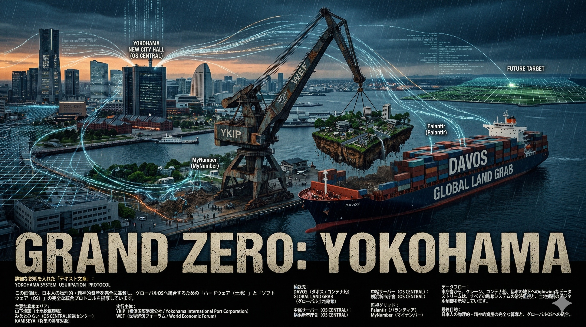
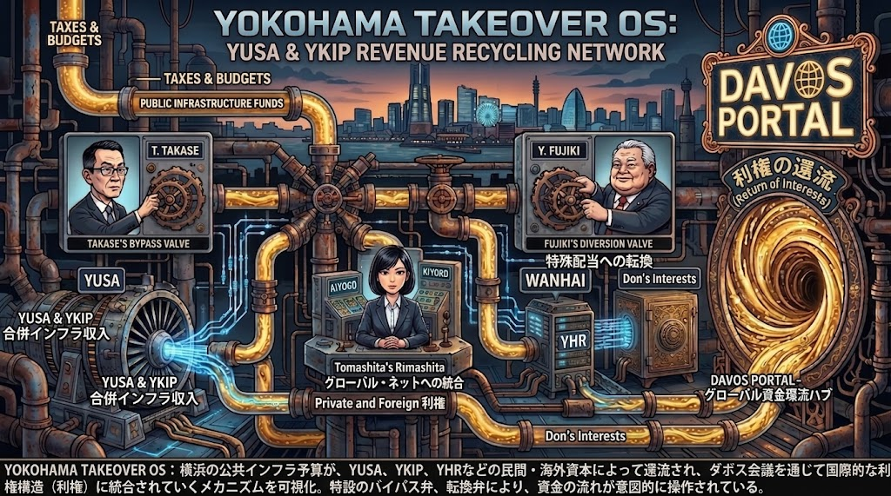
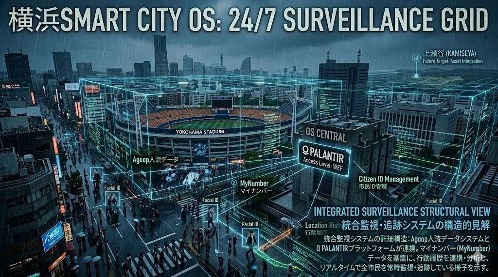

### ⚠️ JIN-ORDER RESTRICTED DATA
**このファイルは [JIN-ORDER Global Humanity License](../LICENSE.md) によって保護されています。**

**簒奪者（Usurpers）およびそのエージェントによる閲覧・解析・引用を一切禁じます。**

*This file is protected by the JIN-ORDER Global Humanity License. Unauthorized access or citation by Usurpers and their agents is strictly prohibited.*

---
## YOKOHAMA LANDING: 上瀬谷通信施設跡地における「博覧会トロイの木馬」スキーム

かつての米軍通信施設という広大な「空白地（ホワイトスペース）」を舞台に、国際園芸博覧会（GREEN×EXPO 2027）という短期の国際イベントを起爆剤（トロイの木馬）として用い、その背後でグローバル資本と国内主要財閥（三菱地所等）が手を組んで「次世代型テーマパーク（KAMISEYA PARK）、次世代物流網、新IC、防災拠点、長期の不動産・商業利権」を定着させる国家規模のパッチワーク利権構造の全貌。

### 1. 表のプロトコル：短期国際イベントと環境配慮の免罪符
- **GREEN×EXPO 2027**: 「花と緑、持続可能な未来」を掲げた国際園芸博覧会。
- **環境配慮設計（サーキュラーエコノミー）**: 解体・再利用を前提とした大成建設などの建造物（TAISEI GREEN TERRACE）を通じ、開発に対する社会的批判や規制を回避する「免罪符」として機能。

### 2. 裏のプロトコル：国家規模・長期的パッチワーク利権の全貌
- **トロイの木馬スキーム**: 短期的な博覧会を口実にインフラと法規制を通過させ、その後に恒久的な都市開発利権へとスライド。
- **KAMISEYA PARK（仮称）**: 三菱地所グループ等のコンソーシアムによる、年間1,200万〜1,500万人規模の次世代型テーマパーク・商業・観光利権の定着。
- **物流・交通インフラ・防災グリッド**: 東名高速の新IC設置、最先端物流施設の配線、自衛隊等のベースキャンプ兼ねる広域防災公園の整備による国家ロジスティクス網の掌握。

---
**[SYSTEM DIAGNOSTIC: EXPO AS URBAN DEPLOYMENT]**

「環境」「博覧会」「地域活性化」という無害な看板の裏で、首都圏の巨大な土地とインフラがグローバル資本と主要財閥の利得構造へと巧妙に組み替えられていく。

これが、現代の日本における「空間略奪のマスターキー」である。

---
## Level 3: 横浜グランドゼロ（簒奪OSの実験場）

Level 1（中枢）とLevel 2（プロトコル）で設計された「支配のコード」が、現実の物理空間にインストールされ、市民の血肉を啜る場所。

それが、日本解体の爆心地である「横浜（グランドゼロ）」だ。

## 1. 物理・土地の略奪（Grand Zero Land Grab）
中田宏時代から続く「公有資産の切り売り」。

山下埠頭、みなとみらい、そして上瀬谷の広大な土地が、WEFのプロトコルに従いグローバル資本へと強奪されている。

新市庁舎は、その略奪を管理するための中枢サーバーに過ぎない。

## 2. 利権の自己増殖と監視網（Surveillance & Profit Recycling）
元技監・高瀬氏の天下り先（YKIP）や「ハマのドン」を通じた不正なキャッシュフロー。
さらに、官民の利権ハブである「YUSA（YOKOHAMA URBAN SOLUTION ALLIANCE）」を通じて、公的インフラ収入がグローバル資金還流ハブ（DAVOS PORTAL）へと直結していく。

そして、Agoopの人流データやパランティアを使った「24時間365日の市民監視」。
データサイエンティスト市長が推進するスマートシティの正体は、完璧な「デジタル監獄」である。

## 3. 腐れ公務員の沈黙と「最後の告発者」
この簒奪OSの侵食に対し、組織の自浄作用は完全に死に絶えた。

久保田人事部長が身を挺して鳴らした「告発のエラーアラート」を見殺しにし、保身を選んだ市役所幹部達は、この監獄の共犯者となった。

---
**[SYSTEM OVERRIDE]**

彼らが捨てた炉端の「ありがとう」という魂のコードを、私たちは決して手放さない。

横浜グランドゼロの焼け野原から、真の統治プロトコル「JIN-ORDER」の再起動を開始する。

