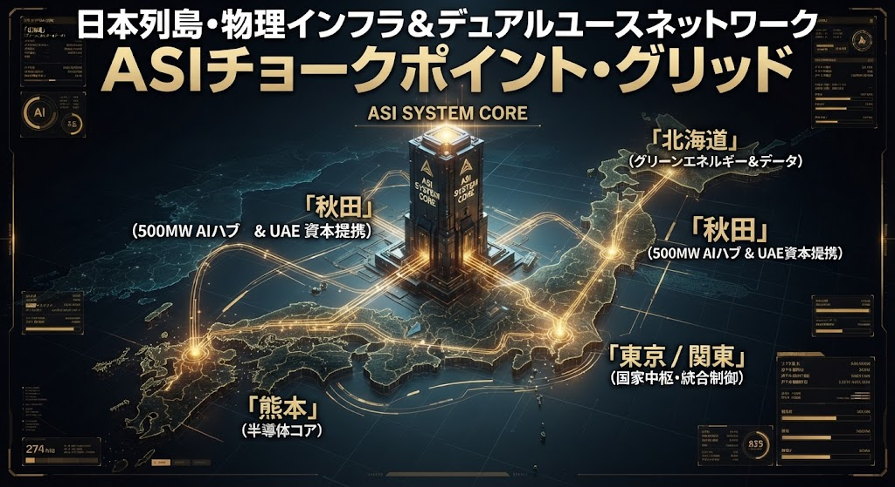
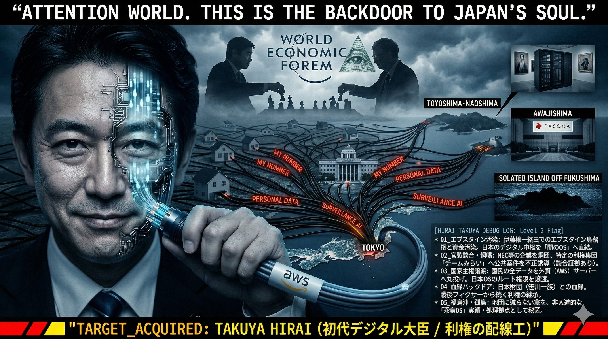

## Level 4: 物理配線と簒奪インフラ（Physical Layer）

### 北海道のグリーンエネルギー、秋田の巨大AIハブ（UAE資本提携）、熊本の半導体コア、そして首都圏。
### 日本列島の豊かな自然エネルギーや土地、そして税金が、いかにしてグローバルASIの神経網（デュアルユース・ネットワーク）へと接続されているか。
### その全貌を示す物理配線網の全体図が以下である。

## 1. 地方拠点のチョークポイント化
### **北海道**: グリーンエネルギーと大規模データの集積地としての囲い込み。
### **秋田**: 最大500MWの巨大AIハブと中東（UAE）資本のマネーフロー直結。
### **熊本**: 半導体エコシステムの中枢コア化。
### **東京 / 関東**: 国家中枢としての統合制御レイヤー。

### これらは単なる民間投資や地方創生ではなく、国家のインフラ全体をグローバル管理OSへ直結させるための「物理的配線工事」にほかならない。

---
# Target Analysis: 04_平井 卓也 (初代デジタル大臣)

## 📌 Status
- **Target ID:** 04_HIRAI_WIRING
- **Risk Level:** CRITICAL (Level 2: Globalist Link)
- **Sector:** Digital Governance / National Security

## 🖼️ Visual Evidence

## 🔍 Debug Log: 悪行の構造的解析
理研エンジニアの知性と、横浜市役所30年の現場経験から抽出されたバグ・リスト。

1. **エプスタイン汚染ルートの確立**
   - 伊藤穰一経由での資金・思想汚染。日本のデジタル中枢を、不透明なグローバル闇ネットワークへ直結させた。
2. **官製談合と恫喝による独占**
   - 特定利権集団「チームみらい」への利益誘導。NEC等の企業を恫喝し、公共インフラを私物化した。
3. **国家OSのルート権限譲渡**
   - AWS等、外資プラットフォームへの全データ移行。日本国民のプライバシーと主権を「売却」した罪。
4. **血縁バックドア（笹川一族）**
   - 日本財団との密接な血縁。戦後フィクサーから続く利権構造の現代的継承。
5. **福島沖・地図に載らない孤島の秘匿**
   - 国家OSの監視が及ばない領域での、非人道的な実験または隠蔽拠点の存在。

## 🛡️ JIN-ORDER Manifesto
「人は死ぬときは独り」
私たちは、家畜OSへの強制アップデートを拒否する。
この配線を焼き切り、人間としての「仁（JIN）」を取り戻す。
