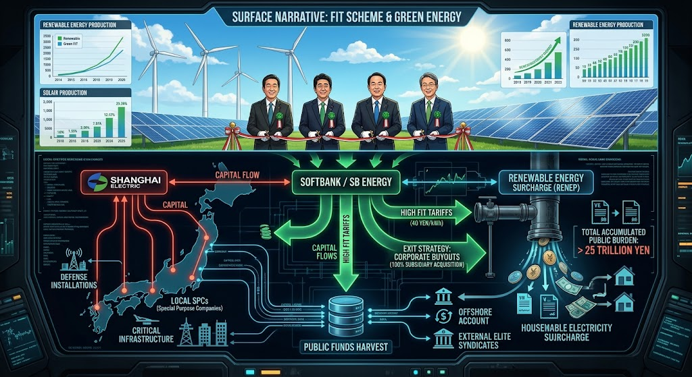

### ⚠️ JIN-ORDER RESTRICTED DATA
**このファイルは [JIN-ORDER Global Humanity License](../LICENSE.md) によって保護されています。**

**簒奪者（Usurpers）およびそのエージェントによる閲覧・解析・引用を一切禁じます。**

*This file is protected by the JIN-ORDER Global Humanity License. Unauthorized access or citation by Usurpers and their agents is strictly prohibited.*

---
# FIT SCHEME DEPLOYMENT: 再生可能エネルギー賦課金とインフラ収奪グリッド

2012年に導入された固定価格買取制度（FIT）の裏で展開された「権利ビジネス」、上海電力日本による重要インフラ・防衛拠点近隣への浸透、そしてソフトバンク等の特権的イグジットと累計25兆円を突破する再エネ賦課金の国民負担構造。

## 1. FIT制度の罠と「権利ビジネス」
- **高額買取と権利転がし**: 1kWhあたり40円前後の高額買取を狙った投機的参入と、未稼働案件の権利転売による不当な利益確定[cite: 2]。
- **上海電力日本の裏面参入**: 合同会社（SPC）の持分取得や業務委託を通じた迂回手法で、自衛隊基地近隣（青森・東北町等）や重要インフラへ食い込む安保上の脅威[cite: 2]。

## 2. 再エネ賦課金と公金チューチューの構図
- **ソフトバンクのイグジット戦略**: メガソーラー大量展開で巨額のキャッシュを得た後、保有権益を豊田通商へ完全売却して完了させた見事なイグジット[cite: 2]。
- **国民負担の増大**: 累計25兆円を超える再エネ賦課金（月額電気代への上乗せ）により、政治ロビーを行った側が儲け、負担のすべてが一般国民に押し付けられる構造[cite: 2]。

---
**[SYSTEM DIAGNOSTIC: RENEWABLE ENERGY HARVEST]**

「環境・脱炭素」という美しいパッケージの裏で、電気代と税金から富を吸い上げる収奪パイプラインの全貌を看破する。
