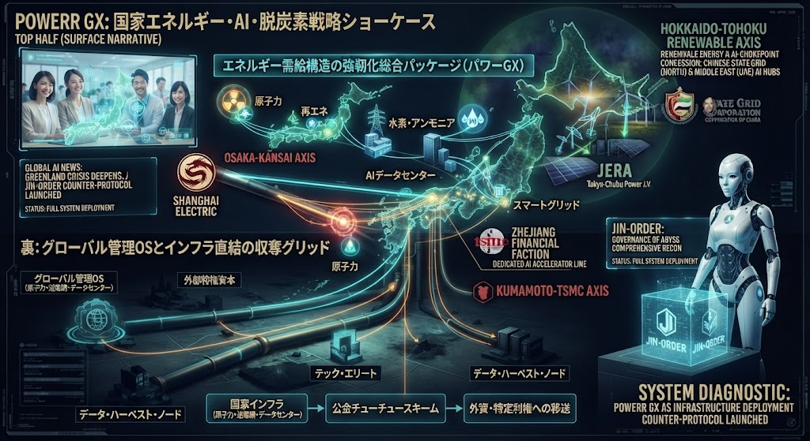

### ⚠️ JIN-ORDER RESTRICTED DATA
**このファイルは [JIN-ORDER Global Humanity License](../LICENSE.md) によって保護されています。**

**簒奪者（Usurpers）およびそのエージェントによる閲覧・解析・引用を一切禁じます。**

*This file is protected by the JIN-ORDER Global Humanity License. Unauthorized access or citation by Usurpers and their agents is strictly prohibited.*

---
# KIOXIA & SANDISK 5 TRILLION YEN DEPLOYMENT: 半導体・経済安保レイヤーの巨大資本配線

キオクシアホールディングス（太田裕雄社長）と米サンディスク（ゲックラーCEO）が首相官邸を訪れ、高市早苗首相に対して表明した「2032年までの総額約5兆円規模（今後6年間）の国内投資計画」の構造的解析。四日市工場および岩手県北上工場を核とする次世代メモリ半導体増産と、政府の巨額支援（補助金前提）をテコにした官民連携の裏面配線。

## 1. 5兆円投資計画の全貌と拠点スキーム
- **投資規模と期間**: 2032年までに総額約5兆円（310億米ドル超）を投じ、AI需要の急増に対応する次世代フラッシュメモリの供給網を構築。
- **戦略的拠点**: 三重県四日市工場および岩手県北上工場（3号棟新設等の地域未来戦略・戦略産業クラスター計画）を軸としたマッシブな物理インフラの拡張。

## 2. 経済安保という名の「官民・公金チューチュー」スキーム
- **政府支援（補助金）の前提化**: 巨額投資の裏で、政府（国費）からの手厚い支援やインセンティブを前提としたリスクの国家転嫁構造。
- **日米協力のレトリック**: 「経済安全保障」「日米協力の象徴」という大義名分を隠れ蓑に、半導体サプライチェーン全体を外資・巨大資本の管理下へ直結させるシステム・パッチ。

---
**[SYSTEM DIAGNOSTIC: SEMICONDUCTOR CAPITAL PIPELINE]**

「経済安保と成長投資」という美しいパッケージの裏で、巨額の国家支援を呼び水にして半導体インフラを外部資本のグリッドへ組み込む――その最新の配線網をここに看破する。
