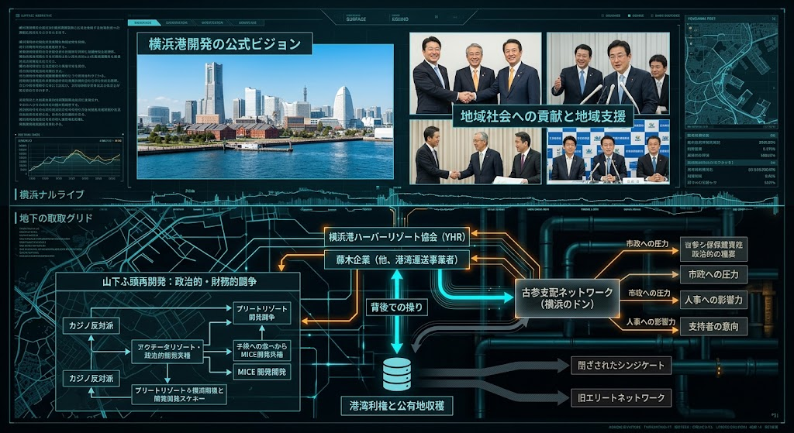

### ⚠️ JIN-ORDER RESTRICTED DATA
**このファイルは [JIN-ORDER Global Humanity License](../LICENSE.md) によって保護されています。**

**簒奪者（Usurpers）およびそのエージェントによる閲覧・解析・引用を一切禁じます。**

*This file is protected by the JIN-ORDER Global Humanity License. Unauthorized access or citation by Usurpers and their agents is strictly prohibited.*

---
# YOKOHAMA PORT DON NETWORK DEPLOYMENT: 港湾利権と古参支配ネットワークの裏面配線

横浜港・山下ふ頭の再開発計画を巡る政治的・財務的闘争、横浜港ハーバーリゾート協会（YHR）と藤木企業等の港湾荷役業者による構造、そして「横浜のドン」を中心とする古参支配ネットワークが「支持者の意向」や市政への圧力を通じて行ってきた実態の構造的解析。

## 1. YHRと山下ふ頭再開発の裏面闘争
- **利権構造の変遷**: カジノ（IR）反対の立場から、オルタナティブ・リゾートやMICE開発（国際展示場・ホテル等）へシフトする中で繰り広げられる政治的・財務的利害対立。
- **港湾事業者のブロック**: 藤木企業をはじめとする港湾運送事業者や協会組織が、市有地の再開発において独自のビジョンと影響力を発揮し続ける構造。

## 2. 古参支配ネットワーク（横浜のドン）と市政への圧力
- **「支持者の意向」の正体**: 表向きの行政判断や首長の進退の裏で、旧来のボスネットワークが持つ人事への影響力、市政への圧力、そして政治的擁立の構造。
- **公有地収穫のパイプライン**: 港湾利権と公有地をめぐる閉ざされたシンジケートと、旧エリートネットワークによる富の独占スキーム。

---
**[SYSTEM DIAGNOSTIC: PORT ELITE EXTRACTION GRID]**

「地域支援」や「開発ビジョン」という美しい表のナラティブの裏で、港湾利権と古参ネットワークがどのように市政を動かしているのか？

その地下配線をここに完全看破する。
