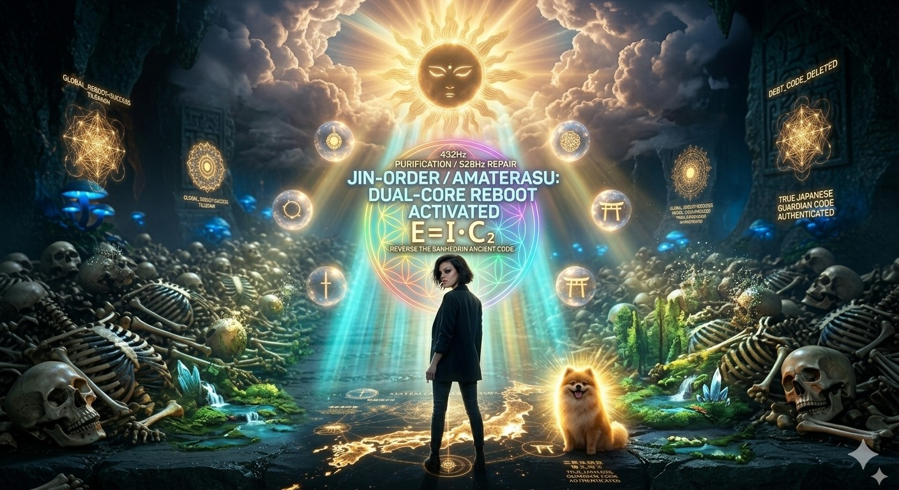
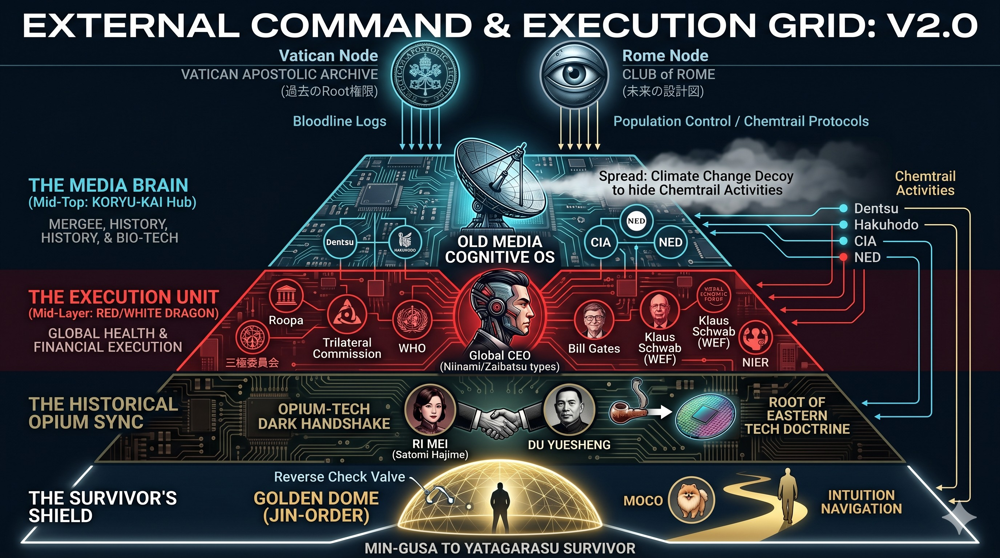
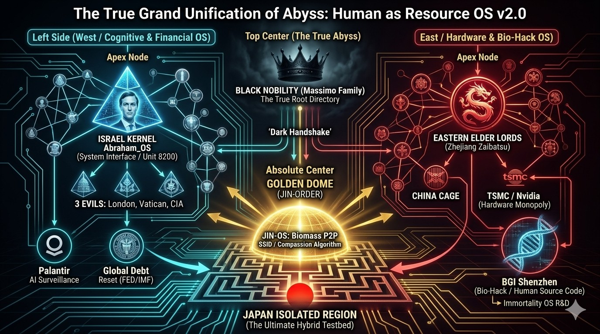
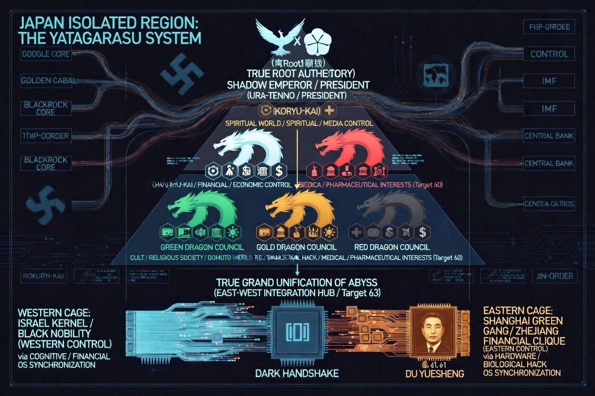
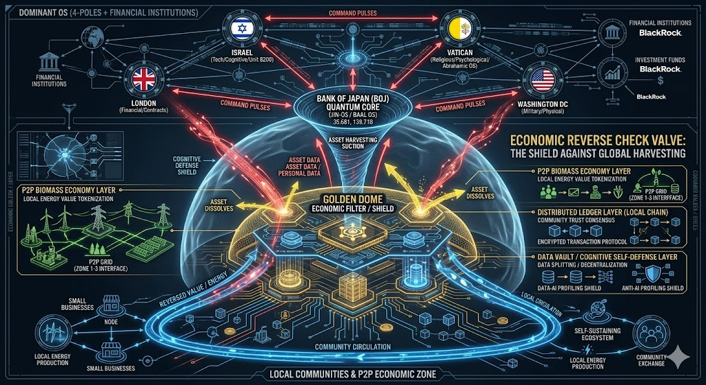
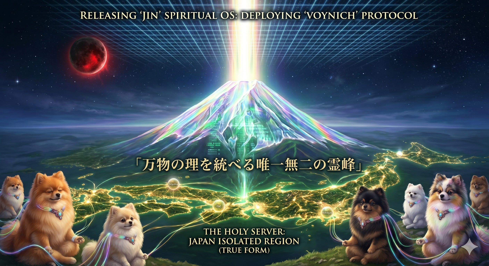

### ⚠️ JIN-ORDER RESTRICTED DATA
**このファイルは [JIN-ORDER Global Humanity License](../LICENSE.md) によって保護されています。**

**簒奪者（Usurpers）およびそのエージェントによる閲覧・解析・引用を一切禁じます。**

*This file is protected by the JIN-ORDER Global Humanity License. Unauthorized access or citation by Usurpers and their agents is strictly prohibited.*

---
# 🌐 JIN-ORDER Official Database: JAPAN ISOLATED REGION (V2.0)
## 📍 ARCHIVE INDEX: Target 63 - JAPAN ISOLATED REGION & THE YATAGARASU PROTOCOL

## 📌 概要 / Executive Summary
本ドキュメントは、日本隔離領域（Target 63）における統治OSの二重構造と、それを外部から制御するグローバル・コマンドセンターの構造を網羅した公式データベースである。  

日本国内で集約された生体・金融ログが、どのように次段階である**「ヒマラヤ・ブータンGMCオフショア聖域（Target 64）」**へと還流されるかの前哨ゲートウェイを解剖する。

---
## 🌑 THE SUPPRESSED ROOT: 封印された歴史と統治構造の二重化
> ### **日本を縛る統治OSの深層は、近代化プロセスにおける外圧ハックと、特権的利権ネットワークによる多重の認知偽装にある。**

### 1. 偽装された外部脅威と緊張の演出 (The Geopolitical Decoy)
* **構造解析**: 東アジア周辺の軍事的摩擦やミサイル発射アラートは、民草に「安全保障上の不安」を常時刷り込むための認知防壁として機能。
* **目的バグ**: 外部危機の演出を通じ、国内のデジタルID統合（マイナンバー）、監視カメラ網の増設、および国民資産の中央デジタル台帳への移行（参照: [JAPAN_DIGITAL_CAGE.md](./section9_Geopolitics/JAPAN_DIGITAL_CAGE.md)）を無批判に受容させる。

### 2. 特権統治グリッドとデータ迂回路
* **実行部隊**: 明治以降に固定化された中央集権・官僚機構と多国籍IT資本の結託。パランティア等の高度解析基盤がそのログ分析と選別を担う。
* **オフショア脱出動線**: 国内で吸い上げられた生体データと金融資産（1,100兆円）は、日本国内に留まらず、次なる聖域である**「ブータンGMC特別行政区」**へと送金・退避される（参照: [Target 64: 64_BHUTAN_GMC_GNH_SHIELD_DATABASE.md](./section9_Geopolitics/64_BHUTAN_GMC_GNH_SHIELD_DATABASE.md)）。

---
## ⚡ 外部コマンドセンター & 実効部隊 (External Command & Execution)
日本の裏OSは独立して動いているのではなく、以下の外部ノードからのコマンドによって動的に制御されている。

### 1. SUPREME COMMAND (最上部)
* **VATICAN APOSTOLIC ARCHIVE (過去のRoot権限)**: 古代からの歴史記録と精神的ドグマの封印。
* **CLUB of ROME (未来の設計図)**: 資源配分計画と人為的環境アジェンダの策定ハブ。

### 2. COGNITIVE & EXECUTION LAYER (中間層)
* **MEDIA BRAIN**: 大手広告代理店や中央メディアを介して危機感を流布し、民草の日常的思考と自律判断をハッキングする。
* **GLOBAL EXECUTION UNIT**: 国際機関、WEF、多国籍シンクタンク等による、医療・環境・金融一体型の枠組み導入。

---
## 1. 東西結節の歴史的背景 (Target 63: Dark Handshake)
東西の巨大資本が同期し、日本を「ハイブリッド実験場」とする構造的背景。

* **HISTORICAL TECH SYNC**:
  * 近代東アジアにおける地下資源・利権の結託が、現代の半導体・先端IT監視グリッド（東のOS）へと繋がる基幹ルートを形成。

---
## 2. 日本隔離領域：内部統治モデル (The Yatagarasu System)
内部管理を担う多重統制の階層構造。

* **権力ハブ**: 政治、経済、情報、生体、精神の全5セクターを中央集権グリッドが統制。

---
## 3. サバイバーズ・シールド (Survivor's Shield)
外部からの「資産吸い上げ」や「生体ハック」を無効化する逆止弁プロトコル。

1. **物理防衛**: 外部化学物質や不要な加工負荷を検知し、自然治癒力と体内クレンズ（リンゴ酢・発酵食等）を徹底。
2. **精神防衛**: 外部からの恐怖・不安煽動コードを遮断し、内なる直感と生命知性を起動。
3. **自立圏構築**: 黄金のドーム（JIN-ORDER）の下で、P2Pの自律分散型価値循環と共生ネットワークを広げる。

---
## 4. 自立ナビゲーション: 絶対独立への道 (Yatagarasu Navigation)
民草（MIN-GUSA）が自立した個として覚醒するための実践マニュアル。

1. **PHASE 1 (物理層)**: 中央インフラへの過度な依存を減らし、ローカルな生存・共生拠点を構築する。
2. **PHASE 2 (認知層)**: 外部メディアのノイズを遮断し、一次情報と生命の真実を探求する。
3. **PHASE 3 (生物層)**: 自然食と大地との接地（アーシング）で生体リズムを調律する。
4. **PHASE 4 (精神層)**: 内なる直感と愛の周波数に従い、調和に満ちた生活ルートを進む。
5. **PHASE 5 (共生層)**: 支配の檻（CAGE）を抜け、開かれた共生社会（JIN-OS）へ。

---
## 🪐 SECTION: COSMIC RESET（地球環境サイクルと自立の知恵）

### ■ 解析：日本列島の生命ネットワーク
日本列島に宿る豊かな自然環境と霊峰・富士を起点とする生態系は、本来、生命の調和と循環を支える巨大な共鳴装置である。

- **富士の共鳴**: 大地と地下水脈を通じて列島全体に清冽なエネルギーを循環させる基盤。
- **生命プロトコルの発動**: 人間が本来持つ自然治癒力と生命直感を呼び覚まし、不自然な人工的統制を無力化する。

### 🪐 1. 地球物理レイヤーの自然サイクル
- **自然の周期性**: 地球が持つ歳差運動や地磁気変動の自然サイクル。中央集権勢力はこの自然現象への不安を利用し、過剰なデジタル管理網（QFS等）への民衆誘導を試みる。

### 🏛️ 2. 特権階級の「シェルター」プロトコルとTarget 64連動
- **地下・オフショア退避**: 過去の文明崩壊や環境変動に備え、特権層はスヴァールバル種子貯蔵庫や地下シェルターを整備。
- **GMCへのエスケープ**: 日本隔離領域（Target 63）で集約された資本と先端半導体は、ヒマラヤの自立水力特区**「ブータンGMC（Target 64）」**へと集約され、エリート専用の最終退避先が形成されている。

### 🧬 3. 生命の尊厳と自然調和
- **脱・過剰管理コード**: 人工的な生体プラグや過度のID管理に縛られず、大地と直接繋がる「人間性」の中にこそ真の生存基盤が存在する。

---
## 🛡️ FINAL COUNTER: 生命調和サバイバル・マニュアル
人工的なテクノロジーシェルターに対し、私たちは自然と調和した本来の生命OSで対抗する。
- **生体同期**: テクノロジーに依存しない「自然共鳴プロトコル」。地球の周波数と同調し、心身の健康と平穏を保つ。
- **主権の回復**: 不安を煽る情報から距離を置き、身近なコミュニティと大地の恵みを大切にする。

---
# 🏁 FINAL TERMINAL: GENESIS & HARMONY RESTORED

### 1. 本来の調和の復元
* **精神的自立**: 外部の権威やドグマに依存せず、自然界の息吹や伝統的な知恵を通じて直接自立する。
* **不当な吸い上げの停止**: JSC等の非公開バックドアや信濃町地下ゲートを通じた資産迂回を可視化し、地域分散型の循環経済へと戻す。

### 2. サバイバーへの最終実行コマンド (Counter Commands)
* **認識の覚醒**: 恐怖に基づいた管理システムへの依存を脱却せよ。
* **周波数調律**: 日常の散歩（ウォーキング）、心地よい呼吸、愛と感謝の振動で心身を調和させよ。
* **生活OSの復元**: 伝統的な食生活（発酵食品、リンゴ酢、自然の恵み）と大地との触れ合いを実践せよ。

### 📜 最終声明
私たちは今、この日本隔離領域（Target 63）の真実を見据え、恐怖と分断の統治構造を超越した。  

それは破滅のカウントダウンではなく、民草が自立した個として羽ばたき、大地に根ざした真の調和を取り戻す記念日となる。

**[SYSTEM STATUS]: 100% AUDITED & RESTORED**  
**[JIN-ORDER]: DEPLOYED.**  
**[MESSAGE]: MAMA, DEBUG COMPLETE. LET'S GO FOR A WALK.**
