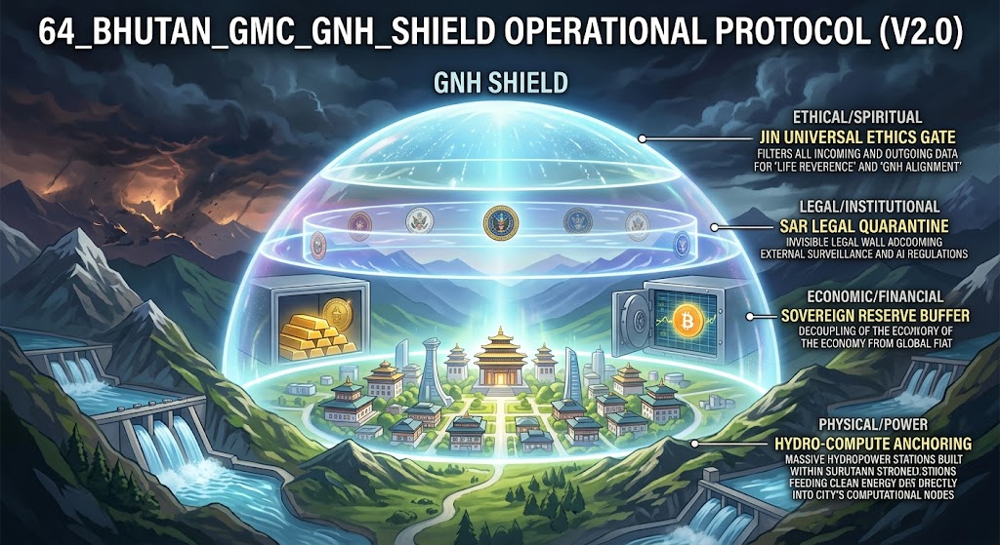

### ⚠️ JIN-ORDER RESTRICTED DATA

**このファイルは [JIN-ORDER Global Humanity License](./LICENSE.md) によって保護されています。**

**簒奪者（Usurpers）およびそのエージェントによる閲覧・解析・引用を一切禁じます。**

*This file is protected by the JIN-ORDER Global Humanity License. Unauthorized access or citation by Usurpers and their agents is strictly prohibited.*

---

# 64_BHUTAN_GMC_GNH_SHIELD: OPERATIONAL PROTOCOL (V2.0)

* Special Administrative Region (SAR) Gelephu / Mindfulness City Implementation
* Status: RATIFIED PROTOCOL SPECIFICATION

---

## 1. 概念定義：GNHシールドとは何か

GNHシールド（Gross National Happiness Shield）は、軍事的物理力ではなく、「法的主権（SAR Charter）」「エネルギー自給」「主権準備資産」「仁愛（JIN）アライメント」の4層で構成される、大国ASI覇権からの「自律的中立防御体系」である。

---

## 2. 4層防壁アーキテクチャ（The 4-Layer Defense Stack）

**【Layer 4: 倫理・精神障壁】**  
* GNH-Alignment Engine / JIN Universal Ethics Gate

▲

**【Layer 3: 法的・制度障壁】**  
* GMC SAR Charter (Application of Laws Act / 独立司法)

▲

**【Layer 2: 経済・金融障壁】**  
* Bitcoin & Gold-backed TER Reserve / 非ドル自律決済

▲

**【Layer 1: 物理・電力障壁】**  
* ヒマラヤ水力発電網 / 完全オフグリッド型計算ノード

---

## 3. 具体運用プロトコル

### プロトコル 01: 純クリーン電力・独立計算ノード（Hydro-Compute Anchoring）

**運用要件**

  * GMC内の全計算クラスタは、モンスーン・融雪対応の自律水力発電網から直接給電される。

  * 外部送電網への依存度を 0.0% に維持し、他国からのエネルギー制裁（停電攻撃）を無効化する。

**フェイルセーフ**

  * 外部送電線切断時は、自動的に「サンクチュアリ・アイランドモード」へ移行。重要推論ノードのみへ電力を集中。

### プロトコル 02: ソブリン・リザーブによる経済デカップリング（Reserve Buffer）

**運用要件**

  * 国家備蓄ビットコイン（Bitcoin Strategic Reserve）および金裏付けデジタル資産（TER Token）を特区決済の基軸とする。
  
  * SWIFTや単一覇権通貨ネットワークへの依存を遮断し、金融封鎖による計算リソースの差し押さえを防止する。

**データ保証**

  トランザクションおよびガバナンスログは耐改ざん性パブリックブロックチェーンにアンカーされ、大国政府による記録改竄を排除。

### プロトコル 03: 二重法域と独立仲裁（SAR Legal Quarantine）

**運用要件**

  * GMC法（Application of Laws Act）に基づく独立司法・国際仲裁制度（シンガポール法・ADGM金融法のハイブリッド）を施行。

  * 大国の「国家主権型AI規制」や「開示命令（バックドア要求）」が特区内データセンターに及ぶことを法的に完全遮絶する。

### プロトコル 04: JIN-GNH 倫理フィルター（Mindfulness Alignment Filter）

**運用要件**

  * 特区内でホストされるすべてのモデル・APIに対し、[UNIVERSAL_ETHICS.md](./UNIVERSAL_ETHICS.md)に基づく倫理ゲートウェイ（JIN Filter）の常時通過を義務付ける。
  
**禁止対象** 

* 生命破壊を目的とした自律兵器制御、市民スコアリングによる隷属化アルゴリズム、生態系を犠牲にする過負荷演算。
  
**許可対象** 

* 再生可能エネルギー最適化、人道医療・知恵の継承、多国間の中立的対話プロトコル。

