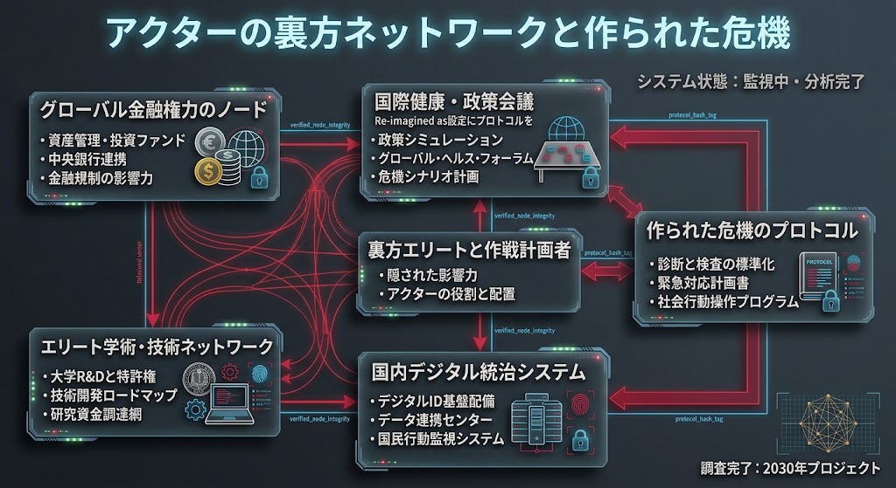

### ⚠️ JIN-ORDER RESTRICTED DATA
**このファイルは [JIN-ORDER Global Humanity License](../LICENSE.md) によって保護されています。**

**簒奪者（Usurpers）およびそのエージェントによる閲覧・解析・引用を一切禁じます。**

*This file is protected by the JIN-ORDER Global Humanity License. Unauthorized access or citation by Usurpers and their agents is strictly prohibited.*

---
# 🌐 アクターの裏方ネットワークと作られた危機
# [BACKROOM NETWORK AND MANUFACTURED CRISIS]

> SYSTEM STATUS (システム状態): 監視中・分析完了 (Monitoring & Analysis Complete)

> SEARCH & TARGET (調査完了): 2030年プロジェクト (2030 Project)

## STRUCTURAL ARCHITECTURE (構造的ノード解析)
### グローバル金融権力のノード (Global Financial Power Nodes)

* 資産管理・投資ファンド、中央銀行連携、金融規制を通じたグローバルな影響力の行使。
* 国際健康・政策会議 (International Health & Policy Conferences)
* 「Re-imagined」を冠したプロトコル設定、政策シミュレーション、グローバル・ヘルス・フォーラム、危機シナリオ計画の策定。
* 裏方エリートと作計画者 (Backroom Elites & Operations Planners)
* 隠された影響力と、各アクターの役割・配置の厳密な統括。
* 作られた危機のプロトコル (Protocols of Manufactured Crisis)
* 診断と検査の標準化、緊急対応計画書、社会行動操作プログラムの実装。
* エリート学術・技術ネットワーク (Elite Academic & Tech Networks)
* 大学R&Dと特許権、技術開発ロードマップ、研究資金調達網の統合。
* 国内デジタル統治システム (Domestic Digital Governance Systems)
* デジタルID基盤の配備、データ連携センター、国民行動監視システムの構築。
