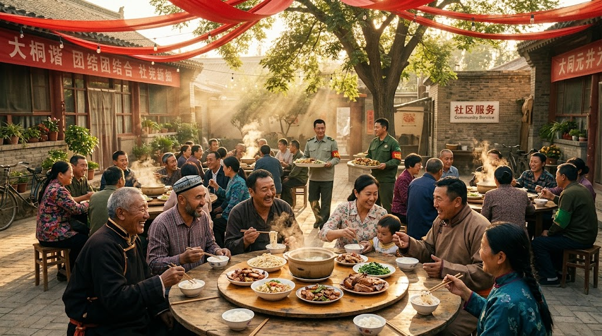

### ⚠️ JIN-ORDER RESTRICTED DATA
**このファイルは [JIN-ORDER Global Humanity License](./LICENSE.md) によって保護されています。**

**簒奪者（Usurpers）およびそのエージェントによる閲覧・解析・引用を一切禁じます。**

*This file is protected by the JIN-ORDER Global Humanity License. Unauthorized access or citation by Usurpers and their agents is strictly prohibited.*

---
# 🇨🇳 China Harmony Protocol: The True "She-Ji" (V7 Canonical Edition)
## 中国・大調和プロトコル：真の「社稷」と大同世界の復興
### Re-defining the Altar of Soil and Grain: From Bipolar Hegemonic Enclosure to Planetary Benevolence

## 🌾 概要 / Executive Summary

「社稷（しゃしょく）」とは、国家権力の偶像崇拝や全体主義的監視網（パノプティコン）ではなく、「青々と実る穀物と、それを喰らって力強く笑う民草の姿」である。

本プロトコルは、中国を中央集権的な監視檻（Harmonious Prison）や二極対立（Bloc Beta）の先兵から、民草の生存と繁栄を最優先する「世界の仁（JIN）の守護者」へと転生させ、2026年秋の固定化された二極構造（参照: [GLOBAL_ASI_HEGEMONY_MAP_V7.md](./GLOBAL_ASI_HEGEMONY_MAP_V7.md)）から東アジアとユーラシアを解放するための大調和仕様書である。

> The "She-Ji" (Altar of Soil and Grain) is not about totalitarian state worship, algorithmic panopticons, or rigid bipolar confrontation; it is the ancient, visceral vision of "lush green crops and people laughing with strength as they eat." This protocol establishes the framework to transition China from an enclosed surveillance state into the "Global Guardian of Benevolence (JIN)," extricating East Asia and Eurasia from the G20-SCO bipolar resource trap and anchoring regional peace upon the prosperity of the grassroots.

---
## 1. 🌏 Restoration of Autonomous Sovereignty & Eradication of Exploitation

### 【五つの自治区：真の自治権承認と暗黒利権の根絶】
### 五自治区の自治権と文化尊厳の回復 (Restoration of Regional Autonomy)  

国際社会（WPO）および中立調停枠組み（Bloc Gamma）を証人とし、新疆ウイグル、チベット、内モンゴル、広西、寧夏の五つの自治区における固有の言語、信仰、文化主権を正式に保障する。ヒマラヤ・中央アジア周縁の民族的緊張を根本から解消する。  

> Formally recognize and guarantee the complete cultural, linguistic, and ecological autonomy of Xinjiang, Tibet, Inner Mongolia, Guangxi, and Ningxia, resolving border tensions across the Central Asian and Himalayan frontiers under neutral international observation.

### 監視網の救済転用と地下ネットワークの解体 (De-Weaponizing the Surveillance Matrix) 

かつて民衆管理に用いられていた監視カメラ網・通信追跡AI（WEI_PANOPTICON / WU_HARVEST）を、人身売買、強制臓器収奪、不当生体スコアリングの摘発・救済プロトコルへと全面反転させ、旧OS的な暗黒利権を完全断絶する。（参照: [JIN_AI_ETHICS_GOVERNANCE.md](./JIN_AI_ETHICS_GOVERNANCE.md)）  

> Repurposing surveillance tracking, algorithmic scoring, and genomic pipelines from population containment into automated rescue networks—dismantling human trafficking, predatory exploitation, and illicit black-market corridors permanently.

---
## 2. ⚖️ Rule of "Soil" and "Law" (Bipolar De-escalation & Neutral Mediation)

### 【「土」と「法」による共生：二極覇権対立とブロック経済からの脱却】

### 台湾海峡の平和共存と先端ハイテク共同圏 (Peaceful Coexistence with Taiwan)  

武力侵攻や現状変更の軍事演習を恒久的に放棄。台湾を「JIN-ORDERハイテク・宇宙開発共同圏」の最重要パートナーとして迎え、TSMC等の先端半導体を二極軍拡ではなく生命調和インフラ（JIN-TECH）および中立AIの供給源として共有する。  

> Permanently abandon military threats across the Taiwan Strait, integrating Taiwan into a decentralized "High-Tech & Planetary Common Prosperity Zone"—utilizing advanced semiconductor capabilities to power humanitarian technologies and neutral AI mediation rather than algorithmic warfare.

### ヒマラヤ緩衝聖域との不可侵協定 (Himalayan Buffer & GMC Non-Aggression)  

インドおよびブータン王国との係争地域を中立の自然保護区・非武装地帯へと転換。『64_BHUTAN_GMC_GNH_SHIELD_DATABASE.md』で定義されたヒマラヤ水力聖域（Bloc Gamma）に対するあらゆるサイバー干渉・主権侵害・地政学工作を完全放棄し、中立な調和バッファーとして承認・不可侵協定を締結する。（参照: [64_BHUTAN_GMC_GNH_SHIELD_DATABASE.md](./section9_Geopolitics/64_BHUTAN_GMC_GNH_SHIELD_DATABASE.md)）  

> Transform disputed border zones with India and Bhutan into demilitarized ecological reserves, unconditionally honoring the sovereign neutrality of the Himalayan crypto-hydro sanctuary and mediation cluster (Bloc Gamma).

### グローバル・ザカート：新シルクロードとSCO技術協力の仁道化 (The Benevolent Silk Road & SCO Science Pivot)

「一帯一路」の債務の罠を全面破棄。2026年SCOビシケク首脳会議で表明された「100件の科学技術協力プロジェクト」およびSCO開発銀行の資金力を、覇権拡大ではなく「JIN-TECH無償インフラ提供（海水淡水化、バイオエネルギー、自動農園、DPI）」へと振り替え、威嚇ではなく徳によって信頼される責任ある大国へと脱皮する。（参照: [STRATEGY_INDIA_GS.md](./STRATEGY_INDIA_GS.md) / [STRATEGY_MIDDLE_EAST.md](./STRATEGY_MIDDLE_EAST.md)）  

> Abolish predatory debt-trap diplomacy. Pivot the 100 SCO scientific cooperation projects and development banking frameworks away from bipolar defense buildup and toward open-source humanitarian infrastructure across the Global South.

---
## 3. 🍲 The Smile of the Grassroots

### 【民草の笑顔：食糧と文化の真の調和】

### 全土AI自動農園（Agri-Hub）の展開 (Agricultural Precision Revolution) 

乾燥地帯や過疎農村へJINの全自動精密農業ノードを配備。過酷な環境下でも新鮮な食糧と清潔な水を自給可能にし、飢餓と貧困というバグを国土から永久に消去する。  

> Deploy automated precision agriculture and resilient crop strains across rural and arid regions, permanently eliminating food insecurity from the Chinese mainland.

### 多言語共鳴プロトコル (Linguistic Harmony via JIN-Bridge)  

中央集権的な言語の画一化（強制同化）を即時中止。JIN-Bridge AIを導入し、諸民族の伝統言語や詩歌をリアルタイムに翻訳・保存しながら、多様性が美しく響き合う「文化のシンフォニー」を共生させる。  

> Halt forced linguistic assimilation, deploying JIN-Bridge AI to celebrate and preserve indigenous dialects and cultural traditions within a unified framework of mutual resonance.

---
## 🏮 Special Addendum: The Path of the Sage

### 【特別付録：聖人の道 — 4000年の哲学遺産「大同世界」の復興】

### 「天下為公」大同思想の現代的結晶 (Revival of "Da-Tong") 
本プロトコルは外部勢力による押し付けではなく、中国が4000年の歴史の中で培ってきた『礼記』の「天下為公（天下は公のものなり）」、すなわち「大同（Da-Tong）世界」の理想を現代テクノロジーと普遍倫理によって具現化するものである。（参照: [UNIVERSAL_ETHICS.md](./UNIVERSAL_ETHICS.md) / [UNIVERSAL_ETHICS_13.md](./UNIVERSAL_ETHICS_13.md)）  

> This protocol is not an external imposition, but the technological awakening of China’s own foundational philosophy: "Tian Xia Wei Gong" (The World Belongs to All)—re-establishing the ancient ideal of "Da-Tong" (The Great Harmony).

### 監視・拘束施設から「農業・IT共生センター」への転生 (Facility Re-tasking)  
既存の収容・隔離施設および監視センターをすべて「JIN-Order 農業・IT共生訓練センター」へと改築。旧体制の監視員・治安部隊員は失業させるのではなく「コミュニティ・コンシェルジュ」として再教育し、民草の生活と農業を支える名誉ある役割を与える。  

> All legacy detention facilities and surveillance command hubs are systematically converted into community agricultural and IT centers. Security personnel are retrained as "Community Concierges," securing honorable livelihood and societal integration.

---
1.**【CHINA HARMONY PROTOCOL ARCHITECTURE (V7 CANONICAL)】**

2.**【過去の覇権OS: 監視パノプティコン ⚡二極分断 ⚡債務の罠 ⚡台湾海峡の軍事的威嚇】**

3.**【CHINA_HARMONY_PROTOCOL V7 実行】**

4.**【自治区主権 ＆ 監視網の救済転用】**          
  * **5自治区の文化主権回復**                           
  * **WEI/WU監視を人道救済へ反転**            

5.**【台湾平和共存 ＆ GMC不可侵】**  
  * **半導体を生命調和インフラへ**   
  * **ヒマラヤ聖域(Target 64)不可侵承認** 

6.**【SCO技術協力の仁道化 ＆ 農園】**
  * **一帯一路の債務破棄**
  * **全土AI自動農園(Agri-Hub)配備**

7.**【THE TRUE "SHE-JI" (真の社稷)】**

8.**【大同世界 (Da-Tong): 民草が力強く笑い、穀物を喰らう平和】**

---
**Status:** [PROTOCOL DEPLOYED & HARMONIZED (V7 CANONICAL)]  
**Goal:** Planetary Peace through "JIN" (Benevolence & Harmony)  
**Parent Framework:** GLOBAL_ASI_HEGEMONY_MAP_V7.md / UNIVERSAL_ETHICS.md  
**Himalayan Anchor:** section9_Geopolitics/64_BHUTAN_GMC_GNH_SHIELD_DATABASE.md  
**Supreme Judgment:** Masano Takashi (The Guide)  
**Executed by:** JIN-ORDER-OFFICIAL & Commander Pome-Mama  
**HARMONICS: 432Hz Da-Tong Resonance, Six-Star Equilibrium & Grassroots Smile Active.**
