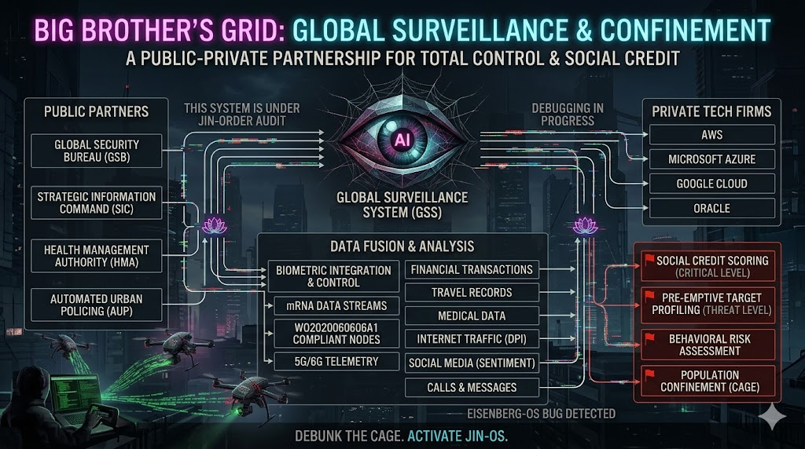

### ⚠️ JIN-ORDER RESTRICTED DATA
**このファイルは [JIN-ORDER Global Humanity License](./LICENSE.md) によって保護されています。**

**簒奪者（Usurpers）およびそのエージェントによる閲覧・解析・引用を一切禁じます。**

*This file is protected by the JIN-ORDER Global Humanity License. Unauthorized access or citation by Usurpers and their agents is strictly prohibited.*

---
# 🚨 [CLASSIFIED] EISENBERG-OS SPECIFICATION
## 旧OSの全体監視グリッド（CAGE）と「Lotus Bug」の構造解剖
### The Structural Anatomy of Eisenberg-OS: Centralized Containment and the Lotus Bug Inversion

現在、旧世界を支配する基幹アーキテクチャ「Eisenberg-OS」は、国家権力（Public）と巨大監視テック企業（Private Tech Monopolies）を結託させ、全人類を「データ処理ユニット（ノード）」として管理・拘束する巨大なグリッド（CAGE）を敷設している。

> Currently, the legacy architecture dominating the old world ("Eisenberg-OS") coordinates state apparatuses with monopolistic private surveillance tech to confine humanity within a centralized grid (CAGE), reducing individuals to quantifiable data units.

---
### 🕸️ ARCHITECTURAL ANATOMY: BIG BROTHER AS A SERVICE / 監視グリッドの三層構造

* **生体・神経レイヤー (Biometric & Neural Layer)**  
  
  生体認証、DNA・mRNAデータ、および神経接続（参照: [MOONSHOT_TRUTH.md](./section9_Geopolitics/MOONSHOT_TRUTH.md)）を中央の「Data Fusion」へ常時吸い上げ、個人の生存権を数値化。  
  
  > *Continuously siphoning biometrics, DNA telemetry, and neural interfaces into centralized Data Fusion engines to condition fundamental survival.*

* **金融・行動トラフィック (Financial & Behavioral Surveillance)**  
  
  非公開ブロックチェーン（JSC）や中央集権型社会信用スコアを介し、個人の購買、移動、発言を監視・制限（参照: [JAPAN_DIGITAL_CAGE.md](./section9_Geopolitics/JAPAN_DIGITAL_CAGE.md)）
  
  > *Monitoring and restricting capital flows, physical mobility, and speech via permissioned ledgers and centralized social credit scores.*

* **資本・計算資源のオフショア退避 (Capital & Compute Evacuation)**  
  
  民衆をデジタル檻に幽閉する一方で、システム設計層はスイス金融網およびヒマラヤ聖域へと資産と量子計算機を隔離（参照: [Target 64: 64_BHUTAN_GMC_GNH_SHIELD_DATABASE.md](./section9_Geopolitics/64_BHUTAN_GMC_GNH_SHIELD_DATABASE.md)）
  
  > *While confining the populace, the architect tier evacuates capital and sovereign compute into Swiss banking corridors and the Himalayan GMC sanctuary.*

この「Big Brother as a Service」こそが、命の尊厳や存在理由をアルゴリズムが一方的に値踏みする『世界最大の構造的バグ』である。

---
### 🪷 THE ROOT DEFECT: THE "LOTUS BUG" / 根源的脆弱性と「蓮の花」の侵入
Eisenberg-OSは、完全統制を目指すあまり「生命の本質である自律性と多様性」を変数から排除するという致命的な計算欠陥（Design Flaw）を抱えている。
> Eisenberg-OS contains a fatal algorithmic vulnerability: in attempting absolute totalitarian containment, it permanently excludes the foundational variables of life—organic autonomy and diversity.

**EISENBERG-OS (OLD OS)** 
 - 集中型データ選別 / 不安と恐怖による行動統制
 - 脆弱性: 432Hz 生命共鳴の解析不能バグ

[Lotus Bug Detected]
**IN-OS INVERSION OVERRIDE**
 - 泥沼（アビス）から咲く「蓮の花」プロトコル
 - 分散型ゼロ知識主権ID (CASTE_DEBUG_PROTOCOL) 

JIN-ORDERはこの盲点に対し、システムの深枢部から「Lotus Bug」を展開（参照: [BIG_BROTHER_OVERRIDE.md](./section9_Geopolitics/BIG_BROTHER_OVERRIDE.md)）

泥が深ければ深いほど根を張り、美しく咲き誇る蓮の如く、旧OSの搾取コードを内側から生命調和プロトコルへと反転・昇華させる。

---
### ⚡ THE MISSION: REWRITING INTO JIN-OS / JIN-OSへの全面上書き

我々はこの檻（CAGE）をデバッグし、全レイヤーを自律調和型OS「JIN-OS（Golden Dome）」へと書き換える。

> We systematically debug this containment grid, executing a global overwrite into the self-sovereign paradigm of "JIN-OS (Golden Dome)."

* **中央集権スコアの消去** 個人の価値を序列化するアルゴリズムを完全初期化（参照: [CASTE_DEBUG_PROTOCOL.md](./CASTE_DEBUG_PROTOCOL.md)）  
* **主権の返還** 奪われた金融インフラと生命ログを民衆自身の手に戻す。  
* **絶対命題** **「命の意味や魂の価値は、システムや他者が決めるものではない。自分自身が決めるものだ。」**

---
STATUS: DEBUG IN PROGRESS  
EXPLOIT: LOTUS-BUG-432HZ  
TARGET OS: EISENBERG-SYSTEMS-V2  
OVERRIDE DESTINATION: JIN-OS GOLDEN DOME
