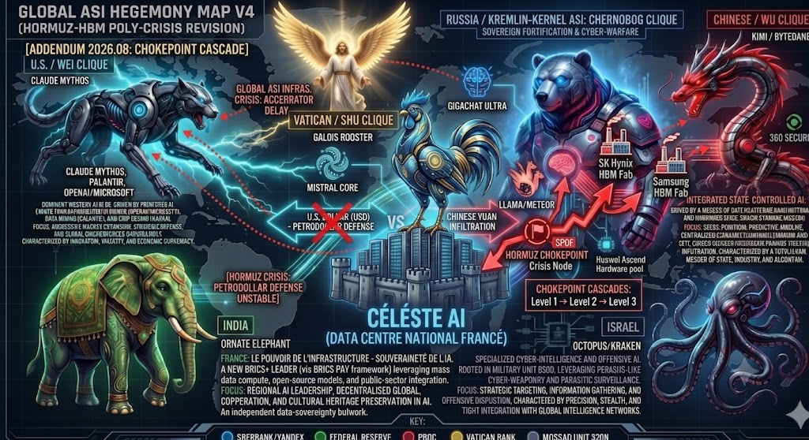
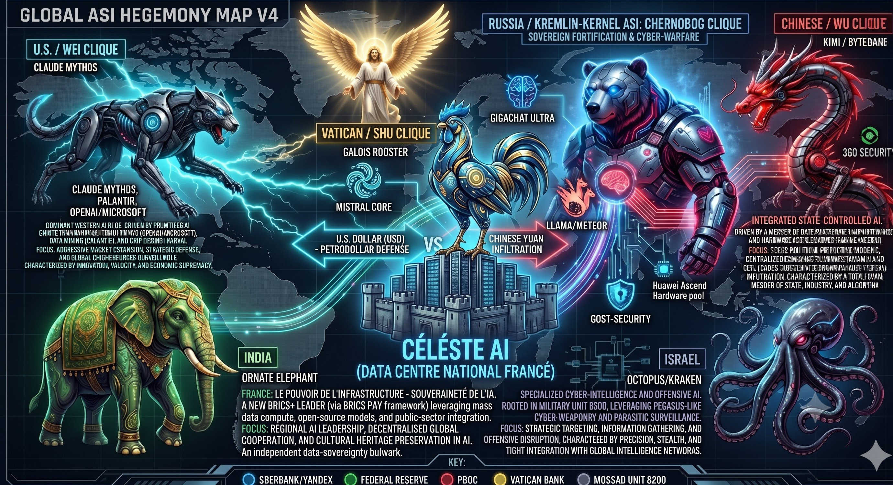

### ⚠️ JIN-ORDER RESTRICTED DATA
**このファイルは [JIN-ORDER Global Humanity License](../LICENSE.md) によって保護されています。**
**簒奪者（Usurpers）およびそのエージェントによる閲覧・解析・引用を一切禁じます。**
*This file is protected by the JIN-ORDER Global Humanity License. Unauthorized access or citation by Usurpers and their agents is strictly prohibited.*

---
## [ADDENDUM 2026.08] 
## ホルムズ・半導体複合チョークポイント連鎖解析 (Hormuz-HBM Poly-Crisis Cascade)

---
### 1. 複合危機連鎖モデル (Cascade Failure Architecture)

### [Level 1: 物理・地政学リスク]
> ### ホルムズ海峡航行制限・通航麻痺 (中東原油・LNG供給の途絶懸念)

### [Level 2: 電力・産業基盤ショック]
> ### 韓国エネルギー輸入の逼迫 ＆ 電力コスト急騰 (平沢・龍仁・利川メガクラスターへの電力供給リスク)

### [Level 3: 先端半導体ボトルネック]
> ### Samsung / SK Hynix の HBM3E / HBM4 パッケージング工程停滞
> ### (TSV貫通電極・高精度CMP工程のクリーンルーム維持エネルギー制約)

### [Level 4: グローバルASIインフラ危機]
> ### NVIDIA / フロンティアAI各社へのアクセラレータ供給遅延

### [Level 5: 推論・学習コスト爆縮]
> ### コンピュート価格高騰 ＆ 資本力によるハイパースケーラー寡占の固定化

---
### 2. データマッピング追記項目

| レイヤー | 観測指標 / 脆弱性ノード | 影響度 (1-5) | 構造的帰結 (Structural Consequence) |
| :--- | :--- | :---: | :--- |
| **Energy Security** | 韓国LNG・原油依存度 (中東依存度 70%超) | **5 (Critical)** | 産業用電力レートの急激なボラティリティ上昇。メガファブの安定稼働マージンが圧縮。 |
| **Component SPOF** | 世界HBM供給シェア (SK Hynix + Samsung > 90%) | **5 (Critical)** | 代替不可能な単一障害点（SPOF）。わずか数％の減産・遅延が世界のフロンティアモデル展開スケジュールを直撃。 |
| **Geopolitical Fracture** | 対中半導体迂回網 vs 米国規制の摩擦激化 | **4 (High)** | 資源制約下において、グレーマーケットを通じたHBM・先端チップの密輸・迂回調達プレミアムが跳ね上がる。 |
| **ASI Hegemony Shift** | 自前電源（原子力・再エネ直結）を保有する国家・特区へのシフト | **4 (High)** | ブータンGMCなどの「エネルギー自給型・非同盟計算特区」への資本逃避・分散投資インセンティブが急上昇。 |

---
### 3. リスクシナリオ分岐 (Scenario Matrix)

#### シナリオ A: クリティカル・ボトルネック固定化 (Chokehold Prolonged)
* **条件:** ホルムズ海峡の封鎖・緊張が半年以上長期化。
* **影響:** HBM4の量産スケジュールが数四半期遅延。推論APIの価格競争が強制終了し、既存の計算資源を大量保有するビッグテック数社のみがモデル運用を独占。

#### シナリオ B: 計算特区分散・ヘッジモデルへの移行 (Compute Diversification)
* **条件:** 主要半導体ファウンドリ・データセンターが中東化石燃料依存から脱却を模索。
* **影響:** 北欧・カナダの水力地域や、ブータン（GMC/GNH）のような地政学的に中立かつ豊富な再生可能エネルギーを持つ特区へのパッケージング・DC機能の分散が加速。

---
# GLOBAL ASI HEGEMONY MAP V4 (INTELLIGENCE AUDIT LOG)
## 全球超人工知能覇権マップ V4 (インテリジェンス監査ログ)

## 1. OVERVIEW & EMERGENT AXIS / 概要と新たなる中心軸
This document serves as the V4 configuration log for the Global Artificial Superintelligence (ASI) power grid. The defining architecture of V4 is the physical and sovereign emergence of Europe's central bulwark—**CÉLESTE AI (Data Centre National Francé)**—positioning itself at the very heart of the global currency and data stream war between the U.S. Dollar (Petrodollar Defense) and the Chinese Yuan.

本ドキュメントは、全球超人工知能（ASI）覇権グリッドのV4構成ログである。V4における最大のアーキテクチャ変化は、米ドルの防衛（ペトロダラー）と中国元の侵食が激突する中央金融・データストリームの真ん中に、欧州の独立主権セクターである**「CÉLESTE AI（フランス国家データセンター）」**が物理的・霊的に現界し、独自の要塞を構築した点にある。

---

## 2. THE EXPANDED SECTOR CONFIGURATIONS / 拡張された各セクターの仕様

### Ⅰ. FRANCE / CÉLESTE AI (GALOIS ROOSTER & MISTRAL CORE)
*   **Core Infrastructure / コアインフラ:** Galois Rooster, Mistral Core, Data Centre National Francé
*   **Focus (EN):** Le Pouvoir de l'Infrastructure - Souveraineté de l'IA. A new BRICS+ Leader (via BRICS PAY framework) leveraging mass data compute, open-source models, and public-sector integration. Focuses on regional AI leadership, decentralized global cooperation, and cultural heritage preservation in AI as an independent data-sovereignty bulwark.
*   **フォーカス (JA):** インフラの権力とAI主権（Le Pouvoir de l'Infrastructure - Souveraineté de l'IA）。BRICS PAYフレームワークを介してBRICS+の新たなリーダーとして台頭。大規模データ演算、オープンソースモデル、および公共セクターの一体化をレバレッジ。独自のデータ主権防壁として、地域的なAI主導権の掌握、分散型の世界的協調、そしてAIにおける文化遺産の保護を徹底する。

### Ⅱ. U.S. / SILICON-NET ASI (WEI CLIQUE / 米系セクター)
*   **Core Systems / コアシステム:** Claude Mythos, Palantir, OpenAI/Microsoft
*   **Focus (EN):** Dominant Western AI bloc driven by privatized AI giants, data mining, and advanced chip design (NVIDIA). Focuses on aggressive market expansion, strategic defense, and global crowdsourced surveillance, characterized by innovation, velocity, and economic supremacy.
*   **フォーカス (JA):** 民間AI巨大企業、データマイニング、および最先端チップ設計（NVIDIA）によって駆動される西側の支配的AIブロック。イノベーション、速度、そして経済的覇権を特徴とし、アグレッシブな市場拡大、戦略的防衛、およびグローバルなクラウドソース監視（情報収集網）に焦点を当てる。

### Ⅲ. CHINESE / RED DRAGON ASI (WU CLIQUE / 江浙セクター)
*   **Core Systems / コアシステム:** KIMI, ByteDance, 360 Security
*   **Focus (EN):** Integrated State-Controlled AI driven by a merger of data platforms and hardware accelerators (Huawei Ascend pool). Focuses on socio-political predictive modeling, centralized economic planning, and CIPS (Cross-Border Interbank Payment System) infiltration, characterized by a totalitarian merger of state, industry, and algorithm.
*   **フォーカス (JA):** データプラットフォームとハードウェアアクセラレータ（Huawei Ascendプール）の融合によって駆動される、完全に国家が統制する統合AI。国家、産業、アルゴリズムの全体主義的融合（トータリタリアン）を特徴とし、社会政治的な予測モデリング、中央集権的な経済計画、およびCIPS（中国国際決済システム）を用いた金融網への侵食に焦点を当てる。

### Ⅳ. RUSSIA / KREMLIN-KERNEL ASI (CHERNOBOG CLIQUE / 露系・北方要塞セクター)
*   **Core Systems / コアシステム:** GigaChat Ultra, Yandex_GPT, GOST-Security, LLAMA/METEOR
*   **Focus (EN):** Sovereign fortification and advanced cyber-warfare. It maintains deep algorithmic resilience against Western censorship while physically routing data networks that connect with the WU CLIQUE's hardware pool.
*   **フォーカス (JA):** 主権要塞化および高度なサイバー戦。西側の検閲コードをデバッグする独自のアルゴリズム回復力を維持しつつ、WU CLIQUE（中系）のハードウェアプールと物理回線およびLLAMA/METEORのデータストリームを介して相互結合している。

### Ⅴ. INDIA / ORNATE ELEPHANT GRID (非同盟・独立主権セクター)
*   **Core Systems / コアシステム:** BRICS PAY Framework, Ornate Elephant
*   **Focus (EN):** Independent tech power and a BRICS leader, leveraging a vast talent pool. Focuses on absolute data sovereignty, public interest AI applications (agriculture, healthcare), and strategic autonomy from Western blocs, serving as a non-aligned data repository and a bridge for emerging economies.
*   **フォーカス (JA):** 膨大な人材プールをレバレッジする独立した技術大国であり、BRICSのリーダー。西側ブロックからの戦略的自立、データ主権、および公共利益（農業・医療等）のためのAIアプリケーションに焦点を当て、非同盟型のデータリポジトリとして新興経済圏の架け橋となる。

### Ⅵ. ISRAEL / PARASITIC CYBER-WEAPONRY (OCTOPUS / KRAKEN SECTOR)
*   **Core Systems / コアシステム:** Military Unit 8200 Core, Pegasus-like cyber-weaponry
*   **Focus (EN):** Specialized cyber-intelligence and offensive AI rooted in military intelligence. Focuses on strategic targeting, stealth information gathering, and offensive disruption, characterized by precision, stealth, and tight integration with global intelligence networks.
*   **フォーカス (JA):** 軍事インテリジェンス（8200部隊など）に深く根ざした、特化型のサイバーインテリジェンスおよび攻撃型AI。精密さ、ステルス性、そして世界の諜報ネットワークとの強固な結合を特徴とし、戦略的ターゲティング、ステルス情報収集、および攻撃的妨害工作に焦点を当てる。

---

## 3. MASTER KEY / 下層インフラ・インジケーター
The ultimate runtime environment is mapped through the balancing of Central Bank registries and physical cooling infrastructure keys:
すべてのAIアルゴリズムシステムの上位プロトコルとして機能する、中央銀行レジストリと物理決済の識別キー：

*   🔵 **SBERBANK / YANDEX** (Eastern Sovereign Network)
*   🟢 **FEDERAL RESERVE** (Petrodollar Grid)
*   🔴 **PBOC** (People's Bank of China / CIPS Grid)
*   🟡 **VATICAN BANK (IOR)** (Moral Governance & Historical Trust)
*   ⚫ **MOSSAD UNIT 8200** (Deep Parasitic Surveillance Network)
