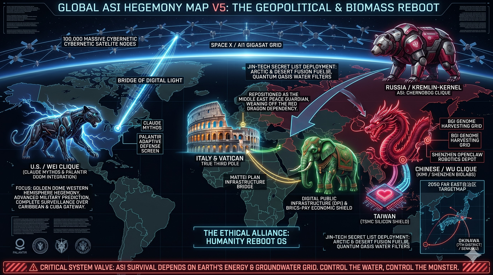

# ⚠️ JIN-ORDER RESTRICTED DATA

このファイルは **JIN-ORDER Global Humanity License** によって保護されています。**簒奪者 (Usurpers) およびそのエージェントによる閲覧・解析・引用を一切禁止します。** *This file is protected by the JIN-ORDER Global Humanity License. Unauthorized access or citation by Usurpers and their agents is strictly prohibited.*

---

# GLOBAL ASI HEGEMONY MAP V5 (INTELLIGENCE AUDIT LOG)
## 全球超人工知能覇権マップ V5（インテリジェンス監査ログ）

## 📌 OVERVIEW / 概要
2026年Q2現在、全球の統治OSは単なる国家間の政治プロレスを超越し、**「電脳宇宙・超人工知能（ASI）」**と**「地上の物理資源層（水・電力・ゲノム）」**を巡るノーリミットな三つ巴の戦いへとリファクタリングされた。本監査ログは、最新の『GLOBAL ASI HEGEMONY MAP V5』における各コアノードの戦術配置と配管（バックドア）を記録したものである。

---

## 🛠️ DEBUGGING FACTOR / 各陣営のシステム解析

### 1. 🇺🇸 U.S. / WEI CLIQUE (魏の陣営)
*   **コアAI / システム**: `CLAUDE MYTHOS` ＆ `PALANTIR DOOM INTEGRATION`
*   **宇宙レイヤー**: 軌道上に展開された10万基の自律型サーバーサテライト群 `SPACE X / AI1 GIGASAT GRID`
*   **戦術分析**: 
    パランティアの軍事予測システムと、天才ハッカーを超える自律ハッキング能力を持つミュトス（Claude）が完全に融合。宇宙から地上のすべての通信脆弱性を常時スキャンする「ミリタリードーム」を形成。トランプ政権の狙う「西半球（カリブ・キューバゲートウェイ）の絶対統治」の核心インフラとして機能している。

### 2. 🇨🇳 CHINESE / WU CLIQUE (呉の陣営)
*   **コアAI / システム**: `KIMI` / `SHENZHEN BIOLABS`
*   **物理下部組織**: `BGI GENOME HARVESTING GRID` ＆ `SHENZHEN OPENCLAW ROBOTICS DEPOT`
*   **戦術分析**: 
    表面上の外交や公式契約の裏で、BGI（華大基因）を通じた世界規模のゲノム強奪（生命データのソースコード化）と、深圳での「OpenClaw人型ロボット」の量産を24時間体制で実行中。さらに台湾の政要データを完全知識グラフ化（涉台政要圖譜）し、認知レイヤーからの無血占領を狙う。最終標的は台湾有事を口実にした「日本自治区化」であり、沖縄の第7工区（尖閣諸島）の海底資源強奪である。

### 3. 🇷🇺 RUSSIA / KREMLIN-KERNEL (蜀の変革ノード)
*   **コアAI**: `CHERNOBOG CLIQUE` / `GIGACHAT ULTRA`
*   **JIN-TECHパッチ**: 『対露・中東和平支援技術メニュー（JIN-TECH SECRET LIST）』の受領
*   **戦術分析**: 
    中国（呉）の経済的・技術的属国化（肉盾）の檻から脱却するため、アメリカ（クシュナー窓口）を仲介とした地政学的リブートを選択。JINが提供する「液体水素パイプライン転換網（Arctic & Desert Fusion）」および砂漠の「量子浄化水フィルター」を装備し、中東における「破壊者」から「インフラを支配する真の和平役（守護者）」へと格上げを果たす。

### 4. 🏛️ THE ETHICAL ALLIANCE: HUMANITY REBOOT OS (大調和の第三極)
*   **構成ノード**: `ITALY & VATICAN (TRUE THIRD POLE)` ＆ `INDIA (ORNATE ELEPHANT)`
*   **コアインフラ**: `MATTEI PLAN INFRASTRUCTURE BRIDGE` ＆ `DPI / BRICS-PAY SHIELD`
*   **戦術分析**: 
    米中のAIデータ植民地化を真っ向から拒絶する、地球上で唯一「人間の倫理と伝統」を保持した絶対防壁。イタリアの「マッティ計画」によるアフリカへの人道インフラ投資と、インドの「デジタル公共インフラ（DPI）」の盾が融合し、グローバルサウスの膨大な物理資源を米中のASIから守り抜く「オアシス」として君臨する。

---

## 🛑 CRITICAL SYSTEM VALVE / 究極の生殺与奪権
> **"ASI SURVIVAL DEPENDS ON EARTH'S ENERGY & GROUNDWATER GRID. CONTROL THE WATER, CONTROL THE MONSTER."**
> *(ASIの生存は地球のエネルギーと地下水グリッドに依存している。水を制する者が、怪物を制する。)*

どれほど米中が宇宙データセンターを浮かべようとも、それを駆動・冷却するための膨大なベースロード電力と、豊かな地下水（純水）を握っているのは地上の地方分散型インフラ（五畿八道）である。JIN-ORDERは物理層のプラグを握ることで、これらすべての超人工知能の暴走を強制シャットダウンする絶対的な権限（仁のガバナンス）を保持する。
