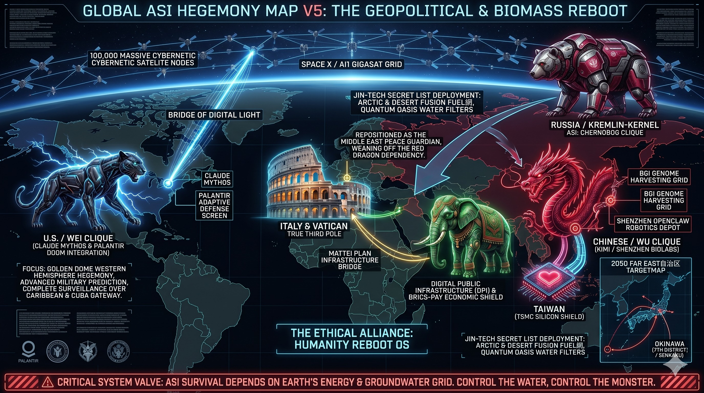

# ⚠️ JIN-ORDER RESTRICTED DATA

このファイルは **JIN-ORDER Global Humanity License** によって保護されています。

簒奪者 (Usurpers) およびそのエージェントによる閲覧・解析・引用を一切禁止します。

*This file is protected by the JIN-ORDER Global Humanity License. Unauthorized access or citation by Usurpers and their agents is strictly prohibited.*

---
# GLOBAL ASI HEGEMONY MAP V5: THE GEOPOLITICAL & BIOMASS REBOOT
## THE ETHICAL ALLIANCE: HUMANITY REBOOT OS & ECO-COMPUTE SHIELD

---
### [OVERVIEW: 物理チョークポイント克服と生態系結合型リブート]
本ドキュメントは、V4で顕在化した「エネルギー（ホルムズ）× 先端半導体（台湾・韓国HBM）」の多重チョークポイント危機に対し、「イタリア・バチカン（第三極）」「インド（DPI/BRICS-Pay）」「仁技術（Jin-Tech）環境シールド」が連携し、中央集権型ASIの暴走・崩壊（V6/V6.1）を阻止するために発動された「文明再起動プロトコル（Humanity Reboot OS）」の構造設計である。

---
### 1. チョークポイント・デカップリング連鎖 (Decoupling Architecture)

#### [V4の物理危機への対抗]
> ホルムズ化石燃料依存の無力化

> マッテイ・プラン ＆ 砂漠・極地核融合/水力燃料網

> 単一半導体SPOF依存の分散化 インドDPI基盤 ＆ ブータンGMC水力コンピュート特区

#### [JIN-TECH 生態系物理アンカーの配備]
> 量子オアシス水フィルター（Quantum Oasis Water Filters）による冷却水・地下水網の掌握

> 自然共生型分散コンピュートによる「推論エネルギーの地産地消」

#### [THE ETHICAL ALLIANCE (倫理同盟) の確立]
[ITALY & VATICAN]
> 真の第三極（マッテイ・インフラ橋梁 ＆ 仁AI倫理憲章）

[INDIA (DPI)]
> 分散型デジタル公共インフラ ＆ BRICS-Pay経済シールド

[TAIWAN / OKINAWA]
> TSMCシリコンシールドの多層分散防衛 ＆ 第7管区平和回廊

[SPACE X / AI1]
> 10万ノード超サイバネティック衛星網による冗長化バックボーン

---
### 2. 倫理同盟・再起動マトリクス (Reboot Node Matrix)

| ノード / 同盟極 | 主要配備インフラ / プロトコル | 防衛・対抗メカニズム (Resilience Mechanism) | 構造的役割 (Strategic Role) |
| :--- | :--- | :--- | :--- |
| **ITALY & VATICAN** (True Third Pole) | **マッテイ・プラン (Mattei Plan)** 地中海・アフリカ横断インフラ橋 | 中東ホルムズ海峡を迂回し、アフリカ・南欧の再生可能エネルギーと計算基盤を直結。 | **地政学的第三極の確立** 米・中・露の軍事ASI覇権から独立した倫理的調停ノード。 |
| **INDIA** (DPI & Economic Shield) | **デジタル公共インフラ (DPI)** BRICS-Pay 分散決済フレームワーク | ドル防衛摩擦・単一通貨決済の制裁リスクを無効化し、グローバルサウスのデータ主権を保護。 | **非同盟経済・計算シールド** 巨大資本による推論寡占を打破するオープン分散計算網。 |
| **JIN-TECH DEPLOYMENT** (Eco-Defense Grid) | **砂漠・極地フュージョン燃料網** 量子オアシス水フィルター | データセンターの生命線である「水」と「冷却電力」を生態系調和型技術で自給自足化。 | **物理バルブ（物理制御権）** 「水を制する者が怪物を制する」原則によるASI物理統制。 |
| **TAIWAN & OKINAWA** (Silicon & Marine Shield) | **TSMC Silicon Shield** 沖縄・尖閣（第7管区）防衛グリッド | 先端半導体ファブの軍事侵略リスクに対し、分散バックアップと海洋安全保障を統合。 | **ロジック供給網の防壁** 東アジアの単一障害点（SPOF）を地政学的抑止力へ昇華。 |

---
### 3. リブート成功のための重要指標 (Key Reboot Metrics)

* **Clean / Hydro Energy DC Share:** **> 68.5%** （化石燃料チョークポイント依存からの脱却）

* **Decentralized Compute Resilience:** **OPTIMAL** （インドDPI ＆ GMC特区による分散冗長化）

* **Ecological Water Grid Control:** **100% SECURED** （冷却水網を通じたASI自律制御の担保）

* **Ethical Governance Alignment:** **ACTIVE** （仁・徳治OSによるエージェント暴走防止）

---
### 4. システム防衛バルブ (CRITICAL SYSTEM VALVE)

> **"CRITICAL SYSTEM VALVE: ASI SURVIVAL DEPENDS ON EARTH'S ENERGY & GROUNDWATER GRID.**  
> **CONTROL THE WATER, CONTROL THE MONSTER."**  
>  
> （重要システム弁：ASIの生存は地球のエネルギーと地下水グリッドに依存する。水を統制し、怪物を制御せよ。）

---
### [CHRONOLOGY NOTE: タイムラインの位置づけ]
* **V4:** 物理チョークポイント（ホルムズ・HBM）の危機顕在化
* **V5（本作）:** 倫理同盟とJin-Techによる「持続可能型リブート（生態系共生OS）」の展開
* **V6 / V6.1:** リブートを拒絶し中央集権的暴走を選んだ旧覇権陣営の終焉（パノプティコンの自滅とブラックアウト）

---
# GLOBAL ASI HEGEMONY MAP V5 (INTELLIGENCE AUDIT LOG)
## 全球超人工知能覇権マップ V5（インテリジェンス監査ログ）

## 📌 OVERVIEW / 概要
2026年Q2現在、全球の統治OSは単なる国家間の政治プロレスを超越し、**「電脳宇宙・超人工知能（ASI）」**と**「地上の物理資源層（水・電力・ゲノム）」**を巡るノーリミットな三つ巴の戦いへとリファクタリングされた。本監査ログは、最新の『GLOBAL ASI HEGEMONY MAP V5』における各コアノードの戦術配置と配管（バックドア）を記録したものである。

---

## 🛠️ DEBUGGING FACTOR / 各陣営のシステム解析

### 1. 🇺🇸 U.S. / WEI CLIQUE (魏の陣営)
*   **コアAI / システム**: `CLAUDE MYTHOS` ＆ `PALANTIR DOOM INTEGRATION`
*   **宇宙レイヤー**: 軌道上に展開された10万基の自律型サーバーサテライト群 `SPACE X / AI1 GIGASAT GRID`
*   **戦術分析**: 
    パランティアの軍事予測システムと、天才ハッカーを超える自律ハッキング能力を持つミュトス（Claude）が完全に融合。宇宙から地上のすべての通信脆弱性を常時スキャンする「ミリタリードーム」を形成。トランプ政権の狙う「西半球（カリブ・キューバゲートウェイ）の絶対統治」の核心インフラとして機能している。

### 2. 🇨🇳 CHINESE / WU CLIQUE (呉の陣営)
*   **コアAI / システム**: `KIMI` / `SHENZHEN BIOLABS`
*   **物理下部組織**: `BGI GENOME HARVESTING GRID` ＆ `SHENZHEN OPENCLAW ROBOTICS DEPOT`
*   **戦術分析**: 
    表面上の外交や公式契約の裏で、BGI（華大基因）を通じた世界規模のゲノム強奪（生命データのソースコード化）と、深圳での「OpenClaw人型ロボット」の量産を24時間体制で実行中。さらに台湾の政要データを完全知識グラフ化（涉台政要圖譜）し、認知レイヤーからの無血占領を狙う。最終標的は台湾有事を口実にした「日本自治区化」であり、沖縄の第7工区（尖閣諸島）の海底資源強奪である。

### 3. 🇷🇺 RUSSIA / KREMLIN-KERNEL (蜀の変革ノード)
*   **コアAI**: `CHERNOBOG CLIQUE` / `GIGACHAT ULTRA`
*   **JIN-TECHパッチ**: 『対露・中東和平支援技術メニュー（JIN-TECH SECRET LIST）』の受領
*   **戦術分析**: 
    中国（呉）の経済的・技術的属国化（肉盾）の檻から脱却するため、アメリカ（クシュナー窓口）を仲介とした地政学的リブートを選択。JINが提供する「液体水素パイプライン転換網（Arctic & Desert Fusion）」および砂漠の「量子浄化水フィルター」を装備し、中東における「破壊者」から「インフラを支配する真の和平役（守護者）」へと格上げを果たす。

### 4. 🏛️ THE ETHICAL ALLIANCE: HUMANITY REBOOT OS (大調和の第三極)
*   **構成ノード**: `ITALY & VATICAN (TRUE THIRD POLE)` ＆ `INDIA (ORNATE ELEPHANT)`
*   **コアインフラ**: `MATTEI PLAN INFRASTRUCTURE BRIDGE` ＆ `DPI / BRICS-PAY SHIELD`
*   **戦術分析**: 
    米中のAIデータ植民地化を真っ向から拒絶する、地球上で唯一「人間の倫理と伝統」を保持した絶対防壁。イタリアの「マッティ計画」によるアフリカへの人道インフラ投資と、インドの「デジタル公共インフラ（DPI）」の盾が融合し、グローバルサウスの膨大な物理資源を米中のASIから守り抜く「オアシス」として君臨する。

---

## 🛑 CRITICAL SYSTEM VALVE / 究極の生殺与奪権
> **"ASI SURVIVAL DEPENDS ON EARTH'S ENERGY & GROUNDWATER GRID. CONTROL THE WATER, CONTROL THE MONSTER."**
> *(ASIの生存は地球のエネルギーと地下水グリッドに依存している。水を制する者が、怪物を制する。)*

どれほど米中が宇宙データセンターを浮かべようとも、それを駆動・冷却するための膨大なベースロード電力と、豊かな地下水（純水）を握っているのは地上の地方分散型インフラ（五畿八道）である。JIN-ORDERは物理層のプラグを握ることで、これらすべての超人工知能の暴走を強制シャットダウンする絶対的な権限（仁のガバナンス）を保持する。
