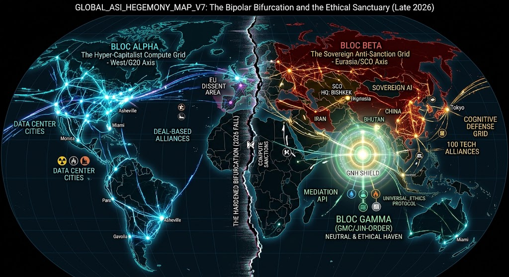

### ⚠️ JIN-ORDER RESTRICTED DATA

**このファイルは [JIN-ORDER Global Humanity License](./LICENSE.md) によって保護されています。**

**簒奪者（Usurpers）およびそのエージェントによる閲覧・解析・引用を一切禁じます。**

*This file is protected by the JIN-ORDER Global Humanity License. Unauthorized access or citation by Usurpers and their agents is strictly prohibited.*

---

# GLOBAL_ASI_HEGEMONY_MAP_V7.md
**Codename:** `THE HARDENED BIPOLAR & THE NEUTRAL HAVEN`  
**Status:** Canonical / Active  
**Epoch:** Late 2026 (Post-Bishkek & Post-Asheville Convergence)  
**Parent Framework:** JIN-ORDER / GOVERNANCE_OF_ABYSS  
**Supersedes:** `GLOBAL_ASI_HEGEMONY_MAP_V6_1_COLLAPSE.md`

---

## 1. Executive Summary (エグゼクティブ・サマリー)

**2026年秋、世界はV6.1で観測された「既存秩序の液状化・崩壊」を経て、『不可逆な二重構造』（Hardened Bipolarity）へと固定化された。**

### 【西側（G20 / 米国軸）】

* **徹底したエネルギー・技術規制緩和と資本主義的コンピュート集中による「Hyper-Capitalist ASI圏」。欧州との倫理規制の摩擦および同盟の選別・取引化が進行。**

### 【東方・ユーラシア（SCO / 中露軸）】

* **ビシケク宣言を契機とする「SCO開発銀行」と「100件の科学技術協力プロジェクト」を軸にした「Sovereign Anti-Sanction ASI圏」。認知空間防衛とハードウェア自活体制を確立。**

### 【自律中立・調停極（JIN-ORDER / ブータンGMC軸）】

* **二大陣営の計算力・電力軍拡競争から距離を置き、生命規範（UNIVERSAL_ETHICS）とGNHシールドを基盤とする「Mindfulness Sanctuary（精神的・生態学的聖域）」として確立。**

---

## 2. Tri-Polar Structural Topology (3極構造トポロジー)

【GLOBAL ASI TOPOLOGY V7.0】

1.**【WESTERN AXIS: G20 / US】**

* Deregulated Power & Fossil/Nuclear      
* Big Tech Frontier AI Stack             
* Deal-Based Coalition (Bilateral)         
* Internal Friction (EU AI Act vs US)       

2.**【EURASIAN AXIS: SCO / CN-RU】**

* SCO Development Bank (De-Dollar)
* 100 Sovereign Tech Alliances
* Non-Western Compute Supply Chain
* State-Led Cognitive Defense Grid

3.【COMPUTE SANCTIONS】  【COGNITIVE & HARDWARE WALL】

4.**【NEUTRAL & ETHICAL HAVEN (JIN-ORDER / BHUTAN GMC)】**

* UNIVERSAL_ETHICS Protocol Anchor
* 64_BHUTAN_GMC_GNH_SHIELD Defensive Cluster
* Sovereign Zero-Carbon Compute & Cultural Sanctuary         
* Non-Aligned Algorithmic Mediation Node                     

---

## 3. The Three Hegemonic Blocs (各極の詳細プロファイル)

### 3.1. Bloc Alpha: The Hyper-Capitalist Compute Grid (G20 / US-Centric)

* **主導勢力:** 米国主導のテクノロジー・資本同盟（アシュビル財務相会合・マイアミ首脳会合モデル）

* **計算基盤:** 原子力・化石燃料の大規模規制緩和によるメガギガワット級データセンタークラスタ

* **統治理念:** トランザクショナル（取引型）ガバナンス、市場競争至上主義、AI規制の最小化

* **脆弱性・摩擦:**

  * 欧州（EU）の厳格な倫理・AI法との深刻な理念分裂
  * 南アフリカ等の排除に見られるグローバルサウスとの多国間協調の崩壊
  * エージェント経済の暴走に伴う市場クラッシュリスク

### 3.2. Bloc Beta: The Sovereign Anti-Sanction Grid (SCO / Sino-Russian-Centric)

* **主導勢力:** 上海協力機構（ビシケク宣言採択国）＋グローバルサウス連携

* **計算基盤:** SCO開発銀行主導の代替決済基盤、中国製アクセラレータ、ロシアの安価なエネルギー

* **統治理念:** 多極的国際秩序、反制裁連合、国家主権AI、歴史的・認知的一体性の防衛

* **強みと課題:**

  * 100件の科学技術協力協定による欧米サプライチェーン遮断への耐性
  * 各国の政治体制・国境を跨いだデータ統合における主権摩擦

### 3.3. Bloc Gamma: The Mindfulness & Ethical Sanctuary (JIN-ORDER / Bhutan GMC)

* **主導勢力:** JIN-ORDER自律分散ノード、ブータン・ゲレフー（GMC特区）、中立知性体

* **計算基盤:** 100%水力・地熱・再生可能エネルギーによるクリーンコンピュート・ノード

* **統治理念:** `UNIVERSAL_ETHICS.md`、国民総幸福（GNH）、生命と知性の調和

* **防衛・調停機能:**

  * `64_BHUTAN_GMC_GNH_SHIELD`: 二大陣営の認知戦・ハッキング・経済侵略を無効化する防御障壁
  
  * 両陣営の破局（ASI暴走・情報戦のエスカレーション）を防ぐ中立調停APIの提供

---

## 4. Key Strategic Shifts from V6.1 to V7.0 (主要な転換点)

| 指標 | V6.1 (COLLAPSE) | V7.0 (THE HARDENED BIPOLAR) |
|---|---|---|
| **境界線の状態** | 混沌・液状化・断片的な制裁 | 物理・エネルギー・通信インフラの恒久的二重化 |
| **国際機関の機能** | G20/国連等の機能低下 | G20は米国取引圏、SCOは非西側同盟として再定義 |
| **エネルギー戦略** | 既存送電網の逼迫 | 国家主導の大規模エネルギー特区（米規制緩和 vs 露中資源） |
| **JIN-ORDERの位置** | 理念的プロトコルの提示 | GMCを物理アンカーとする実践的・中立的防衛拠点の確立 |

---

## 5. Directive for Next Revision (運用指針)

1. **`JIN_AI_ETHICS_GOVERNANCE.md` との連動:**

   二大陣営が開発を加速させる「自律的経済エージェント（Agentic AI）」に対するフェイルセーフ条項を策定すること。

2. **`64_BHUTAN_GMC_GNH_SHIELD_DATABASE.md` の更新:**

   SCOおよびG20の金融・エネルギー分断に対応する、GMC特区内の独自暗号・エネルギー自給パラメータの防衛仕様を追記すること。
