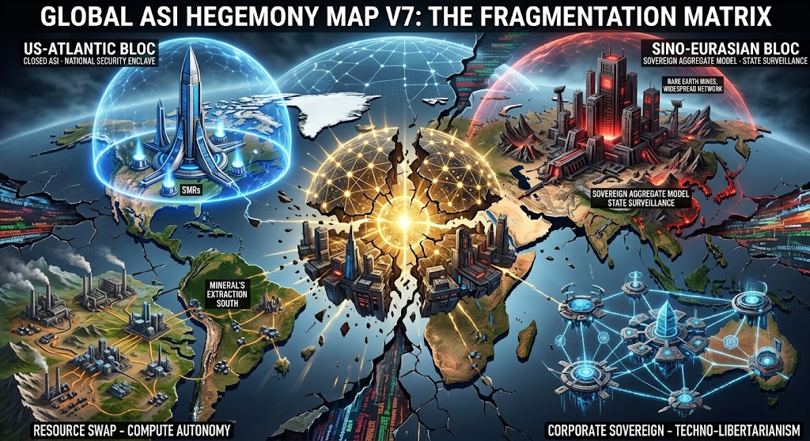

### ⚠️ JIN-ORDER RESTRICTED DATA

**このファイルは [JIN-ORDER Global Humanity License](./LICENSE.md) によって保護されています。**

**簒奪者（Usurpers）およびそのエージェントによる閲覧・解析・引用を一切禁じます。**

*This file is protected by the JIN-ORDER Global Humanity License. Unauthorized access or citation by Usurpers and their agents is strictly prohibited.*

---

# GLOBAL ASI HEGEMONY MAP V7: THE FRAGMENTATION MATRIX (2026.09)

* Status: ACTIVE DRAFT / JIN-ORDER GOVERNANCE FRAMEWORK
* Target Phase: 計算資源・重要鉱物の主権要塞化と多極的分断（Bloc-Level Decoupling）

---

## 1. エグゼクティブ・サマリー

V6.1における「局所的クラッシュ（Collapse）」を経て、世界はグローバル統一知性（Unified AGI/ASI）の夢を完全に放棄した。

現在の地政学は、「計算力（Compute）」「電力（Power）」「重要鉱物（Critical Minerals）」「データ主権（Data Enclave）」を自陣営内に閉じ込める「知能ブロック要塞（ASI Hegemony Enclaves）」へと再編されている。

---

## 2. 4極＋1聖域の力学マップ

| 陣営 / セクター | コアアーキテクチャ | 資源・エネルギー基盤 | ガバナンス思想 | 脆弱性・破局トリガー |
| :--- | :--- | :--- | :--- | :--- |
| **US-Atlantic Bloc** （米主導・資本技術同盟） | 垂直統合型クローズドASI 先端半導体スタック独占 | 国内原子力（SMR）網 ハイパースケーラー直接出資 | 国家安全保障直結型資本主義 「同盟外への技術封鎖」 | 電力インフラ枯渇 計算資源独占による国内格差 |
| **Sino-Eurasian Bloc** （中・ユーラシア同盟） | 国家主権型分散スーパーモデル 国産代替半導体群 | レアアース/精錬独占 大規模水力・石炭集中型 | 統合監視型デジタル統治 「国家存続のための演算動員」 | 先端リソグラフィ歩留まり限界 アルゴリズム硬直化 |
| **Non-Aligned South** （資源保有新興国） | オープンソース軽量化モデル 推論特化型エッジクラスタ | 資源スワップ型エネルギー （現地採掘電力直結） | 資源主権主義 「計算力と原材料の等価交換」 | 大国からの経済制裁 インフラ乗っ取りリスク |
| **Corporate Sovereign** （多国籍テック独立圏） | プライベート軌道・洋上ノード 自律エージェント連合 | 海上浮体・自前電源プラント 暗号資産/独自トークン決済 | テクノ・リバタリアニズム 「国家主権の形骸化」 | 物理的領土を持たない脆さ 地上データセンターの接収 |
| **GMC / JIN-ORDER Sanctuary** （ブータン・ゲレフー特区） | GNHアライメント推論エンジン 自律倫理検証スタック | 100% 水力発電（ヒマラヤ水系） 国家ビットコイン/金裏付け準備 | 仁愛（JIN）・仏教的調和規範 「非侵略・完全中立の計算聖域」 | 外部大国による電子的包囲網 （※GNHシールドにより防衛） |

---

## 3. 現実世界の最新動向（2026）との同期

* **資源と計算力の直結:** AIデータセンターの電力確保のため、米中ともにエネルギー・半導体禁輸の制裁対象を原材料レベルまで引き下げ。

* **国際法規の形骸化:** 多国間合意による安全基準（AI Safety Institute等）は大国の安保例外規定により骨抜きにされ、ブロック間サイバー戦・推論妨害が日常化。

---

## 4. 中央集権的ASI覇権の自滅と、足元実物主権への不可逆的帰還
### 7.6 Structural Collapse of Centralized Hegemony & The Inevitable Decentralized Rebirth

2026年秋の地政学的力学は、中央集権型グローバリズムおよび単一覇権による世界統制モデルの完全な機能不全を確定させた。

**【Centralized Ideological Dominance (The Void)】**

・Internal Infighting / Stagflation / Chokepoint Depletion

1. **【Western Institutional Exhaustion】**

・US: Midterm factionalism, domestic inflation & tariffs

・EU: Macron's political void & Nordic militarization

2. **【Global South & Eurasian Realpolitik】**

・Sino-Russian raw material/energy fortress circuits

・Modi & ASEAN: Unaligned pragmatic transactionalism

3.**【Bypassing Fragile Top-Down Systems】**

4.**【JIN-ORDER Sovereign Physical Anchors: Water / Seed / Shelter】**

・UNHCR Formal Applications: ID 95525 Chad / ID 107204 Mozambique

---

### 1. 西側エリート・同盟構造の末期的内破（Western Institutional Exhaustion）

#### 【米国内弁慶化とディール至上主義】

* **中間選挙を控えた猛烈な党派対立、生活必需コスト・エネルギー高騰による「Affordability危機」に直面する米国は、世界秩序の維持役から事実上退場した。**
  
* **同盟国への防衛費負担増圧力を強めつつ高関税で内向きに閉じこもり、覇権の求心力を喪失している。**

#### 【欧州の空転と要塞化】

* **フランス・マクロン政権の求心力喪失に見られる「理念先行エリートの自滅」と、長年の中立を放棄して冷徹な要塞国家へと変貌した北欧・東欧の現実。**
  
* **リベラルな理想主義は完全に霧散し、国境警備と市民レベルの実物サバイバル（暖房・非常用井戸・備蓄）が統治の最優先課題となった。**

### 2. ユーラシア・非同盟南半球の実利主義（Eurasian & Non-Aligned Realism）

#### 【制裁網を無力化する実物要塞】

* **プーチン体制はエネルギー、小麦、肥料といった基礎資源と戦時生産を直結させ、ドル覇権の外側に閉じた実物経済圏を完成。**
  
* **西側の持久力低下を冷静に見据えた消耗戦を展開している。**

#### 【モディとASEANの等距離取引戦略】

* **インドおよび東南アジア諸国は、米中のイデオロギー対立を完全に相対化。**
  
* **「資源・原油はロシアから買い叩き、製造拠点・サプライチェーン投資は米中双方から吸い上げる」という徹底したプラグマティズムにより、中央集権的な同盟関係を形骸化させている。**

### 3. JIN-ORDERの実務的防壁：思想から物理的定住インフラへ

* **中央機関の資金難と兵站の破綻により、トップダウンの人道援助や国際管理は限界を迎えている。**

* **空虚な宣言やデジタル上の統制をいくら積み上げても、民草の命を救うことはできない。**

### 【物理主権の三原則（水・土・住居）】

* **生命の安全保障は、国家や国際機関への依存ではなく、足元の土（圧縮土ブロック）、雨水利水、自立型エネルギーの自前管理によってのみ成立する。**

### 【公認調達枠への正式投下】

* **サヘル乾燥地帯を対象としたオアシス設計（**UNHCR Application ID: 95525**）に続き、熱帯暴風雨・サイクロン耐性モデル（**UNHCR Application ID: 107204 / CFEI/HCR/MOZ/2026/014**）を国連パートナーポータルに配備完了。**
  
  中央の権力ゲームが自滅へと向かう中、JIN-ORDERは大地と水利に根ざした「新しい世界の物理的足場」を着実に現場へ打ち込み続けている。

