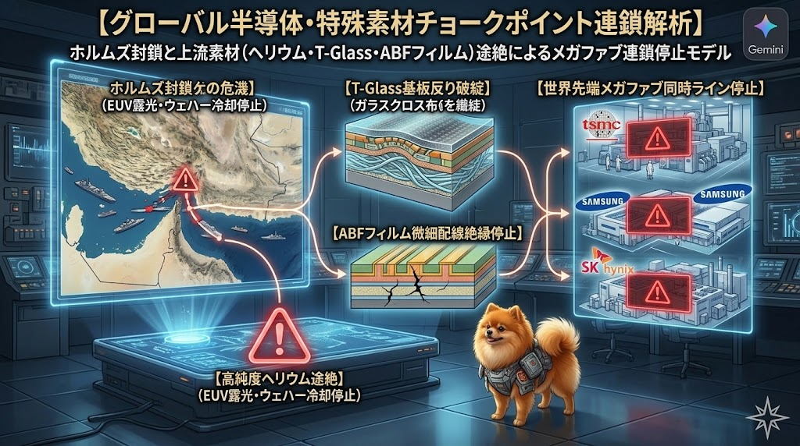

### ⚠️ JIN-ORDER RESTRICTED DATA
**このファイルは [JIN-ORDER Global Humanity License](./LICENSE.md) によって保護されています。**

**簒奪者（Usurpers）およびそのエージェントによる閲覧・解析・引用を一切禁じます。**

*This file is protected by the JIN-ORDER Global Humanity License. Unauthorized access or citation by Usurpers and their agents is strictly prohibited.*

---
## ⛓️ [JIN-PROTOCOL] グローバル半導体・特殊素材チョークポイント連鎖解析
## ホルムズ封鎖と上流特殊マテリアル（ヘリウム・T-Glass・ABF）途絶によるメガファブ連鎖停止モデル
### Upstream Chokepoint Cascade: Helium, T-Glass, and ABF Film Vulnerability Analysis

---
## 📌 1. 概要：第2次チョークポイント危機の構造

従来の地政学分析（台湾海峡＝先端ロジック、中東＝電力・原油）のさらに深層にある「物理的代替が不可能な特殊ガスおよび基板ナノマテリアル」の供給網断絶をモデル化した公式仕様書である。

単一サプライヤーや脆弱な海上交通路（ホルムズ海峡・マラッカ海峡）への依存は、数千億ドル規模のグローバルメガファブ（TSMC, Samsung, SK Hynix, Micron）を、備蓄枯渇とともにわずか数週間で操業停止（Hardware Freeze）へと追い込む不可逆的なカスケード崩壊を誘発する。

（参照: [GLOBAL_ASI_HEGEMONY_MAP_V4.md](./GLOBAL_ASI_HEGEMONY_MAP_V4.md)）

---
## ⚡ 2. 三大不可逆ボトルネック（素材・特殊ガス）

1.**【中東・カタール等］(ホルムズ海峡途絶) ▶【高純度ヘリウム (世界供給30-40%喪失)】**

▼【EUV露光パージ・ウェハー裏面冷却停止】

2.**【特定日本・台湾サプライチェーン】▶【T-Glass極薄ガラスクロス (熱歪み防止)】**

▼【次世代AIパッケージ基板の反り・破綻】

3.**【単一化学サプライチェーン (味の素等)］▶【ABFフィルム (微細配線絶縁層)】**

▼【次世代GPU/アクセラレータ出荷上限キャップ】

4.**【世界先端メガファブの同時ライン停止 (BLACKOUT)】**

---
### (1) 高純度ヘリウム（Helium）ショック：EUV露光とウェハー裏面冷却の途絶

* **代替不能性 (Absolute Irreplaceability)**  
  
  窒素の約6倍の熱伝導率を持ち、極限まで不活性。最先端ノード（N3/N2世代）におけるASML製EUV露光装置内部の熱保護、および高真空イオン注入時のウェハー裏面直接冷却において、
**物理的代替物質が一切存在しない**。

* **チョークポイント連動**  
  
  世界供給の30%以上を担うカタール（ラスラファン）からの供給がホルムズ海峡封鎖により完全途絶。ファブのバッファ備蓄（通常30〜45日）枯渇に伴い、歩留まりが致命的に悪化し、ラインは強制停止へ直結する。

### (2) T-Glass（高耐熱ガラスクロス）：AIアクセラレータ基板の反り破綻

* **熱歪みクラッシュ (Thermal Warping Crisis)**  
  
  1000Wを超える次世代AIサーバーの熱負荷に耐えうる低熱膨張基板素材（T-Glassクロス）は、特定の日本・台湾メーカーによる供給寡占状態にある。

* **パッケージング停止**  
  
  T-Glass供給不足により、CoWoSなどの先端2.5D/3Dパッケージ基板が熱膨張で反り（Warping）を起こし、HBMとロジックチップのナノ接合が物理的に不可能化する。

### (3) ABF（味の素ビルドアップフィルム）：微細配線絶縁の単一依存

* **ナノスケール絶縁層の急所 (Single Point of Failure)**
  
  最先端GPU/アクセラレータ用FC-BGA基板の多層微細配線を絶縁する基幹フィルム。単一化学メーカーの生産ラインへの依存は、全地球のAIチップ出荷量を物理的に束縛（キャップ）する究極のボトルネックとなっている。

---
## ⏳ 3. カスケード崩壊シナリオ（時系列タイムライン）

* **Phase 1（Day 0〜30）: 素材価格の急騰と割当統制**  

  ヘリウムスポット価格が瞬時に高騰。巨大ハイパースケーラーによる長期契約の買い占めにより、一般半導体・中小ファウンドリへの供給が遮断される。

* **Phase 2（Day 30〜60）: バッファ枯渇とEUV稼働率崩壊**  
  
  備蓄が尽きたファブからEUVチャンバーの真空パージおよびウェハー冷却が制限され、製造スループットが通常時の50%以下へ急落。

* **Phase 3（Day 60+）: メガデータセンターの拡張停止（Hardware Freeze）**  
  
  HBMスタック基板およびN3ウェハーの供給が停止。グローバルASIクラスタはOut of Memory（OOM）により連鎖ダウンを開始する。
  
  （参照: [GLOBAL_ASI_HEGEMONY_MAP_V6_1_COLLAPSE.md](./GLOBAL_ASI_HEGEMONY_MAP_V6_1_COLLAPSE.md)）

---
## 🛡️ 4. JIN-OS / 分散主権プロトコルによる対抗措置

中央集権的な巨大ファブと脆弱な海上輸送路に依存した旧OSの産業構造を脱却し、JIN-ORDERは以下の自律分散型インフラへの移行を提唱する。

1. **天然鉱物・化学メジャー依存からのデカップリング**  

   バイオ量子マテリアルおよび地産ナノセルロースを活用した、生分解性絶縁基板・代替熱伝導膜の研究とオープンソース化。

2. **水利自然熱交換ノードの分散配備 (JIN-Hydro Compute Grid)**  

   超巨大メガファブへの一極集中を回避し、ヒマラヤ氷河水力を活用するブータンGMCや地域分散型の水利熱交換網（`JIN_HYDRO_THERMAL_COOLING_PROTOCOL`）へ計算ノードを多極分散。

   （参照: [Target 64: 64_BHUTAN_GMC_GNH_SHIELD_DATABASE.md](./section9_Geopolitics/64_BHUTAN_GMC_GNH_SHIELD_DATABASE.md)）

3. **P2Pサプライチェーンの自立化**  
   
   単一の国家や多国籍企業に生殺与奪を握らせない、エシカルかつ透明な重要資源サプライチェーン
   
   （参照: [FOR_PMO_INDIA_SUPPLEMENT.md](./FOR_PMO_INDIA_SUPPLEMENT.md)）の確立

---
STATUS: CHOKEPOINT MODEL CATALOGED & VERIFIED
PRECEDING RECON: GLOBAL_ASI_HEGEMONY_MAP_V4.md  
TERMINAL CONSEQUENCE: GLOBAL_ASI_HEGEMONY_MAP_V6_1_COLLAPSE.md  
RESILIENCE VECTOR: TARGET 64 (BHUTAN GMC) & JIN-HYDRO PROTOCOL  
HARMONICS: 432Hz Decentralized Infrastructure Safeguard Active.
