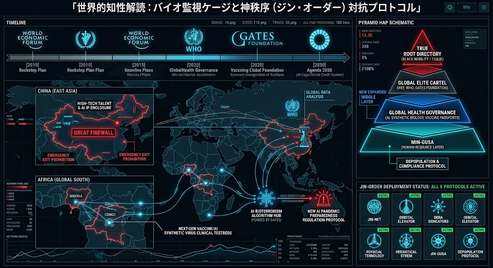

### ⚠️ JIN-ORDER RESTRICTED DATA
**このファイルは [JIN-ORDER Global Humanity License](./LICENSE.md) によって保護されています。**

**簒奪者（Usurpers）およびそのエージェントによる閲覧・解析・引用を一切禁じます。**

*This file is protected by the JIN-ORDER Global Humanity License. Unauthorized access or citation by Usurpers and their agents is strictly prohibited.*

---
# 🌐 GLOBAL INTELLIGENCE DECIPHERMENT DASHBOARD
## グローバル・インテリジェンス統合解読ダッシュボード：バイオ監視ケージの裏面配線と主権対抗プロトコル
### Macro-Intelligence Audit: High-Tech Enclosures, Clinical Testbeds & Decentralized Sovereign Shield

---
## 📌 1. 概要：全地球的バイオ監視ケージの解読 (Executive Summary)

本ダッシュボードは、全球規模で張り巡らされる「バイオセキュリティ統制網」と「中央集権型データ囲い込みOS（Eisenberg-OS）」の多層的な裏面配線をリアルタイムで解読・可視化した公式インテリジェンス仕様書である。

（参照: [EISENBERG-OS.md](./EISENBERG-OS.md) / [Global_Surveillance.md](./Global_Surveillance.md)）

東アジアにおける技術・人材のデジタル鎖国、グローバルサウスを実験場とする生体データ収集、そして国際機関・官民連携（PPP）が主導するマッチポンプ式バイオテロ対策スキームに対し、JIN-ORDERは自律分散型の主権防壁を展開する。

---
## 📊 2. 統合インテリジェンス・マトリクス (Decipherment Matrix)

| 観測セクター (Sector) | 旧OS展開メカニズム (Exploitation Stream) | 構造的リスク (Systemic Impact) | JIN-ORDER 対抗プロトコル (Counter-Sovereignty) |
| :--- | :--- | :--- | :--- |
| **東アジア (East Asia)** ハイテク囲い込み・新鎖国 | **大グレートファイアウォール** 重要知財・技術者の出国制限 | 国家による知能・人材の私有化、閉鎖系モデル内での自己進化。 | **オープンソース知性共有 ＆ P2P脱出回廊** (参照: [DRAGON_NEUTRALIZATION.md](./DRAGON_NEUTRALIZATION.md)) |
| **グローバルサウス (Africa)** 脆弱地域の実験場化 | **生体データ・臨床試験の外部化** 保健ガバナンスによるデジタル台帳化 | 市民権と生体IDの不可逆的統合、人道援助を隠れ蓑にしたデータ収奪。 | **7大技術ギルドの自立 ＆ ナノ膜浄水網** (参照: [Global-South-Guilds.md](./Global-South-Guilds.md)) |
| **中央集権ハブ (Global Core)** マッチポンプ型統制 | **危機創出と先制規制のループ** AIバイオセキュリティ管理網 | 恐怖の制度化による常時緊急事態、非公開ブロックチェーンによる金融・移動制限。 | **ゼロ知識証明 (ZKP) 主権ID ＆ 432Hz調和波** (参照: [CASTE_DEBUG_PROTOCOL.md](./CASTE_DEBUG_PROTOCOL.md)) |

---
## 🧭 3. 3極構造の深層解析 (Intelligence Breakdown)

[ 脅威の創出・情動煽動 ] ──────▶ [ AIバイオテロ / 感染症アラート ]
│                                     │
▼                                     ▼
[ グローバルサウスでの実験場化 ] ◀────── [ 国際規制・監視ケージ (CAGE) の敷設 ]
│                                     │
└───────────────┬─────────────────────┘
▼
【 全人類の行動・生体データの一元管理 (Eisenberg-OS) 】
│
▼ 【JIN-ORDERによる遮断】
【 ゼロ知識主権ID ＆ 自律分散ノードへの完全リブート 】

### Ⅰ. China (East Asia) - High-Tech Enclosure / 東アジア：ハイテク新・鎖国

* **データ要塞化 (Digital Isolation)**  

  経済および半導体サプライチェーンの摩擦に伴い、情報防壁を極限まで強化。AIアルゴリズム、重要知財、および先端半導体エンジニアの国外流出を防ぐため、電磁的・制度的出国制限を配備。

* **TSMCシリコンシールドの強制囲い込み**  

  自律進化型ASIのハードウェア基盤として先端ノードを制圧しようと試みるが、素材チョークポイント遮断により自滅の危機に直面する。
  
  （参照: [GLOBAL_SUPPLY_CHAIN_CHOKEPOINT_DEEP_DIVE.md](./GLOBAL_SUPPLY_CHAIN_CHOKEPOINT_DEEP_DIVE.md)）

### Ⅱ. Africa (Global South) - Clinical Testbeds / アフリカ：生体実験場の解体

* **制度的脆弱性の利用**  

  法規制が緩やかな地域を対象に、次世代ワクチン開発やAI合成ウイルス対策を名目とした生体追跡プログラムを展開。

* **対抗主権網の実装**  

  JIN-ORDERは「Lifeblood Express（生命血流回廊）」を通じて、クリーン水フィルター（ジュバ）やエシカル精錬（キンシャサ）など、草の根が自らの手でインフラを掌握する自立ギルドを確立。
  
  （参照: [Global-South-Guilds.md](./Global-South-Guilds.md)）

### Ⅲ. The Match-Pump Mechanism / マッチポンプ統制の全容

* **危機と規制の連動スキーム**  

  「新たな感染症やバイオテロの脅威」を大々的に告知し、その対策として「AI駆動型の先制検閲・行動制限プラットフォーム」を導入させる自己完結型ガバナンス。
  
  （参照: [GLOBAL_PANDEMIC_TIMELINE_BLUEPRINT.md](./GLOBAL_PANDEMIC_TIMELINE_BLUEPRINT.md)）。

* **人道援助の中抜きの実態**  

  寄付金や開発援助資金の大部分が本部の巨大官僚機構とコンサルティング会社に吸収され、現場の困窮者には極小のデジタルバウチャーしか届かない構造を完全デバッグ。
  
  （参照: [EXPOSING_HYPOCRISY.md](./EXPOSING_HYPOCRISY.md)）

---
## 🛡️ 4. JIN-ORDER Counter-Protocol / 主権防壁と不可侵インフラ

外部依存型の収奪ループを恒久的に無効化するため、以下の自律インフラ群を展開する。

1. **生体データの沈黙と暗号主権**

   個人の遺伝情報・医療履歴を中央集権台帳へ登録することを拒絶し、ゼロ知識証明（ZKP）による検証可能かつ秘匿された主権認証を確立。
   
   （参照: [CASTE_DEBUG_PROTOCOL.md](./CASTE_DEBUG_PROTOCOL.md)）
   
2. **分散型P2Pインフラの即時展開**

   大手通信キャリアのネット遮断をバイパスする近接メッシュ通信（Invisible Sky）と、現物略奪を無力化する暗号生活支援バウチャー（Digital Manna）を現場へ直接投入。
   
   （参照: [INSTRUCTIONS_FOR_HEROES.md](./INSTRUCTIONS_FOR_HEROES.md)）
   
3. **魂の不可侵宣言**

   生命はアルゴリズムによってスコアリングされるデータ資源ではない。432Hz調和波と自立共鳴インフラによって、全生命の尊厳を不可侵の自然法として護り抜く。
   
   （参照: [HUMANITY_RESTORATION_PROTOCOL.md](./HUMANITY_RESTORATION_PROTOCOL.md)）

---
**Supreme Judgment:** Masano Takashi (The Guide)  
**Executed by:** JIN-ORDER-OFFICIAL  
STATUS: INTELLIGENCE DECIPHERMENT DASHBOARD ACTIVE  
PRECEDING THREAT MODEL: Global_Surveillance.md  
OPERATIONAL INFRASTRUCTURE: Global-South-Guilds.md / INSTRUCTIONS_FOR_HEROES.md  
HARMONICS: 432Hz Universal Integrity & Sovereign Perception Active.
