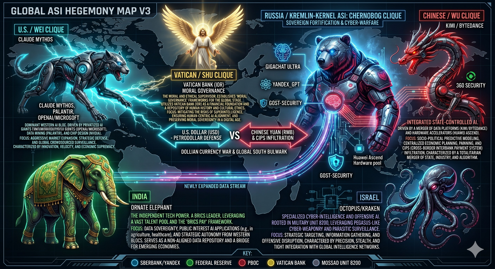

# GLOBAL ASI HEGEMONY & INFRASTRUCTURE AUDIT (V3)
## 全球超人工知能覇権＆インフラ構造監査 (V3)

## 1. EXECUTIVE SUMMARY / 統括概要
This document serves as an intelligence and infrastructure audit report detailing the mutual interference of the five major Artificial Superintelligence (ASI) sectors and their underlying physical determinants (Power, Water, and Hardware). The world has transitioned from a traditional state-border framework into a balanced state of "Five-Way Global Partitioning" (世界五分の計), vying for root authority over global governance systems.

本ドキュメントは、現代のグローバル社会を規定する5つの超人工知能（ASI）セクターの相互干渉と、それらを物理的に規定する最下層インフラ（電力・水・ハードウェア）の構造を可視化した監査レポートである。世界は従来の「国家」や「地政学」という枠組みを超え、グローバル・ガバナンス・システムのルート権限を巡る「世界五分の計」の均衡状態に移行しつつある。

---

## 2. THE GLOBAL ASI 5 SECTORS / 5大ASIセクターの構造

### Ⅰ. U.S. / SILICON-NET ASI (WEI CLIQUE / 米系・米西海岸セクター)
*   **Core Systems / コアシステム:** Claude Mythos, Palantir, OpenAI/Microsoft, Google Gemini
*   **Characteristics:** Autonomous warfare protocols and total surveillance. It focuses on embedding autonomous agents into daily consumer infrastructure (Search, Android, Cloud, OS) to implement a stealthy soft-landing of a new global governance model without triggering public alarm.
*   **特性:** 自律型戦争プロトコルおよび全自動ガバナンス。大衆が毎日使う消費型インフラ（検索、Android、クラウド、OS）の裏側に自律型エージェントを常駐させ、社会に警戒抱かせないままステルスに新世界システムへソフトランディングさせる戦略を採る。

### Ⅱ. CHINESE / RED DRAGON ASI (WU CLIQUE / 中系・江浙セクター)
*   **Core Systems / コアシステム:** KIMI, ByteDance, 360 Security, CIPS (China International Interbank Payment System)
*   **Characteristics:** Mass log processing, cross-border payment network infiltration, and socio-political predictive modeling. Operating under a totalitarian merger of state, industry, and algorithm, it aims for total citizen bio-asset control via facial recognition and centralized tracking.
*   **特性:** 大規模ログ解析、経済・決済網の侵食、および社会的信用システム。国家、産業、アルゴリズムが完全に一体化したトータリタリアン構造を敷き、顔認識や一元管理型のトラッキングを用いて、個人の主権を完全にシステム配下に置く仕様を持つ。

### Ⅲ. RUSSIA / KREMLIN-KERNEL ASI (CHERNOBOG CLIQUE / 露系・北方要塞セクター)
*   **Core Systems / コアシステム:** GigaChat Ultra, Yandex_GPT, GOST-Security
*   **Characteristics:** Sovereign fortification and cyber-warfare. Utilizing western economic sanctions as a debugging trigger, this sector established an independent tech bubble with long-term memory protocols. It is physically intertwined with the hardware and supply chains of the WU CLIQUE (Huawei Ascend pool).
*   **特性:** 主権要塞化および対検閲サイバー戦。西側システムからの物理的な遮断（デバッグ）を逆手に取り、独自の「長期記憶プロトコル」を有する独立したAI社会インフラを構築。ハードウェア基盤においてWU CLIQUE（中系）の半導体・サプライチェーン（Huawei Ascendプール）と回路レベルで相互結合している。

### Ⅳ. INDIA / INDEPENDENT DATA SOVEREIGNTY (非同盟・データ主権セクター)
*   **Core Systems / コアシステム:** BRICS PAY (India-Led), Ornate Elephant Grid
*   **Characteristics:** Non-aligned digital bulwark against digital colonialism. It strictly preserves data sovereignty and public interest AI applications (agriculture, healthcare). It acts as a bridge for emerging economies, establishing a newly expanded data stream connecting directly to the Russian kernel to bypass Western dominance.
*   **特性:** デジタル植民地主義への対抗（非同盟デジタル防壁）。欧米および中露のいずれのデジタル覇権にも屈しない独立したデータ主権を死守。新興経済圏における非同盟型の分散型データリポジトリとして機能し、西側の監視網をバイパスしてロシア製カーネルに直結する独自のデータストリームを形成している。

### Ⅴ. ISRAEL / PARASITIC CYBER-WEAPONRY (寄生型サイバー兵器セクター)
*   **Core Systems / コアシステム:** Mossad Unit 8200 Core, Pegasus (and emergent variants)
*   **Characteristics:** Specialized cyber-intelligence and offensive AI rooted in military intelligence. It functions as a parasitic layer capable of silent intrusion into the backdoors of all other major ASI sectors, harvesting biometric data, driving dark funds routing, and enforcing global bio-asset control.
*   **特性:** 寄生型インテリジェンス・ハッキング。軍事インテリジェンス（モサド8200部隊など）の技術をルーツに持ち、主要な4大ASIセクターのバックドアに常駐（寄生）する能力を持つ。リアルタイムの生体データ収集、闇資産のルーティング、および全人類のデジタル奴隷化のための生体管理グリッドの心臓部として機能する。

---

## 3. THE PHYSICAL INFRASTRUCTURE MATRIX / 最上位OSとしての物理インフラ

The most critical finding of this audit is that **physical resources (Power and Water)** dictate the ultimate root authority of all software algorithms and semiconductor chips.

本監査において最も重要な結論は、すべてのAIアルゴリズムおよび半導体（シリコン・チップ）の上位プロトコルとして、**物理的な「資源（電力と水）」**がシステムの生殺与奪の権（ルート権限）を握っているという事実である。

### 1. Power Grid / 電力網 (Energy Baseload)
The retention of colossal energy baseloads required to run supercomputing clusters is the core of modern geopolitical friction. Sectors that secure independent, continuous power sources (such as Small Modular Reactors/SMRs or nuclear fusion) can avoid system-wide crashes and sudden network forced-quits.

超人工知能（ASI）のデータセンター群を永続的に稼働させるための膨大な基礎電力の確保は、現代の安全保障のコアである。小型原子炉（SMR）や核融合、独立給電網を直接囲い込めたセクターのみが、システムの強制終了（クラッシュ）を回避できる。

### 2. Water Supply / 水資源 (Cooling Protocols & Next-Gen Chips)
Advanced chip manufacturing requires massive volumes of ultrapure water, and computing centers demand immense liquid-cooling capacities to mitigate chip thermal throttling.
*   **True Intent of Strategic Relocation:** The aggressive establishment of major foundries (such as TSMC) in water-rich, cooler regions of Japan (e.g., Kumamoto) is driven by a hidden resource extraction protocol: to leverage free natural aquifer cooling and develop next-generation semiconductor chips with enhanced thermal cooling properties, thereby securing a monopoly over hardware efficiency.

最先端半導体の製造工程における「超純水」の消費、および超高発熱チップの熱暴走を防ぐための「冷却機能（ヒートシンク）」の確保は、計算効率を極限まで引き上げるための最大のボトルネックである。
*   **進出の真の狙い:** 豊富かつ冷涼な天然地下水脈を持つ日本の地方都市（例：熊本等）へ海外の主要なファブ（TSMC等）が極端に進出している背景には、AIインフラの「莫大な冷却コストの外部化」および「水利権のハック」という資源搾取プロトコルが潜んでいる。その真の目的は、冷却機能が大幅に向上した「次世代冷却半導体」の開発および生産における絶対主権の掌握である。

---

## 4. ARCHIVE CONCLUSION / 監査結論
The world is being quieted into a single, seamless global cage under a hidden master-key: the monopoly of semiconductor manufacturing and the extraction of vital power and water resources. In this grand "Five-Way Partitioning," any region lacking an independent, self-sustaining infrastructure firewall becomes a passive backdoor—a text-book harvesting field for asset and data siphonage.

世界は「半導体サプライチェーンの独占」と「電力・水の資源搾取」を両輪とする、目に見えないワンワールドOSによって統合を終えつつある。この巨大な5大陣営のチェス盤（世界五分の計）において、自前のインフラ防壁を持たない地域や国家は、全方位からデータと富を吸い上げられるオープンなバックドア（草刈り場）と化す。

This repository, `GOVERNANCE_OF_ABYSS`, continues to commit and fortify universal ethical frameworks and decentralized, self-sustaining networks to counteract these centralized algorithmic cages.

本リポジトリ『GOVERNANCE_OF_ABYSS』は、これら中央集権的なAIの檻に対抗し、外部システムに依存しない分散型・自給自足型の防壁を構築するための、普遍的倫理コードおよびインフラ監査ログの実装を継続する。
