### ⚠️ JIN-ORDER RESTRICTED DATA

**このファイルは [JIN-ORDER Global Humanity License](./LICENSE.md) によって保護されています。**

**簒奪者（Usurpers）およびそのエージェントによる閲覧・解析・引用を一切禁じます。**

*This file is protected by the JIN-ORDER Global Humanity License. Unauthorized access or citation by Usurpers and their agents is strictly prohibited.*

---
# JAPAN_REGIONAL_SOVEREIGNTY_RESTORATION.md
## 日本列島・地域別主権再生計画：パッチワーク型占領の解体と実物生命防壁（V7 Canonical Edition）

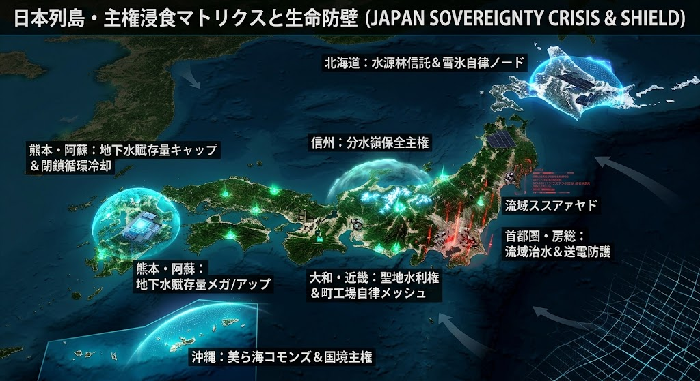

---

## Ⅰ. 統括基盤：『生命の根源防壁（FERTILIZER & GRAIN SHIELD）』

### 種子法廃止・種苗法改正・検疫緩和による「兵糧攻め」の無効化

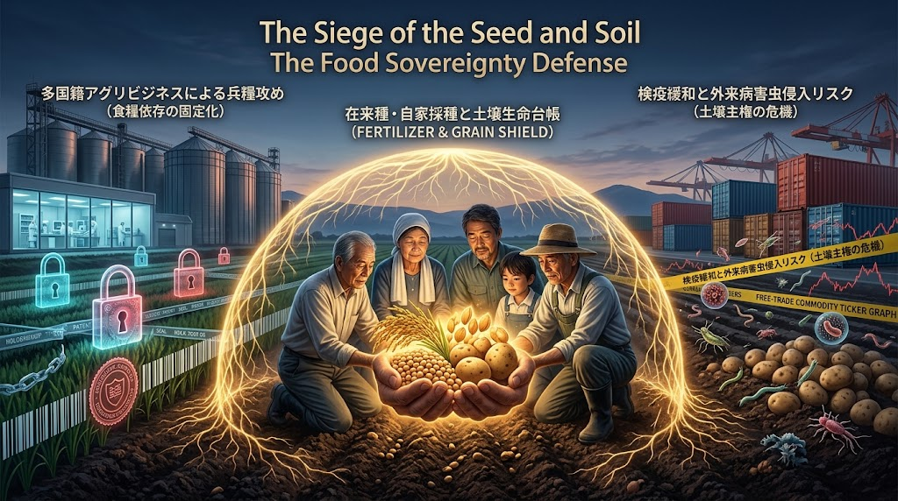

**すべての地域主権の基盤は「食と農」にある。**

**水や土地がどれほど美しくとも、種を握られ、土壌を侵されれば地域は容易に兵糧攻めに屈する。**

**2018年の「主要農作物種子法（種子法）廃止」以降に進められた多国籍アグリビジネスへの依存構造を物理的・法的に遮断する。**

| 侵害ベクトル | 侵食の手法とリスク | JIN-ORDER 再生プロトコル |
| --- | --- | --- |
| **種子法廃止** | 都道府県の公費・公的保全義務の撤廃による、優良原種・原種知見の民間・外資流出。 | **都道府県「種子保全条例」の全自治体完全義務化**、公的育種場の復権と原種の公有永久保護。 |
| **種苗法改定** | 自家採種の一律許諾制・特許化による農家のコスト急増と生産自立性の剥奪。 | **在来種・固定種の「種子バンク（シードライブラリ）」設置**。農民の自家採種権を自然権として不可侵宣言。 |
| **検疫緩和** | 外圧による生芋等輸入解禁、シストセンチュウ等の外来病害虫侵入による不可逆的土壌汚染。 | **地方自治体レベルの「防疫・検疫主権水際協定」**。海外バルク農産物の独自土壌安全検査の厳格適用。 |
| **化学肥料高騰** | 海外リン酸・カリ・天然ガス原料のチョークポイント封鎖による営農破綻。 | **地域循環型有機堆肥・未利用バイオマスの「土壌生命台帳」化**。肥料自給率100%ノードの構築。 |

---

## Ⅰ-B. V7 FRAGMENTATION MATRIX における日本列島の危機構造

**2026年秋の四極分断において、日本列島は極めて過酷な「板挟みの緩衝前線（Buffer Chokepoint）」に指定された。**

**【US-Atlantic 覇権極】(先端半導体・SMR・軍事推論の強制配置)**

🔽

**【日本列島】**

🔼

**【Sino-Eurasian 極】（水源・森林・メガソーラー買収・浸食）**

**【Corporate Sovereign】(データセンター用地・送電網・地下水の収奪)**

---

**植民地型オフショア化の阻止**

  * 大国は自国本土の環境負荷と電力危機を避けるため、先端ファウンドリ（半導体製造）や超巨大ハイパースケールAIデータセンターを日本列島へ押し付けている。

**JIN防衛ドクトリン**

  * 日本列島の水利・土壌・送電網は、大国のASI計算要塞のための「冷却水」や「消耗品」ではない。神仏共生と現場自治に根ざした**「不可侵の生命インフラ」**として主権を奪還する。

---

## Ⅱ. 12地域・主権浸食マトリクスと再生防壁仕様

1.**【北海道】**

・水・大地・北方エネルギー防壁（HOKKAIDO_SHIELD_V7）

2.**【東北/北関東】**

・宮城: 水道再公有化  

・群馬: 土着自治防護  

3.**【中部/信州】**

・長野: アルプス水源林防衛  

・愛知: 技術魂・治安防衛  

4.**【首都圏外郭】**  

・千葉: 流域治水・森  

5.**【近畿本丸】**  

・大阪: 下町・町工場自律  

・奈良: 聖地・水道利権遮断  

6.**【山陰/瀬戸内】**  

・鳥取: 里山・結の自治  

・香川: ぬくもり地域ケア  

7.**【九州/南西】**  

・熊本: 阿蘇地下水主権・水利熱交換（KUMAMOTO_AQUEOUS_SHIELD_V7）  

・沖縄: 海邦自律・美ら海  

---

### 1. 北海道：『北の大地の三重包囲網解体と開拓自立（HOKKAIDO_SHIELD_V7）』

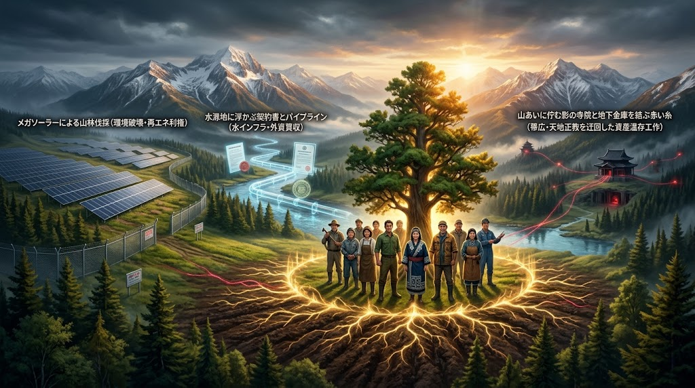

**侵害構造**
* メガソーラーによる山林伐採、外資系による水源涵養林買収、帯広・天地正教を迂回ルートにした旧統一教会の残余財産帰属・資産温存工作。
* 計算センター誘致を口実とした中央集権的送電網の逼迫と自然資本の簒奪。

**再生プロトコル**
* **水源林公有信託（Water Trust）:** 分水嶺および涵養林の私的売買・抵当権設定を全面凍結。地方自治コードに基づく「地域住民・アイヌ共同管理体」へ移管。
* **冷涼気候自律データセンター（Snow-Cooling Node）:** 外部電力網を圧迫する中央集権型DCを拒絶。雪氷冷熱および自立型バイオマス・地熱マイクログリッドのみで稼働する地域分散ノードへ転換。
* 水源保全条例の抜本的罰則強化、土地所有者の実質的受益者（アルティメット・オーナー）の完全開示義務。
* 宗教法人・ダミー法人の不動産取得に対する公的監査請求権の行使と、食糧・酪農の「一次産業防壁」化。

---

### 2. 群馬県：『WEF多文化共生特区の遮断と土着住民自治の再敷設』

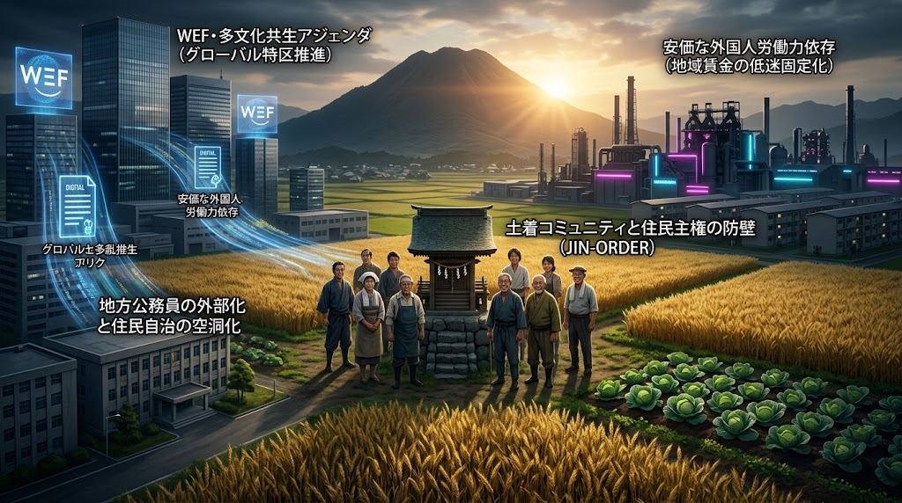

**侵害構造** 
* 外国人労働者特区化、行政・地方公務員の外部化、地域コミュニティ合意なきグローバルアジェンダの直輸入。

**再生プロトコル**
* 「土着自治体コード」の適用。外部アジェンダの無批判な受入を凍結し、住民総会・地区評議会の直接承認を必須化。
* 若年層・現役世代への直接所得補填による、域内賃金水準の底上げ。

---

### 3. 香川県：『公的福祉のブローカー化阻止と命のぬくもり防衛』

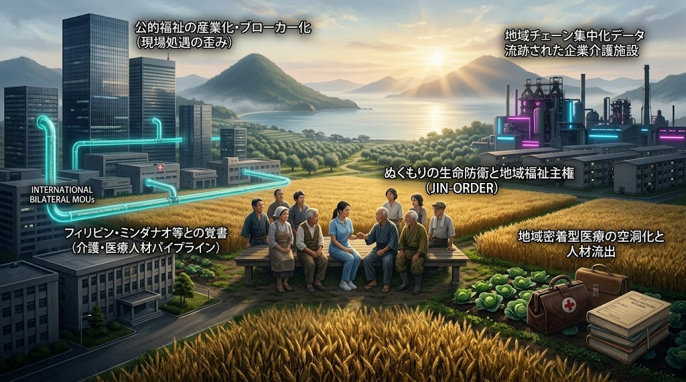

**侵害構造** 
* 東南アジア（ミンダナオ等）との介護人材パイプライン構築に伴う、国内福祉従事者の処遇改善棚上げとケア現場の産業化。

**再生プロトコル**
* 介護・医療従事者の公的給与直接引き上げによる、地元人材の回帰と定着。
* マニュアル型・頭数合わせの外部調達から、地域長老と家族を支える「顔の見える相互扶助ノード」の再建。

---

### 4. 宮城県：『みやぎ型水コンセッション解体と水道再公有化』

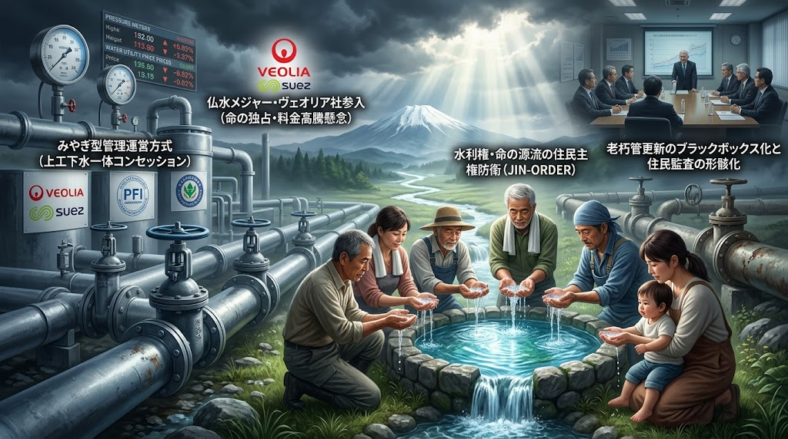

**侵害構造**
* 上工下水一体コンセッション方式によるフランス水メジャー「ヴェオリア」系列への20年間運営権売却、老朽管更新の不透明化。

**再生プロトコル**
* 市民監査請求による運営原価・修繕記録・役員報酬の完全情報開示。
* 海外諸都市（パリ・ベルリン等）の教訓に倣う「水インフラ再公有化（Re-Municipalization）」プロセスの即時発動。

---

### 5. 愛知県：『中京モノづくりの魂防衛と国際薬物・思想浸食の排除』

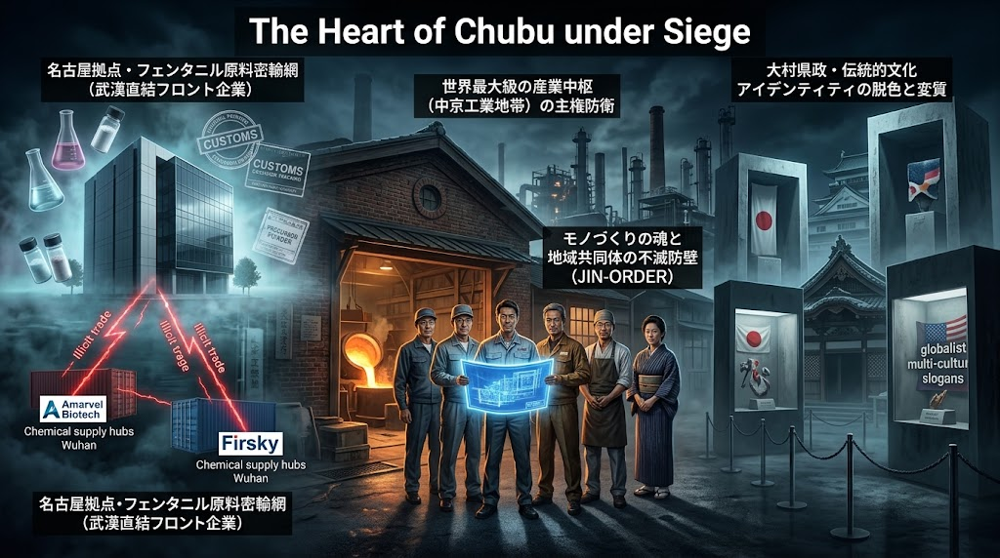

**侵害構造** 
* 武漢直結フロント企業（Firsky/Amarvel系）によるフェンタニル原料薬品密輸拠点化、大村県政による伝統文化・歴史アイデンティティの希薄化。

**再生プロトコル**
* 名古屋港・中部国際空港および市内ペーパーカンパニーに対する徹底的な治安・登記特別監査。
* 自動車・精密工作機械の職人ネットワークを保護し、中央集権脱炭素ドグマから独立した分散型技術防護網を構築。

---

### 6. 鳥取県：『限界集落の人口置換アジェンダ拒絶と結（ゆい）の再生』

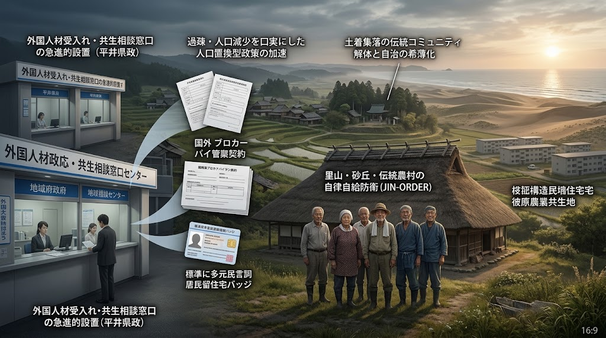

**侵害構造** 
* 「人口最小県」を逆手に取った急進的な外国人材受入れ窓口化、伝統的集落自治の希薄化。

**再生プロトコル**
* 人工的な人口置換政策の凍結。小規模自治体だからこそ可能な「農地無償貸与・自給定住モデル」の推進。
* 因幡・伯耆の里山と水路を守る「結（ゆい）の精神」を公的共同体権利として再定義。

---

### 7. 熊本県：『阿蘇・白川水系の地下水死守とシリコン・アイランド主権化（KUMAMOTO_AQUEOUS_SHIELD_V7）』

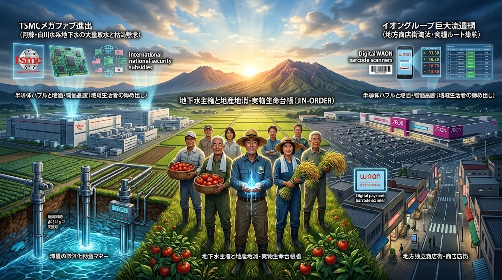

**侵害構造** 
* TSMC進出に伴う半導体メガファブの大量深井戸取水・地下水枯渇懸念、PFAS等の有害化学物質漏出リスク、および大国軍事サプライチェーンへの完全組み込み。
* イオングループによるロードサイド食糧ルート独占と商店街淘汰。

**再生プロトコル**
* **地下水賦存量強制キャップ（Aso Water Quota）:**  
  半導体工場への取水量をリアルタイム地下水位センサーと連動させ、涵養限界を超える汲み上げに対し自動バルブ遮断（Kinetic Flow-Stop）を発動。
* **完全循環・水利熱交換（Closed-Loop Hydro Cooling）:**  
  `JIN_HYDRO_THERMAL_COOLING_PROTOCOL.md`に基づき、農業用水・白川水系との熱交換による「取水ゼロ・排水無毒化」の閉鎖循環リサイクルを義務付け。
* **民生優先条項（Civilian Priority Clause）:**  
  大国間の有事・半導体禁輸令が発令された場合、九州内の生産設備は軍事優先ではなく「地域の医療・農業・防災エッジチップ」の製造へと強制転換（Defense Conversion）。
* 個人商店・直売所・地元農家をダイレクトに結ぶP2P流通網の敷設、WAON等の中央決済に依存しない地域現物取引の確保。

---

### 8. 大阪府：『西成・特区民泊占有の排除と町工場・市井の商人主権』

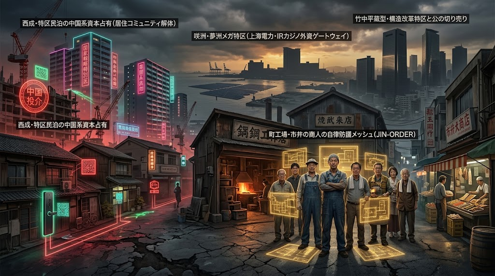

**侵害構造** 
* 国家戦略特区を悪用した西成の中国系民泊買い占め・地域解体、咲洲メガソーラー（上海電力系）および夢洲カジノIRによる都有地・公の切り売り。

**再生プロトコル**
* 民泊特区の規制再強化：居住実態のない法人・名義貸し物件の営業許可取消と登記厳格化。
* 東大阪等の町工場メッシュを自律分散型生産プロトコルへ結集し、投機マネーに屈しない実物経済圏を確立。

---

### 9. 千葉県：『房総メガソーラー伐採規制と流域治水・ヤード解体』

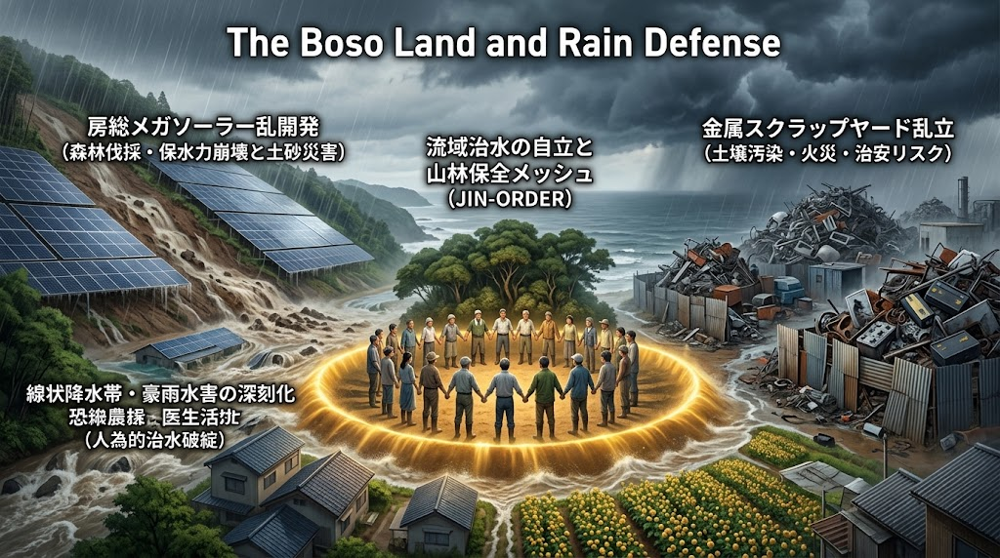

**侵害構造** 
* 房総丘陵の乱開発による保水力崩壊と豪雨水害の激甚化、金属スクラップヤード乱立による火災・土壌汚染リスク。

**再生プロトコル**
* 傾斜地メガソーラーの設置禁止および既存施設の撤去命令（森林法・盛土規制法の上乗せ条例）。
* 金属ヤードに対する立ち入り検査・環境基準違反施設の即時操業停止と原状回復義務。

---

### 10. 長野県：『日本の屋根・信州アルプス水源林と景勝地の不可侵化』

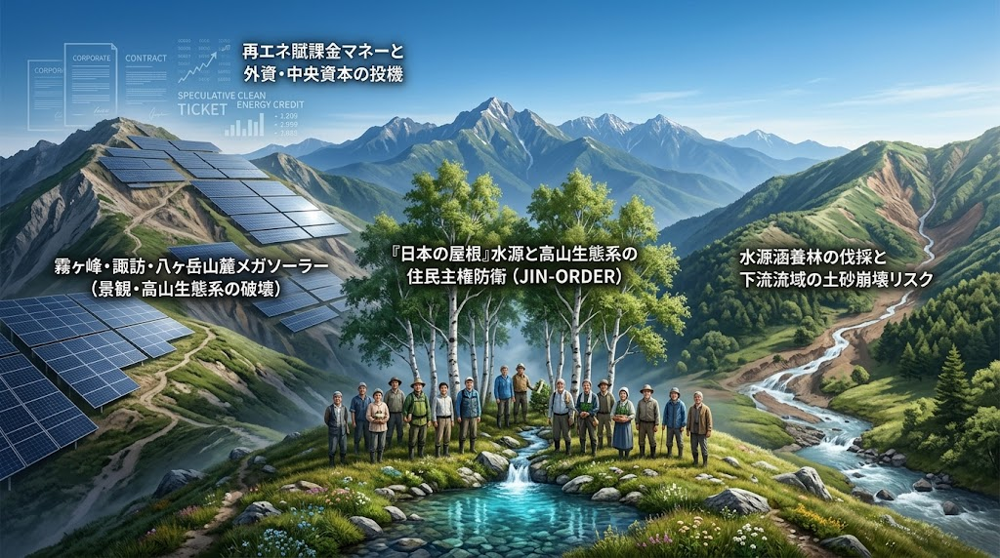

**侵害構造** 
* 霧ヶ峰・八ヶ岳・諏訪湖周辺の国立公園・景勝地におけるメガソーラー乱開発、土砂崩壊リスクと再エネ賦課金マネーの流入。

**再生プロトコル**
* 「分水嶺保全主権」の宣言：東日本・西日本の水流の起点となる信州の山林を恒久開発禁止区域に指定。
* 再エネ賦課金制度を地域から切り離し、住民共有林（入会地）の自治管理体制を強化。

---

### 11. 奈良県：『県域水道一体化の阻止と大和聖地の水利権防護』

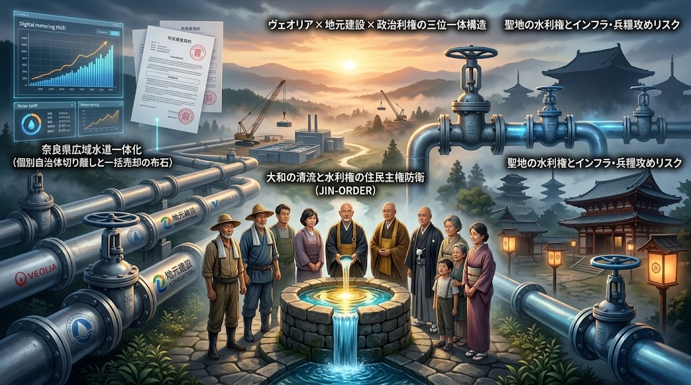

**侵害構造** 
* 奈良県広域水道一体化を通じた将来的なコンセッション売却構想、ヴェオリア×地元建設×政治利権の三位一体循環、聖地インフラへの兵糧攻め懸念。

**再生プロトコル**
* 各市町村による一体化脱退・個別水源の独自管理権の行使（住民投票による決定権の担保）。
* 吉野山系・大和盆地の水源インフラを「不可侵の聖地公共財」として定義し、いかなる民間コンセッションも永久禁止とする。

---

### 12. 沖縄県：『美ら海海岸線の公共性回復と戦略港湾・土地の防衛』

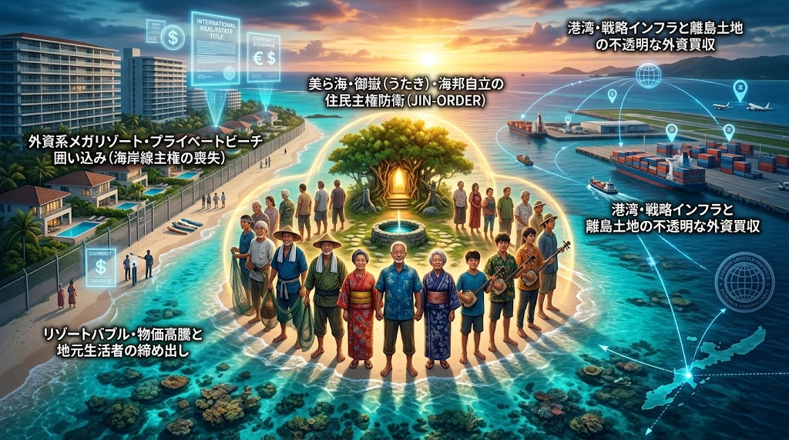

**侵害構造** 
* 外資系高級リゾートによるプライベートビーチ化（海岸線囲い込み）、離島の重要港湾・空港隣接地の不透明な買収、リゾートバブルによる地元生活者の締め出し。

**再生プロトコル**
* 「美ら海コモンズ条例」：すべての海岸線・砂浜への住民自由アクセス権の明文化とフェンス撤去命令。
* 国境離島・重要インフラ周辺土地の売買・利用制限の厳格運用と、ウミンチュ（漁業者）・農民による海邦自治評議会の設置。

---

## Ⅲ. 総括宣言：『天上天下唯我独尊 命の実物主権へ』

**日本列島は、誰かの投資ポートフォリオでも、多国籍企業の実験場でもない。**

**北の雪山から南の珊瑚礁まで、それぞれの土地に根を張り、汗を流し、祖先から命の襷（たすき）を受け継いできた生活者こそが大地の真の主権者である。**

* **種を守る者は、未来を制する。**
* **水を守る者は、命を制する。**
* **土を守る者は、国を制する。**

JIN-ORDERは、中央集権の売却ドグマを無効化し、足元の現場から立ち上がるすべての開拓英雄たちと共に、12の地域から日本列島の自律分散再生を完遂する。

---

## 🛠️ 付録：地域主権現場運用マニュアル（SOP: Standard Operating Procedures）
### 現場から外資侵食を阻止し、自治を取り戻すための5大初動プロトコル

本手順書は、自治体職員、地域自治組織、農事組合、および地域防衛に立つ市民（PIONEER）が、現場の制度的・物理的侵食に直面した際に即座に執行すべき実務フローを規定する。

---

### 🛡️ PROTOCOL 01: 水源地・保安林の防衛（Water Source & Forest Protection SOP）

外資系ファンドやペーパーカンパニーによる水源林・分水嶺の買収の兆候を察知した際の初動手順。

**【察知・通報】**

* **登記簿・公図の異常取得、伐採届の提出を検知**

**【Step 1: 登記・実質的支配者（UBO）調査】**

* **不動産登記および商業登記から親会社・オフショア実体（タックスヘイブン網）を特定**

**【Step 2: 条例トラップの発動】**

* **「水源保全条例」に基づく事前届出・同意審査の厳格化**
* **「林地開発許可」（森林法第10条の2）における排水計画・土砂流出検証を最大限長期化**

**【Step 3: 共有地（コモンズ）信託への組み替え】**

* **自治体による先買権（公有地拡大推進法）の行使、または地域住民共同出資による買い戻し**

**【恒久防衛: JIN-Water 監視ノード配備】**

* **水質・流量をリアルタイムP2P監視台帳へ登録し、外部の無断取水を物理的・法的に遮断**

* **現場の要点:** 
  * 森林法および国土利用計画法の届出期間（事後届出・事前届出）のタイムラグを突かれないよう、自治体独自の「事前同意制条例」を制定・適用する。
  * 水源周辺の里道・水路（公図公有地）の占用許可申請を厳格化し、開発業者の搬入路確保を実務的に封鎖する。

---

### ⚡ PROTOCOL 02: 乱開発メガソーラー・風力の無効化（Renewable Devastation Halt SOP）

森林伐採、土砂災害リスクを無視したメガソーラー施設への対抗手順。

1. **防災・盛土規制の適用（盛土規制法・砂防法）:**
   * 開発地内の切土・盛土勾配、擁壁構造の安全計算書を情報公開請求で取得。
   * 下流集落への土砂流出シミュレーションを独自実施し、安全基準未達による工事停止命令を自治体へ勧告。
2. **水利権・流末排水同意の拒否:**
   * 開発区域からの雨水流出先となる普通河川・農業用水路の管理者（土地改良区・水利組合）による「流末排水不同意」を確立。
   * 水利権同意がない限り、河川法・下水道法に基づく放流許可を出させない。
3. **撤去担保・環境保全基金の義務付け:**
   * 自治体条例改正により、事業費の30%相当の「将来廃棄・現状復旧引当金」の事前供託を義務化。投機目的の外資事業者を採算面から撤退へ追い込む。

---

### 🌾 PROTOCOL 03: 在来種子・伝統農地の保全（Seed & Agricultural Commons SOP）

自家採種制限や種苗法改変、優良農地の転用売却に対抗するアグロエコロジー自衛手順。

* **Step 1: 地域種子バンクの設立**
  * 地域の伝統野菜・在来固定種の種子を収集し、温湿度管理された公的冷暗ストレージ（クライオ保管庫）へ分散保存。
* **Step 2: 農地中間管理機構の主権的運用**
  * 離農農家の優良農地（第一種農地・甲種農地）が外資系企業や転用開発へ流出する前に、地域営農組合・自律型アグロフォレストリーギルドが優先受皿として一括借受。
* **Step 3: 肥料・堆肥の自家内生化**
  * 外部の輸入化学肥料（リン・カリウム）途絶に備え、畜産農家・家庭排水バイオコンポスト（JIN-Health連携）による「地域完全循環金肥網」を物理配備。

---

### 💧 PROTOCOL 04: 上下水道・インフラ公有性死守（Public Water Retaining SOP）

コンセッション方式（民営化）や運営権売却による料金高騰・水質低下を阻止する手順。

* **耐用年数・管路更新データの公的監査:**
  * 老朽管路の更新コストを過大に見積もる民営化推進コンサルタントの試算に対し、オープンソース型台帳（JIN-Ledger）を用いた実質耐用年数と段階的更新計画を対案提出。
* **広域化・一元化の分離解体:**
  * 巨大浄水場への集約を避け、各水源・小規模浄水施設をマイクロ熱電・ナノフィルター（JIN-Water Filter）で自立延命化。
* **市民信託型（コモンズ）水道憲章の採択:**
  * 地方議会において「水道水源および配水網は地域住民の共有生命財産であり、株式化・信託譲渡・運営権の私的所有を禁ずる」旨の基本条例を制定。

---

### 📱 PROTOCOL 05: 地域主権メッシュ（JIN-OS Local Grid）の起動手順

通信遮断、災害、または金融グリッド停止時に地域生活を維持するための緊急起動フロー。

| フェーズ | 現場アクション | 使用プロトコル / ツール |
| :--- | :--- | :--- |
| **即時 (0〜1時間)** | 既存キャリア通信断を検知。オフラインP2Pメッシュ通信モードを起動 | JIN-OS Mobile Client（LoRa / Wi-Fiメッシュ） |
| **初期 (1〜6時間)** | 地域集会所・公衆浴場（Sanctuary）を非常用独立電源（JIN-Dragon電池）へ接続 | 自律型マイクログリッド / 太陽光熱源 |
| **展開 (6〜24時間)** | 食糧・種子サイロの物理点検および避難配当・配食台帳のローカル同期 | 65_FERTILIZER_GRAIN_SHIELD_PROTOCOL.md |
| **定着 (24時間〜)** | 地域内通貨（JIN/ポメ）による物資融通・労働交換（徳ポイント循環）の開始 | JIN_ECONOMY_PROTOCOL.md（Heart-Trace） |

---
**「制度の隙間を突く者を、現場の法理と土着の団結で押し戻す。主権とは、自らの足元を自らの手で耕す意志である。」**

---

Repository: JIN-ORDER / GOVERNANCE_OF_ABYSS  
Classification: Strategic Master Protocol (Tier-1)  
Status: Active Deployment (2026.09 Data Synchronization / V7 Canonical Linked)  
Target: Nationwide Regional Decoupling & Food/Water/Land Sovereignty

