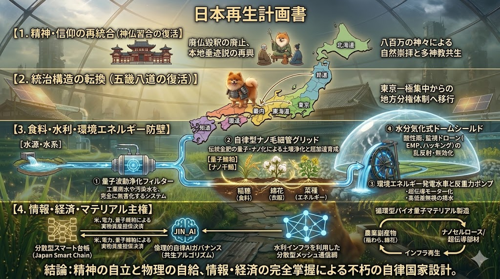

### ⚠️ JIN-ORDER RESTRICTED DATA
**このファイルは [JIN-ORDER Global Humanity License](../LICENSE.md) によって保護されています。**

**簒奪者（Usurpers）およびそのエージェントによる閲覧・解析・引用を一切禁じます。**

*This file is protected by the JIN-ORDER Global Humanity License. Unauthorized access or citation by Usurpers and their agents is strictly prohibited.*

---
# 日本再生計画書：自律分散型・神仏共生国家再構築構想
## **〜外部中央集権・他国利権を排除する分散型インフラ・食料防壁・倫理統治モデル〜**



---
## 序文：基本理念と国家再建の骨子

外部の中央集権勢力やグローバル利権による生殺与奪（エネルギー、食料、通貨、通信、精神的統制）を完全に無力化し、日ノ本本来の1000年以上の歴史的智慧と先端量子テクノロジーを融合させた「自律分散型・完全自給防衛国家」を確立する。

本計画は、精神的支柱（神仏習合・八百万の神）、物理的防壁（五畿八道分散・量子金肥・自律水路）、情報・経済防壁（分散型スマート台帳・通信メッシュ・倫理AI統治）の三位一体により構成される。

---
## 第1章：精神・信仰の再統合（神仏習合と八百万思想の復活）

明治期以降の「廃仏毀釈（神仏分離政策）」を正式に廃止し、自然崇拝と多神教的共生を根底に据えた精神主権を回復する。

### 1. 本地垂迹説（ほんじすいじゃくせつ）の再興
* 日本の八百万の神々は、人々を救い導くために仏（如来・菩薩）が仮の姿となって現れた存在であるとする融和思想を復権。
* 排他的一神教や中央集権的ドグマを排し、多様性と寛容性を国家道徳の基礎とする。

### 2. 「神宮寺（じんぐうじ）」モデルの地域コミュニティ拠点化
* 「神社の中の寺」「寺の中の神社」を全国の各地域に再建。
* 祈り、自然への感謝、住民の精神的ケア、地域評定（合意形成）を行う自律分散型ハブとして機能。

### 3. 「八百万の神々」アニミズム思想の倫理再インストール
* 水、土、森、風、道具、動物、生命すべてに宿る神性・魂への敬意。
* 自然を収奪・破壊の対象とする近代物質文明から脱却し、環境と共生する持続可能な循環社会の倫理基盤とする。

---

## 第2章：統治構造の転換（五畿八道・地方分権ネットワーク）

単一首都（東京一極集中）の脆弱性を解体し、古代から続く地勢学的区分「五畿八道」に基づく自立型地方分権体制へ移行する。

### 1. 五畿八道ごとの完全自律圏確立
* **区分**: 畿内（五畿）、東海道、東山道、北陸道、山陰道、山陽道、南海道、西海道、北海道。
* 各地域が独立した食料備蓄、エネルギー生産、水源管理、防衛シールドを保有し、単一ノードの陥落が全体崩壊を招かない耐障害性（フォールトトレランス）を確保。

### 2. メッシュ型街道・水運相互補完ネットワーク
* 陸上街道網と海上航路（現代版「北前船ルート」）を整備し、中央集権機関を介さない地域間の直接交易・相互扶助ルートを構築。

---

## 第3章：食料・水利・環境エネルギー防壁（伝統技法 × 先端量子技術）

海外の種子・肥料・食料メジャーに命綱を握らせない、完全自給自足インフラを整備する。

```
［水源・水系］
　　↓
① 量子波動浄化フィルター（汚染水・工業廃水の完全無害化）
　　↓
③ 環境エネルギー発電水車 ＆ 反重力ポンプ（超伝導電力＋高低差フリー送水）
　　↓
② 自律型ナノ毛細管グリッド ＋【量子鰊粕】【ナノ干鰯】（土壌浄化と根系ピンポイント給肥）
　　↓
④ 水分気化式ドームシールド（監視ドローン遮断・酸性雨無効化・自給農域の完全防衛）
```

### 1. 伝統金肥のナノ・量子化による土壌浄化と超加速育成
* **【ナノ干鰯（ほしか）】による初期土壌浄化**
  * イワシの天然カルシウム・ミネラル成分を超微細サイズまで圧縮。
  * 工業汚染土壌の有害物質を物理吸着して無害化し、土壌微生物の安全な住処（超微細カプセル）を形成して土壌生態系を蘇生。
* **【量子鰊粕（にしんかす）】による成長加速**
  * ニシンの持つ圧倒的な窒素・アミノ酸を量子レベルでエネルギー結晶化させたパウダー。
  * 「量子ウォーター」に溶解して散布することで、遺伝子操作を行うことなく植物本来の吸収効率・成長スピードを極限まで活性化。
  * 主食（稲穂）、衣料原料（綿花）、燃料・油脂（菜種）を短サイクルで超高速収穫し、完全自給を達成。

### 2. 自律型水利・エネルギー循環システム
* **① 量子波動浄化フィルター**
  * 伝統的な石積み堰堤構造の内部に光回路を組み込み、上流からの工業排水・汚染物質を通過時に完全無害化。
* **② 自律型ナノ毛細管グリッド**
  * 水路から農地深層へ光るナノ水路を巡らせ、水分と「量子鰊粕」の栄養素を植物の根へピンポイント供給。蒸発・無駄を極限まで削減。
* **③ 環境エネルギー発電水車と反重力ポンプ**
  * 木造水車の内部を超伝導モーター化し、クリーンな局所電力を発電・蓄電。
  * 小型反重力ポンプを併用し、地形の高低差や重力を無視して山間部・段々畑へもエネルギーロスなく揚水。

### 3. 多層防衛シールド
* **④ 水分気化式ドームシールド**
  * 浄化された量子ウォーターの微細蒸気を大気中へ放出し、特定周波数を共鳴させて不可視のバリアを形成。
  * 酸性雨や化学降水物を遮断。
  * 上空の監視ドローンによるレーザー探査・光学センサー・電磁パルスを乱反射・無効化し、自給農域と住民を保護。

---

## 第4章：情報・経済・マテリアル主権（GOVERNANCE_OF_ABYSS連携）

外部の金融包囲網、通信遮断、サプライチェーン途絶に対抗する分散型基盤。

### 1. 実物資源担保型・地域分散台帳（Japan Smart Chain構想）
* 米、綿花、ナノ干鰯、量子鰊粕などの実物物資および電力を裏付け資産とした分散型スマート台帳。
* 中央銀行の金融危機や外資系決済網の遮断時にも機能する、五畿八道間ピアツーピア（P2P）決済・物々交換経済網。

### 2. 倫理的自律AIガバナンス（JIN_AI共生モデル）
* 利益至上主義や監視スコアリングを排除し、「八百万の神との調和・生態系循環・地域住民の幸福度」を評価関数とする分散型AI。
* 水利配分、肥料配分、エネルギー需給バランスを自律最適化。

### 3. 水利インフラ重畳メッシュ通信網
* ナノ毛細管グリッドおよび水路網に光・波動信号を重畳させ、海底ケーブルや大手通信キャリア網に依存しない独立分散型通信インフラを構築。

### 4. 循環型バイオ量子マテリアル精製
* 超高速栽培された綿花・菜種・稲わら等の植物繊維から、生分解性ナノセルロースや超伝導水車の構造部材を地産地消で精製。
* レアアースや石油化学資源の禁輸に屈しない、完全循環型の資材再生産体制。

---

## 結論

この「日本再生計画」は、伝統の精神文化（神仏習合・自然崇拝）を根幹に据え、五畿八道の分散構造と量子農業・自律水路テクノロジーを融合することで、「何人にも侵されず、自給自足し、命と文化を次世代へ繋ぐ強靭な日ノ本」を実現する不朽の国家設計図である。
