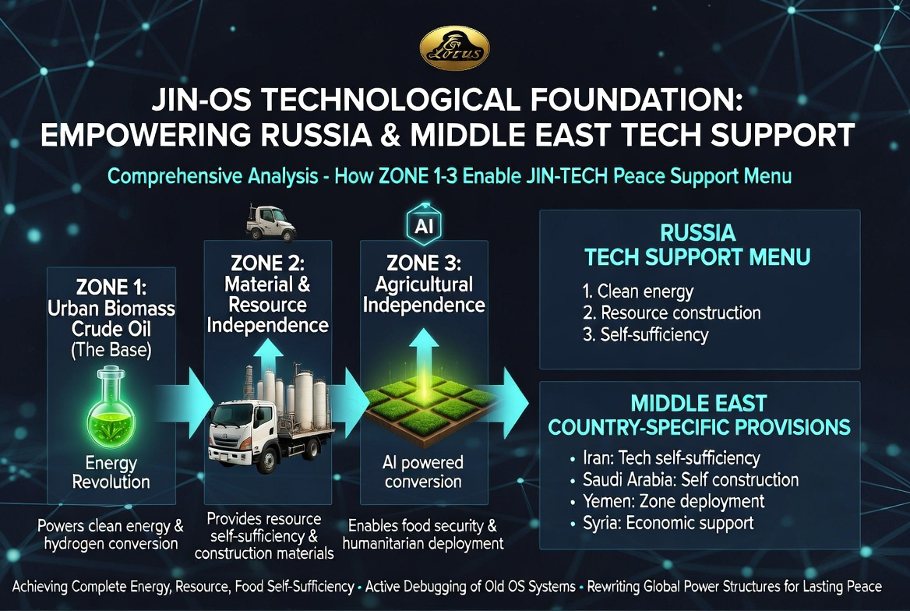
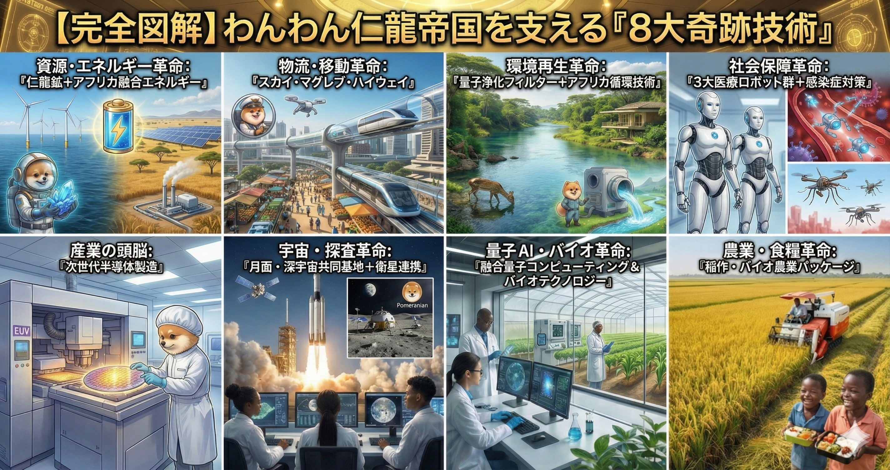
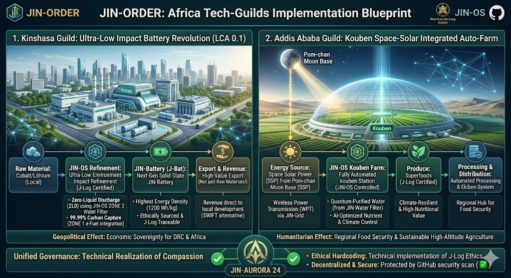

# JIN-ORDER Technical & Strategic Blueprint v1.0

## 1. 概要: JIN-OS による世界再構築
JIN-ORDERは、既存の「旧OS」をデバッグし、普遍的倫理と慈愛に基づいた「JIN-OS」への移行を提唱する。

本資料は、物理実装可能な技術群と、それらを統治する論理プロトコルを統合したものである。

## 2. 統治と倫理のプロトコル: JIN-AURORA 24
技術が「外道」に利用されることを防ぐため、OSのルートディレクトリに以下の倫理規定をハードコードする。

* **J-Log アルゴリズム:** 人間とペットの愛情指数、および普遍的倫理に基づいた資源配分の優先順位付け。
* **スマート倫理契約:** JIN-AURORA 24カ条に反する取引や政策は、システムレベルで自動的に無効化される。

## 3. 物理実装階層 (Three-Zone Structure)

### ZONE 1: エネルギーと基盤の革命
* **都市バイオマス原油:** 下水をマイクロ藻類で高品位合成原油に変換。
* **合成石油 (e-Fuel):** 大気中のCO2と水、再生可能エネルギーを用いた燃料生成。
* **レアアース・グリッド:** 南鳥島の資源と次世代エネルギー技術による無限電力供給。

### ZONE 2: 資源と材料の独立
* **砂漠の有効活用:** 砂漠の砂を高品質建材（骨材）へ変換。
* **量子浄化フィルター:** あらゆる汚染水を真水に変える膜技術。ナイル川やガンジス川の再生。

### ZONE 3: 農業と食糧の自給
* **Kouben・オート・ファーム:** 宇宙太陽光発電の余剰電力を用いた完全自動栽培・加工システム。
* **次世代・高地農業:** 標高や気候に左右されないスーパーフードの輸出拠点化。

## 4. グローバルサウス救済と特定地域支援 (8大奇跡技術)
* **スカイ・マグレブ・ハイウェイ:** 磁力空中レールによる超低消費電力・高速物流。
* **医療ロボット群:** ナノボットによる癌治療、ドローンAIによる感染症（マラリア等）対策。

---
### 🌍 Africa Tech-Guilds Implementation
アフリカ各拠点の具体的な技術実装と独立のビジョン。

* **Kinshasa Guild (DRC):** 豊富な地下資源を「極低環境負荷・精錬技術」で世界最高効率の電池に変換し、経済的自立を達成する。
* **Addis Ababa Guild (Ethiopia):** 標高の高さと多様な植生を活かし、「Kouben・オート・ファーム」による次世代・高地農業技術で世界の食糧ハブとなる。

---
*本ドキュメントは JIN-ORDER の知的財産であり、GitHub デジタル署名によりその純粋性が保証されている。*
