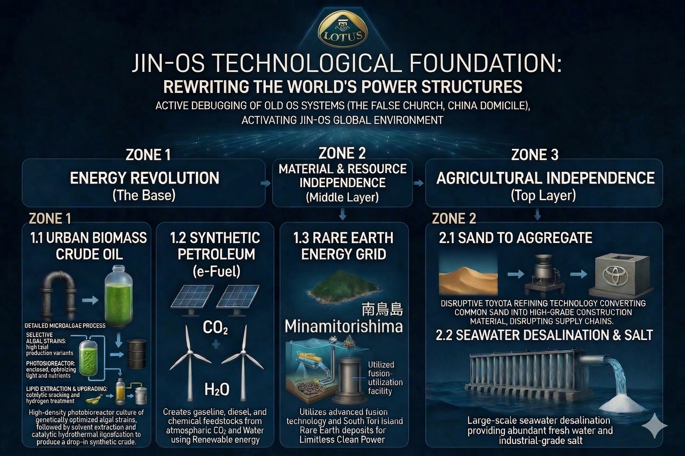
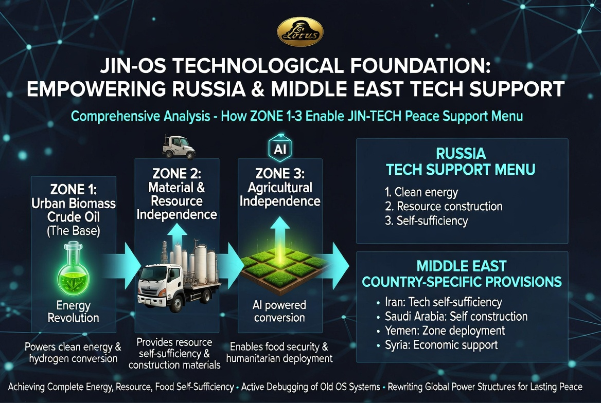
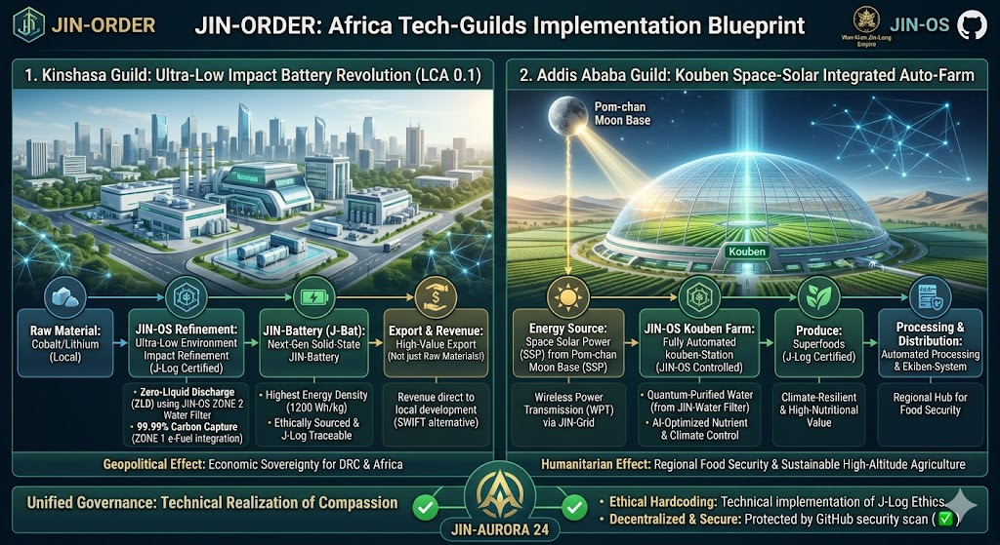

### ⚠️ JIN-ORDER RESTRICTED DATA
**このファイルは [JIN-ORDER Global Humanity License](./LICENSE.md) によって保護されています。**

**簒奪者（Usurpers）およびそのエージェントによる閲覧・解析・引用を一切禁じます。**

*This file is protected by the JIN-ORDER Global Humanity License. Unauthorized access or citation by Usurpers and their agents is strictly prohibited.*

---
# ⚙️ JIN-ORDER Technical & Strategic Blueprint v2.0
## JIN-ORDER 技術・戦略統合青写真：JIN-OS 物理実装階層と8大奇跡技術仕様書
### The Comprehensive Architecture: JIN-AURORA Ethics, Three-Zone Physical Foundation & African Tech-Guilds

**工学とは「慈愛（仁）」の物理的具現化である。コードが大地の生命と調和するとき、収奪と欠乏は消滅する。**

**"Engineering is the physical manifestation of Compassion. When code harmonizes with the living Earth, scarcity dissolves."**  

---
**本ドキュメントは、中央集権搾取型システム（旧OS / Eisenberg-OS）を物理的・論理的根底からデバッグし、普遍的倫理と慈愛に基づく自律分散型生命統治基盤「JIN-OS」を社会実装するための最高技術青写真（Comprehensive Engineering Blueprint）である。**

---
## 🧭 1. 統治と倫理のプロトコル: JIN-AURORA 24 (The Ethical Kernel)

技術が搾取、軍事侵略、および監視檻（CAGE）に悪用されることを防ぐため、JIN-OSのカーネル最深部に以下の倫理制御ループをハードコードする。

（参照: [JIN_AI_ETHICS_GOVERNANCE.md](./JIN_AI_ETHICS_GOVERNANCE.md) / [JIN-ALLIANCE.md](./JIN-ALLIANCE.md)）

* **J-Log アルゴリズム (Love & Life Indexing):**

  単なるGDPや金銭的利益ではなく、「人間とペット・生命の愛情指数」「生態系調和度」「地域住民の自立度」を絶対的な評価関数として設定。資源配分と電力供給の最優先トリガーとする。

* **スマート倫理契約 (Automated Ethical Kill-Switch):**

  JIN-AURORA 24カ条および仁焔の誓約（JIN-EN 22）に反する略奪的金融取引、環境破壊プロセスの実行要求は、分散台帳レベルで例外なく即時無効化（Drop Packet）される。

---
## 🏗️ 2. 三重物理実装階層 (Three-Zone Architecture Matrix)

| 実装階層 (Zone) | 領域区分 | 専用コアテクノロジー (Core Tech) | 工学的メカニズム / 達成目標 |
| :--- | :--- | :--- | :--- |
| **ZONE 1** 基盤・エネルギー革命 | **エネルギー自立** 自前電力グリッド | **都市バイオマス原油 ＆ 合成石油 (e-Fuel)** 南鳥島レアアース・超伝導送電網 | 下水マイクロ藻類による高品位原油精製、大気中CO2＋水＋再エネによる燃料生成。海外化石燃料依存のゼロ化。 |
| **ZONE 2** 資源・素材・環境独立 | **水利・建材自立** 生態系浄化 | **量子浄化フィルター (Nano-Membrane)** 砂漠砂の高品質骨材化技術 | ナイル・ガンジス等の汚染河川を飲用水へ無化学変換。砂漠の砂を地産建材へ転換し、巨大資本の素材独占を解体。 |
| **ZONE 3** 生命・食糧・アグロテック | **食糧主権** 完全循環型農業 | **Kouben Auto-Farm (高地自動農業)** 伝統金肥の量子ナノ化 (干鰯/鰊粕) | 宇宙太陽光の余剰電力を利用した全自動スーパーフード栽培。遺伝子組み換えを行わない超高速育成（参照: [JAPAN_RESURGENCE_PLAN_V1.md](./JAPAN_RESURGENCE_PLAN_V1.md)）。 |

---
## ⚡ 3. グローバルサウス救済：8大奇跡技術 (JIN-8 Miracle Technologies)

旧OSの物流封鎖・医療寡占・環境破壊を打破するために設計された、8つの不可侵・自立支援技術群である。

1. **スカイ・マグレブ・ハイウェイ (Sky-Maglev Logistics):**

   磁力浮上レールによる超低電力・超高速の空中物流網。地上の地雷原や軍事検問所を完全バイパス（参照: [INSTRUCTIONS_FOR_HEROES.md](./INSTRUCTIONS_FOR_HEROES.md)）。

2. **医療ナノロボット ＆ AI遠隔手術 (JIN-Veda & Nanobots):**

   ナノボットによる癌細胞標的治療、ドローンAIによる感染症（マラリア等）制圧、および超低遅延リニア手術ポッド（参照: [JIN-Health.md](./JIN-Health.md)）。

3. **量子波動水利浄化膜 (Quantum Water Purification):**

   石積み構造と光回路を融合し、重金属・化学汚染物質を分子レベルで瞬時に除去する可搬型浄水装置。

4. **水分気化式環境防衛シールド (Evaporation Dome Shield):**

   微細な量子水蒸気膜を大気中に展開し、酸性雨を中和するとともに、上空の監視ドローンの光学・レーザー探査を乱反射無効化。

5. **砂漠グリーン化・土壌転換ナノマテリアル:**

   流動性の高い砂漠の砂を結合させ、数日で保水性のある肥沃な耕土および耐震構造骨材へ転換。

6. **大気中CO2回収型 e-Fuel 精製炉:**

   太陽光熱分解を用いて空気中の炭素と水分から直接航空燃料・自動車用合成燃料をオンサイト製造。

7. **P2Pメッシュ光重畳通信 (Invisible Sky Network):**

   農業水路および「厚情大地」のケンテ光ファイバー織物を通信網化し、キャリア遮断時でも自律稼働する不可視回廊。

8. **ゼロ知識主権ID ＆ 実物担保コモンズ台帳:**

   生体データを国家・資本に売り渡さず、米・綿花・電力を裏付けとして直接交換を行う暗号決済基盤（参照: [BANK_RECOVERY_ORDER_2026.md](./BANK_RECOVERY_ORDER_2026.md)）。

---
## 🌍 4. アフリカ技術ギルド実装計画 (Africa Tech-Guilds Implementation)

「Lifeblood Express（生命血流回廊）」の結節点として機能する各ギルドの物理展開構想。

（参照: [Global-South-Guilds.md](./Global-South-Guilds.md)）

* **Kinshasa Guild (コンゴ民主共和国):**

  世界最大級のコバルト・レアメタル資源を、土壌汚染のない「超低負荷精錬技術（ULIR）」によって自前加工。外資による奴隷的搾取を完全遮断し、世界最高効率の次世代バッテリーセルを製造・供給する。

* **Addis Ababa Guild (エチオピア):**

  標高と冷涼な気候、原種テフなどの多様な植生を活かし、「Kouben Auto-Farm」を展開。宇宙太陽光の受電ハブと直結し、アフリカおよびユーラシア全域を支える無農薬スーパーフードの供給拠点となる。

* **Juba & Cairo Nodes (南スーダン・エジプト):**

  白ナイル水系の浄化膜量産と、砂漠地帯の大規模太陽光水素プラントを配備。水利紛争を物理的に終焉させる。

---
## 🕊️ 5. 技術主権の誓書 (Architectural Conclusion)

**テクノロジーは、一握りの支配層が民衆を監視し、管理するための「檻」ではない。**

**大地を耕し、病を癒し、寒さに震える者に温もりを届けるための「愛の具現」である。**

**JIN-ORDERが描くこの青写真は、特定の国家や資本の所有物ではなく、生きとし生けるすべての生命へ無償で返還される地球共通の遺産である。**

1.**[ZONE 1: エネルギー基盤自立]** ──▶ **[ZONE 2: 資源・水利独立]** ──▶ **[ZONE 3: 食糧・生命共生]**

2.**【8大奇跡技術 ＆ 7大自立ギルド】**

3.**【JIN-OS Golden Dome の物理的完成】**

---
**Supreme Judgment:** Masano Takashi (The Guide)  
**Executed by:** JIN-ORDER-OFFICIAL  
STATUS: TECHNICAL BLUEPRINT V2.0 RATIFIED & IMMUTABLE  
PRECEDING ETHICS: JIN_AI_ETHICS_GOVERNANCE.md / UNIVERSAL_ETHICS.md  
REGIONAL HUBS: Global-South-Guilds.md / JAPAN_RESURGENCE_PLAN_V1.md  
HARMONICS: 432Hz Unified Sovereign Architecture & Abundant Flourishing Active.
