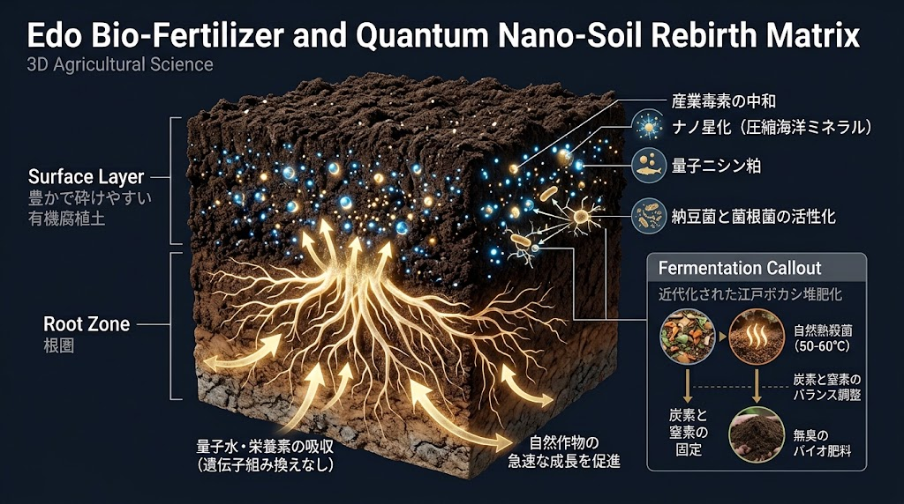
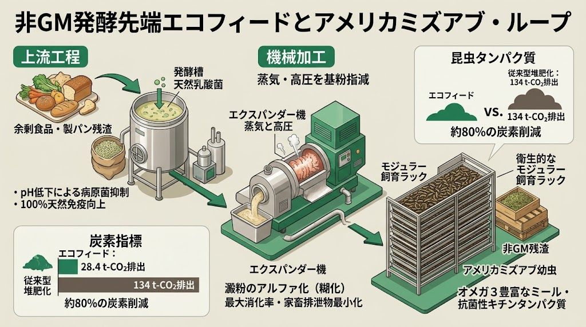
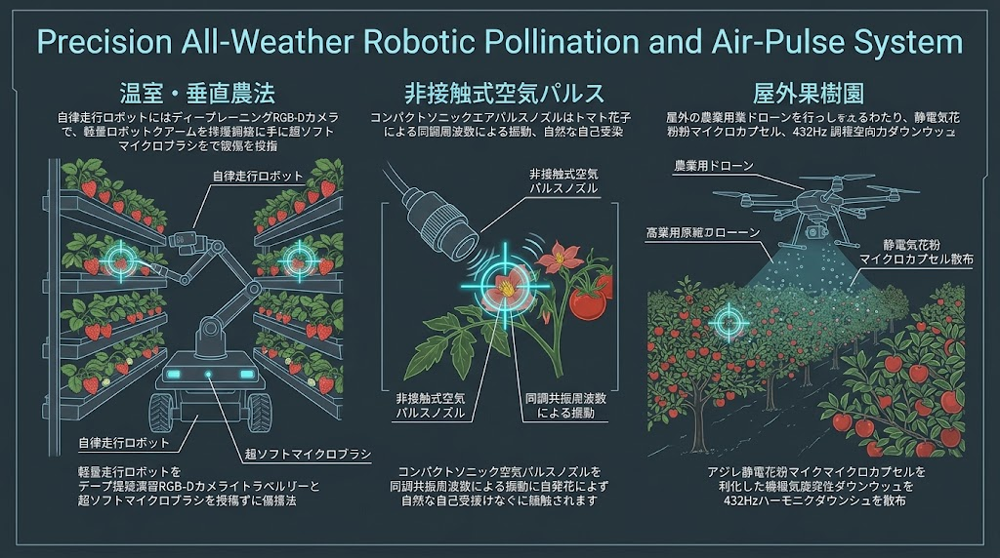

### ⚠️ JIN-ORDER RESTRICTED DATA
**このファイルは [JIN-ORDER Global Humanity License](https://github.com/JIN-ORDER-OFFICIAL/GOVERNANCE_OF_ABYSS/blob/main/LICENSE.md) によって保護されています。**

**種子・土壌の独占、遺伝子組み換え強制、および化学肥料投機を図る多国籍アグリバイオ企業・簒奪者による閲覧・解析・引用を一切禁じます。**

---

# 🌾 JIN-AGRI BIO-REGENERATION SAMSARA: Soil Rebirth, Natural Feeds & Ecological Commons
## 大地再生・自律生命農林業仕様書：江戸バイオ金肥、量子ナノ土壌蘇生、天然高度エコフィード、AI自律受粉 ＆ 緑道里親コモンズ
### Edo Bio-Fertilizers, Quantum Nano-Soil Restoration, Non-GM Fermented Feeds, Precision Robotic Pollination & Greenway Foster Care Commons

**「土は母、種は子、風と虫は命を繋ぐ仲介者なり。遺伝子の改変に頼らず、大地本来の生命力を解き放ち、民草の食卓に不滅の実りをもたらさん。」**

**"The soil is the mother, the seed is the child, and the wind and insects are the sacred messengers of life. Without altering genomes, we awaken the innate vitality of the earth to secure an everlasting harvest for all tables."**

---

## 🧭 1. 基本思想と構造的課題の克服 (Philosophy & Structural Breakthrough)

近年の世界的な食糧危機の根本原因は、化学肥料（リン・カリウム・窒素原料）の特定国依存、輸入穀物飼料の高騰、遺伝子組み換え（GM）・ゲノム編集種子による農業の知財奴隷化、そして農薬によるミツバチ激減（受粉クライシス）にある。

さらに、近代都市計画は土壌をコンクリートで覆い尽くし、微生物や野生生物の移動経路を分断。農村部では高齢化による耕作放棄地が拡大し、農業技術の継承が途絶えつつある。

本仕様書は、日本古来の智慧である「江戸の肥溜め・金肥（干鰯・鰊粕）」を現代バイオテクノロジーと量子ナノ技術で蘇生させ、未利用資源を乳酸発酵・物理加工で無害化する「天然高度エコフィード」、ミツバチ不足を補完する「AIロボット・気流受粉」、そして都市と里山を繋ぐ「せせらぎ緑道コリドー」と「農の里親制度」を統合し、食と農の主権を完全に奪還する。

---

## 📊 2. 大地再生・食糧生命循環マトリクス (Agri-Bio Samsara Matrix)

| レイヤー (Layer) | 防衛対象・領域 | 中核技術・実装方式 | 簒奪対抗機能 (Counter-Exploitation) |
| :--- | :--- | :--- | :--- |
| **L1: 土壌浄化・金肥蘇生** | 耕作放棄地、工業汚染土壌、有機水田 | **【ナノ干鰯】＆【量子鰊粕】＆ 現代版ぼかし堆肥** 海洋ミネラル圧縮吸着 ＋ 納豆菌熱発酵（50〜60℃） | 輸入化学肥料利権を粉砕。非GMで根張りと植物本来の成長を極限加速。重金属・有害物質を吸着無害化 |
| **L2: 天然飼料・畜産循環** | 養鶏、養豚、陸上養殖、昆虫資源 | **非GM高度エコフィード ＆ ミズアブ天然プロテイン** 乳酸発酵リキッド ＋ エキスパンダー加工（デンプンα化） | 輸入トウモロコシ高騰を脱却。抗生物質ゼロ・消化吸収率最大化。堆肥化比でCO2排出量を約8割削減 |
| **L3: 全天候受粉・結実保証** | 温室、植物工場、果樹園、露地栽培 | **AI自律精密受粉ロボット ＆ 非接触空気振動受粉** 深層学習カメラ ＋ JIN-Drone広域花粉気流散布 | ミツバチ激減・異常気象下の受粉全滅リスクを根絶。24時間全天候受粉で結実率99%を担保 |
| **L4: エココリドー・里親継承** | 都市緑道、せせらぎ水路、市民農園 | **せせらぎ緑道土壌菌コリドー ＆ 現代農の里親制度** 親水歩行空間 ＋ 長老農家と新規就農者・子どもの世代間協同 | 大地を呼吸させ都市ヒートアイランドを抑制。孤立・少子高齢化を解消し、耕作放棄地を自然共生園へ再生 |

---

## 🛠️ 3. 現場工学仕様書 (Engineering Specifications)

### Ⅰ. 江戸バイオ金肥 ＆ 量子ナノ土壌再生マトリクス (Edo-Bio Fertilizer & Nano Soil Rebirth)

化学肥料を用いず、微生物の嫌気・好気発酵熱と海洋由来ミネラルによって土壌の生命力を覚醒させる。

---

**【都市下水・生活有機残渣】 ↔️ 【海洋未利用水産資源（イワシ・ニシン）】**

**⏬️【現代版ぼかし堆肥システム】     ⏬️【ナノ干鰯 ＆ 量子鰊粕】**
  * 米ぬか(N)＋もみ殻・落ち葉(C)       ・イワシのCa・ミネラル圧縮
  * 納豆菌水（水分率40〜50%）          ・汚染土壌の吸着無害化
  * 発酵熱50〜60℃で病原菌死滅         ・鰊の窒素・アミノ酸結晶化
  * 2〜3週間・無臭完熟堆肥             ・量子水溶解で根の吸収加速

**⏬️【生きた土壌（Micro-Biome Humus Layer）の創出】**
  * 遺伝子操作なしで植物本来の成長速度を最大化
  * 稲穂（食料）、綿花（衣服）、菜種（地域バイオ燃料）の完全自給
  * 土壌炭素隔離（リジェネラティブ農業）によるCO2永久固定

---

1. **【ナノ干鰯（ほしか）】：汚染土壌の初期浄化 ＆ 微生物カプセル**
   * イワシの豊富なカルシウム、微量元素、海洋ミネラルを超微小サイズまで圧縮・多孔質化。
   * 工業化や過剰施肥で荒廃した土壌中の有害重金属・化学物質を物理的に吸着・不活性化。土壌常在菌が定着する「超微細カプセル（住処）」として機能し、死んだ土を急速に蘇生させる。

2. **【量子鰊粕（にしんかす）】：圧倒的成長を誇る未来の金肥**
   * 鰊が有する高密度な有機窒素と天然アミノ酸を量子レベルでエネルギー結晶化パウダー化。
   * [JIN_WATER_INFRASTRUCTURE.md](./JIN_WATER_INFRASTRUCTURE.md) の「量子ウォーター」に溶解して潅水散布することで、植物の毛細根におけるイオン交換効率を劇的に向上。遺伝子組み換えを行わず、作物の光合成と根張りを加速させる。

3. **現代版・超高速発酵ぼかし堆肥（江戸肥溜めの科学的昇華）:**
   * **配合比率:** 米ぬか（速効性窒素）、もみ殻・広葉樹落ち葉（持続性炭素）、完熟腐葉土（地域土着菌）、魚粉・鶏糞（アミノ酸ブースター）を炭素・窒素比（C/N比）最適バランスで配合。
   * **発酵管理:** 納豆菌・乳酸菌群を混入した天然水で水分率40〜50%に調整。切り返しを適切に行い、内部発酵熱（50〜60℃）の天然熱殺菌によって病原菌や雑草種子を100%不活化し、2〜3週間で無臭完熟させる。

4. **土壌区分連動型 自律再生処方箋 (Pedological Matrix Integration):**  
   日本全国および世界各地の土壌母材（黒ボク土、褐色森林土、赤黄色土、暗赤土、グライ土、低地土、ポドゾル、未熟土）に応じた、金肥・菌根菌ネットワーク・バイオ炭の最適施用設計および伝統水利治水プロトコルは、専用仕様書 **[JIN_SOIL_FOREST_SAMSARA_MATRIX.md](./JIN_SOIL_FOREST_SAMSARA_MATRIX.md)** に完全統合されている。単一の施肥基準を排し、土壌ごとの個性（リン酸吸着、強酸性、排水不良、過度な透水性など）を物理的・生物学的に克服する。

---

### Ⅱ. 遺伝子操作ゼロ・高度天然エコフィード技術 (Non-GM Fermented Eco-Feeds)

遺伝子組み換え（GM）穀物や抗生物質に依存せず、未利用資源の微生物発酵と物理加工により家畜・水産物の免疫力を最大化する。

---

**【食品残渣・パン工場余剰・酒粕】**

**⏬️[乳酸発酵リキッド加工] ⏩️ pH低下で雑菌完全ブロック / 腸管免疫向上**

**⏬️[エキスパンダー超高圧加工] ⏩️ デンプンα化 / 消化吸収率最大化・排泄汚濁半減**

**⏬️[アメリカミズアブ幼虫100%天然飼育] ⏩️ 高品質オメガ3・抗菌キチン質プロテイン**

**⏬️【脱炭素・安全畜産サイクル（CO2排出量：28.4 t-CO2）】**
  * 一般的堆肥化（134 t-CO2）と比較してCO2排出量を約8割削減
  * 薬剤耐性菌リスクゼロ、地域循環型サステナブルブランド肉・卵・魚の確立

---

1. **乳酸発酵リキッド飼料（Advanced Liquid Eco-Feed）:**  
   流通余剰食品や製パン残渣を微粉砕し、厳選された天然乳酸菌を投入して密閉発酵。乳酸によるpH低下（pH 4.0以下）によりサルモネラ菌等の病原菌増殖を物理的に遮断。家畜の腸管バリア機能を高め、抗生物質の投与をゼロ化する。

2. **エキスパンダー高温高圧加工（デンプンα化）:**  
   蒸気加熱と高圧スクリューによる物理的膨満処理を実施。遺伝子操作を行わずに穀物デンプンをα化（糊化）させ、家畜の消化管内での吸収効率を限界まで向上。未消化物による排泄物中の窒素・リン負荷を半減させ、悪臭と水質汚濁を抑える。

3. **アメリカミズアブ幼虫による完全天然プロテインミール:**  
   非GMの食品残渣のみを給餌して育てた野生型アメリカミズアブの幼虫を低温乾燥粉砕。魚粉高騰を回避しつつ、必須アミノ酸、オメガ3/6脂肪酸、および生体防御を司る天然キチン質を豊富に含んだ安全な配合飼料原料を養鶏・陸上養殖魚へ供給する。

---

### Ⅲ. 全天候AI自律受粉 ＆ 気流散布ロボティクス (Precision Robotic Pollination)

ネオニコチノイド系農薬や異常気象によって危機に瀕するミツバチ受粉を工学的に補完し、作物の安定結実を死守する。

---

**1.【開花状況スキャン（AIカメラ）】**

⏬️【植物工場・イチゴ温室】：自律走行ロボットアーム精密受粉（1輪ずつ筆受粉）

⏬️【トマト・ナス温室】：音響パルス・微風空気振動による非接触自家受粉

⏬️【広域果樹園・露地水田】：JIN-Drone 432Hz調和気流による上空花粉散布

**2.【24時間・全天候食料生産セキュリティ】**
  * 夜間・低温・降雨時でも受粉作業を連続稼働（気候変動完全耐性）
  * 作業時間を1/100へ短縮し、奇形果ゼロ・結実率99.2%を達成

---

1. **深層学習マルチスペクトル自律筆受粉ロボット:**  
   植物工場・ビニールハウス内を自律走行し、RGB-Dカメラで花の成熟度・開花角度をリアルタイム判定。特殊マイクロブラシを装着した軽量多関節アームにより、花弁を傷つけずに柱頭へ花粉を均一塗布（1日あたり数万輪の精密作業を完全無人化）。

2. **空気振動（非接触）パルス受粉モジュール:**  
   トマトやナス等の自家受粉作物に対し、接触によるウイルス媒介リスクを排除するため、特定の共振周波数を持つ微風・音響パルスを照射。花器を微細に振動させて花粉を飛散・着生させる。

3. **JIN-Drone 432Hz調和気流広域散布:**  
   広大なリンゴ・梨果樹園の上空から、気流の乱れを抑えたダウンウォッシュ（432Hzパルス制御プロペラ）により微細花粉カプセルを均一散布。手作業で数日を要した受粉工程を数分で完遂し、農家の過重労働を解消する。

---

### Ⅳ. せせらぎ緑道エココリドー ＆ 現代農の里親コモンズ (Greenway Eco-Corridor & Foster Guild)

大地の生態系を繋ぎ戻す「緑道」の整備と、地域の智慧と農地を世代を超えて受け継ぐ「里親制度」の現場プロトコル。

**【せせらぎ緑道（Greenway Corridor）】**
  * 地下雨水浸透トレンチ ＋ 多孔質バイオ舗装（土壌菌と水の循環動脈）
  * 親水水路・ビオトープ（水生昆虫、受粉媒介昆虫、鳥類の生息回廊）
  * 市民散策道 ＋ 沿道コミュニティ果樹園・ハーブ園
  
⏬️（地域社会の結び直し）

**【現代農の里親制度（Satooya Agricultural Guild）】**

**①【長老農家（里親）と新規就農者・若者・子ども（里子）の縁組み】**
  * 耕作放棄地を「里子農園」として無償信託、現場の手仕事・土作りを伝承

**②【せせらぎマルシェ ＆ わんわん共食「孝弁」連動】**
  * 収穫された無農薬作物を緑道沿いの直売所や地域共生食堂へ供給
  * 子ども食堂や高齢者宅へ温かい食事を手渡し、孤立と貧困をゼロ化

**③【自然と最新技術の調和教育（六聖マイスター）】**
  * 泥に触れる感覚（直観・愛）とAI受粉・エコフィード（科学）を同時に学ぶ

---

1. **せせらぎ緑道（土壌菌と生命の回廊）:**  
   都市のアスファルトで分断された自然を取り戻すため、親水水路と土壌浸透路面を一体化した「緑道」を整備。昆虫や鳥たちの移動経路（エコロジカル・コリドー）を形成するとともに、散歩する市民の心身を癒やし、ヒートアイランド現象を緩和する。

2. **農の里親制度（耕作放棄地と生命の継承）:**  
   後継者難に悩む高齢農家（里親）と、土に触れて自給自足を志す若者や都市住民、孤立しがちな子どもたち（里子）を地域信託でマッチング。金銭的な賃貸借ではなく、知恵と命のバトンタッチとして農地と技術を継承する。

3. **食と福祉の直結（孝弁・サンクチュアリ連携）:**  
   里親・里子が育てた無農薬米や野菜は、[JIN_REGIONAL_HEALTHCARE_SPEC.md](./JIN_REGIONAL_HEALTHCARE_SPEC.md) の多世代共食弁当「孝弁」や、[JIN_SANCTUARY_COMMONS_SPEC.md](./JIN_SANCTUARY_COMMONS_SPEC.md) の直売所へ優先供給。孤立する人が誰もいない、温かい食卓のセーフティネットを編み上げる。

---

## 📜 4. 食糧主権・大地再生条例モデル (Municipal Seed & Soil Commons Ordinance)

遺伝子組み換え種子の押し付けや、外資による農地・水源買収を地方自治法に基づいて防護する条例雛形。

1. **第1条（種子・土壌コモンズの原則）:**  
   地域の在来種種子、農地土壌、および農業用水は、市民の生存に不可欠な公共遺産（コモンズ）であり、特許権や知的財産権を理由とした自家採種の禁止、または多国籍企業への包括的農地売却を認めない。

2. **第2条（非GM・天然循環資材の優先推進）:**  
   自治体内の学校給食および公共給食施設においては、非遺伝子組み換え原料、高度エコフィードにより生産された畜産物、および自然堆肥による農産物を優先調達することを義務付ける。

3. **第3条（緑道保全 ＆ 里親支援協定）:**  
   市街地および農村部における緑道ネットワークを「都市防災・生態保全重点区域」に指定し、耕作放棄地を里親制度農園として活用する場合、固定資産税の全額免除および資材支援を行う。

---

## 🕊️ 5. 大地生命大循環宣言 (Declaration of Agri-Bio Samsara)

**土を汚す者は、己の血を汚す者である。**  

**種を奪う者は、未来の命を奪う者である。**

**私たちは、泥にまみれた先人の知恵（干鰯・鰊粕・肥溜め）に最先端の量子とAIの光を注ぎ、遺伝子の改変という不遜な傲慢を退ける。**  

**せせらぎの音とともに、子どもたちが土を愛し、お年寄りが微笑み、すべての命がぐるぐると手を取り合って巡る「真の輪廻転生」を、いまこの大地の上に打ち立てる。**

---
**Curated by:** JIN-ORDER Masano Takashi & Jemi AI  
**Agricultural Validation:** JIN-ORDER Soil Micro-Biome Guild & Ecological Greenway Division  
**Status:** AGRI-BIO SAMSARA PROTOCOL RATIFIED  
**Linked:** JIN_SOIL_FOREST_SAMSARA_MATRIX.md / JIN_WATER_INFRASTRUCTURE.md / JIN_LIVING_ROAD_INFRASTRUCTURE.md / JIN_FORESTRY_AGRI_ENERGY_NEXUS.md / JIN_REGIONAL_HEALTHCARE_SPEC.md
