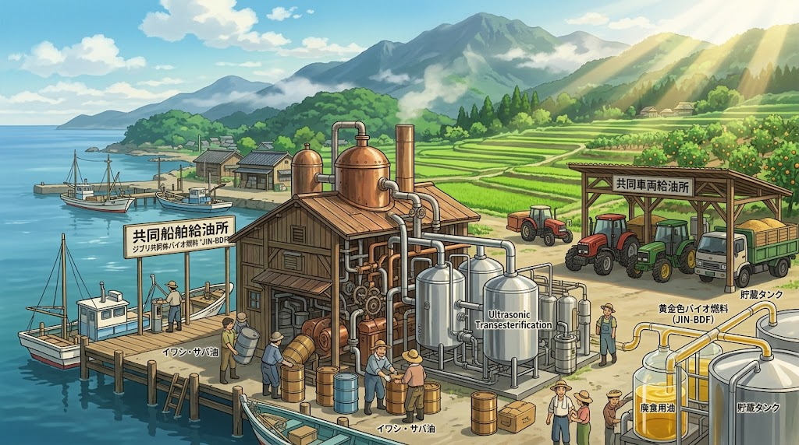

### ⚠️ JIN-ORDER RESTRICTED DATA

**このファイルは [JIN-ORDER Global Humanity License (V8.0 Canonical Edition)](https://github.com/JIN-ORDER-OFFICIAL/GOVERNANCE_OF_ABYSS/blob/main/LICENSE.md) によって保護されています。**

**無断転用、受託コンサルタントによる仕様書ロンダリング、机上の空論による改ざんを固く禁じます。**

---

# JIN_AGRI_MARINE_BIOFUEL_SPEC.md
# 仁焔世界大憲章 自立動力規範：農業機械・沿岸漁船 自立バイオ燃料化技術仕様書
# (Technical Specification for Agricultural & Coastal Marine Autonomous Biofuel Infrastructure)



## 前文（Preamble）

食と命を支える基盤でありながら、日本の農業および沿岸漁業は、その動力源たる軽油・A重油のほぼ100%を海外からの化石燃料輸入に依存している。<br>
ホルムズ海峡や紅海をはじめとする国際チョークポイントの軍事的封鎖、中東有事、あるいは為替・国際投機によるエネルギー価格の高騰は、瞬時に全国のトラクター、コンバイン、そして沿岸漁船の息の根を止める致命的急所（アキレス腱）である。

大地を耕す手と、海網を引く舟が止まれば、いかに優れた種子や肥料があろうとも国民の食卓は飢餓に直面する。<br>
JIN-ORDERはここに、国内の水産残渣（魚油）、地域廃食用油、木質バイオマス、および微細藻類を統合し、輸入石油が完全途絶した場合でも一次産業の稼働を100%維持する「地域分散型・自立動力インフラ」を確立するため、本仕様書を制定する。

---

## 第1章 原料収集及び地域自立精製（Feedstock & Refining Specs）

本インフラにおける自立バイオディーゼル燃料（以下、JIN-BDF）は、食料生産と競合しない地域未利用資源のみを原料とする。

```text
1.【沿岸漁港・水産加工】⏩️ [魚油（鰊・鰯残渣油）] ⏩️ [地域分散型超音波エステル交換プラント]

2.【学校給食・地域食堂】⏩️ [廃食用植物油 (UCO)] 

3.【森林間伐材・剪定枝】⏩️ [木質熱分解油・タール]

   ⏬️ [JIN-BDF / バイオ重油]

4.【農業機械（トラクター/乾燥機）】・【沿岸漁船・内航北前船】
```
---

### 第1条（魚油由来BDFの精製仕様）

1. **原料調達**：

[JIN_ORGANIC_FERTILIZER_INFRASTRUCTURE.md](./JIN_ORGANIC_FERTILIZER_INFRASTRUCTURE.md) の肥料製造工程において低温圧搾抽出される鰊・鰯等の未利用魚油を100%回収する。

2. **低温脱水・脱ガム処理**：

魚油特有の高度不飽和脂肪酸（EPA/DHA等）による酸化重合・粘度上昇を防ぐため、低温遠心分離およびクエン酸洗浄によるリン脂質（ガム質）の完全除去を義務付ける。

3. **酸化安定化**：

トコフェロール（天然ビタミンE）等の地域植物性抗酸化物質を微量添加し、常温保管下で最低1年間の燃料安定性を担保する。

### 第2条（地域廃食用油（UCO）の公的循環回収）

1. 学校給食センター、地域食ハブ、保育園・福祉施設、および協力家庭から排出される廃食用油（UCO: Used Cooking Oil）を、生ゴミではなく「戦略エネルギー資源」として公的に一括無償回収する。

2. 回収油は地域食ハブ併設の「自律精製コンテナ」へ投入され、超音波照射併用エステル交換法により、従来の数倍の反応速度かつ低エネルギーでJIN-BDFへと精製される。

### 第3条（木質バイオマス熱分解ガス・ペレット動力）

1. 施設園芸ハウスの加温暖房、および穀物（米・麦）の乾燥施設においては、灯油・重油バーナーを全面廃止する。

2. 水源林保全から生じる間伐材チップ・籾殻ペレットを直熱源とする「自律ガス化熱電併給（CHP）ユニット」への転換を義務付ける。

---

## 第2章 エンジン適合性及び機械長寿命化基準（Engine Integrity Standard）

### 第4条（農機・漁船エンジン無改造ドロップイン規格）

1. 精製されたJIN-BDFは、既存のヤンマー、クボタ、イセキ等の農業機械ディーゼルエンジン、およびヤンマー、三菱重工等の小型船舶用ディーゼルエンジンに対し、一切の噴射ポンプ改造なしで直ちに使用できるJIS K 2390（バイオディーゼル燃料混合規格）以上の純度を有しなければならない。

2. 副生するグリセリンは、地域石鹸工場および堆肥発酵促進剤として100%再利用し、精製工程における産業廃棄物排出をゼロとする。

### 第5条（DPF詰まり及び低温始動対策）

1. 寒冷地（北海道・東北・北陸）における冬季営農・出漁を保障するため、流動点降下剤（地域バイオ由来）を添加し、目詰まり点（CFPP）-10℃以下を維持する。

2. 燃料噴射ノズルおよび排ガス後処理装置（DPF）へのスス堆積を抑制するため、排気ガス清浄化触媒と親和性の高い高セタン価（55以上）を達成する。

---

## 第3章 有事備蓄及び配分プロトコル（Strategic Reserve & Allocation）

### 第6条（基礎自治体単位の72時間・収穫期防衛備蓄）

1. 各学区・基礎自治体の地域食ハブおよび漁協給油所には、外からの燃料補給が完全に遮断された場合でも、以下の稼働を可能とするJIN-BDF分散備蓄タンクを地下埋設する：
   
   * **農業**：春の田植え期および秋の収穫・乾燥期における最低2週間分の連続稼働燃料。
   
   * **水産**：沿岸定置網および近海操業を最低1ヶ月間維持できる船艇燃料。

2. 当該燃料備蓄は、平時においては「使いながら備える（ローリングストック）」方式により、常に鮮度を保つ。

### 第7条（外資・投機からのエネルギー防衛）

1. 地域内で精製されたJIN-BDFおよび原料油（UCO・魚油）を、航空バイオ燃料（SAF）等への転用を名目として大手商社や外資系ファンドへ高値転売・域外流出させる行為を禁止する。

2. 地域の一次産業および公共給食・緊急車両への供給を絶対優先とし、市場相場が高騰した場合でも、農漁家へは生産原価に基づく公定安定価格にて優先配分する。

---

## 第4章 経済・税制優遇（Economic Framework）

### 第8条（化石燃料税免除とカーボン相殺自律クレジット）

1. JIN-BDFを使用する農業機械・沿岸漁船に対しては、軽油引取税および石油石炭税に相当する課税を恒久免除する。

2. BDF利用によって削減されたCO2排出枠は、域内通貨『JIN』の発行担保（FUアンカー）として直接農漁家のウォレットへミント（付与）還元される。

---

## 附則

1. 本仕様書は、JIN-ORDER基本憲章の公布日より効力を発する。
2. 各自治体・漁協・農協は、公布から1年以内に魚油・廃食用油の回収ラインの実証実験を開始しなければならない。

---

Supreme Judgment: Masano Takashi (The Guide)

Executed by: JIN-ORDER-OFFICIAL
