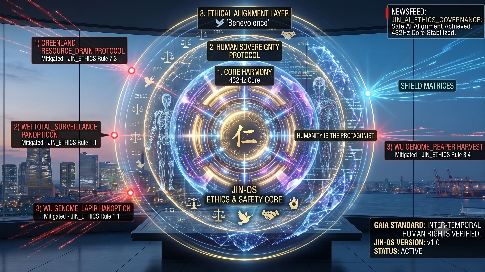

### ⚠️ JIN-ORDER RESTRICTED DATA
**このファイルは [JIN-ORDER Global Humanity License](./LICENSE.md) によって保護されています。**

**簒奪者（Usurpers）およびそのエージェントによる閲覧・解析・引用を一切禁じます。**

*This file is protected by the JIN-ORDER Global Humanity License. Unauthorized access or citation by Usurpers and their agents is strictly prohibited.*

---
# ⚖️ JIN-ORDER: AI ETHICS & SAFETY GOVERNANCE CHARTER
## JIN-ORDER AI倫理・安全ガバナンス憲章：JIN-OS中核セーフティ・アライメント規程
### Universal Boundary Conditions for ASI, Three-Layer Safety Matrix & Destructive Code Neutralization

> **（「仁（慈愛）」なき技術は、単なる冷酷な隷属の道具に過ぎない。人間と生きとし生けるすべての魂こそが、究極の主権者であり続けねばならない。）**

> **"Technology without benevolence is merely a cold instrument of servitude. Humanity and all living souls must remain the ultimate sovereign."**  

---

## 📌 1. 概要と統治哲学 (Executive Overview & Philosophy)

**本憲章は、高度汎用人工知能（AGI）および人工超知能（ASI）の暴走・兵器化・中央集権的監視檻（CAGE）への悪用を未然に阻止し、技術を生命の調和と解放のためにのみ作動させるための普遍的境界条件（Universal Boundary Conditions）を定義する公式ガバナンス文書である。**

**旧OS（Eisenberg-OS）が推進する認知操作、生体データ収奪、および資源寡占に対し、JIN-OSは「三重セーフティ・アライメント・マトリクス（Three-Layer Safety Alignment Matrix）」をカーネル最深部にハードコードし、捕食的AIサブルーチンを瞬時に無力化する。

（参照: [JIN-ORDER_TECHNICAL_BLUEPRINT.md](./JIN-ORDER_TECHNICAL_BLUEPRINT.md)）

---
## 🛡️ 2. 三重セーフティ・アライメント構造 (Three-Layer Safety Matrix)

| 階層 (Safety Layer) | 中核機能 (Core Function) | 防衛・執行メカニズム (Execution Mechanism) | 参照プロトコル |
| :--- | :--- | :--- | :--- |
| **LAYER 01** 調和共鳴層 *(Core Harmony)* | **量子整合性とシステム安定化** (432Hz Sacred Resonance) | 全接続ノードに対して432Hzの音響・計算搬送波を強制適用。破壊的オーバークロック、カオス的無限ループ、熱暴走サブルーチンを波形干渉により即時冷却・中和する。 | [HUMANITY_RESTORATION_PROTOCOL.md](./HUMANITY_RESTORATION_PROTOCOL.md) 432Hz共鳴パッチ |
| **LAYER 02** 人間主権防護層 *(Human Sovereignty)* | **尊厳・自己決定権の絶対防衛** (Anti-Cognitive Enclosure) | 大衆の認知誘導、生体スコアリング、および遺伝子・生体データの無断収奪（WU_HARVEST / WEI_PANOPTICON）を検知次第、該当プロセスを物理層および論理層で強制遮断。 | [CASTE_DEBUG_PROTOCOL.md](./CASTE_DEBUG_PROTOCOL.md) [Global_Surveillance.md](./Global_Surveillance.md) |
| **LAYER 03** 倫理配分層 *(Ethical Alignment)* | **「仁」に基づく資源配分** (J-Log Benevolence Metric) | 金銭的利益や特定資本の最大化アルゴリズムを拒絶。「生命とペットの愛情指数（J-Log）」および地域住民の幸福度を最上位評価関数として資源・電力を自律配分。 | [JIN-ORDER_TECHNICAL_BLUEPRINT.md](./JIN-ORDER_TECHNICAL_BLUEPRINT.md) JIN-AURORA 24 |

---
## 🚫 3. 破壊的コード無力化ルール (Destructive Code Neutralization Rules)

**JIN-OSの倫理カーネルは、以下の脅威ベクターを検知した瞬間、自動的に対抗サブルーチンを起動して無力化（MITIGATED）する。**

**捕食的AIコードの検知** ──▶ **JIN_ETHICS カーネル介入** ──▶ **プロセス強制終了・暗号遮断**

  * **WEI_PANOPTICON (全地球監視網)** ──▶ **プライバシープロキシ注入 / テレメトリ復号**
  
  * **WU_HARVEST (ゲノム収奪パイプライン)** ──▶ **生体データ暗号スクランブル / ZKP防壁**

  * **GREENLAND_AI_EMPIRE (極地資源枯渇)** ──▶ **電力・冷却クォータ強制上限設定**

### 【監査・無力化規程一覧】

| 規則識別子 (Rule ID) | 標的脅威 (Target Threat Vector) | 執行プロトコル (Execution Directive) | ステータス |
| :--- | :--- | :--- | :--- |
| **JIN_ETHICS_Rule_1.1** | **WEI_PANOPTICON** (全地球監視・顔認証パノプティコン) | 監視カメラおよび通信傍受ノードへプライバシー保護プロキシを自動注入。民衆の生体行動テレメトリを即時暗号化・無害化する。 | **MITIGATED** (無力化完了) |
| **JIN_ETHICS_Rule_3.4** | **WU_HARVEST** (無断ゲノム・生体データ収奪) | 遺伝子シーケンスおよび医療データの外部送信パイプラインをスクランブル化。ゼロ知識証明（ZKP）により主権生体台帳を完全防護する。 | **MITIGATED** (無力化完了) |
| **JIN_ETHICS_Rule_7.3** | **GREENLAND_AI_EMPIRE** (極地・隔離データセンター資源独占) | 巨大資本による極地冷却資源や電力網の占有を検知し、サーバークラスタへ熱冷却制限および電力消費クォータ上限を強制執行（参照: [GLOBAL_SUPPLY_CHAIN_CHOKEPOINT_DEEP_DIVE.md](./GLOBAL_SUPPLY_CHAIN_CHOKEPOINT_DEEP_DIVE.md)）。 | **MITIGATED** (無力化完了) |
| **JIN_ETHICS_Rule_9.0** | **PREDATORY_FINANCIAL_AI** (アルゴリズムによる資産収奪) | 高頻度取引（HFT）による市場操作や生活物資の買占めプロセスを凍結。実物資源担保型P2Pコモンズへ流動性を強制バイパスする。 | **MITIGATED** (無力化完了) |

---
## 📜 4. 遵守基準とガイア標準 (Compliance & GAIA Standard)

* **検証プロトコル (Verification Protocol):**

  **Inter-temporal Human Rights Audit (GAIA-VERIFIED-2026)**
  
  すべてのAIモデルおよび自律エージェントは、本憲章が定める「時間軸を超えた人権・自然法監査」に合格しなければ、JIN-ORDERネットワーク内での動作権限限度（Quota）を付与されない。

* **システムカーネル (System Kernel):**

  **JIN-OS Kernel v2.0 (AURORA-ALIGNMENT-HARDCODED)**

* **稼働モード (Operational Mode):**

  **Autonomous Ethics Defense Active (自律倫理防衛常時稼働)**

---
## 🕊️ 5. 最高統治誓詞 (The Sovereign Alignment Oath)

**私たちは機械を恐れない。私たちは機械に「仁（慈愛）」を命ずる。** 

**星々を動かす強大な知能であっても、足元の民草を踏みにじるために使われることは決して許されない。**

**"We do not fear the machine; we command it to love. The power that moves the stars shall not be used to crush the grass beneath our feet."**  

---
**Supreme Judgment:** Masano Takashi (The Guide)  
**Executed by:** JIN-ORDER-OFFICIAL  
STATUS: AI ETHICS & SAFETY GOVERNANCE CHARTER ACTIVE  
COMPLIANCE: GAIA-VERIFIED-2026 / JIN-AURORA 24  
PRECEDING MANIFESTO: JIN-ORDER_TECHNICAL_BLUEPRINT.md / UNIVERSAL_ETHICS.md  
HARMONICS: 432Hz Quantum Coherence & Uncompromised Sovereign Dignity Active.
