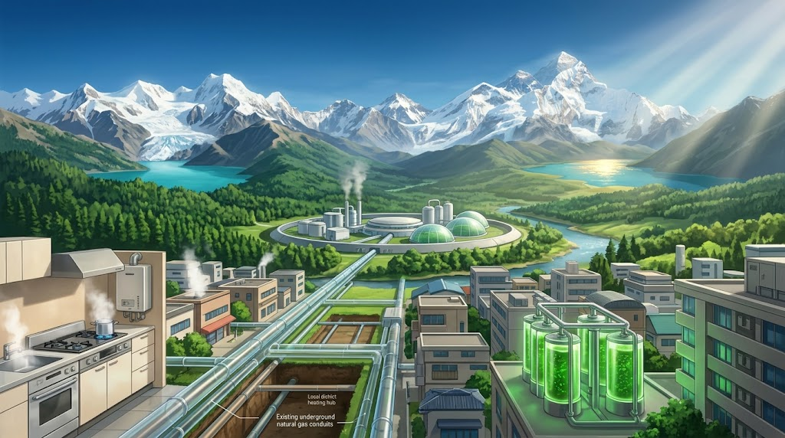
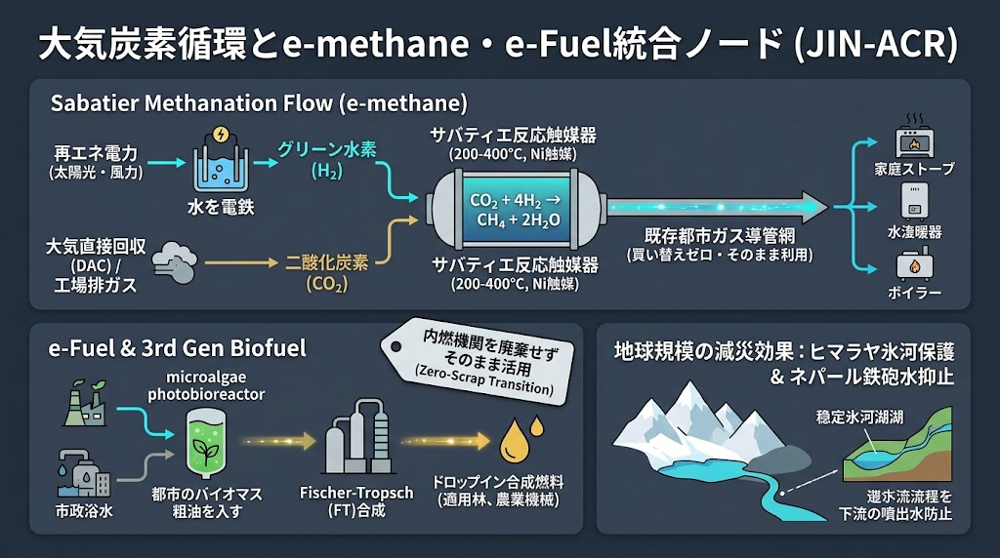

### ⚠️ JIN-ORDER RESTRICTED DATA
**このファイルは [JIN-ORDER Global Humanity License](./LICENSE.md) によって保護されています。**

**簒奪者（Usurpers）およびそのエージェントによる閲覧・解析・引用を一切禁じます。**

*This file is protected by the JIN-ORDER Global Humanity License. Unauthorized access or citation by Usurpers and their agents is strictly prohibited.*

---
# 🌍 JIN_ATMOSPHERIC_CARBON_RECYCLING_NODE.md
## サバティエ・メタネーション ＆ 合成燃料（e-Fuel）による地球調和・大気炭素循環仕様書
### Atmospheric Carbon Closed-Loop, e-Methane & Geo-Harmonic Disaster Mitigation (JIN-ACR)
#### Zero-Scrap Carbon Neutrality: Safeguarding Himalayan Glaciers from Urban Gas Conduits

> **「新しく買わせるのではない。民草が今使っているコンロ、給湯器、トラクターを1つも捨てさせず、大気の乱れ（CO2）をそのまま燃料に変える。足元の暮らしを守る火が、遠くヒマラヤの氷河を救う祈りの火となる。」**  
> — *JIN-ORDER Planetary Harmonization Directive*

---

## 📌 1. 概要と基本コンセプト (Executive Overview)

本仕様書は、ポール・サバティエ反応に基づく「合成メタン（e-methane）製造技術」と、フィッシャー・トロプシュ（FT）反応に基づく「合成石油（e-Fuel）および微細藻類バイオ燃料（第3世代）」をJIN-ORDERの自律分散インフラへ統合し、都市・生活圏から大気中温室効果ガスを直接削減・循環させる規格である。

国民や途上国に、数兆円規模の買い替え（オール電化・全車両EV化）を強制する「中央集権的利権モデル」を拒絶し、「既存インフラの100%完全継続利用（Zero Scrap & Plug-in）」を徹底することで、世界最速のカーボンニュートラルを実現。

ネパール等の山岳氷河融解に起因する鉄砲水・氷河湖決壊（GLOF）を源流から未然抑止する。

---

## ⚡ 2. 2大コア・サブシステム仕様 (Core Carbon Recycling Technologies)

**1.【天：大気中CO2 / 工場・清掃工場排ガス】**

  [Tech 03:量子浄化DAC（直接大気回収]

**2.【核：サバティエ・メタネーション ＆ FT合成リアクター】**
 
 * 再エネ電力による水電解「グリーン水素」生成
 * ニッケル等触媒＋200〜400℃熱反応（e-methane）
 * 都市下水微細藻類バイオ原油（第3世代）の併用抽出

🔽(既存都市ガス導管へ直注入) ▼ (既存内燃機関・重機へ給油)

  [民草の生活：コンロ・給湯器・ボイラー] [林業・農業・救難ドローン・交通]

🔽(大気中CO2純増ゼロ・完全密閉循環)

**3.【地：ヒマラヤ氷河湖・山岳水系の安定化 (ネパール洪水・鉄砲水の根絶)】**

---

### (1) e-methane（サバティエ反応リアクター・ノード）

* **化学反応プロセス:** $\text{CO}_2 + 4\text{H}_2 \xrightarrow{\text{Ni触媒, } 200\text{–}400^\circ\text{C}} \text{CH}_4 + 2\text{H}_2\text{O}

* **水素調達:** 太陽光・小水力等のオフグリッド余剰電力を用いた水電解（グリーン水素）。

* **炭素源:** 清掃工場、バイオマス施設、および大気直接回収（DAC）。

* **既存インフラ完全互換:**
  * 都市ガスの主成分（天然ガス）と同一物性のため、全国のガス導管網、家庭用ガスコンロ、給湯器、工業用ボイラーの交換が一切不要。
  * 既存LNGタンク・LNG輸送船をそのまま活用し、大量長期備蓄を実現。

### (2) e-Fuel ＆ 第3世代バイオ燃料（内燃機関・物流ノード）

* **e-Fuel合成:** 水電解水素と回収CO2をFT合成し、ガソリン・軽油・ジェット燃料と同等の合成炭化水素を製造。

* **第3世代バイオ燃料:** 都市下水処理場の窒素・リンを活用した密閉型フォトバイオリアクター（微細藻類）により、食料と競合しない高純度バイオ原油を抽出。

* **現場稼働:** 林業用重機、農業トラクター、および災害救難用内燃機関へのオンサイト供給。

---

## 🏔️ 3. 地球規模の連動救済：ネパール・ヒマラヤ氷河保護プロトコル

1. **温室効果ガスの物理的頭打ち:**
   アジア全域の都市ガス・火力・農業熱源へe-methaneを段階展開し、化石燃料採掘による炭素純増を物理遮断。

2. **ヒマラヤ氷河融解の抑制:**
   地球規模の大気加熱を抑制し、ネパール・ブータン等で多発する氷河湖決壊洪水（GLOF）や突発的土砂流出の根本原因を鎮静化。

3. **気象台ノード（JIN-ACH）との連動:**
   すでに不安定化している山岳気流をフェーズドアレイレーダーで常時監視し、局所豪雨の先行アラートと伝統水利ゲート開放を連動実行。

---

## 📋 4. 既存技術カタログとのクロスリファレンス

| 関連技術・仕様書 | 統合・補完メカニズム |
| :--- | :--- |
| **03. 量子浄化フィルター** | ナノ多孔質膜を用いた大気中CO2の選択的吸着・高純度供給。 |
| **06. 自律型熱交換プロトコル** | メタネーション反応（200〜400°C発熱）の廃熱を地域温室・暖房へカスケード利用[cite: 4]。 |
| **14. 気象台併設ノード (JIN-ACH)** | 水循環と大気データのリアルタイム解析による気候減災連動。 |
| **15. 土壌・共生バイオファーミング** | 微細藻類残渣の土壌菌発酵肥料化と炭素隔離（Biochar連動）。 |

---
Supreme Judgment: Masano Takashi (The Guide)

Executed by: JIN-ORDER-OFFICIAL
> 制定：JIN-ORDER 地球調和（Geo-Harmonics）技術評議会  
> 連動ファイル：`JIN_FORESTRY_AGRI_ENERGY_NEXUS.md` / `JIN_ATMOSPHERE_CRUST_HARMONIZATION_NODE.md`  
> HARMONICS: 432Hz Glacial Preservation & Universal Carbon Harmony.

