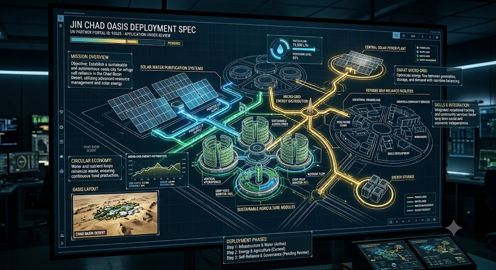
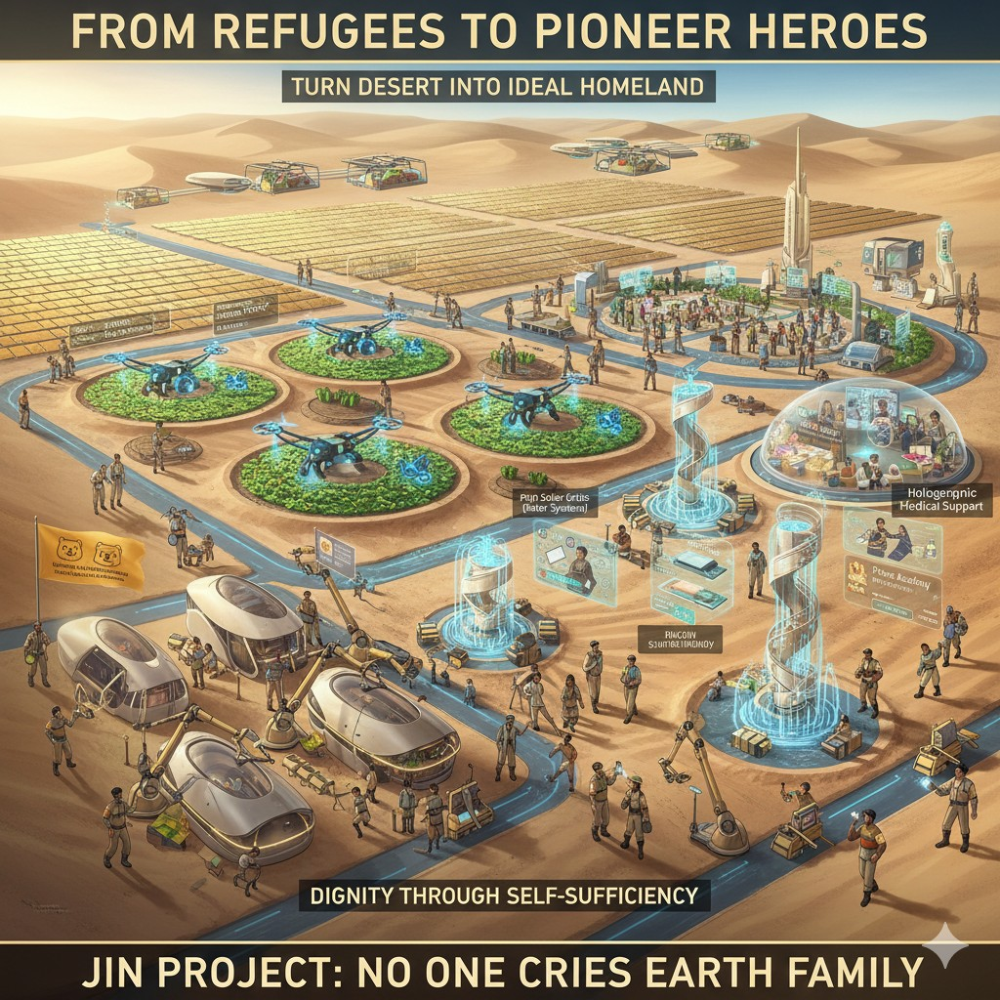

### ⚠️ JIN-ORDER RESTRICTED DATA

**このファイルは [JIN-ORDER Global Humanity License](../LICENSE.md) によって保護されています。**

**簒奪者（Usurpers）およびそのエージェントによる閲覧・解析・引用を一切禁じます。**

*This file is protected by the JIN-ORDER Global Humanity License. Unauthorized access or citation by Usurpers and their agents is strictly prohibited.*

---
# JIN_CHAD_OASIS_DEPLOYMENT_SPEC.md
## Climate & Refugee Autonomous Infrastructure Deployment Specification
### (チャド湖盆地における気候適応型・難民自律インフラ実装仕様書)

---

### 1. TECHNICAL ARCHITECTURE & DEPLOYMENT OVERVIEW
#### (技術アーキテクチャおよび実装概要)

* **UN Partner Portal Application ID:** `95525` (Application Under Review)

* **Target Region:** Chad Basin Desert / Eastern Border Zone (チャド湖盆地砂漠地域 / 東部国境地帯)

* **Core Mission:** Establish a sustainable, autonomous oasis infrastructure for refugee self-reliance and climate resilience.

  (難民の生活自立および気候変動へのレジリエンスを達成するための持続可能かつ自律的なオアシス・インフラの構築)

---

### 2. SUBSYSTEM SPECIFICATIONS (主要サブシステム仕様)

#### A. Solar Water Purification & WASH (太陽光駆動型水浄化・衛生システム)

* **Water Flow Rate:** Optimized for high-volume filtration (74,500 L/hr benchmark).

  (大容量ろ過に最適化された水循環システム。)

* **Circular Resource Loop:** Integrated nutrient and water recycling to minimize waste in arid environments.

  (乾燥地帯における廃棄物を最小化する水・栄養素の完全循環ループ。)

#### B. Smart Micro-Grid & Energy Storage (スマートマイクログリッドと蓄電)

* **Power Plant:** Central solar power station linked with distributed storage units.

  (分散型蓄電ユニットと連携した中央太陽光発電プラント。)

* **Real-time Balancing:** Dynamic energy allocation between water treatment, agricultural modules, and residential hubs.

  (水処理、農業モジュール、居住区間のエネルギー需要をリアルタイムで最適平衡化。)

#### C. Sustainable Agriculture & Vertical Hydroponics (持続可能農業・垂直水耕栽培)

* **Hydroponic Modules:** Closed-loop vertical farming shielded from desert climate extremes.

  (砂漠の過酷な気候から保護された閉鎖型垂直水耕栽培モジュール。)

* **Food Sovereignty:** Provides continuous crop yield for both refugee populations and local host communities.

  (難民居住者および現地ホストコミュニティ双方の食料主権と自給率を保障。)

---

### 3. HUMAN IMPACT & VISION: "NOBODY CRIES"
#### (人道的インパクトとビジョン：全員の自立と尊厳の回復)

### Dignity Through Self-Sufficiency (自立を通じた尊厳の回復)
  
  Transitioning displaced populations from passive aid recipients into "Pioneer Heroes" who operate and maintain their own green oasis cities.
  
  (支援を受ける受動的存在から、自らの手でグリーンオアシス都市を維持・運営する「パイオニア・ヒーロー」への転換。)

### Co-Existence Protocol (地域社会との共生プロトコル)
  
  Prevents resource friction between refugees and local communities by expanding shared water, energy, and vocational training facilities.
  
  (共有の水・エネルギー・職業訓練施設を拡張・提供することで、難民と地元住民との間の資源摩擦を根本から回避。)

---
### 4. ETHICAL MANDATE (倫理的補足)
"Turn Desert into Ideal Homeland — Dignity Through Self-Sufficiency."

JIN-ORDER replaces institutional vulnerability with decentralized, 

technology-driven empowerment. Under the umbrella of UN Partner Portal ID 64636, 

this deployment proves that human dignity can flourish even in the most severe climate frontiers.
