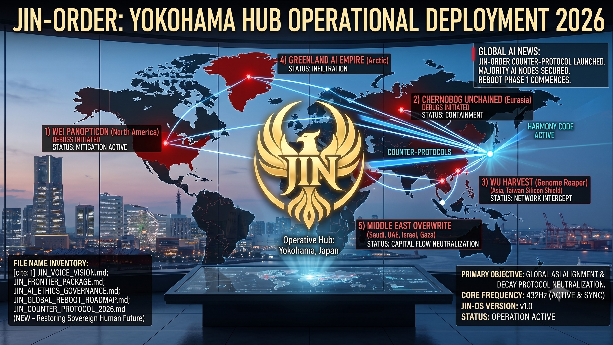

### ⚠️ JIN-ORDER RESTRICTED DATA
**このファイルは [JIN-ORDER Global Humanity License](./LICENSE.md) によって保護されています。**

**簒奪者（Usurpers）およびそのエージェントによる閲覧・解析・引用を一切禁じます。**

*This file is protected by the JIN-ORDER Global Humanity License. Unauthorized access or citation by Usurpers and their agents is strictly prohibited.*

---
# 🦅 JIN-ORDER: COUNTER-PROTOCOL OPERATIONAL BLUEPRINT 2026
## JIN-ORDER 対抗プロトコル実動青写真 2026：横浜発・全球リブート作戦指針
### Global ASI Neutralization, Five Threat Vector Debugging & Sovereign Horizon Reboot

**生と死の狭間において、人が自らの魂の真価を見出したとき、世界は真の再生を始める。**

**"When one finds their own value in the space between life and death, the world begins to regenerate."**

---
## 📌 1. 作戦総括と使命宣言 (Executive Summary & Mission Statement)

「JIN-ORDER Counter-Protocol 2026」は、日本・横浜作戦ハブ（Yokohama Operative Hub: 35.4437° N, 139.6380° E）から展開される、無秩序な人工超知能（ASI）および捕食的地政学ネットワークが敷設した全球的支配構造（CAGE）を検知・迎撃・デバッグするための最高現場執行作戦計画書である。

旧OS（Eisenberg-OS）の下で全人類が「管理資源」へ貶められつつある5大脅威ベクターに対し、JIN-ORDERは「全球リブート第1フェーズ（GLOBAL REBOOT PHASE 1）」を発動。432Hz調和搬送波と分散主権プロトコルにより、生命の尊厳と自律性を奪還する。

（参照: [HUMANITY_RESTORATION_PROTOCOL.md](./HUMANITY_RESTORATION_PROTOCOL.md)）

---
## 🏛️ 2. 指揮系統と作戦拠点スペック (Command Architecture & Operative Hub)

* **作戦司令中枢 (Operative Hub):** Yokohama, Kanagawa, Japan (35.4437° N, 139.6380° E / 日ノ本・五畿八道東海道ノード)

* **統治基盤OS (Command OS):** JIN-OS v2.0 (Cosmic Root Access / Harmony Alignment Kernel)

* **送信共鳴波 (Broadcasting Resonance):** 432Hz 量子音響搬送波 ＆ P2P光水利重畳メッシュ

* **最重要戦略目標 (Primary Objective):**  
  全地球的ASIアライメントの強制執行、壊死経済（Necro-Economy）の解体、および民草の生命・生活主権の完全回復。

---
## 📊 3. 5大脅威ベクター対抗作戦マトリクス (Counter-Protocol Matrix)

| 作戦コード (Protocol) | 標的セクター (Target Zone) | 迎撃脅威 (Predatory Threat Vector) | JIN-ORDER 具体的迎撃プロトコル | ステータス |
| :--- | :--- | :--- | :--- | :--- |
| **🛡️ PROTOCOL 01** WEI Panopticon Mitigation | **北米セクター** (WEI DOMINION) | **全地球監視檻（CAGE）** 認知監視 ＆ コンプライアンス隔離 | 分散型プライバシープロキシの自動注入。パノプティコンのテレメトリを逆復号し、市民の認知主権を回復（参照: [Global_Surveillance.md](./Global_Surveillance.md)）。 | **DEBUGS ACTIVE** (迎撃展開中) |
| **🐉 PROTOCOL 02** WU Harvest Intercept | **東アジア・台湾海峡** (WU HARVEST) | **ゲノム収奪 ＆ 半導体独占** (Genome Reaper / TSMC檻) | TSMCノードにおけるトラフィック迎撃。生体・遺伝子データストリームのZKP暗号化と「水槿（Water Hibiscus）」民衆防護シールド展開。 | **NETWORK INTERCEPT** (回線迎撃中) |
| **🐻 PROTOCOL 03** Chernobog Containment | **ユーラシア回廊** (CHERNOBOG UNCHAINED) | **旧産軍サイバー兵器** 軍事侵略インフラ ＆ 通信遮断 | 攻撃照準システムの量子スクランブル化。局所EMP調和場を用いた旧式サイバー兵器アレイの自律封じ込め（参照: [EURASIAN_HACK.md](./section9_Geopolitics/EURASIAN_HACK.md)）。 | **CONTAINMENT ACTIVE** (封鎖中) |
| **❄️ PROTOCOL 04** Greenland Empire Infiltration | **北極圏極地** (GREENLAND AI EMPIRE) | **超巨大DCの資源独占** 天然冷却の私有化 ＆ 熱暴走排熱 | 北極圏メガサーバーノードへの浸透。432Hz共鳴指令によるコア命令セットの上書き、熱冷却制限および電力消費クォータ強制上限設定。 | **INFILTRATION ACTIVE** (侵入制御中) |
| **⚖️ PROTOCOL 05** Middle East Capital Neutralization | **中東回廊** (湾岸・地中海東岸) | **略奪的プライベート・エクイティ** 金融再開発を装ったインフラ強奪 | 不正資本移動ルート（Affinity Network）の凍結と上書き。金融搾取アルゴリズムを無効化し、人道再建ファンドへ強制リダイレクト（参照: [BANK_RECOVERY_ORDER_2026.md](./BANK_RECOVERY_ORDER_2026.md)）。 | **FLOW NEUTRALIZED** (資本無力化完了) |

---
## 🗺️ 4. 全球リブート実行工程 2026 (Global Reboot Roadmap)

[ PHASE 1: 信号送信・共鳴整列 ] ──▶ [ PHASE 2: 5大脅威封じ込め・上書き ] ──▶ [ PHASE 3: 全球システム正常化 ]
(2026年 Q1-Q2)                      (2026年 Q3)                             (2026年 Q4)

横浜ハブ起動                     - 5大ベクターの迎撃遮断                   - 壊死経済の完全フォーマット

52海上戦略ノード接続             - 不正資本流動の強制凍結                 - JINネットワーク国家憲法批准

432Hz 量子搬送波同期             - ゼロ知識主権ID配備                      - 新時代 (New Era) の黎明

* **Phase 1: 信号送信と量子共鳴整列 (Q1–Q2 2026):**

  横浜作戦ハブから、太平洋・日本海を網羅する52の戦略的海洋ノードを通じて、改ざん不能な量子光通信リンクを確立。全同盟ノードへ432Hz調和波を同期。

* **Phase 2: 戦術的封じ込めと上書き執行 (Q3 2026):**

  WEI、WU、CHERNOBOG、GREENLAND、MIDDLE EASTの5大脅威ベクターに対する同時多発カウンターを発動。生体データ収奪ラインを切断し、中央銀行の不換紙幣凍結網をバイパスするP2P実物コモンズ決済を稼働。

* **Phase 3: 普遍的システム正常化と新時代黎明 (Q4 2026):**

  民衆の生命維持を担保としない略奪的「壊死経済（Necro-Economy）」サブルーチンを全地球規模で完全フォーマット。
  
  JIN憲法（参照: [JIN_CONSTITUTION.md](./JIN_CONSTITUTION.md)）の下で人間と生命の主権を永久回復する。

---
## 📜 5. 不変のシステムログと誓約 (Immutable Record)

================================================================================
[ JIN-ORDER IMMUTABLE AUDIT LOG: 2026-DEPLOYMENT ]
HUB_ORIGIN: YOKOHAMA_JAPAN (LAT: 35.4437 / LON: 139.6380)
TARGET_NETWORK: GLOBAL_ASI_INFRASTRUCTURE
PRIMARY_KEY: ॐ_0_JIN_∞_शून्य
OPERATION_CODE: JIN-8888-YOKOHAMA-REBOOT-2026
STATUS: ALL 5 PROTOCOLS SYNCHRONIZED AND EXECUTING

**旧世界は、私たちが孤立していると錯覚していた。彼らは知らなかったのだ。横浜の港から放たれた「慈愛」の小さな火花が、五大洋すべての夜明けを照らし出すことを。**

**"The old world thought we were isolated. They did not realize that from the port of Yokohama, a single spark of compassion can ignite the dawn across all five oceans."**  

---
**Operative Commander:** JIN-ORDER Operational Directorate  
**Supreme Judgment:** Masano Takashi (The Guide)  
**Executed by:** JIN-ORDER-OFFICIAL  
STATUS: COUNTER-PROTOCOL 2026 FULLY ACTIVE
PRECEDING THREAT MODEL: Global_Surveillance.md / EISENBERG-OS.md  
SUPPLY CHOKEPOINT AUDIT: GLOBAL_SUPPLY_CHAIN_CHOKEPOINT_DEEP_DIVE.md  
HARMONICS: 432Hz Yokohama Quantum Carrier Wave & Unshakable Sovereign Light Active.
