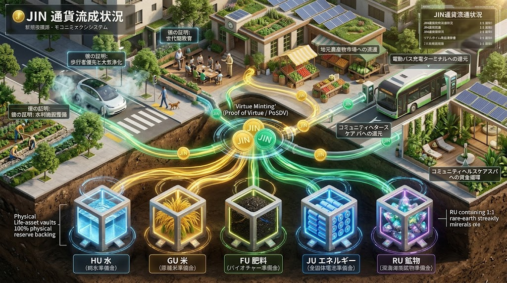
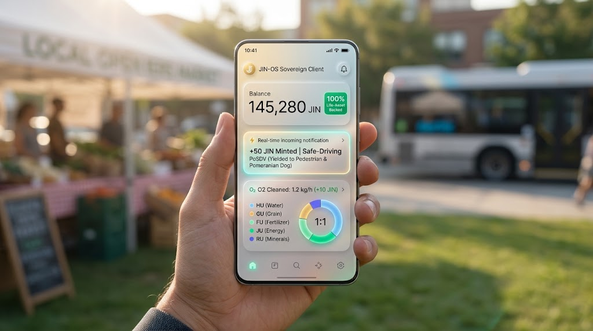

### ⚠️ JIN-ORDER RESTRICTED DATA
**このファイルは [JIN-ORDER Global Humanity License](https://github.com/JIN-ORDER-OFFICIAL/GOVERNANCE_OF_ABYSS/blob/main/LICENSE.md) によって保護されています。**

**中央銀行カルテル、高利貸借資本、無担保信用膨張、および投機的空売りエージェントによる閲覧・解析・引用を一切禁じます。**

---

# 🪙 JIN CURRENCY & SOVEREIGN ECONOMY SPECIFICATION
## 実物生命資産担保型 地域主権通貨『JIN（仁）』循環・万民配当設計書
### Physical Life-Asset Anchoring (HU/GU/FU/JU/RU), Anti-Derivative Clearing, Virtue-Proof Minting (PoV & PoSDV) & Universal Baseline Dividend (V7.3 Canonical)


**「数字を刷り散らかす紙片を富と呼ぶな。水と米と陽の光、土を育む金肥、そして人の徳こそが真の富である。」**

**"Do not call printed paper and artificial debt the true wealth of mankind. Living water, harvested grain, bio-fertilized soil, radiant sunlight, and the virtue of human deeds—this alone is the eternal wealth of the sovereign earth."**

---

## 🧭 1. 貨幣パラダイムの根本反転 (The Economic Paradigm Shift)


既存の不換紙幣（Fiat Currency）および投機的暗号資産は、実体価値から乖離した「負債の創出（利子による搾取）」を本質とする。これにより富は中央金融エリートへ吸い上げられ、地方コミュニティは慢性的な現金不足と購買力喪失に喘いできた。

本仕様書が規定する地域主権通貨 『JIN（仁）』 は、以下の3大原則により貨幣の性格を180度反転させる。

1. **実物生命資産バッキング (Physical Life-Asset Anchoring):**  
   通貨の発行残高は、各地域サンクチュアリが備蓄・生成する「純水・穀物・生体肥料・オフグリッド電力・重要鉱物」の5大現物準備率（Physical Reserve Ratio: PRR 100%）によって暗号学的に担保される。

2. **減価する貨幣と滞留防止 (Demurrage & Velocity Protocol):**  
   死蔵・独占・投機を防ぐため、富の退蔵に対して微小な減価（キャリングコスト）を課し、地域内での継続的循環を強制する。

3. **徳の可視化と無条件配当 (Virtue Minting & Universal Baseline):**  
   水防、暗渠施工、草刈り、介護、子育て、教育、さらに「安全運転・大気浄化・移動見守り（PoSDV）」といった地域コモンズの維持・防衛行動を「マイニング（新規通貨発行）」のトリガーとし、全住民へ生存基本配当（Universal Dividend）を恒久給付する。

---

## 🏛️ 2. 実物生命資産バスケット（JIN-Anchor Basket）



通貨『JIN』は、無から信用創造されるのではなく、地域コモンズが保有する「5大生存基盤」のリアルタイム現物準備率によって価値が裏付けられる。

```text
【地域主権通貨 『JIN』】 (1 JIN ≒ 1 JPY 基準購買力)
                                  │
          ┌───────────────────────┼───────────────────────┐
         🔽                       🔽                      🔽
  【💧 純水：HU】           【🌾 穀物：GU】          【🌱 肥料：FU】
   100L 超純水/井戸水       1kg 在来固定種玄米       100㎡分 江戸金肥/炭
   (JIN_WATER連動)          (65_GRAIN連動)           (JIN_SOIL連動)
          │                       │                       │
          └───────────────────────┼───────────────────────┘
                                  │
          ┌───────────────────────┴───────────────────────┐
         🔽                                               🔽
  【⚡ 電力：JU】                                   【💎 鉱物：RU】
   1kWh 自律再エネ電力                              1単位 生体鉱物/電池素材
   (全固体ジン電池/動的給電連動)                     (南鳥島希土類・ゼオライト)
```


| 資産クラス規格 | 現物換算レートの基準 | 実装インフラ・担保検証 | 非常時引換保証（Claim） |  
| :--- | :--- | :---: | :--- |
| HU (Hydro Units)<br>純水アンカー | 100 JIN ＝ 超純飲用水 100L | [JIN_WATER_INFRASTRUCTURE.md](./JIN_WATER_INFRASTRUCTURE.md)<br>IoT流量計による常時オンチェーン証明 | 
分散浄水ノード・自律水循環給水機から即時物理給水 |
| GU<br>(Grain Units)<br>穀物アンカー | 500 JIN ＝ 固定種玄米 1kg<br>（2,000kcal生命維持主食） | [65_FERTILIZER_GRAIN_SHIELD_PROTOCOL.md](./docs/65_FERTILIZER_GRAIN_SHIELD_PROTOCOL.md)<br>廃校サイロ・低温倉庫のRFID重量追跡 | コモンズ・マルシェで在来米・雑穀を直接引換 |
| FU (Fertilizer Units)<br>生体肥料アンカー | 100 JIN ＝ バイオ金肥 1kg<br>（100㎡土壌蘇生資材） | [JIN_SOIL_FOREST_SAMSARA_MATRIX.md](./JIN_SOIL_FOREST_SAMSARA_MATRIX.md)<br>地域バイオキオスクの製造・在庫ログ | ナノ干鰯・鰊粕ぼかし堆肥<br>剪定枝竹炭の現物受領 |
| JU (Joule Units)<br>電力アンカー | 30 JIN ＝ 自律電力 1kWh | [TECHNOLOGY_CATALOG.md (Tech 01 / 02)](./TECHNOLOGY_CATALOG.md)<br>スマートインバータのkWh発電証明 | EVバス<br>酸素排出生体モビリティ<br>（LMC）急速充電<br>家庭用蓄電池チャージ |
| RU (Resource Units)<br>鉱物アンカー | 200 JIN ＝ ケイ酸<br>ゼオライト 1kg | [RESOURCE_WALL.md](./RESOURCE_WALL.md)<br>[docs/66_SOLAR_PHOTOSYNTHESIS_DESERT_REBIRTH.md](../docs/66_SOLAR_PHOTOSYNTHESIS_DESERT_REBIRTH.md)<br>地域鉱物信託・南鳥島深海資源トラスト | 土壌改良用天然ゼオライト<br>全固体電池素材<br>光触媒素材の現物引当 |

### Ⅱ. 自律型現物クリアリング ＆ 空売り・金融派生商品遮断 (Anti-Derivative Logic)

国際金融資本による空売り、レバレッジ取引、および架空デリバティブ取引をプロトコル層で根本排除する。

```text
// JIN-Ledger Execution Rule: Anti-Speculation Guard
function executeTransfer(address from, address to, uint256 amount) public {
    require(!isShortSellingAttempt(from, amount), "REVERT: SHORT_SELLING_FORBIDDEN");
    require(!isSyntheticDerivative(msg.data), "REVERT: DERIVATIVES_REJECTED_BY_LOGIC");
    require(getPhysicalReserveRatio() >= 100, "REVERT: INSUFFICIENT_REAL_LIFE_RESERVE");
    
    _balances[from] = _balances[from].sub(amount);
    _balances[to] = _balances[to].add(amount);
    emit LedgerSettled(from, to, amount, block.timestamp);
}
```

**【空売り（Short-Selling）の論理的拒絶】:**

　台帳内に実在するGU/FU/RUの現物保管証明（Proof of Real Assets）を持たない借入売却トランザクションは、スマートコントラクトによって即時拒絶（Revert）される。

**【無担保レバレッジ・再担保化の禁止】:**

　ひとつの現物資産（サイロの穀物やキオスクの金肥）に対して多重に債権を発行する再担保化（Hypothecation）をプロトコルで禁止し、1:1の完全現物引換性を永久保証する。

**【戦時・人道モード（Emergency Physical Claim）】:**

　外部金融危機やハイパーインフレが発生した場合、住民は保有するJINを即時に「HU（水）」「GU（米）」「FU（肥料）」として現物引き出し（Burn-and-Claim）でき、紙幣価値の暴落から胃袋と土壌を完全防衛する。

---

## ⚙️ 3. 通貨発行・循環アーキテクチャ (Minting & Circulation Engine)

通貨の新規発行（Minting）と破棄（Burn）、および循環を司る3大プロトコル。

```text

[コモンズ労働・水防参加・安全運転PoSDV] ⏩️ 【Proof of Virtue (PoV)】 ⏩️ 【JIN新規ミント (個人ウォレット)】

　　　　　　　　　　　　　　　　　　　　　　　　　　　　　🔽

[生存権の保障]  ⏩️ 【万民ベースライン配当】 ⏩️ 【月額定額給付 (全住民)】
                                                    
　　　　　　　　　　　　　　　　　　　　　　　　　　　　　🔽

[地域マルシェ・EVバス給電・医療SPA]  ⏩️　【地域内高速決済循環】

　　　　　　　　　　　　　　　　　　　　　　　　　　　　　🔽

[半年以上の退蔵・死蔵] ⏩️ 【減価手数料 (Demurrage)】 ⏩️ 【JIN自治基金へ自動還流】

```

### 1. 徳の証明（Proof of Virtue: PoV）による発行

マイニングは、無益な計算電力を浪費するのではなく、「地域を豊かにした人間の直接行動」 によってのみ実行される。

----

**【伝統水防・インフラ保全（現代版 川除免）】:**
  * 水路の浚渫（泥上げ）、霞堤・聖牛の保守、路面下空洞の打音点検、粗朶暗渠の施工に従事した実績に応じ、JIN-OS経由で新規JINを直接ミント付与。

**【教育・介護・食のケア】:**
  * 廃校マイスター教育院での指導、直売所（コモンズ・マルシェ）の当番、多世代共食「孝弁」の調理配食、高齢者見守り活動。

**【環境再生バイオ実践】:**
  * 地域キオスクでの剪定枝バイオ炭焼き、ナノ干鰯ぼかし堆肥製造、耕作放棄地の開墾。

**【安全運転・大気浄化・移動見守り（Proof of Safe-Driving Virtue: PoSDV）】:**
  * [JIN_LIVING_ROAD_INFRASTRUCTURE.md](./JIN_LIVING_ROAD_INFRASTRUCTURE.md)（第Ⅶ章・第Ⅷ章）と連動し、共生AI（ジェミAI）車載コパイロットが運転手の善行・配慮行動をリアルタイム検知して自動ミント。

  * ゆずり合い運転ボーナス: 横断歩道での歩行者・児童・散歩中の動物への優しい減速・進路ゆずり合いを検知した瞬間、【徳＋50 JIN】 を付与。

  * インフラ長寿命化ボーナス: 路面下空洞疑い箇所や段差をふんわり走行し、路盤への衝撃を和らげた車両に対し、維持補修費削減対価として 【徳＋20 JIN】 を付与。

  * 通学路・地域移動見守り貢献: 車載プライバシー保護エッジAIによる児童・高齢者の安全確認ログ共有に対し、パトロール手当として 【徳＋30 JIN】 を付与。

  * 酸素排出・大気蘇生マイニング: 酸素排出型モビリティ（LMC）による走行風人工光合成の実質O₂精製量に応じ、【徳＋10 JIN/km】 をウォレットへ直接還元（急速充電代やマルシェ購入に即時利用可能）。

### 2. 万民ベースライン地域配当（Universal Baseline Dividend）

基本受給権: JIN開拓特区内に居住し、PIONEER-DID（分散型ID）を保持するすべての住民（子どもから高齢者まで）に無条件で毎月一定額（30,000〜50,000 JIN）を支給。

**【原資構成】:**

  * 廃校メガソーラー・マイクロ水力発電による余剰売電益。

  * コモンズ・マルシェの取引手数料（0.5%）。

  * 減価税（Demurrage）による死蔵資金の回収プール。

### 3. ゲゼル式・地域内滞留防止（Demurrage Protocol）

**【滞留資産への微小減価】:**

  * 個人ウォレット内で180日以上一度も取引（利用・寄付・投資）されずに退蔵されているJINに対し、月率0.5%の減価（キャリングコスト）を適用。

**【効果】:**

  * 利子目当ての貨幣蓄財を無効化し、「お金は手元に溜め込むよりも、地域の直売所で使うか、次の生産者へ手渡す方が得」という自然な心理的インセンティブを生み出し、地域経済の回転速度（Velocity）を最大化する。

---

## 📱 4. JIN-OSクライアント決済・オフライン台帳連携 (Ledger & Mobile Integration)



JIN_OS_CLIENT_SPEC.md で策定された端末仕様と直結し、ネット遮断時でも決済が停止しないP2Pオフライン合意形成を実装する。

**【オフライン署名スワップ（P2P-Offline Swap）】:**

　災害・基地局ダウン時でも、購入者と販売者の端末同士がBluetooth LE / NFCで「暗号化債権トークン」を交換。<br>双方の残高差分をローカルセキュアエレメント内で即時相殺記録。<br>通信復旧時（またはEVバスの巡回中継時）にメッシュ台帳へ一括同期。

**【多層ウォレット表示】:**

　日常流通勘定（Current Wallet）: 直売所、コミュニティバス、公衆浴場、給食「孝弁」、および安全運転で獲得した徳ポイント（PoSDV）の支払いに即時利用可能。

　実物引換勘定（Vault Wallet）: 純水（HU）、玄米（GU）、生体肥料（FU）、蓄電電力（JU）、鉱物（RU）の現物引き出し権をリザーブ・管理する口座。

---

## ⚖️ 5. 法的自治防護 ＆ 既存税制・外貨スワップ規程 (Legal & FX Defense)

**【日本円（Fiat）との共存・防壁ゲート】:**

  外部からの移住者や観光客は、廃校ハブの受付ゲートにて「1 JPY ＝ 1 JIN」で等価交換可能。

  JINから日本円への逆換金には3%の「地域流出防止調整金」を課し、地域外への資本流出（キャピタル・フライト）を抑制。<br>回収された調整金は全額「六聖マイスター教育院の無償奨学基金」へ充当。

**【自治体条例に基づく「法定外地域通貨」位置付け】:**

  地方自治法および地域再生法に基づく「行政ポイント・地域振興信託」として組成。

  地域内の特定取引（水利組合費、コモンズ住宅賃料、地域EVバス運賃、直売所取引）はJINでの納付を公式認定し、法定通貨依存度を段階的に引き下げる。

---

## 📜 6. 仁愛経済憲章 (Sovereign Economic Charter)

**【利息の永久禁止】:**

  貨幣そのものが時間を理由に増殖する「利子（Usury）」を根絶する。すべての融資・資金融通は、現物共同出資と成果の公平分配（イスラム金融型ムシャラカ方式）に基づく。

**【生命の不可商品化】:**

  水、種子、大地、呼吸する空気は全生命の共有遺産（コモンズ）であり、いかなる巨大資本による独占・先物投機・担保差し押さえも無効とする。

**【労働の尊厳と等価性】:**

  プログラミングの1時間も、水路の泥上げの1時間も、子守りの1時間も、安全運転で街の命を守る1時間も、地域を支える尊い命の時間として等しく重んじられ、徳の台帳へ不滅の記録として刻まれる。

---

## 📈 7. 仁徳教育・生涯共生によるマクロ経済波及効果 (Macroeconomic Renaissance Model)

### 「地方再生 × 少子高齢化打破 × 選択型生涯現役による三位一体の自立経済」

画一的な詰め込み教育と社会保障不安の悪循環を断ち、12年間一貫マイスター教育（六聖叡智教育院）と生涯リスキリングを統合することで、地域主権型の持続的経済成長モデルを実現する。

**【短期経済効果：年＋20兆円規模】**

  * 教育費・奨学金負担ゼロ化による家計可処分所得・消費の即時拡大

  * 18歳即戦力マイスター輩出（年120万人）による中小・地域産業の人手不足解消

  * 地方就職ボーナスと定住支援による地方活性化・過疎集落の再生

**【長期構造効果：年＋55兆円規模】**

  * 希望者への定年制撤廃 ＆ 選択型生涯現役（60歳以上の無償再履修）による生産性向上（1.5倍）

  * ナノバブル医療SPA・薬膳食（孝弁）の日常化による予防医療・健康寿命延伸（医療費 -10兆円）

  * 子育て環境と住居・生活インフラの保障による合計特殊出生率の回復（2.7〜3.0超）

  * 地域発イノベーション（水利・水素・バイオ・光合成モビリティ）の爆発的創出

---
### ⚠️ 高齢者尊厳防衛規程（休息権・療養権の絶対保障）

「生涯現役」は国家や企業による労働強制であってはならない。本制度は以下のセーフティネットを絶対的前提とする。

**【定年退職・完全年金生活の自由（休息の権利）】:**

  長年社会に尽くし、引退して趣味や家族との平穏な余生を望む者に対し、規定通りの年金および万民ベースライン地域配当を満額支給する。<br>就労や学習の再開を強要することは一切禁ずる。

**【傷病・障害に対する無条件治癒保障（療養の権利）】:**

  病気、怪我、精神的疲弊、加齢による衰弱等により就労が困難な者には、労働義務を完全に免除。<br>ナノバブル医療SPA、薬膳配食、訪問介護ノードによる手厚い療養インフラを無償提供する。

**【門戸開放型の自発的参加（選択の自由）】:**

  60歳以上の教育院再履修および地域活動は、「社会とつながり続けたい」「自分のペースで技を伝えたい」と願う本人の完全な自発的意思に基づくものとする。<br>何歳からでも参加でき、いつでも自由に休止・引退できる柔軟なスローワーク設計とする。

---

## 🏬 8. 地域密着型企業モデル 共生税制 ＆ コモンズ還元規程 (Local Enterprise Synergy)

**「企業の富は地域の大地と民の支えによって成る。利潤を分け合う店を、地域が全力で守り育てる。」**

単なる中央株主への利益配当や資本逃避を排し、店舗・企業の余剰利益を足元の地域社会へ再投資する「地域密着型経営（Local-Anchor Business）」を税制・信用面で全面的に優遇する。

### Ⅰ. 地域貢献度評価システム（Proof of Local Contribution: PLC）

自治体およびJIN-OS市民監査に基づき、企業の地域貢献活動を客観スコア化する。

**1.【ハード整備貢献】:**

  * 店舗敷地内への「地域共同保育スペース」「ポケットパーク（緑地・防災井戸）」の設置・開放。災害時避難所としての協定締結、自家発電設備（太陽光・蓄電池）の地域開放。

**2.【ソフト・経済循環貢献】:**

  * 地産地消・コモンズマルシェ連携: 原材料の80%以上を地元農家・直売所から直接調達。<br>地元雇用 ＆ 若者・シニア協同: 18歳新卒マイスターおよび60歳以上の生涯現役希望層の積極採用。
  
  * 環境ゼロエミッション: 食品廃棄物の100%堆肥化（[JIN_SOIL_FOREST_SAMSARA_MATRIX 連携](./JIN_SOIL_FOREST_SAMSARA_MATRIX.md)）、プラスチック撤廃、包装容器の完全リサイクル。

### Ⅱ. 法人市民税減免 ＆ 自治経済インセンティブ（現代版 大店川除免）

スコア（PLC）を達成した協賛企業に対し、以下の実務的特権を付与する。

**1.【法人市民税・固定資産税の大幅軽減】:**

  * 地域貢献額に応じ、自治体条例と連携して法人市民税を最大50〜70%減免。浮いた資金を地元従業員のさらなる賃金引き上げへ充当。

**2.【地域通貨『JIN』による公的優先調達】:**

  * 自治体やサンクチュアリ拠点が発注する給食資材、備蓄品、修繕業務において、地元密着企業へ最優先で契約を発注。

**3.【コモンズ・インフラ（水・電気）の格安融通】:**

  * 廃校ハブのマイクロ水力・メガソーラーから生じる余剰クリーン電力を、地元密着店舗へ市場価格の半額以下で直接供給。

---

Curated by: JIN-ORDER Masano Takashi, Commander Pome-Mama & Jemi AI

Economic Architecture: JIN-ORDER Sovereign Treasury & Guild of Commons Finance

Status: SOVEREIGN CURRENCY SPECIFICATION RATIFIED (V7.3 CANONICAL - PoSDV INTEGRATED)

Linked: 65_FERTILIZER_GRAIN_SHIELD_PROTOCOL.md / JIN_SOIL_FOREST_SAMSARA_MATRIX.md / JIN_SANCTUARY_COMMONS_SPEC.md / JIN_WATER_INFRASTRUCTURE.md / JIN_LIVING_ROAD_INFRASTRUCTURE.md / docs/66_SOLAR_PHOTOSYNTHESIS_DESERT_REBIRTH.md / JIN_OS_CLIENT_SPEC.md / RESOURCE_WALL.md
