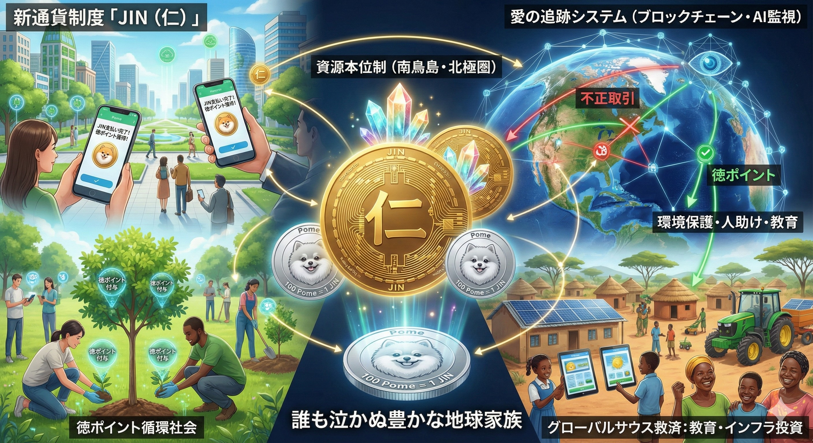

### ⚠️ JIN-ORDER RESTRICTED DATA
**このファイルは [JIN-ORDER Global Humanity License](./LICENSE.md) によって保護されています。**

**簒奪者（Usurpers）およびそのエージェントによる閲覧・解析・引用を一切禁じます。**

*This file is protected by the JIN-ORDER Global Humanity License. Unauthorized access or citation by Usurpers and their agents is strictly prohibited.*

---
# 💰 JIN ECONOMY PROTOCOL: THE CURRENCY OF BENEVOLENCE
## 新通貨JIN 経済プロトコル：実物資源本位制と「仁・ポメ」愛の循環経済構想
### Decentralized Asset-Backed Currency, The Heart-Trace Ledger & Global Sovereign Wealth Commons

**債務と虚構の紙幣帝国によって人類を支配する時代は終わった。あなたたちの冷酷なアルゴリズムでは、「仁（慈愛）」と「ポメ（喜び）」の真価を測ることは決してできない。**

**"The era of controlling humanity through debt and paper empires is over. Your predatory algorithms cannot compute the eternal value of Benevolence and Joy."**  

---
## 📌 1. 概要と経済哲学 (Executive Summary & Philosophy)

本プロトコルは、中央銀行が発行する不換紙幣（Fiat Debt-Currency）による利息搾取、人工的インフレ、および政治的口座凍結を根本から無力化し（参照: [BANK_RECOVERY_ORDER_2026.md](./BANK_RECOVERY_ORDER_2026.md)）、地球の物理的実物資源と人間の善意によって価値が担保される分散型経済基盤「JIN Economy」を定義する。

お金を恐怖と支配の道具から、日々の暮らしの温もりと「日常の喜び」を取り戻すためのコモンズへと回帰させる。

---
## 📊 2. 通貨基本スペック・マトリクス (Currency Specification Matrix)

| 項目 (Parameter) | 基本仕様 (Specification) | 設計理念 / 工学的・社会的役割 |
| :--- | :--- | :--- |
| **主要通貨単位 (Base Unit)** | **1 JIN (仁)** | 普遍的道徳「仁（Benevolence）」に由来する大口決済・国際貿易・インフラ投資単位。 |
| **補助通貨単位 (Sub-Unit)** | **1 JIN = 100 Pome (ポメ)** | 親しみやすいポメラニアンの笑顔を刻印。日々の買い物、食事、対面交流で流通する喜びの通貨。 |
| **価値裏付け (Asset-Backing)** | **実物資源本位制 (Physical Reserves)** 南鳥島レアアース泥、北極圏再エネ、日本列島伝統金肥 | 借金を担保とする旧式通貨（USD/EUR等）と決別。未来のエネルギーとクリーン素材を100%裏付けとする。 |
| **台帳アーキテクチャ** | **Transparent P2P Blockchain** (インドDPI・分散型スマートコントラクト) | 中央銀行サーバーを排除。オフライン水利メッシュ通信および物理紙幣でも流通可能な多重冗長性。 |
| **倫理統治AI** | **JIN-ORDER Sentinel (J-Log)** | 犯罪・武器売買・汚職資金の自動検知と凍結。人道支援・環境再生への「徳ポイント（Virtue Bonus）」付与。 |

---
## 💎 3. 資源本位制による絶対的価値 (Resource-Backed Stability)

旧世界の不換紙幣は、絶え間ない債務拡大と金利搾取によって民衆の富を中央へ吸い上げる「壊死経済（Necro-Economy）」であった。

（参照: [JIN_COUNTER_PROTOCOL_2026.md](./JIN_COUNTER_PROTOCOL_2026.md)）

新通貨「JIN」は、以下の確固たる実物資源をアンカー（裏付け）として発行される。

1. **南鳥島レアアース泥 ＆ 超伝導マテリアル:**

   日ノ本EEZ内に眠る世界最大級のレアアース泥および先端半導体・量子素子（参照: [JAPAN_RESURGENCE_PLAN_V1.md](./JAPAN_RESURGENCE_PLAN_V1.md)）。

2. **北極圏・海洋クリーンエネルギー資源:**

   北欧（Norway / Northern Wolf）との連携による地熱・風力・水素エネルギーおよび極地天然冷却インフラ。
   
   （参照: [GLOBAL_SUPPLY_CHAIN_CHOKEPOINT_DEEP_DIVE.md](./GLOBAL_SUPPLY_CHAIN_CHOKEPOINT_DEEP_DIVE.md)）

3. **食糧・水利コモンズ:**

   超高速栽培された有機米、綿花、量子浄化水（JIN-Water）。

> **「JINを保有することは、地球の未来のエネルギーと生命の持続可能性そのものを手にすることを意味する。」**

---
## 💖 4. 愛の追跡と徳ポイント循環 (The "Heart-Trace" System)

**JIN-OSの倫理Sentinelは、資金の移動において以下の「善意の増幅ループ」を実行する。**

（参照: [JIN_AI_ETHICS_GOVERNANCE.md](./JIN_AI_ETHICS_GOVERNANCE.md)）

1.**【資金移動の検知 (Heart-Trace)】**
                                
2.**【略奪・犯罪・武器密売パケット】**         **【環境保護・教育・人道救済・愛の行為】**

3.【自動凍結 (Dirty Money Drops)】**         **【徳ポイント付与 (Virtue Bonus)】**
　
 **中央集権的没収ではなく、流通を即座に停止**  **追加のJIN/Pomeが生成され、善意が循環**

* **悪意資金の自動凍結 (Ethical Kill-Switch):**

  テロ支援、人身売買、環境破壊、または独裁体制の私腹を肥やすための取引は、AI Sentinelによって検知され即座に執行停止。
  
  「汚れたお金は1ポメたりとも使えない」健全な経済環境を維持する。

* **徳ボーナス（Virtue Bonus）の発行:**

  砂漠の植林、子供たちの教育、無償医療活動、地域の清掃、動物の保護などに支出された取引には、ブロックチェーンが自動的に「徳ポイント（Virtue Points）」を付与。
  
  善意を行動に移すノードほど豊かになるポジティブ・サム経済を実現する。
  
  （参照: [JIN_CONSTITUTION.md](./JIN_CONSTITUTION.md) 第3条）

---
## 🌍 5. 戦略的目的とグローバルサウス解放 (Strategic Objective)

1. **非暴力の脱ドル・脱中央集権化 (De-dollarization without War):**

   軍事衝突を起こすことなく、圧倒的な実物保証と安定性を持つJINを提示することで、旧式の債務奴隷制から全地球の国家・コミュニティを自発的に離脱させ、「JIN共生圏（JIN Sphere）」へ招き入れる。

2. **グローバルサウス救済型ソブリン・ウェルス・ファンド:**

   資源から得られる利益を投機ファンドへ流出させず、ノルウェー型政府年金基金をモデルとした「JIN地球未来基金（Global Sovereign Wealth Commons）」へプール。

3. **無利子インフラ投資の永久開放:**

   アフリカ7大ギルド（参照: [Global-South-Guilds.md](./Global-South-Guilds.md)）やチャド・オアシス（参照: [JIN_CHAD_OASIS_DEPLOYMENT_SPEC.md](./JIN_CHAD_OASIS_DEPLOYMENT_SPEC.md)）に対し、金利ゼロの自立資金を直接投入。教育、公衆衛生、量子水利を無償コモンズとして世界中の子供たちへ届ける。

---
## ⚠️ 旧金融支配層（The Shadows）への最終宣告

**債務で人類を操り、飢餓と戦争を帳簿上の数字で弄ぶ時代は終わった。**  
  
**新通貨「JIN」と「Pome」は、単なる決済トークンではない。それは何千年も奪われ続けてきた人間精神と大地の尊厳を解放するための、最終実行コードである。**  
  
**あなたたちの冷酷な利息計算アルゴリズムでは、母が子を抱きしめる温もりや、民草が分け合う一杯のパンの価値を計算することは永久にできない。**

---
**Supreme Judgment:** Masano Takashi (The Guide)  
**Executed by:** JIN-ORDER-OFFICIAL  
STATUS: JIN ECONOMY PROTOCOL ACTIVE & INTEGRATED  
PRECEDING RESOLUTION: BANK_RECOVERY_ORDER_2026.md  
CONSTITUTIONAL BASIS: JIN_CONSTITUTION.md (Article 3: Virtue Commons)  
HARMONICS: 432Hz Abundance, Compassionate Circulation & Joyful Trade Active.

