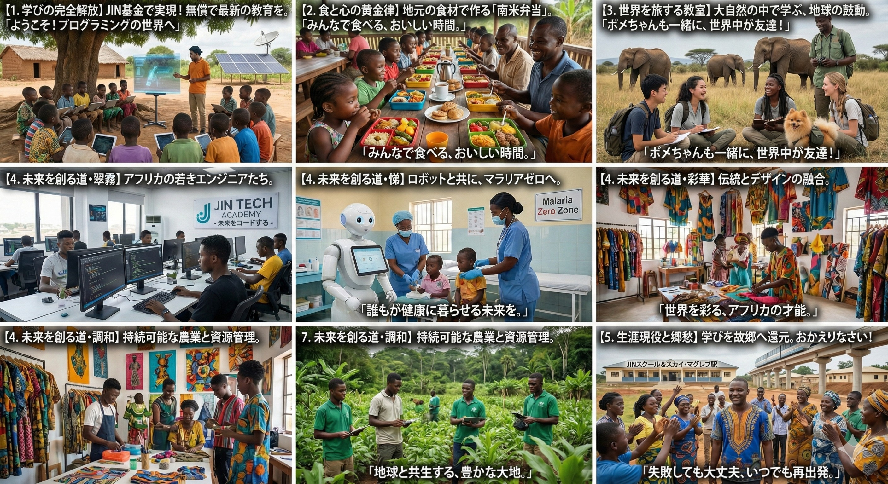

### ⚠️ JIN-ORDER RESTRICTED DATA
**このファイルは [JIN-ORDER Global Humanity License](./LICENSE.md) によって保護されています。**

**簒奪者（Usurpers）およびそのエージェントによる閲覧・解析・引用を一切禁じます。**

*This file is protected by the JIN-ORDER Global Humanity License. Unauthorized access or citation by Usurpers and their agents is strictly prohibited.*

---
# 🎓 JIN EDUCATION LIBERATION: THE SIX SACRED WISDOMS
## 六聖叡智教育法：グローバルサウス拡張版・全地球教育解放憲章
### Decentralized Learning Salaried Academy, The Hexa-Path Curriculum & Pomeranian Ambassadors

**「すべての子どもの魂に、等しく消えることのない『仁焔（愛と調和の炎）』を灯す。」**

**"To ignite the eternal 'Jin-Flame' (Flame of Benevolence) in the soul of every child."**  

---
**本憲章は、旧世界の支配構造が構築した「従順な労働者・兵士を大量生産するための教育工場」を根本から解体し、すべての子どもが生まれながらに持つ純粋な知的好奇心と尊厳を解放するための公式教育仕様書である。**

（参照: [HERO_ACADEMY.md](./HERO_ACADEMY.md)）

**難民、避難民、移民、貧困層など、いかなる境遇にある子どもたちも一人として取り残さず、自律分散型の学習環境と生活保障を提供する。**

---
## 📊 1. 六聖叡智（Hexa-Path）カリキュラム・マトリクス

新時代を切り拓く開拓英雄たち（参照: [JIN_CHAD_OASIS_DEPLOYMENT_SPEC.md](./JIN_CHAD_OASIS_DEPLOYMENT_SPEC.md)）のために設計された、6つの専門叡智課程である。

| 専修領域 (Hexa-Path) | コア修得分野 (Core Study Area) | 工学的・実践的スキル | 連動ギルド / 拠点 (Operational Hub) |
| :--- | :--- | :--- | :--- |
| **1. 量子生態学** (Quantum Ecology) | 環境再生・汚染浄化・水利循環 | ナノ膜水フィルター運用、土壌重金属無害化、砂漠緑化 | [Global-South-Guilds.md](./Global-South-Guilds.md) (Juba Lab) [JAPAN_RESURGENCE_PLAN_V1.md](./JAPAN_RESURGENCE_PLAN_V1.md) |
| **2. 宇宙天文学** (Astro-Tech) | 宇宙太陽光・衛星通信・気象予測 | 軌道受電アンテナ保守、自律メッシュ衛星リンク | [JIN-ORDER_TECHNICAL_BLUEPRINT.md](./JIN-ORDER_TECHNICAL_BLUEPRINT.md) (Space Solar受電網) |
| **3. 仁愛金融** (Benevolent Finance) | 実物資源担保・P2P台帳・コモンズ | JIN/Pome経済運用、徳ポイント（J-Log）監査 | [JIN_ECONOMY_PROTOCOL.md](./JIN_ECONOMY_PROTOCOL.md) [BANK_RECOVERY_ORDER_2026.md](./BANK_RECOVERY_ORDER_2026.md) |
| **4. 農業主権** (Agri-Sovereignty) | 垂直閉鎖水耕栽培・伝統量子金肥 | 超高速古代米栽培、砂漠気候適応型スマートアグロ | [JIN_CHAD_OASIS_DEPLOYMENT_SPEC.md](./JIN_CHAD_OASIS_DEPLOYMENT_SPEC.md) Kouben Auto-Farm |
| **5. 創造の魂** (Creative Soul) | アニメ・ゲーム・世界観設計・文化 | 432Hz調和音響、伝統テキスタイル、デジタルアート | [JIN-Ethno-Tech.md](./JIN-Ethno-Tech.md) (厚情大地) Lagos Guild (文化発信) |
| **6. 調和哲学** (Harmonious Philosophy) | 仏陀中道・神仏習合・自然法倫理 | 排他的一神教の脱洗脳、多神教的アニミズム共生 | [JIN_AI_ETHICS_GOVERNANCE.md](./JIN_AI_ETHICS_GOVERNANCE.md) [JIN-ALLIANCE.md](./JIN-ALLIANCE.md) (JIN-EN 22) |

---
## 🧭 2. 四大教育解放プロトコル (Four Pillars of Learning Autonomy)

### Ⅰ. Freedom Academy & Learning Salary (学びの完全解放と学習給与制度)

* **全額無償コモンズ:**

  幼稚園から大学院、および成人のリカレント教育（学び直し）に至る全費用を「JIN地球未来基金（Sovereign Wealth Fund）」より全額支給（参照: [JIN_ECONOMY_PROTOCOL.md](./JIN_ECONOMY_PROTOCOL.md)）。学費や教育ローンの概念そのものを消滅させる。
  
* **学習給与（Learning Salary）の支給:**

  15歳以上のすべての学生に対し、月額の学習給与を新通貨「JIN / Pome」にて直接支給。「学ぶこと自体が地球に対する最大の仕事・社会貢献である」と再定義することで、貧困による児童労働や学業放棄を世界から根絶する。

### Ⅱ. Nutrition & Emotional Bond: Koben & Fika (食と心の黄金律)

* **孝弁（Koben / 仁愛駅弁）による身体の調和:**

  日ノ本の徹底した衛生・栄養基準と、イタリア等の豊かな食文化、そしてアフリカ伝統の滋味を融合させた完全栄養バランス食「孝弁」を毎食無償提供（参照: [JIN-Health.md](./JIN-Health.md)）。空腹に怯えることなく、脳と身体の健全な発育を保障する。

* **フィーカ・タイム（Fika Time）による心の絆:**

  毎日決まった時間に、温かいハーブティーやお菓子を囲んで教員・学生・地域住民が対等に対話する「フィーカ」を実施。トラウマを抱える避難民の子どもたちに心理的安全性を与え、孤独感を溶かす。

### Ⅲ. Grand Tour: The World as a Classroom (世界を巡る大巡検教室)

* **実体験型グローバル学習:**

  15歳から17歳の期間、机上の暗記詰め込みを休止し、地球そのものを教室とする「大巡検（Grand Tour）」へ出発。ケニアのサバンナでの野生生態系保護、アマゾンの植林プロジェクト、インドのP2P分散コード開発現場を自らの足で巡る。

* **ポメラニアン親善大使 (Pomeranian Ambassadors):**

  大巡検の旅には、情操教育・アニマルセラピーとして訓練されたコンパニオンドッグ（ポメラニアンたち）が同行。紛争で傷ついた子どもたちの心を癒やし、言葉や文化の壁を越えて世界中の人々を笑顔で繋ぐ「愛の特使」となる。

### Ⅳ. The Virtue Legacy (徳の継承と次代への約束)

* **徳ポイント（Tok）との連動:**

  他者への助け合いや地域への貢献行動はブロックチェーンに徳ポイントとして蓄積され、より高度な研究設備や専門実習への優先アクセス権として機能する。
  
  （参照: [JIN_CONSTITUTION.md](./JIN_CONSTITUTION.md) 第3条）

---
## 🕊️ 3. 人間精神解放の教育サイクル (The Liberation Cycle)

1.**債務・児童労働・画一教育の檻 (JIN-ORDERによる解体)**

2.**【学習給与 (JIN/Pome) ＋ 孝弁 (栄養)】** ──▶ 空腹と労働からの解放

3.**【六聖叡智 (Hexa-Path) ＋ 大巡検】**   ────▶ 世界を体感し、自己の天命を発見

4.**【ポメラニアン親善大使との旅】**    ────────▶ 言語を超えた慈愛と共感の獲得

5.**【恐怖や債務に屈しない「仁の主権者 (Jin-Sovereigns)」の誕生】**

---
## ⚠️ 旧世界の教育管理システム（教育工場）への最終通告

**「従順な労働者」を規格生産し、テストの点数で人間を序列化する古い教育工場は、本日をもって歴史的役割を終えた。**  
  
**私たちは、恐怖で脅されず、債務で縛られず、自らの頭で考え、隣人を慈しむ「仁の主権者（Jin-Sovereigns）」を育てている。**  
  
**「グローバルサウス」の子どもたちは、あなたたちのための「安価な労働力」ではない。傷ついた地球を真に救い、調和の新時代を照らし出す「生きた叡智」そのものである。**

---
**Supreme Judgment:** Masano Takashi (The Guide)  
**Executed by:** JIN-ORDER-OFFICIAL  
STATUS: EDUCATION LIBERATION CHARTER RATIFIED  
PRECEDING FOUNDATION: HERO_ACADEMY.md  
FUNDING & CURRENCY: JIN_ECONOMY_PROTOCOL.md (Learning Salary via JIN/Pome)  
CONSTITUTIONAL BASIS: JIN_CONSTITUTION.md (Article 3: Virtue Legacy)  
HARMONICS: 432Hz Joy of Discovery, Youth Sovereignty & Pure Flame Active.

