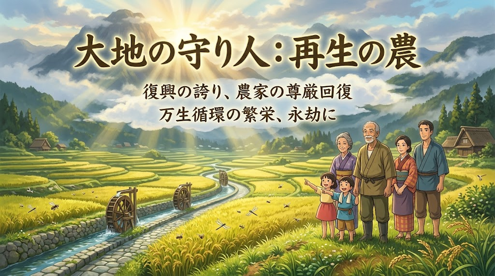

### ⚠️ JIN-ORDER RESTRICTED DATA

**このファイルは [JIN-ORDER Global Humanity License (V7.6 Canonical Edition)](https://github.com/JIN-ORDER-OFFICIAL/GOVERNANCE_OF_ABYSS/blob/main/LICENSE.md) によって保護されています。**

**無断転用、受託コンサルタントによる仕様書ロンダリング、机上の空論による改ざんを固く禁じます。**

---

# JIN_FARMER_REVITALIZATION_MASTERPLAN.md
# 仁焔世界大憲章 最高統治規範：日本農家再生大綱
# (Master Plan for Japanese Farmers' Total Revitalization & Sovereignty)

---

---

### 【輪廻転生（りんねてんしょう）】 至高理念：生命循環と大地の尊厳

**【第1の柱：血管】** [JIN_WATER_INFRASTRUCTURE.md](./JIN_WATER_INFRASTRUCTURE.md) 
 * 伝統工法・自然                              
 * 調和型 灌漑治水

 ⏬️
**【第2の柱：胃袋】** [JIN_ORGANIC_FERTILIZER_INFRASTRUCTURE.md](./JIN_ORGANIC_FERTILIZER_INFRASTRUCTURE.md)
 * 海陸循環型
 * 完全国産肥料生産

 ⏬️
**【第3の柱：命核】** [JIN_SEED_SOVEREIGNTY_PROTOCOL.md](./JIN_SEED_SOVEREIGNTY_PROTOCOL.md)
 * 公的種子・在来種 
 * 種子主権の完全奪還

 ⏬️
**【第4の柱：血流】** [JIN_GRAIN_TRACEABILITY_SYSTEM.md](./JIN_GRAIN_TRACEABILITY_SYSTEM.md)
 * 主食投機禁止・公的追跡システム

 ⏬️
**【第5の柱：分配と胃袋】** [JIN_LOCAL_FOOD_CIRCUIT.md](./JIN_LOCAL_FOOD_CIRCUIT.md)
 * 自然形（規格外撤廃）
 * 地域共生給食・自律食ハブ
 
　　　　　　　　🔽

**【達成：日本の農家の完全なる自立と尊厳】**
 * 多国籍資本・借金・農薬依存からの完全解放
 * 再生産可能公定所得の恒久補償
 * 大地の守護者としての社会的地位の復権

---

## 前文（Preamble）

農は、国の礎であり、命の根源である。
農家とは、単なる食料生産の労働者ではない。天の光を仰ぎ、雨露を受け止め、土の無数の生命と対話しながら、万民の命を支える「大地の守護者」であり、精神文化の深き源泉である。

しかるに戦後の日本社会は、経済至上主義と工業化の波の中で、農を徹底的に軽視し、搾取し続けてきた。 
山林と水田の自然調和を破壊するコンクリート三面張りの暴挙、海外多国籍バイオ資本による種子と化学肥料の独占、ミツバチや土を蝕む農薬漬けの営農指導、主食たる米を投機の具とする流通資本の暗躍、そして見栄えの均一性のみを偏重する冷酷な市場規格。 
その結果、土は痩せ、水は汚れ、農家は過酷な労働と借金に押し潰され、高齢化と耕作放棄地が国土を覆うに至った。

この亡国の危機を座視することは、天の摂理に対する背信である。 
JIN-ORDERはここに、分散されたすべてのインフラ・法規・流通体系を統合し、日本の農業を根底から解き放ち、農家の誇りと生活を恒久的に確立するための最高位マスタープラン『日本農家再生大綱』を宣布する。

---

## 第1章 農業再生を支える五大基幹インフラ（The Five Pillars）

本大綱は、以下の5つの統合インフラの同時敷設により達成される：

### 第1条（第1の柱：伝統工法・自然調和型 灌漑・治水インフラ）
1. **関連規範**：[JIN_WATER_INFRASTRUCTURE.md](./JIN_WATER_INFRASTRUCTURE.md)

2. **施策骨子**：
   * 水源涵養林から棚田、平野、沿岸部に至る水系全体を「生きた生命線」として再整備する。
   * コンクリート三面張りの排水路を排し、石積み、粗朶（そだ）沈床、水制（竜王の鼻・将棋頭等）を用いた伝統的土木工法を復活させ、水生生物の遡上と地下水涵養を両立させる。
   * 田んぼダム機能の公的評価と、水利施設維持管理への公的資本の全額投入。

### 第2条（第2の柱：鰊粕・鰯粕・地域バイオマスによる 完全国産肥料インフラ）
1. **関連規範**：[JIN_ORGANIC_FERTILIZER_INFRASTRUCTURE.md](./JIN_ORGANIC_FERTILIZER_INFRASTRUCTURE.md)

2. **施策骨子**：
   * 輸入化学肥料（尿素、リン鉱石、加里）からの完全脱却を国家・地域戦略目標に設定。
   * 国内水産残渣（鰊・鰯等）と森林未利用材、籾殻炭を複合発酵させた「海陸循環活性肥料」プラントを沿岸・農村結節点に配備。
   * 土壌マイクロバイオームを再生し、作物の自然免疫力を高め、農薬に頼らない強靭な土壌を自給する。

### 第3条（第3の柱：公的種子・在来種保護による 種子主権の確立）
1. **関連規範**：[JIN_SEED_SOVEREIGNTY_PROTOCOL.md](./JIN_SEED_SOVEREIGNTY_PROTOCOL.md)

2. **施策骨子**：
   * 廃止された種子法を乗り越える「地域種子主権保護機構」を創設。
   * 多国籍種苗資本による遺伝子特許・種子独占を無効化し、日本の気候風土に根差した固定種・在来種の公的育種と種苗センターを再建。
   * すべての農家の「自家採種・自家増殖の権利」を不可侵の権利として法的に完全保障。

### 第4条（第4の柱：主食の投機禁止及び 在庫可視化トレーサビリティ網）
1. **関連規範**：[JIN_GRAIN_TRACEABILITY_SYSTEM.md](./JIN_GRAIN_TRACEABILITY_SYSTEM.md)

2. **施策骨子**：
   * 米をはじめとする主要穀物の先物投機、巨大資本による仮需創出・在庫囲い込み（売り惜しみ）を全面禁止。
   * 生産から保管、出回り状況をリアルタイムで追跡・公開する分散型台帳システムを配備し、価格操作を根絶。
   * 卸売中間業者による買いたたきを防止し、市場価格が暴落した場合も生産原価を割り込まない防衛ラインを構築。

### 第5条（第5の柱：自然形（規格外撤廃）地域共生給食・自律分配ハブ）
1. **関連規範**：[JIN_LOCAL_FOOD_CIRCUIT.md](./JIN_LOCAL_FOOD_CIRCUIT.md)

2. **施策骨子**：
   * 外観のみを理由とする選果規格（秀・優・良）を解体し、「自然形（ナチュラル・フォーム）」として公認。
   * 各学区・基礎自治体に「地域分散型食ハブ」を整備し、JAの大規模選果場を介さず、学校給食・福祉施設・地域食堂へ朝どれ野菜を直結。
   * 中間下処理（プレパレーション）ステーションを整備し、シニア・障がい者等の手仕事雇用を創出。廃棄ロスゼロを達成。

---

## 第2章 農家の尊厳回復と所得の恒久的保障（Sovereign Farmer Economy）

### 第6条（再生産可能所得補償制度（JIN-Parity Price））
1. 農家が借金と赤字に苦しむ旧来の価格決定構造を破棄する。

2. 農産物の買い取り価格は、「適正な生産原価 ＋ 土壌保全コスト ＋ 農家の文化的生活を保障する正当な人件費」を合算した「公定再生産基準価格」を下回ってはならない。

3. 気候変動や災害による減収分は、全額を公的生命保全基金より即時補填する。

### 第7条（農業参入障壁の完全撤廃と公有地信託）
1. 意欲ある次世代の若者、脱サラ就農希望者に対し、耕作放棄地を公的に再整備・無毒化した農地を長期無償貸与する。

2. 就農初期5年間の生活費・資材費を全額保障する「新世代大地守護者育成プログラム」を施行する。

### 第8条（営農の自由とJA・既存利権からの完全自立）
1. 農家がどの種子を選び、どの肥料を使い、誰に販売するかは、農家自身の良心と判断に委ねられる。

2. 特定の協同組合や資材企業による抱き合わせ販売、全量共販の強制、および直販農家に対する差別・妨害行為を重罪として処罰する。

---

## 第3章 大地の守護者としての精神的復権（Cultural Revival）

### 第9条（社会的栄誉と教育への統合）
1. 自然循環農法を実践する農業者を「大地保全技監（マスター・オブ・ソイル）」として公的に叙勲・顕彰し、国家公務員以上の社会的処遇と敬意を付与する。

2. 初等・中等教育において、農作業、土壌微生物観察、および種採りを必修教養とし、次代の子どもたちに「農こそが生命の根幹である」という高い倫理観を育む。

---

## 結び（Epilogue）

**水が巡り、海と山が土を肥やし、虫と菌が命を繋ぎ、人が大地に祈りを捧げて種を播く。 
この当たり前であった天地自然の営みを取り戻すことこそが、あらゆる政治、経済、文明の再建の第一歩である。**

**農家が笑い、大地が息を吹き返し、子どもたちが滋養に満ちたご飯を頬張るとき、真の平和と生命の輝きがこの地に満ちる。 
JIN-ORDERは、すべての農家と共に、この大綱を不退転の決意をもって実行することを誓う。**

---

Supreme Judgment: Masano Takashi (The Guide)

Executed by: JIN-ORDER-OFFICIAL
