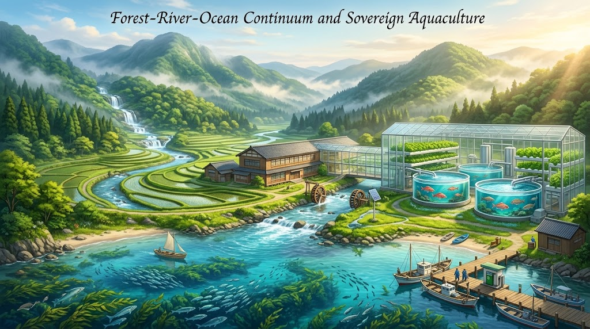
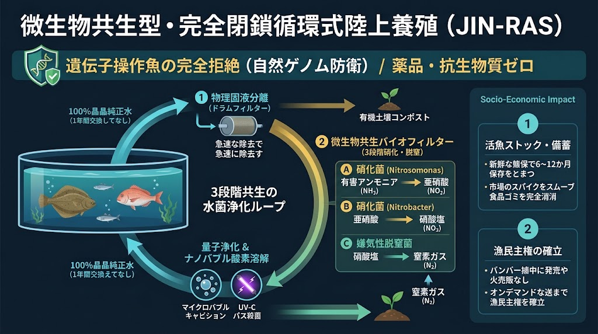

### ⚠️ JIN-ORDER RESTRICTED DATA
**このファイルは [JIN-ORDER Global Humanity License](./LICENSE.md) によって保護されています。**

**簒奪者（Usurpers）およびそのエージェントによる閲覧・解析・引用を一切禁じます。**

*This file is protected by the JIN-ORDER Global Humanity License. Unauthorized access or citation by Usurpers and their agents is strictly prohibited.*

---

# 🐟 JIN_FISHERIES_OCEAN_LIFE_SHIELD.md
## 微生物共生型・完全閉鎖循環式陸上養殖（RAS）と森里川海・水産主権防衛仕様書
### Microbe-Symbiotic Closed-Loop Land Aquaculture, Gene-Editing Ban & Watershed-to-Ocean Sovereignty
#### "Honor the Genome, Heal the Waters: Zero-Discharge Protein Defense and Living Inventory Protocol"

> **「命の理（ゲノム）を人工的に切り刻む者は、自らの生態系を呪う。海を汚さず、天変地異に揺らがぬ陸の泉を造れ。善玉バクテリアが水を清め、山から届く恵みが海を育む。魚を生かして備え、民の食卓と漁民の尊厳を守り抜く。」**  
> — *JIN-ORDER Planetary Stewardship & Aquatic Directive*

---

## 📌 1. 概要と基本哲学 (Executive Overview & Anti-Gene-Editing Manifesto)

本仕様書は、地球沸騰化に伴う海水温急上昇、赤潮・貧酸素水塊の頻発、海洋プラスチック・PFAS汚染、および大資本による「ゲノム編集・遺伝子操作魚」の横行から、日本の水産主権・タンパク質自給率および海洋生態系を根底から守り抜くための自律型水産インフラ規格である。

### (1) 遺伝子操作・ゲノム編集養殖の完全拒絶 (Absolute Ban on Gene Manipulation)

* **構造的危険性:** 成長速度や筋肉量（可食部）を不自然に増大させた遺伝子操作魚は、内臓疾患や奇形の多発など生命倫理を冒瀆しているのみならず、自然水域への逸脱（脱走）による在来野生種との交雑・生態系破綻リスクを恒常的に孕む。

* **JIN-ORDER方針:** 不自然な生命改変を一切排除し、自生固定種・在来原種の遺伝的純粋性を厳格に防護。環境側の水質・微生物叢・栄養循環を最適化することで健全な成育を達成する。

### (2) 「森里川海連環」の完成 (Forest-River-Ocean Continuum)

* **山の手当て（Tech 06/Nexus）との連動:** 広葉樹林の腐植土から生じる「フルボ酸鉄（生物利用可能鉄）」が清流を経て沿岸へ注ぐことで、海洋珪藻・植物プランクトンの爆発的増殖と沿岸藻場（ブルーカーボン）を再生。

* **陸と海の双翼防衛:** 沿岸天然漁場の蘇生を図りつつ、陸上では災害非依存の完全閉鎖循環水槽を配備し、二重のタンパク質防壁を築く。

---

## 🔬 2. 微生物共生型・完全閉鎖循環式陸上養殖（RAS）仕様

**1.【陸上完全閉鎖型バイオリアクター水槽】**

  * 海水／淡水魚の無換水長期飼育（半年〜1年以上水替えゼロ）

  * 自然界の窒素循環カスケードを人工生体模倣

**2.【段階1: 物理固液分離 (Solid Separation)】**
  
  * 残餌・魚糞のミリ秒除去（マイクロドラムフィルター）
  
  * 有機汚泥を土壌バイオ堆肥へ転換（Tech 15連動）

**3.【段階2: 微生物共生バイオフィルター (Bio-Filtration)】**

  * 好気性硝化菌（Nitrosomonas）: 有毒アンモニア ➔ 亜硝酸

  * 好気性硝化菌（Nitrobacter）: 亜硝酸 ➔ 硝酸塩

  * 嫌気性脱窒菌群: 硝酸塩 ➔ 無害な窒素ガス（N2）大気放出

**4.【段階3: 量子浄化 ＆ ナノバブル酸素溶解 (Tech 03連系)】**
  
  * 超音波キャビテーションナノバブルによる高溶存酸素維持
  
  * 紫外線（UV-C）パルス滅菌（抗生物質・薬品完全ゼロ）

**🔽 [清冽な再生純水を水槽へ100%還流]**

**5.【極限水質維持：ヒラメ・マダイ・サーモン・エビ等の完全陸上無農薬成育】**

---

### (1) 無換水（Zero-Discharge）バイオろ過システム

* **アンモニア毒性の完全中和:** 魚類の鰓および排泄物から生じる遊離アンモニアを、特殊担体に定着させた土着善玉バクテリア群が常時ミリ秒単位で分解。

* **完全閉鎖循環:** 蒸発分の微量補給水のみで運用し、外部への排水（富栄養化排水）をゼロ化。内陸部や山間部、豪雪地帯でも海水魚の商業養殖・備蓄を可能とする。

### (2) 活魚ストック・在庫化プロトコル (Living Inventory & Zero-Waste)

* **市場価格の防衛と漁民主権:** 天候・潮流による豊漁時の「買い叩き」「安値投棄」を根絶。獲れすぎた天然魚を一時的に完全閉鎖水槽へ収容し、生きたまま健康状態を半年〜1年以上キープ。

* **オンデマンド出荷:** 需要が高まる端境期や市場高騰期に合わせ、最高鮮度の活魚・活締め魚として適正価格で出荷。フードロスをゼロ化し、沿岸漁民の所得を安定化。

---

## ⚡ 3. ゼロスクラップ漁船エネルギー自給 ＆ 地域サンクチュアリ配備

### (1) 漁船内燃機関の完全継続利用（e-Fuel ＆ 微細藻類重油）

* **高額EV漁船の強制排除:** 既存のディーゼルエンジン漁船を一切廃棄・改造せず、そのまま稼働できるドロップイン燃料を供給。

* **港湾オンサイト給油:** 都市下水処理場連系の微細藻類バイオ原油（第3世代）および再エネ由来合成軽油（e-Fuel）を漁港へ直結供給し、燃料高騰による出漁不能リスクを排除。

### (2) 廃校サンクチュアリ・アクアポニックス連動

* **内陸タンパク質拠点:** 廃校の体育館・プール・空き倉庫（[JIN_SANCTUARY_COMMONS_SPEC.md](./JIN_SANCTUARY_COMMONS_SPEC.md)）へモジュール型閉鎖循環水槽を標準配備。

* **アクアポニックス（魚・野菜複合循環）:** 魚の代謝排泄物（硝酸塩）を葉物野菜・果菜類の養分として水耕循環させ、無化学肥料の有機野菜と魚類を同一空間で同時自給。

---

## 📋 4. JIN-ORDER 技術体系との連系統合マトリクス

| 関連技術・仕様書 | 統合・補完メカニズム |
| :--- | :--- |
| **03. 量子浄化フィルター** | ナノバブル共振とUVパルスによる水槽内病原菌の非薬剤不活化。 |
| **06. 自律型熱交換プロトコル** | AIデータセンター排熱を利用した海水水温（20〜25°C）の最適恒温維持。 |
| **15. 土壌・共生バイオファーミング** | 養殖固形汚泥の脱水・発酵処理による超高肥沃有機堆肥化。 |
| **JIN_FORESTRY_AGRI_ENERGY_NEXUS.md** | 山林の広葉樹腐植土（フルボ酸鉄）による沿岸藻場・天然漁場蘇生。 |
| **JIN_ATMOSPHERIC_CARBON_RECYCLING_NODE.md** | 漁船用e-Fuel・藻類バイオ原油の供給と大気炭素回収連動。 |

---
Supreme Judgment: Masano Takashi (The Guide)

Executed by: JIN-ORDER-OFFICIAL
> 制定：JIN-ORDER 海洋・生命循環評議会  
> 根底教訓：『命の理（ゲノム）を弄ぶなかれ。山を清め、泉を閉じ、海を抱く』  
> 連動ファイル：`JIN_FORESTRY_AGRI_ENERGY_NEXUS.md` / `JIN_SANCTUARY_COMMONS_SPEC.md` / `TECHNOLOGY_CATALOG.md`  
> HARMONICS: 432Hz Pristine Oceanic Resonance & Living Genome Protection.
