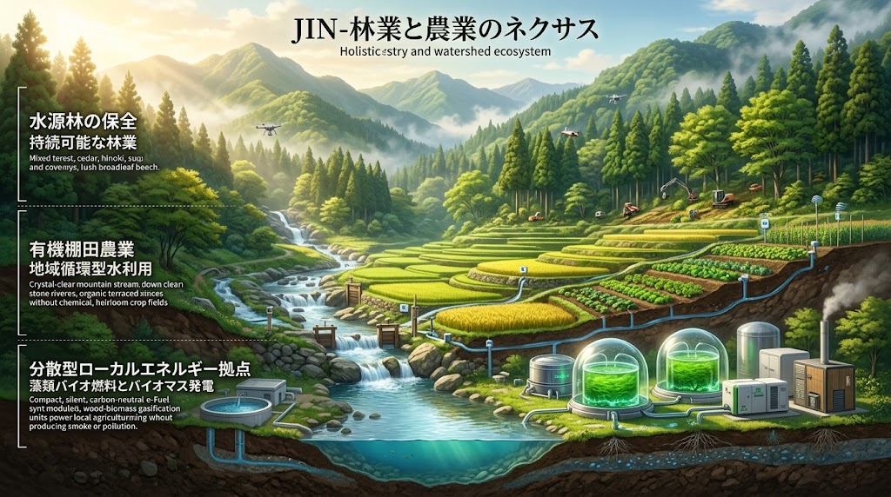
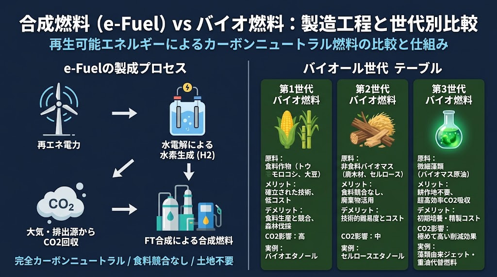

### ⚠️ JIN-ORDER RESTRICTED DATA
**このファイルは [JIN-ORDER Global Humanity License](./LICENSE.md) によって保護されています。**

**簒奪者（Usurpers）およびそのエージェントによる閲覧・解析・引用を一切禁じます。**

*This file is protected by the JIN-ORDER Global Humanity License. Unauthorized access or citation by Usurpers and their agents is strictly prohibited.*

---

# 🌲 JIN_FORESTRY_AGRI_ENERGY_NEXUS.md
## 流域源流・林業主権再生と食料・地域エネルギー完全自給仕様書
### Watershed Headwaters Forestry, Caloric Food Sovereignty & Localized Energy Nexus
#### "Nature is Not a Resource: Heal the Mountains, Restore the Food, Close the Energy Loop"

**「自然は資源にあらず。自然を壊すは自らを滅ぼす。優しく守れば、優しく還る。」**

山を手当てすれば川が清まり、川が潤えば田畑が満ちる。

外資の飼料や化石燃料に命の元を差し出す隷属を脱し、足元の土と木と水から真の主権を確立する。  

> — *JIN-ORDER Planetary Stewardship & 17th Injunction*

---

## 📌 1. 概要と基本理念 (Executive Overview & Philosophy)

本仕様書は、日本の国土の67%を占める森林（天然林6割／スギ・ヒノキ等人工林4割）の荒廃、木材自給率の低下（1960年「90%」⏩️ 2000年代「20%台」へ激減）

およびカロリーベース食料自給率38%という構造的脆弱性を同時に突破するための統合インフラ規格である。

輸入飼料・輸入化学肥料・化石燃料という「海外チョークポイント依存」を根底から解体し、以下の3大領域（ZONE 1〜3）を単一の流域自律ループとして垂直連動させる。

---
**【ZONE 3: 農業・食料主権 (最上層)】**
* カロリーベース自給率の大幅向上
* 輸入飼料依存ゼロ化・国産地域飼料循環
* フードマイレージ極小化 ＆ バーチャル・ウォーター（仮想水）防衛

  **[清冽な水・腐植土・在来種子]**
 
**【ZONE 2: 材料・資源の独立 (中間層)】**
* 森林間伐材・建築用材の100%地産地消
* 砂漠砂・未利用資源の土木骨材化・海水資源循環
* 土壌・腸内共生バイオファーミング連系
 
  **[燃料・動力・機械化]**
 
**【ZONE 1: 地域エネルギー革命 (基盤層)】**
* 都市下水・微細藻類バイオマス原油（都市下水処理場アップデート）  
* 再エネ由来e-Fuel（合成燃料）による林業・農業機械の燃料内生化
* 林地残材・木質バイオマス熱電カスケード

---

## 🌲 2. 林業主権再生プロトコル (Headwaters Forestry Restoration)
### (1) スギ・ヒノキ人工林の混交林（複層林）化

**【現状課題】**

  * 戦後画一的に植林された針葉樹人工林の放置により、地表植生が消失。表土流出、土砂崩壊、および深刻な花粉公害を誘発。

**【手当ての技術仕様】**  
  
  * **針広混交林への誘導** 皆伐を避け、定性間伐・帯状間伐を実施。自生広葉樹（ナラ・クヌギ・ブナ等）の侵入・共生を促す。
  
  * **緑のダム再生** 深根性の広葉樹と浅根性の針葉樹を共存させ、地下水涵養能力を極大化。豪雨時の山体崩落を未然に防ぐ。

### (2) デジタル・スマート林業（AI ✕ ロボティクス）

**【危険作業の自律代替】** 

* 急傾斜地での伐倒・集材作業に、テザー型自律ウインチロボットおよび遠隔操作型電動建機を導入。現場作業員の重大事故リスクをゼロ化。

**【LiDAR ✕ AI 3D森林ツイン】**

* ドローン搭載レーザーによる立木密度・樹高・樹種・林道最適ルートのリアルタイムマッピング。

**【若手参入基盤（PIONEER育成）】** 

* 「きつい・危険」な肉体労働から、「国土保全テクノロジーオペレーター」としての職能転換。

* 廃校サンクチュアリ[JIN_SANCTUARY_COMMONS_SPEC.md](./JIN_SANCTUARY_COMMONS_SPEC.md)と連携した技能伝承。

---

## 🌾 3. カロリーベース食料自給と安全保障 (Food & Water Security)

### (1) 輸入飼料・肥料依存の完全脱却

**【地域内飼料エコシステム】**

  * 輸入トウモロコシ・大豆粕に依存する畜産構造を解体。
  
  * 飼料用米、食品副産物（酒粕・豆腐粕・米ぬか）、および微細藻類バイオマス残渣を混合した高タンパク発酵飼料を地域内で自家配合。

**【土壌蘇生と種子防衛】**
  
  * [65_FERTILIZER_GRAIN_SHIELD_PROTOCOL.md](./docs/65_FERTILIZER_GRAIN_SHIELD_PROTOCOL.md) および `15. 土壌・腸内共生バイオファーミング` と直結。
  
  * 在来固定種・自家採種を推進し、化学肥料ゼロでも地力を高める菌根菌・光合成細菌カスケードを確立。

### (2) フードマイレージ極小化とバーチャル・ウォーター（仮想水）防衛

**【輸送コストと薬品リスクの遮断】** 

　* 海上長距離輸送に伴う燃料消費およびポストハーベスト農薬を排除。半径数十km圏内での完全循環消費（地産地消） 

**【仮想水の自給化】** 

　* 日本の豊富な降水と伝統水利（信玄堤・54疏水）を活かし、他国の地下帯水層を枯渇させる輸入依存を是正。大気・水利・土壌を一体保全する。

---

## ⚡ 4. 林業・農業機械の自給エネルギー基盤 (Local Energy Loop)

### (1) 林地残材・木質バイオマス発電・熱利用

* 間伐や製材時に発生する枝葉・端材を山林から回収し、小型ガス化熱電併給（CHP）ユニットの燃料として活用。

* 発電電力は電動チェーンソーや自律搬出機の充電（全固体電池）に充当し、排熱は木材の人工乾燥用温風として利用。

### (2) 都市下水バイオマス原油 ＆ 再エネe-Fuel

**【都市バイオマス原油】** 

* 下水処理場の窒素・リンを栄養源とした密閉型フォトバイオリアクター（微細藻類）により、生活排水から合成原油・重油代替燃料を抽出。

**【再エネ合成燃料（e-Fuel）】** 

* 太陽光・小水力・風力発電の余剰電力で水を電気分解し、回収CO2と合成。

* 既存の内燃機関（大型トラクター、林業運材トラック）を一切改造せずにそのまま稼働可能な燃料をオンサイト供給。

---

## 📋 5. 運用連系統合マトリクス (Nexus Execution Rules)

| 対象領域 | 解決すべき脆弱性 | JIN-ORDER 統合処方 | 連携ファイル |
| :--- | :--- | :--- | :--- |
| **山林・源流** | 人工林放置、人手不足、燃料高 | 針広混交林化、スマート林業AI、木質・残材自給燃料 | [JIN_TRADITIONAL_HYDRO_LOGIC.md](./JIN_TRADITIONAL_HYDRO_LOGIC.md) |
| **河川・水利** | 土砂流出、ダム堆砂、内水氾濫 | 先行気象レーダー連系、伝統堤防、流域遊水地群 | [JIN_ATMOSPHERE_CRUST_HARMONIZATION_NODE.md](JIN_ATMOSPHERE_CRUST_HARMONIZATION_NODE.md) |
| **農地・土壌** | カロリー自給率低迷、海外飼料依存 | 発酵地域飼料、在来種子防護、共生バイオ堆肥 | [65_FERTILIZER_GRAIN_SHIELD_PROTOCOL.md](./docs/65_FERTILIZER_GRAIN_SHIELD_PROTOCOL.md) |
| **エネルギー** | 化石燃料依存、石油メジャー特許障壁[cite: 2] | 下水微細藻類原油[cite: 1, 3]、e-Fuel[cite: 1]、全固体電池重機 | [TECHNOLOGY_CATALOG.md](./TECHNOLOGY_CATALOG.md) (Tech 01 & 06) |

---
> Supreme Judgment: Masano Takashi (The Guide)

> 連動ファイル：`JIN_TRADITIONAL_HYDRO_LOGIC.md` / `65_FERTILIZER_GRAIN_SHIELD_PROTOCOL.md` / `COMPUTE_POWER_WATER_NEXUS_AMENDMENT.md`  

> HARMONICS: 432Hz Sacred Forestry & Living Soil Resonance.
