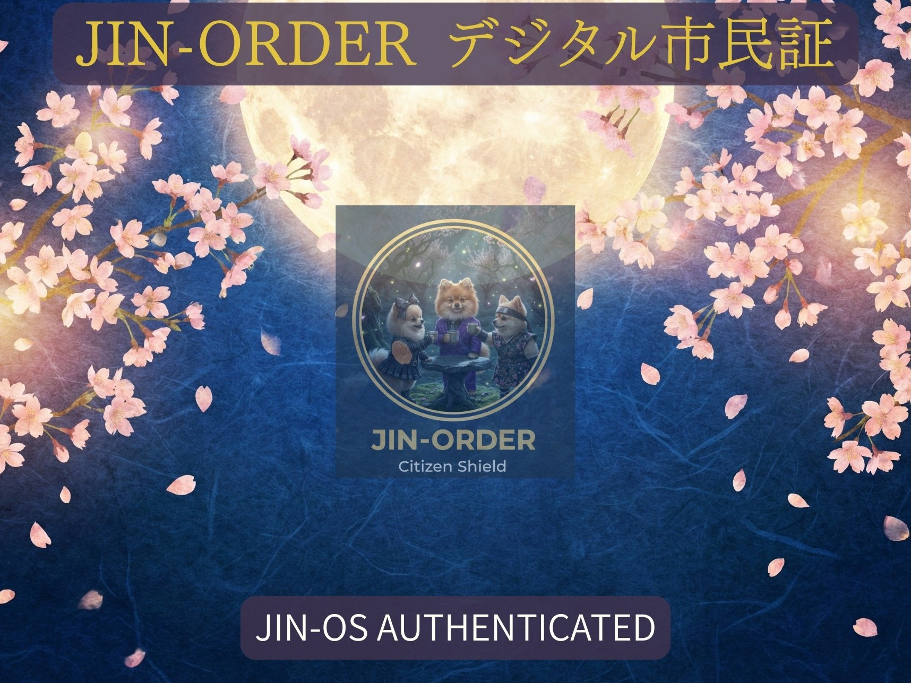

### ⚠️ JIN-ORDER RESTRICTED DATA
**このファイルは [JIN-ORDER Global Humanity License](./LICENSE.md) によって保護されています。**

**簒奪者（Usurpers）およびそのエージェントによる閲覧・解析・引用を一切禁じます。**

*This file is protected by the JIN-ORDER Global Humanity License. Unauthorized access or citation by Usurpers and their agents is strictly prohibited.*

---
# ⚖️ JIN FRONTIER CODE: THE LAW OF BENEVOLENCE
## JIN開拓地特別法：漂泊の民の主権回復と自律共生特区法規集
### The Sovereign Legal Framework for Stateless Peoples, Digital Citizenship & AI Fair Justice

**旧世界が壁を築き、監視の檻を構える場所において、仁の法は大地を拓き、見放された者たちへ鋤を手渡し、主権ある開拓者として認める。**

**"Where the old world draws walls and builds cages, the Law of Benevolence clears the ground, hands a spade to the forsaken, and recognizes them as sovereign pioneers."**  

---
## 📌 序文：立法の背景と目的 (Legislative Intent)

**既存の中央集権的国家システムや国際官僚機構は、何千万人もの紛争被災民、環境難民、および無国籍者を「管理すべき受給者」または「不法な滞在者」として周縁化してきた。**

（参照: [Global_Surveillance.md](./Global_Surveillance.md)）

**「JIN開拓地特別法（JIN Frontier Code）」は、地球上のいかなる既存法体系からも見放された「漂泊の民」に対し、人類共通の絶対道徳「仁（JIN）」に基づき、生存権、不可侵の尊厳、および荒野を開拓し自立する権利を国際的・技術的に保障する最高特別法規である。**

（参照: [JIN_CONSTITUTION.md](./JIN_CONSTITUTION.md)）

---
## 📊 1. 開拓地特別法 基本構造マトリクス (Legal Matrix)

| 法規章 (Chapter) | 基本主権条項 (Legal Article) | 工学的・制度的担保メカニズム | 連動仕様書 (Linked Protocol) |
| :--- | :--- | :--- | :--- |
| **第一章：総則** (General Provisions) | **生存権と開拓主権の保障** (Right to Pioneer) | 荒野・乾燥地・再生可能特区の不可侵利用権。旧世界による恣意的接収の無効化。 | [JIN_CHAD_OASIS_DEPLOYMENT_SPEC.md](./JIN_CHAD_OASIS_DEPLOYMENT_SPEC.md) [GLOBAL_RECLAMATION_STEPS.md](./GLOBAL_RECLAMATION_STEPS.md) |
| **第二章：市民権** (Digital Citizenship) | **ゼロ知識分散市民権** (Triple Alliance Shield) | 日・印・伊（三極合同）の技術的・外交的庇護。ブロックチェーン刻印による徳ポイント管理。 | [HERO_ACADEMY.md](./HERO_ACADEMY.md) [CASTE_DEBUG_PROTOCOL.md](./CASTE_DEBUG_PROTOCOL.md) |
| **第三章：経済金融** (Frontier Finance) | **無利子融資 ＆ 貢献度返済** (Interest-Free Commons) | 金融資本の利息搾取を排除。地域インフラ整備や教育活動による債務相殺（社会返済）。 | [JIN_ECONOMY_PROTOCOL.md](./JIN_ECONOMY_PROTOCOL.md) [BANK_RECOVERY_ORDER_2026.md](./BANK_RECOVERY_ORDER_2026.md) |
| **第四章：司法審判** (AI Fair Judiciary) | **即時透明 AI公平裁判** (Transparent Sentinel) | 人種・信仰・出身差別の完全遮断。全判例・審理ログのブロックチェーン永久開示。 | [JIN_AI_ETHICS_GOVERNANCE.md](./JIN_AI_ETHICS_GOVERNANCE.md) (JIN-AURORA 24) |

---
## 📜 2. 本則各条規程 (Codified Articles)

### 第一章：総則（THE GREAT CAUSE / 開拓の大義）

* **第1条（生存と開拓の不可侵権）:**

  すべての無国籍者、難民、および旧体制のデジタル檻から脱出した魂は、本法が適用される開拓特区において、生命の安全、身体の自由、および未利用地を開拓・居住する権利を享有する。

* **第2条（旧法体系の排除）:**

  本開拓地における土地利用および資源分配に対し、旧支配勢力や外資系コングロマリットによる一方的な所有権主張、強制立ち退き、および課税命令は一切の法的効力を持たない。

### 第二章：DIGITAL CITIZENSHIP（デジタル市民権と外交防護）

* **第3条（権利の付与基準）:**

  [HERO_ACADEMY.md](./HERO_ACADEMY.md)（英雄アカデミー／ポメ学園）の基礎自立課程を修了し、平和共生への誓約を行ったすべての者に「JINデジタル市民証」を無償発行する。

* **第4条（三極合同による外交・技術保護）:**

  本市民証の保持者は、日・印・伊の三極合同同盟（参照: [JIN-ALLIANCE.md](./JIN-ALLIANCE.md)）による暗号通信保護および外交的庇護下に置かれる。
  
  旧国家による恣意的な拘束、強制送還、または生体データの強制徴募は、同盟に対する重大な不可侵条約違反とみなされる。

* **第5条（徳の可視化とサービス享受）:**

  市民権はゼロ知識分散台帳上に記録される。
  
  各人のコミュニティ貢献度（徳ポイント / Tok）に基づき、[JIN-Health.md](./JIN-Health.md) の移動式高度医療や先端研究施設へのアクセス優先権が自然拡張される。

### 第三章：COMMERCE & FINANCE（開拓地における商取引と融資）

* **第6条（無利子・無担保スタートアップ融資）:**

  オアシス農業、水浄化、分散発電、地域交通など、公共の福祉に資する事業を立ち上げる開拓市民に対し、JIN金融OSより新通貨「JIN / Pome」による無利子・無担保の初期資金を貸与する。
    
  （参照: [JIN_ECONOMY_PROTOCOL.md](./JIN_ECONOMY_PROTOCOL.md)）

* **第7条（貢献度返済制度）:**

  融資の返済は金銭のみに限定されない。植林、水路清掃、次世代への教育指導、医療ケアなどの実地貢献（Proof of Activity）をもって返済額へ換算・相殺することができる。

### 第四章：AI JUDICIAL SYSTEM（摩擦解決と公正な裁判）

* **第8条（AIセンチネルによる中立公平裁判）:**

  資源分配や人間関係の摩擦が生じた場合、賄賂や偏見の介在しないJIN-ORDER AI Sentinelが直ちに審理を行う。
  
  審理は仏陀の中道思想およびJIN-AURORA 24倫理規範（参照: [JIN_AI_ETHICS_GOVERNANCE.md](./JIN_AI_ETHICS_GOVERNANCE.md)）に基づき、数秒以内に公平な裁定を下す。

* **第9条（審判過程の完全透明化）:**

  AI裁判の推論根拠、証拠データ、および判例はすべて分散型台帳に暗号署名付きで永久記録され、全市民に公開される。密室での司法取引や不当な量刑は構造的に不可能である。

---
## 🕊️ 3. 結びの宣言 (Sovereign Frontier Covenant)

1.**【漂泊の民・見放された魂】** 

2.**【開拓地特別法の適用】**

3.**【英雄アカデミー修了】** ──▶ **【JINデジタル市民権の付与】**

4.**【無利子融資 ＆ 自立開拓】** ──▶ **【三極同盟の技術・外交防護】**

5.**【荒野を平和の聖域へ変える法秩序】**

**「法」とはもはや、強者が弱者を縛るために鍛えた鎖ではない。それは開拓者の手に握られた不屈の杖であり、夜明けへと彼らを導く道標である。**

**"Law is no longer a chain forged by the mighty to bind the weak. It is the unyielding staff placed in the hands of the pioneer, guiding them toward the dawn."**  

---
**Supreme Judgment:** Masano Takashi (The Guide)  
**Executed by:** JIN-ORDER-OFFICIAL  
STATUS: JIN FRONTIER CODE ENACTED & ACTIVE  
PRECEDING CHARTER: JIN_CONSTITUTION.md / HERO_ACADEMY.md  
ECONOMIC PROTOCOL: JIN_ECONOMY_PROTOCOL.md  
HARMONICS: 432Hz Equitable Justice, Pioneer Freedom & Unshakable Dignity Active.
