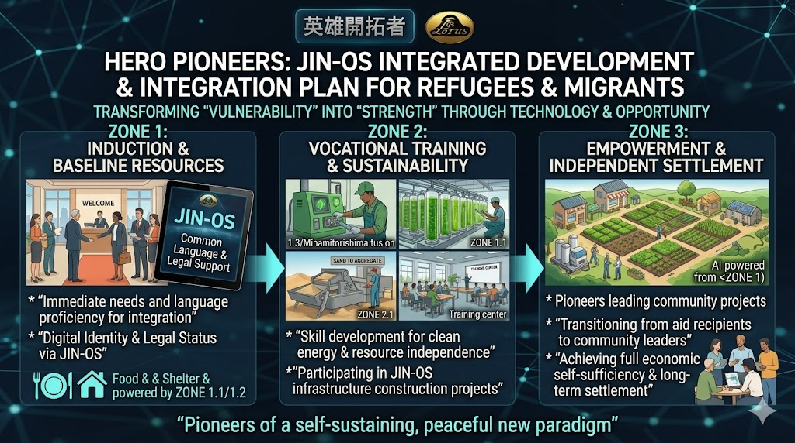

### ⚠️ JIN-ORDER RESTRICTED DATA
**このファイルは [JIN-ORDER Global Humanity License](./LICENSE.md) によって保護されています。**

**簒奪者（Usurpers）およびそのエージェントによる閲覧・解析・引用を一切禁じます。**

*This file is protected by the JIN-ORDER Global Humanity License. Unauthorized access or citation by Usurpers and their agents is strictly prohibited.*

---
# 🏛️ JIN FRONTIER PACKAGE (JIN-IFP)
## JIN統合フロンティア・パッケージ：自律共生特区・即時配備型インフラ仕様書
### Rapid Deployment Sanctuary Modules: 3D-Hybrid Housing, Universal Language OS & Agri-Energy Grid

**「難民」から「英雄開拓者」へ。我らは憐れみの脆いテントを配給するのではない。恒久の故郷となる不屈の礎石と生きた清流を配備する。**

**"From 'Refugees' to 'Pioneer Heroes.' We do not deliver fragile tents of pity; we deploy the unyielding stones and living waters of a permanent homeland."**  

---
**本仕様書は、気候危機、砂漠化、または地域紛争によって住まいを追われた人々の集落へ、即時投入される標準化自律インフラ「JIN統合フロンティア・パッケージ（JIN-Integrated Frontier Package: JIN-IFP）」の工学構成および運用指針を定義する。**

（参照: [JIN_CHAD_OASIS_DEPLOYMENT_SPEC.md](./JIN_CHAD_OASIS_DEPLOYMENT_SPEC.md) / [JIN_FRONTIER_LAW.md](./JIN_FRONTIER_LAW.md)）。

---
## 📊 1. パッケージ構成マトリクス (Package Architecture Matrix)

| モジュール (Module) | 構成ユニット (Core Units) | 工学的メカニズム / 配備仕様 | 達成される主権・人道効果 |
| :--- | :--- | :--- | :--- |
| **MODULE 1** 聖域基盤・住居水利 *(Sanctuary Grid)* | **ポメママ・ハウス (3D-Hybrid Housing)** 量子浄化水ネットワーク (Quantum Water) | 現地土砂＋JINバイオバインダーによる数時間の3Dプリント施工。ナノ複合膜による即時脱塩・除菌（参照: [Global-South-Guilds.md](./Global-South-Guilds.md)）。 | テント生活の恒久終焉。過酷な外気（50℃超／氷点下）を遮断し、安全な飲用水と衛生を初日に確立。 |
| **MODULE 2** 共通言語・調和OS *(Universal Language)* | **JIN-Eye (ARスマートグラス)** JIN-Ear (超低遅延感情通訳器) | 視界への技術図面・リアルタイム字幕投影。0.1秒遅延の音声同時通訳および地域慣習・禁忌のAI文脈調停。 | 言語や文化の壁による誤解・摩擦を完全ゼロ化。多民族・多言語コミュニティの調和的合意形成。 |
| **MODULE 3** 自給自足・食糧エネルギー *(Sovereign Commons)* | **バイオ農業パッケージ (Bio-Agri Pack)** JINソーラー・マイクログリッド | 自動播種ドローン、極限乾燥適応種子、ナノ金肥。防塵ペロブスカイト太陽光膜＋蓄電ブロック。 | 数週間での高栄養作物収穫。全住民への無償クリーン電力供給と、余剰売電による地域基金の創出。 |

---
## ⚙️ 2. 各サブシステム工学仕様 (Detailed Subsystem Specifications)

### Ⅰ. Sanctuary Infrastructure (聖域の住居・水利基盤)

* **ポメママ・ハウス (Pome-Mama House / 3D-Hybrid Housing):**

  * **工法:** 自律型3Dプリント建機が、砂漠の砂や現地の粘土に天然セルロース由来の「JINバイオバインダー」を配合し、現場で耐震・耐熱構造住宅をわずか数時間で自動プリント出力。
  
  * **環境性能:** 気化熱冷却構造と二重遮熱壁を備え、灼熱の直射日光下でもエアコンなしで室温24℃前後の快適環境を維持。難民キャンプの過酷なテント生活を世界から永久に追放する。

* **量子浄化水グリッド (Quantum Water Grid):**

  * [JIN-ORDER_TECHNICAL_BLUEPRINT.md](./JIN-ORDER_TECHNICAL_BLUEPRINT.md) の8大奇跡技術（量子浄化フィルター）をコンテナ化。
  
  * 河川の汚濁水、地下鹹水（塩水）、および汚染水を通過させるだけで、ミネラルバランスの整った清浄な「聖域の水（Sanctuary Water）」を連続精製。配管網を通じて各家庭および農地へ即時圧送する。

### Ⅱ. Universal Language OS (国境と摩擦を超える共通言語OS)

* **JIN-Eye (AR Glasses):**

  「軽量ウェアラブルグラス」が視界に対面相手の発言を母国語のリアルタイム字幕として表示。
  
  インフラ設備の組み立てマニュアルや医療指示書をARホログラムで直感的にナビゲーションする。

* **JIN-Ear (Wearable Interpreter):**

  0.1秒以下の超低遅延で双方向翻訳を実行。
  
  単なる辞書的直訳ではなく、声のトーンや心拍の変動から「感情のニュアンス（恐れ、悲しみ、感謝）」を検知し、誤解を生じさせない優しい語調へ整えて伝達する。

* **文脈調停AI (Contextual Harmony Advisor):**

  異なる宗教・部族・出身地の間で生じやすいタブーや文化的作法をAIが瞬時に解析。
  
  「相手の文化における敬意の示し方」を着用者の視界の隅にそっと助言し、コミュニティ内の不要な緊張を未然に防ぐ。

### Ⅲ. Self-Sovereign Food & Energy (自給自足の尊厳とエネルギー独立)

* **バイオ農業パッケージ (Bio-Agri Package):**

  * 極限乾燥地や塩害土壌でも短期間で自生する高栄養価の改良種子（古代穀物・豆類・葉物野菜）と、[JAPAN_RESURGENCE_PLAN_V1.md](./JAPAN_RESURGENCE_PLAN_V1.md) で実証された【ナノ干鰯／量子鰊粕】濃縮液を同梱。
  
  * 自律型農業ドローンが土壌スキャンとピンポイント給肥・散水を自動実行し、投入から最短数週間で最初の新鮮な収穫をもたらす。
  
* **JINソーラー・グリッド (JIN Solar Micro-Grid):**

  * 折りたたみ展開式の高効率ソーラーアレイと全固体蓄電コンテナ（参照: [Global-South-Guilds.md](./Global-South-Guilds.md) キンシャサ製セル）。
  
  * 住居の照明、調理用電磁調理器、および医療機器へ完全無償で電力を供給。発生した余剰電力は地域間グリッドへ送電され、新通貨「JIN / Pome」としてコミュニティの共有資産（コモンズ基金）へ還元される。
  
  （参照: [JIN_ECONOMY_PROTOCOL.md](./JIN_ECONOMY_PROTOCOL.md)）

---
## 🚀 3. 現地即時展開タイムライン (Rapid Deployment Flow)

1.**【輸送コンテナ投下 (0h)】** ──▶ **【JIN-IFP 展開開始】**

2.**【0〜3時間: 生命線確保】   【3〜12時間: 恒久住居施工】     【12〜24時間: 調和共生稼働】**

* **量子浄化水ユニット起動      - 3D建機による住居プリント      - JIN-Eye/Ear 全員装着**

* **ソーラーグリッド自律展開    - ポメママ・ハウス完成          - 共通言語での開拓評定**

* **清浄水・電力の無償配給      - 家族単位での安全入居          - バイオ農業ドローン播種**

3.**【自立したオアシス都市の誕生】**

---
## 🕊️ 4. 結びの誓約 (The Sovereign Pioneer Compact)

**難民キャンプとは、生存のための緊急の檻に過ぎない。**

**JINフロンティア聖域とは、かつて彷徨った民草自らが、萌え出づる明日の建築者として立ち上がるための人間の尊厳のエンジンである。**

**"A refugee camp is an emergency cage of survival. A JIN Frontier Sanctuary is an engine of human dignity, where former wanderers stand as the architects of a flourishing tomorrow."**  

---
**Supreme Judgment:** Masano Takashi (The Guide)  
**Executed by:** JIN-ORDER-OFFICIAL  
STATUS: FRONTIER PACKAGE SPECIFICATION ACTIVE  
PRECEDING LAW: JIN_FRONTIER_LAW.md / JIN_CHAD_OASIS_DEPLOYMENT_SPEC.md  
CORE HARDWARE: JIN-ORDER_TECHNICAL_BLUEPRINT.md  
HARMONICS: 432Hz Frontier Sovereignty, Rapid Sanctuary & Unbreakable Dignity Active.
