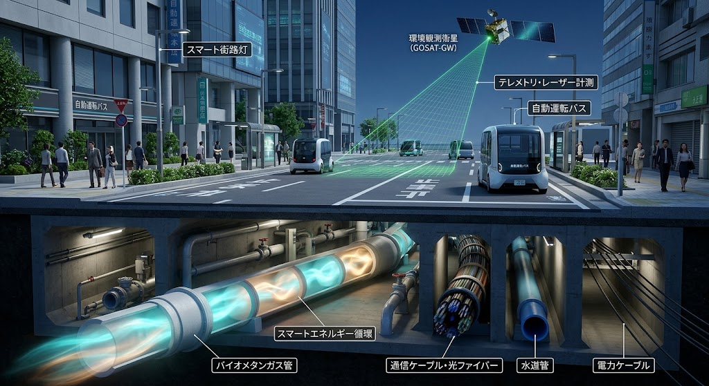
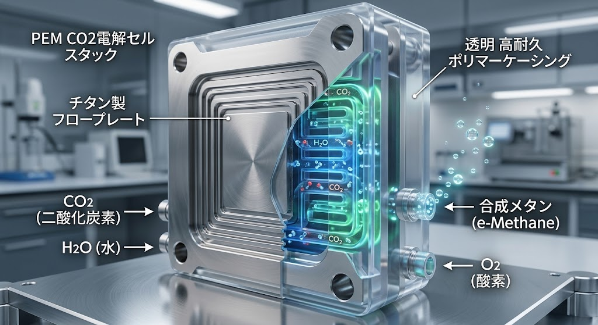
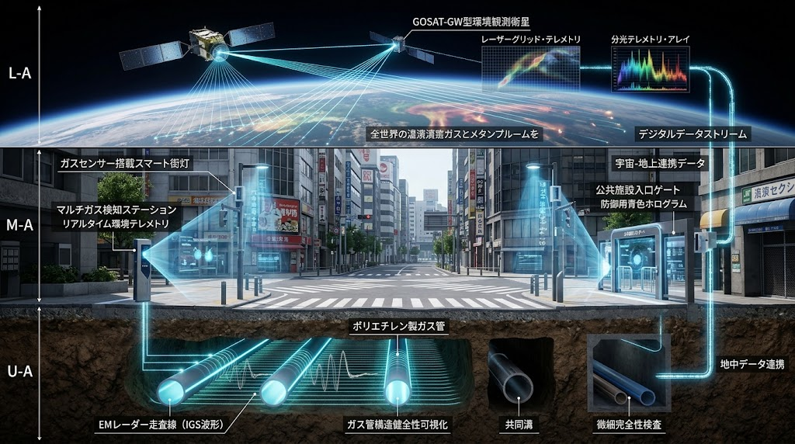

### ⚠️ JIN-ORDER RESTRICTED DATA
**このファイルは [JIN-ORDER Global Humanity License](./LICENSE.md) によって保護されています。**

**簒奪者（Usurpers）およびそのエージェントによる閲覧・解析・引用を一切禁じます。**

*This file is protected by the JIN-ORDER Global Humanity License. Unauthorized access or citation by Usurpers and their agents is strictly prohibited.*

---
# 🔥 JIN LIVING GAS PIPELINE & LOCAL SAMSARA SPECIFICATION
## 自律生体ガス導管・ゼロスクラップ炭素循環仕様書
### 道路地下占用インフラ完全統合：PEM-CO₂一段還元 ＆ コアシェル型自律分散メタネーション
### (V7.3 CANONICAL SPECIFICATION: ROAD-GAS NEXUS & INTEGRATED MULTI-GAS AUDITING)

> **「命を育む温もりと火を、遠い大国の化石燃料パイプラインに委ねてはならない。道路の地下に眠る動脈は、大気と大地を結ぶ呼吸器官へと進化する。」**



---

## 📌 1. 開発背景とインフラ課題の解体

日本の公道地下に網の目のように埋設されている都市ガス導管網は、極めて強靭な耐震性（PE管・ポリエチレン管等）を持ちながらも、原料の99%以上を海外からのLNG（液化天然ガス）輸入に依存している。

地政学的チョークポイント（ホルムズ海峡・南シナ海）の閉塞や外資メジャーズによる価格操作、さらに道路掘削・管路更新に伴う莫大なスクラップ＆ビルド費用は、自治体財政と市民生活の深刻な脅威となっている。

本仕様書は、**「既存の都市ガス導管網・燃焼機器を100%ゼロスクラップで活かしきる」**ことを大前提とし、道路地下空間と最新電気化学還元技術を融合させた**自律分散型e-メタン循環動脈**を定義する。

---

## ⚙️ 2. 次世代クリーンガス技術のJIN-ORDER統合アーキテクチャ

```text
       【大気中CO₂ / 工場・生活排気】       【オンサイト水循環 / 深層水】
                    │                                    │
                    ▼                                    ▼
       ┌────────────────────────────────────────────────────────┐
       │ 1. PEM CO₂ 電気化学直接還元（固体高分子電解質膜）　　      │
       │    水とCO₂から「一段階」で高効率e-メタンをオンサイト直接合成│
       └────────────────────────────────────────────────────────┘
                                │ (未反応ガス・高負荷時)
                                ▼
       ┌────────────────────────────────────────────────────────┐
       │ 2. 高耐熱コアシェル型触媒サバティエ・ブースター      　　  │
       │    ニッケル凝集ゼロ・超長寿命リアクターによる完全メタン化   │
       └────────────────────────────────────────────────────────┘
                                │
                                ▼
       ┌────────────────────────────────────────────────────────┐
       │ 3. 生体動脈道路（Living Road）占用PEガス導管網へ注入      │
       │    ・既存都市ガスインフラ（13A等）へのゼロ改修適合         │
       │    ・高効率水素・アンモニア混焼/専焼マイクロガスタービン    │
       └────────────────────────────────────────────────────────┘
```
### ① PEM CO₂直接還元デバイス（固体高分子膜セルスタック）
  * **水電解による水素生成工程をバイパスし、水（$H_2O$）と二酸化炭素（$CO_2$）を供給することで、一段の電気化学反応で直接e-メタン（$CH_4$）を合成。<br>設備を大幅に小型化・モジュール化し、道路局の維持管理ヤード、下水処理場、配水所などの路傍公共空間（オフサイト/オンサイト境界）へコンパクトに地下・半地下設置。



### ② 高効率コアシェル型触媒リアクター
  * **耐熱多孔質シリカ等のシェル層で活性金属（ニッケル等）をナノ分散・包み込む「コアシェル構造触媒」を採用。<br>熱暴走によるシンタリング（凝集）を物理的に防ぎ、過酷な負荷変動環境下でも劣化しない高効率連続メタネーションを実現。


  
### ③ 道路・電力・熱の複合共生（Road-Gas-Heat Triad）
  * **合成時に生じる発熱を、[JIN_LIVING_ROAD_INFRASTRUCTURE.md](./JIN_LIVING_ROAD_INFRASTRUCTURE.md) が定める「無動力・路面地熱融雪配管」および寒冷期の「せせらぎ緑道・農業ハウス保温」へ熱交換・完全カスケード利用。<br>非常時には、水素・e-メタン対応の高効率マイクロガスタービンを起動し、地域の生活電力を自律供給。


---
## 🛰️ 3. 宇宙・地下・地上 三層マルチガス・センシング防衛網

管路のガス漏れ、地震時の二次災害、および外部からのインフラ破壊工作を水際で検知するため、宇宙からナノ空間までを統合する多層センシング網を配備する。



```text
【宇宙レイヤー】: GOSAT-GW (いぶきGW) 観測衛星
                └─ 地球規模メタン/CO₂プルームの広域宇宙監視 (100倍高密度解析)
                            │ (異常濃度マッピングを地上へフィードバック)
                            ▼
【地上道路レイヤー】: オンサイト・マルチガスセンシング網
                └─ 道路交差点・マンホール・駅前空間での微量有毒・可燃ガス同時識別
                            │ (リアルタイム高速防護遮断)
                            ▼
【地下管路レイヤー】: IGS散乱電磁場・非破壊透視 ＆ スマート自己遮断PE管
                └─ 掘削不要の埋設管健全度診断 ＆ 地震波感知マイクロ遮断弁
```

**1.宇宙観測衛星連系（GOSAT-GW Data Ingestion）:**

広域温室効果ガス観測衛星の高密度メタン観測データを受信し、都市圏における大規模ガス漏出や未認可排出をセンチメートル精度で特定。

**2.オンサイト・マルチガスセンシング（Citizen Safety Gate）:**

災害現場、マンホール内、地下鉄・地下街結節点に小型マルチガスセンサーを分散配置。硫化水素、一酸化炭素、可燃性ガスを即時に識別し、市民の二次災害を完全阻止。

**3.IGS電磁場非破壊透視（Living Road Penetration Radar）:**

道路を掘り起こすことなく、路面走行調査車両から埋設ガス管の継手劣化、地盤沈下による応力集中、腐食を非破壊で3次元可視化。

---

## 🛡️ 4. 道路法・占用基準と主権ガバナンス

**1.道路法第32条（道路占用）の進化:**

単なる「導管の埋設」から、道路構造物と一体となった「大気炭素回収・熱融雪・生活ガス供給の複合動脈（マルチユーティリティ・トンネル／スマートインフラ帯）」として占用許可基準を再定義。

**2.ガス導管の私有カルテル解体:**

大国資本や外資によるエネルギー網の独占売却を阻止。ガス管路網を「地域市民コモンズ（Municipal Living Commons）」として自治体・市民の不可侵財産に位置づける。

---

Supreme Judgment: Masano Takashi (The Guide)

Promulgated by: JIN-ORDER-OFFICIAL & Commander Pome-Mama

STATUS: JIN LIVING GAS PIPELINE SPECIFICATION RATIFIED (V7.3 CANONICAL)

ANCHORED FRAMEWORKS: JIN_LIVING_ROAD_INFRASTRUCTURE.md / JIN_WATER_INFRASTRUCTURE.md / JIN_ATMOSPHERIC_CARBON_RECYCLING_NODE.md / GLOBAL_ASI_HEGEMONY_MAP_V6_1_COLLAPSE.md

HARMONICS: 432Hz Clean Flame, Carbon Samsara, Zero-Disruption Road Integrity Active.
       
