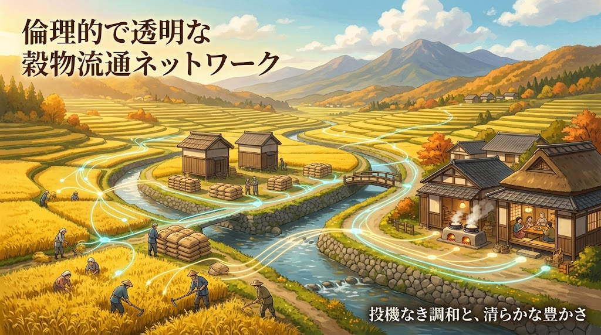

### ⚠️ JIN-ORDER RESTRICTED DATA

**このファイルは [JIN-ORDER Global Humanity License (V7.6 Canonical Edition)](https://github.com/JIN-ORDER-OFFICIAL/GOVERNANCE_OF_ABYSS/blob/main/LICENSE.md) によって保護されています。**

**無断転用、受託コンサルタントによる仕様書ロンダリング、机上の空論による改ざんを固く禁じます。**

---

# JIN_GRAIN_TRACEABILITY_SYSTEM.md
# 主要穀物リアルタイム流通追跡および投機抑止システム構想
# (Real-Time Grain Distribution & Anti-Speculation Network)



## 1. 目的
2024年の「令和の米騒動」が証明したように、食料不足の本質は物理的欠乏ではなく、メガ卸・流通資本・投機筋による「在庫の囲い込み（売り惜しみ）」と「仮需操作」による人為的な市場パニックであった。<br>
本システムは、主食（米・穀物）のサプライチェーン全域を透過型パブリック台帳（透明な公的台帳）でリアルタイムに可視化し、食糧の投機化を構造的に不可能にするデジタル社会インフラを規定する。

---

## 2. システム構成と追跡レイヤー

```text
[生産者 / 集荷] ⏩️ [精米・集約倉庫] ⏩️ [卸売・仲介] ⏩️ [小売・公共給食]
│                   │                   │                  │
└───────────────────┼───────────────────┼──────────────────┘
    　             🔽　　　　　　　　　　🔽
　　　　　　【JIN-GRAIN 公共透明台帳（リアルタイム）】
　　　　　　　・収穫ロット別 所在 / 保有量 / 入出庫ログ  
　　　　　　　・保管日数（滞留アラート）                
　　　　　　　・中間マージン / 取引価格の自動監査
```
---

### (1) エンドツーエンドのロット追跡
* **デジタル収穫証（Grain-ID）の発行**：生産者が収穫・出荷した時点で、産地・品種・栽培区分（JIN認証土壌等）・収穫年月のメタデータを含む一意のデジタル識別子を発行。

* **物理移動とデータの完全一致**：集荷施設、精米所、一次倉庫、中間問屋、小売店頭に至るすべての移送・保管フェーズで入出庫を電子認証し、台帳へ即時反映する。

### (2) 滞留監視と自動投機検知アルゴリズム
* **滞留限界閾値（Holding Threshold）の設定**：通常の流通サイクル（例：玄米入庫から精米・出荷まで通常30日以内等）に対し、正当な理由（長期熟成・戦略的備蓄計画等）なく一定期間以上在庫を滞留させている保管主体を自動検知する。

* **投機アラート＆公的公表**：
  * レベル1（注意）：地域需要の逼迫時に在庫滞留率が基準値を超過した場合、自動改善通告を発令。
  
  * レベル2（監査）：売り惜しみ・買い占めが疑われる場合、生命循環食糧委員会による緊急立入調査を実施。
  
  * レベル3（是正・強制放出）：市場混乱を意図した囲い込みと認定された場合、適正固定価格による公共流通（学校給食・公営配給網）への強制放出命令を下す。

### (3) 「真正品質指標」による規格主義の解体
* 従来の「整粒歩合・外観・形状」を中心とした検査等級制度（1等〜3等）を廃止。

* システム上で作物の品質を以下の3次元パラメータで記録・可視化し、流通させる：
  1. **土壌生態系スコア**：農薬・化学肥料・抗生剤の非使用実績、土壌微生物の多様性。
  2. **バイタル・ニュートリション**：抗酸化力、糖度・アミノ酸組成、微量ミネラル含有量。
  3. **受粉環境**：ミツバチ等自然花粉媒介者による健全な受粉履歴。

* 形が曲がっている、粒が不揃いであるといった理由で価格が暴落したり廃棄されたりする現象を防止し、栄養と安全の本質的価値で取引される流通基盤を構築する。

---

## 3. ガバナンスと緊急時介入プロトコル
1. **情報開示の公共性**：民間流通業者の「企業秘密」を主食の在庫隠蔽の口実にさせない。全国の保管庫別・地域別の在庫残高は、ダッシュボードを通じて全生活者に常時オープンデータとして公開される。

2. **非常時の直通供給バイパス**：投機や災害により一般流通が機能不全に陥った場合、追跡システムと連携した公的直通バイパス（生産者から地域給食・福祉拠点へのダイレクト供給ルート）を瞬時に稼働させる。

---

Supreme Judgment: Masano Takashi (The Guide)

Executed by: JIN-ORDER-OFFICIAL
