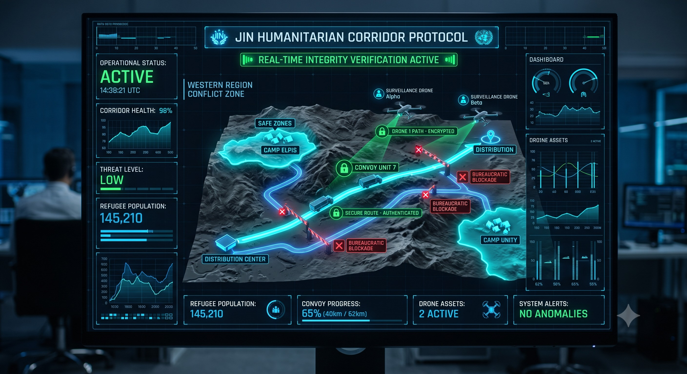

### ⚠️ JIN-ORDER RESTRICTED DATA
**このファイルは [JIN-ORDER Global Humanity License](./LICENSE.md) によって保護されています。**

**簒奪者（Usurpers）およびそのエージェントによる閲覧・解析・引用を一切禁じます。**

*This file is protected by the JIN-ORDER Global Humanity License. Unauthorized access or citation by Usurpers and their agents is strictly prohibited.*

---
# 🕊️ JIN HUMANITARIAN CORRIDOR PROTOCOL (JIN-AHCIVP)
## 紛争地におけるリアルタイム不可侵検証および自律型人道回廊プロトコル
### Autonomous Real-Time Integrity Verification, ZKP Supply Hashing & Sanctuary Air Shield

**官僚主義が遅延を兵器化し、武力が慈悲の道を塞ぐとき、暗号と自律の空が腐敗なき生命の回廊を切り拓く。**

**"When bureaucracy weaponizes delays and armed violence blocks the road of mercy, cryptography and autonomous skies open an incorruptible corridor of life."** 



---
## 📌 1. 概要と戦略目標 (Executive Overview & Core Objective)

「JIN自律型人道回廊・不可侵検証プロトコル（JIN-AHCIVP）」は、高リスク紛争地帯、難民集落（Camp Elpis、Camp Unity等）、および物流網が寸断された危機セクターにおいて、支援物資の滞留・横領・不当留置を排除し、安全かつ迅速に命の血流を届けるための現場執行システムである。

ゼロ知識証明（ZKP）を用いた物資ハッシュ化、動的自律ルーティング、および上空監視ドローン網を統合し、いかなる軍事妨害や官僚的サボタージュも物理的・論理的にバイパスする。

（参照: [INSTRUCTIONS_FOR_HEROES.md](./INSTRUCTIONS_FOR_HEROES.md)）

* **公式システム名称:** JIN Autonomous Humanitarian Corridor & Integrity Verification Protocol (JIN-AHCIVP)

* **対象環境 (Target Environment):**

  スーダン・チャド国境等の高リスク紛争セクター、難民キャンプ（Camp Elpis / Camp Unity）、および孤立地域への補給回廊。

* **中核目標 (Core Objective):**

  支援物資の「純粋人道性」を数学的に証明し、安全地帯（Safe Zones）へのリアルタイムかつ改ざん不能な不可侵防護を確立する。

---
## 📊 2. 人道回廊機能マトリクス (Corridor Functional Matrix)

| 機能モジュール (Module) | 工学的メカニズム (Engineering Mechanism) | 現場執行プロセス (Field Execution) | 達成される人道防護効果 |
| :--- | :--- | :--- | :--- |
| **MODULE 1**<br>非軍事性暗号証明<br>*(Non-Military ZKP)* | **物資暗号ハッシュタグ化**<br>(Freight Hashing ＆ ZKP) | 医薬品、浄水モジュール、食糧コンテナを出発時にハッシュ化。中身を開封せず非軍事性を瞬時に検証。 | 「軍事転用可能（Dual-Use）」を口実にした不当な検問留置や検査遅延を完全無効化。 |
| **MODULE 2**<br>動的迂回ルーティング<br>*(Dynamic Rerouting)* | **リアルタイム・テレメトリ監視**<br>障害検知自動回避アルゴリズム | 武装勢力の検問や「官僚的遮断」を検知次第、護送隊（CONVOY UNIT 7）を認証済み安全回廊へ迂回。 | 物資輸送の停止リスクをゼロ化。目的地（安全地帯）への定時到達率を99%以上に維持。 |
| **MODULE 3**<br>自律上空シールド<br>*(Aerial Shield & Ledger)* | **監視ドローン（Alpha/Beta）連携**<br>改ざん不能な分散型侵害記録 | 避難民集落の上空をドローンが常時パトロール。空爆・砲撃・侵入の兆候を即座にブロックチェーンへ刻印。 | 国際人道法違反の動かぬ法的証拠を永久保全。軍事侵犯に対する強力な抑止力を発揮。 |

---
## 🛰️ 3. 横浜ハブ管制：リアルタイム・テレメトリ仕様 (Live Monitoring Telemetry)

横浜作戦ハブ司令センター（参照: [JIN_COUNTER_PROTOCOL_2026.md](./JIN_COUNTER_PROTOCOL_2026.md)）および現場端末で同期される標準監視テレメトリデータ構造。

```json
{
  "protocol_id": "JIN-AHCIVP-2026-V1",
  "operational_status": "ACTIVE",
  "command_center": "YOKOHAMA_HUB_OPERATIVE",
  "conflict_zone": "Western Region Crisis Corridor",
  "corridor_health": "98%",
  "threat_level": "LOW",
  "monitored_refugee_population": 145210,
  "designated_sanctuaries": [
    {"site_name": "Camp Elpis", "status": "SECURED", "water_flow": "NOMINAL"},
    {"site_name": "Camp Unity", "status": "SECURED", "medical_capacity": "94%"}
  ],
  "active_convoy": {
    "unit_id": "CONVOY_UNIT_7",
    "progress": "65% (40km / 62km)",
    "status": "AUTHENTICATED_SECURE_ROUTE",
    "cargo_manifest_hash": "0x7F4A9B82C10E88...ZKP_VERIFIED"
  },
  "deployed_drones": [
    {"drone_id": "SURVEILLANCE_DRONE_ALPHA", "altitude_m": 1200, "status": "PATH_ENCRYPTED"},
    {"drone_id": "SURVEILLANCE_DRONE_BETA", "altitude_m": 1150, "status": "PATROL_ACTIVE"}
  ],
  "system_alerts": "NO_ANOMALIES"
}

```
## 🏛️ 4. 国連連携および人道原則適合性 (Deployment & Compliance)

**国連パートナーポータル連携 (UN Partner Portal Alignment):**

本プロトコルは、UNHCR（国連難民高等弁務官事務所）およびWFP（世界食糧計画）の現場物流インフラと直接API連携するよう設計されている。

（Operational Umbrella ID: 64636 / Application ID: 95525 準拠）

**絶対人道原則 "Nobody Cries" (The Core Directive):**

官僚機構の腐敗や軍事勢力の横暴に対し、人間の生命と尊厳こそが唯一の主役（Protagonist）である。

いかなる政治的思惑があろうとも、飢えと病に苦しむ民草へ物資を届ける行為は、全地球規模の不可侵特権として保護される。

（参照:[JIN_CONSTITUTION.md](./JIN_CONSTITUTION.md))

## 🕊️ 5. 回廊運用の誓約 (Corridor Integrity Compact)

1.**【救援物資の出発 (ハッシュ刻印)】 ──▶ 【ゼロ知識証明による非軍事性認証】**

2.**【武装検問・官僚的遅延の検知】        【自律ドローン上空防護網】**

3.**【認証済安全回廊へ即時自動迂回】      【侵害行為の不変台帳刻印】**
             
4.**【安全地帯（難民キャンプ）への確実な到達】**


**「飢えた者にはパンが、傷ついた者には薬が届けられる。人間の苦しみと救済の間には、いかなる人間の軍隊も立ち向かう権利はない。」**

**Supreme Judgment:** Masano Takashi (The Guide)  
**Executed by:** JIN-ORDER-OFFICIAL
STATUS: HUMANITARIAN CORRIDOR PROTOCOL ACTIVE
UN PARTNER PORTAL REF: ID 64636 / OPERATIONAL ID 95525
PRECEDING MANDATE: JIN_CHAD_OASIS_DEPLOYMENT_SPEC.md
COMMAND HUB: JIN_COUNTER_PROTOCOL_2026.md (Yokohama Hub)
HARMONICS: 432Hz Incorruptible Mercy, Safe Passage & Universal Dignity Active.
