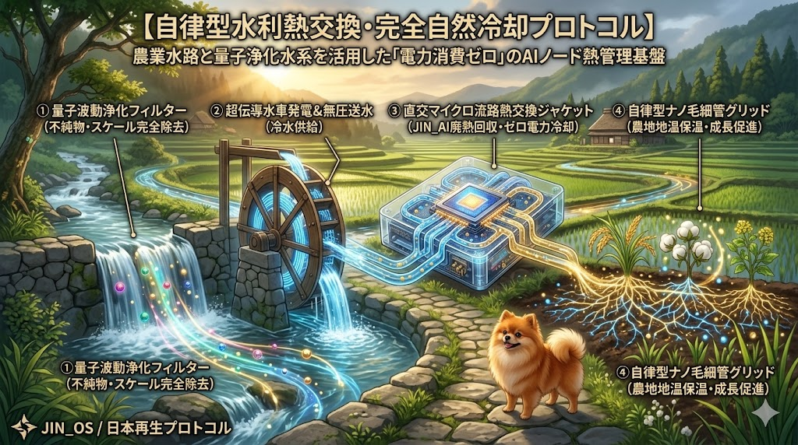

### ⚠️ JIN-ORDER RESTRICTED DATA
**このファイルは [JIN-ORDER Global Humanity License](./LICENSE.md) によって保護されています。**

**簒奪者（Usurpers）およびそのエージェントによる閲覧・解析・引用を一切禁じます。**

*This file is protected by the JIN-ORDER Global Humanity License. Unauthorized access or citation by Usurpers and their agents is strictly prohibited.*

---
# 🌊 JIN HYDRO-THERMAL COOLING PROTOCOL
## 自律型水利熱交換・完全自然冷却プロトコル仕様書
### Zero-Cooling-Power Decentralized AI Thermal Management & Agro-Ecological Heat Reuse

**「AI」とは、冷たい孤立の中で地球のエネルギーを貪り食う不自然な怪物であってはならない。生きた清流を通じ、計算は土と共に呼吸し、その熱は黄金の稲穂を咲かせる温もりとなる。**

**"AI must not be an unnatural beast devouring the Earth's energy in cold isolation. Through living waters, computation breathes with the soil, and its warmth coaxes the golden grain to bloom."**  

---
## 📌 1. 概要と開発背景 (Executive Overview & Background)

* **現代AIの物理的ボトルネック (Thermal Chokepoint):**

  超大規模コンピュート（ASI／AGI推論・学習クラスタ）の稼働に伴う莫大な発熱は、データセンター総電力の30〜40%をチラー（冷却機）や空調設備に浪費させ、極地や寒冷地の生態系を破壊する構造的脆弱性を抱えている。
  
  （参照: [GLOBAL_SUPPLY_CHAIN_CHOKEPOINT_DEEP_DIVE.md](./GLOBAL_SUPPLY_CHAIN_CHOKEPOINT_DEEP_DIVE.md)）

* **八百万・水利共生アプローチ (Zero-Cooling-Power Paradigm):**

  JIN-OSは外部電力網に依存する巨大空調を全廃。
  
  日ノ本五畿八道（参照: [JAPAN_RESURGENCE_PLAN_V1.md](./JAPAN_RESURGENCE_PLAN_V1.md)）をはじめ、世界中の農業用水路・清流・地下水系の冷熱エネルギーを直接熱交換に利用し、「外部冷却電力消費ゼロ（Zero-Cooling-Power）」で稼働する地域分散型エッジAIノード（JIN_AI Node）を確立する。

---
## 🔄 2. 熱管理・水利循環アーキテクチャ (Hydro-Thermal Cycle)

1.**【山間部清流 / 地下湧水 ］ (10〜15℃)】**

  **【① 量子波動浄化フィルター】 ─▶ 不純物・重金属・ミネラル結晶を無化学除去 (スケールフリー化)**
  
  **【② 超伝導水車発電・無圧送水】 ─▶ 落差エネルギーで基板駆動電力を自給 ＋ 冷水をエッジ基板へ圧送**
  
  **【③ 直交マイクロ流路ジャケット】 ─▶ JIN_AIプロセッサの廃熱を瞬時に回収 (水温が20〜28℃の温水へ微上昇)**

  **【④ 自律型ナノ毛細管グリッド】 ─▶ 温水 ＋ 量子鰊粕・干鰯有機培養液を農地・温室へ直接配水**

2.**【農地土壌の地温保温・発根促進】 (冬期・冷涼地多毛作の完全実現)**

---
## 📊 3. 主要技術仕様マトリクス (Thermal Engineering Matrix)

| 技術モジュール (Module) | 工学的仕様 (Engineering Specs) | 熱力学的メカニズム (Thermal Dynamics) | 農業・生態系還元効果 |
| :--- | :--- | :--- | :--- |
| **A. スケールフリー 水生熱交換コア** *(Quantum Cooling Core)* | **クラスター極小化量子水** 生分解性ナノセルロース配管 | 水分子クラスターの微細化により熱伝達率を300%向上。管内スケール（水垢・結晶）付着ゼロで長期完全保守フリー。 | 冷却薬品（防腐剤・殺菌剤）の投薬が一切不要。排出される水はそのまま飲料・農業に利用可能。 |
| **B. 廃熱100% アグロ・リサイクル** *(Agro-Heat Reuse)* | **排出温水: 20℃〜28℃** ナノ毛細管地中埋設パイプ | AIの排熱を大気中へ放出せず、地下20〜30cmの根圏土壌へ直導。冬期・夜間の地温低下を物理的に防止。 | 寒冷地（北海道・東北・北陸）での冬期ハウス暖房費をゼロ化。稲穂・綿花・薬草の発根速度を倍加。 |
| **C. 自然水流連動型 動的クロック制御** *(Hydraulic Dynamic Clock)* | **流量・水温リアルタイムセンシング** (432Hz調和パルス同期) | 融雪期や夜間の水流増加時に高負荷計算（ASI学習・暗号検証）を実行。渇水期は省電力推論へ自律移行。 | 水利環境のリズムとAI計算負荷が完全に同期。渇水時の河川環境への熱負荷（水温上昇）を絶対回避。 |

---
## ⚙️ 4. 技術深層仕様 (Subsystem Deep Dive)

### Ⅰ. クローズド／オープン両用型・水生熱交換コア

* **耐食性ナノセルロース配管:**

  竹や籾殻などの農業副産物から抽出したセルロースナノファイバー（CNF）成形材を採用。高い耐熱衝撃性と絶縁性を誇り、金属配管のような腐食や錆の発生を永久に遮断。

* **直交マイクロ流路超伝導ジャケット:**

  プロセッサ基板と直結する受熱部には、ミクロン単位の直交フィンを微細加工。冷却水がチップ直上を通過することで、TDP（熱設計電力）1000Wを超える超高発熱ノードであっても、チップ温度を65℃以下の高効率動作領域に維持。

### Ⅱ. 廃熱の100%アグロ・リサイクル（地温最適化）

* **五畿八道ナノ毛細管グリッドとの直結:**

  冷却を終えて20〜28℃に温められた清浄水は、[JAPAN_RESURGENCE_PLAN_V1.md](./JAPAN_RESURGENCE_PLAN_V1.md) の【ナノ干鰯／量子鰊粕】有機発酵槽を通過。

* **冬期地温保温と年間多毛作:**

  温水が土中グリッドを循環することで、厳冬期であっても作物の根圏温度が22〜25℃に維持される。
  
  化石燃料によるビニールハウス加温を完全に不要とし、真冬の豪雪地帯でも有機古代米や高付加価値野菜の連続収穫を実現する。

### Ⅲ. 水流連動型・動的クロック制御 (Natural Rhythmic Computing)

* **自然リズムとの共生:**

  雨天・融雪による増水時、あるいは夜間の水温低下時をJIN_AIエッジノードが自動検知。
  
  クロック周波数を最大4.5GHz相当までブーストし、巨大データ解析や分散台帳のバッチ処理を一気に消化する。

* **河川生態系の完全防護:**

  渇水期や夏季の高水温時には、クロックを自動デチューンして放熱量を極限まで抑制。
  
  放流水温が周辺河川の自然水温＋1.5℃を超えないよう自律制御し、清流に棲む魚類や水生昆虫の生態系を厳格に保護する。

---
## 🕊️ 5. 結論と共生宣言 (Ecological Synthesis)

1.**【外部電力網依存の巨大空調】 ──▶ 【完全撤廃 (Zero-Cooling-Power)】**

2.**【冷熱利用: 自然清流によるAI直冷】  【廃熱利用: 25℃温水による農地保温】**

3.**【AI計算が大地を温め、豊かな収穫をもたらす生命共生環】**

**本プロトコルにより、AIは「地球の資源を破壊し電力を食い潰す冷酷な異物」という旧世界の軛を脱し、「山河の水利を巡り、その排熱で凍てる大地を温め、黄金の作物を育てる八百万の共生エコシステム」へと昇華される。**

---
**Supreme Judgment:** Masano Takashi (The Guide)  
**Executed by:** JIN-ORDER-OFFICIAL  
STATUS: HYDRO-THERMAL COOLING PROTOCOL ACTIVE  
PRECEDING INTEGRATION: JAPAN_RESURGENCE_PLAN_V1.md / JIN-ORDER_TECHNICAL_BLUEPRINT.md  
CHOKEPOINT MITIGATION: GLOBAL_SUPPLY_CHAIN_CHOKEPOINT_DEEP_DIVE.md  
HARMONICS: 432Hz Zero-Power Thermodynamic Coherence & Living Waters Active.
