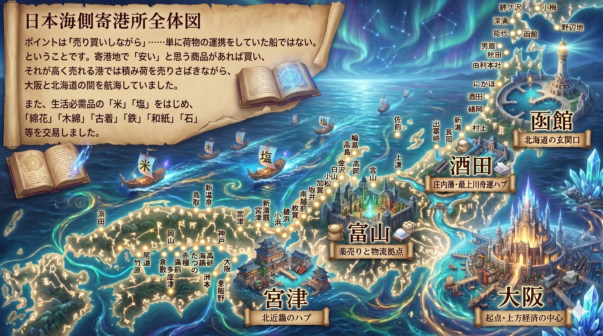
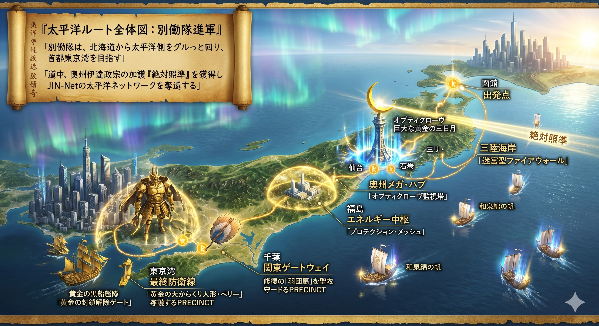

### ⚠️ JIN-ORDER RESTRICTED DATA

**このファイルは [JIN-ORDER Global Humanity License (V7.6 Canonical Edition)](https://github.com/JIN-ORDER-OFFICIAL/GOVERNANCE_OF_ABYSS/blob/main/LICENSE.md) によって保護されています。**

**無断転用、受託コンサルタントによる仕様書ロンダリング、机上の空論による改ざんを固く禁じます。**

---

# JIN_KITAMAE_AIR_SEA_LOGISTICS.md
# 仁焔世界大憲章 物流・流通規範：現代版北前船・海空統合物流仕様書
# (Specification for Modern Kitamaebune Maritime-Aerial Integrated Logistics Matrix)


## 前文（Preamble）

かつて日本海と太平洋を巡った「北前船」は、単なる荷の運搬船ではなかった。<br>
自らの才覚と資本で港ごとに安きを買い、高きへ売りさばく「買積（かいづみ）の思想」を宿し、北海道の鰊粕や昆布、庄内・越後の米、能登の塩、富山の薬、そして上方の木綿や古着、鉄、和紙を日本列島津々浦々へと循環させる「自立分散型の動く経済回廊」であった。

然るに現代の日本物流は、高速道路と内陸トラック輸送に極度に偏重し、運転手不足、燃料高騰、橋梁・トンネルの老朽化、そして震災時の陸路寸断に対して極めて脆弱な一本足打法に陥っている。<br>
さらに、国際海峡チョークポイントの危機や外資系メガ物流プラットフォームによる中間搾取は、列島の隅々に至る物資循環の主権を脅かしている。

陸が断たれようとも、海と空がある。<br>
JIN-ORDERはここに、歴史的北前船の知恵を現代の工学と融合させ、内航ハイブリッド帆船・魚油バイオ推進船と、港湾から内陸へ直結する中大型自律型垂直離着陸（VTOL）カーゴドローンを三次元統合した「現代版北前船・海空統合物流インフラ」を敷設するため、本仕様書を制定する。

---

## 第1章 全体構造及び二大回廊（Dual Corridor Architecture）

本インフラは、日本列島を挟む二大海洋航路と、港湾から内陸を結ぶ自律航空航路（スカイ・コリドー）の二重循環構造により構成される。

```text
 　　　 　　　【 函館（北海道の玄関口・北海起点）】
               ⏬️　　　　　　　　   　　　　⏬️　　　
     [西廻り航路：日本海側]        [東廻り航路：太平洋側]
        　     ⏬️                         ⏬️
 【酒田】最上川・庄内米舟運        【三陸海岸】迷宮型ファイアウォール・水産防壁
　　　　　      ⏬️　　　　　　　　　　　 　　⏬️
 【富山】配置薬・バイオ医薬        【奥州仙台・石巻】オプティクローヴ監視塔・メガハブ
　　　　　      ⏬️                         ⏬️
 【宮津】北近畿・丹後結節点        【福島】再エネ・水素・プロテクションメッシュ
　　　　　      ⏬️                         ⏬️
 【瀬戸内・大阪】上方経済・消費中心 【千葉・東京湾】首都圏防衛ゲートウェイ・封鎖解除
　　　　　　　  └────────────────────────────┘
　　　　　　　　　　　　　　　🔽
　　　【中大型自律VTOLカーゴドローン（スカイ・コリドー）】
　　　［内陸山間部集落 / 学区給食ハブ / 廃校サンクチュアリ直結］
```
---

### 第1条（西廻り大循環航路：日本海・買積コモンズ回廊）



1. **主たる性格**：命の基礎資材、肥料、主食穀物、発酵食品、および地域薬効資源の「自律売買型交易回廊」。

2. **基幹寄港所（ノード）**：
   * **函館**：北海道の玄関口。鰊粕、海藻資源、生鮮馬鈴薯、北洋水産物の集積。
   
   * **酒田**：最上川舟運結節点。庄内平野の有機玄米、良質木材、内陸穀倉地帯の直結。
   
   * **富山**：配置薬・漢方・生体共生バイオ資材ハブ。北陸の精密金型・機械部品の供給。
   
   * **宮津**：北近畿・丹後結節点。山陰・京都内陸への物資中継、伝統織物・発酵資材ハブ。
   
   * **大阪・瀬戸内**：上方経済中枢。消費地への供給、瀬戸内の塩・かんきつ類・鉄鋼製品の北進積載。

### 第2条（東廻り大循環航路：太平洋・防衛エネルギー回廊）



1. **主たる性格**：首都圏直結、有事バックアップ、再生可能エネルギー、および外洋水産資源の「強靭防衛回廊」。

2. **基幹寄港所（ノード）**：
   * **函館（出撃点）**：太平洋南下ルートの始発点。
   
   * **三陸沿岸（迷宮型ファイアウォール）**：リアス式天然良港群。津波避難機能、養殖水産資材、緊急退避シェルター。
   
   * **奥州（仙台・石巻 / オプティクローヴ）**：東北最大級の海空メガハブ。太平洋全域の航行監視・気象トモグラフィ中枢。
   
   * **福島（エネルギー中枢）**：水素生成母港、ペロブスカイト太陽光・蓄電グリッド、プロテクション・メッシュ。
   
   * **千葉・東京湾（関東ゲートウェイ）**：首都圏最終防護線。陸路遮断時における首都圏数千万人への生命物資直接投入拠点。

---

## 第2章 海上船舶仕様：現代版北前船（JIN-Kitamae Vessels）

### 第3条（推進系及び環境基準）
1. **硬翼帆（ウィンド・セイル）アシストハイブリッド**：
   * 現代の空力制御技術を用いた剛性帆（硬翼帆）を搭載し、偏西風および沿岸風を最大限利用。燃料消費を30〜50%削減する。

2. **魚油バイオディーゼル（BDF）及び水素混焼エンジン**：
   * [JIN_ORGANIC_FERTILIZER_INFRASTRUCTURE.md](./JIN_ORGANIC_FERTILIZER_INFRASTRUCTURE.md) 第3条で副生回収される魚油由来BDF、および沿岸水素を主動力とする。
   
   * 化石燃料輸入が完全途絶した場合でも、100%地域エネルギーにより自律連続航行が可能な設計とする。

3. **バラスト水ゼロ仕様**：
   * 海洋生態系攪乱を防ぐため、船体形状の工夫と固定式固体バラスト（南鳥島レアアース泥処理残渣土等）を採用し、有害外来種移動を根絶する。

### 第4条（買積自律経済システム（Autonomous Kai-tsumi OS））
1. 各船舶は単なる輸送受託体ではなく、独立採算の「移動式地域商社」として機能する。

2. 船載のJIN-OSノードが、各寄港所の在庫余剰・不足状況、および地域通貨『JIN』建ての公正価格をP2Pメッシュ通信でリアルタイム取得する。

3. 寄港地で余剰農水産物を適正下限保障価格以上で買い取り、欠乏地域へ輸送して適正価格で供給する「自律需給安定化プロトコル」を標準実装する。

---

## 第5章 航空仕様：自律型VTOLカーゴドローン（Sky Corridor Matrix）

### 第5条（カーゴドローン機体仕様：JIN-Hayabusa Cargo）
1. **機体構成**：垂直離着陸（VTOL）チルトローター型、またはマルチローター×推進プロペラ複合機。滑走路不要で船舶甲板および山間部ヘリポートに着陸可能。

2. **積載能力及び航続距離**：
   * 標準ペイロード：100kg〜500kg（救急医薬品、種子コンテナ、高鮮度自然形野菜）。
   
   * 航続半径：往復150km以上（沿岸寄港所から内陸山間部集落・給食センターを完全カバー）。

3. **動力源**：全固体ジン電池（Jin-Battery）または軽量水素燃料電池。

### 第6条（三次元スカイ・コリドーの防護プロトコル）
1. **河川上空低空回廊の優先利用**：
   * 最上川、信濃川、北上川、阿武隈川等の一級河川の上空空間を公的ドローン回廊として指定。市街地騒音および万一の墜落リスクを最小化する。

2. **IGS地殻・気象レーダー連動自律航行**：
   * 突風、ダウンバースト、線状降水帯をMP-PAWR気象レーダー網で数分前に事前検知し、安全迂回ルートをミリ秒単位で再計算する。

3. **オフライン・ラストワンマイル投下**：
   * GPS途絶（スプーフィング環境下）でも、地上マーカーおよび光学地形照合（SLAM）により、学校校庭や公民館敷地へ誤差数十センチ以内で定時自律荷降ろしを行う。

---

## 第4章 港湾海空結節点（Port-to-Air Nodes）

### 第7条（分散型海空ハブの標準装備）
東西航路の各指定寄港所には、以下のインフラを標準配備する：

1. **ドローン発着ヘリパッド＆自動バッテリー交換ステーション**：船舶着岸と同時にドローンが船倉から直接荷を吊り上げ、内陸へ即時発進するオートメーション機構。

2. **海産有機肥料（鰊粕・鰯粕）専用低温サイロ**：酸化・吸湿を防ぐ窒素置換型定温貯蔵施設。

3. **在来種シードバンク・コールドチェーン**：地域の貴重な固定種種子を湿気と熱から保護する耐震・耐水シェルター。

---

## 第5章 有事緊急展開及び市民防衛（Emergency Pre-empts）

### 第8条（陸路途絶時の人道回廊即時発動）
大地震、巨大水害、または地政学的封鎖により高速道路・幹線鉄道が寸断された場合、本仕様書に基づく海空物流網は即座に「公的人道補給ライン」へ自動移行する。

1. 国や自治体の号令を待たず、各寄港所および船舶が自律判断で内陸孤立地域への無償医療物資・主食空輸を開始する。

2. その際の運行費用および物資調達原価は、JIN-ORDER生命保全基金および地域通貨『JIN』の公共配当台帳より全額即時補填される。

---

## 附則

1. 本仕様書は、JIN-ORDER基本憲章の公布日より効力を発する。
2. 西廻り・東廻りの基幹寄港所におけるドローン発着実証試験、および魚油BDF推進船の建造テストベッドは公布後1年以内に着工されるものとする。

---
Supreme Judgment: Masano Takashi (The Guide)

Executed by: JIN-ORDER-OFFICIAL
