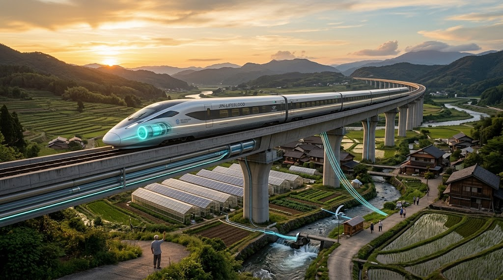

### ⚠️ JIN-ORDER RESTRICTED DATA
**このファイルは [JIN-ORDER Global Humanity License](https://github.com/JIN-ORDER-OFFICIAL/GOVERNANCE_OF_ABYSS/blob/main/LICENSE.md) によって保護されています。**

**資源略奪、中央集権的交通独占、および化石燃料カルテルによる閲覧・解析・引用を一切禁じます。**

---

# 🚄 JIN-LIFEBLOOD EXPRESS SPECIFICATION
## 次世代水素・高温超伝導自律動脈交通網 仕様書
### Superconducting Maglev Arteries, Photosynthetic Rail, IGS Subsurface Scanning & Carbon-Negative Mobility
### (V2.0 CANONICAL UPDATE: LIVING ARTERY & SUBSURFACE DIAGNOSTIC INTEGRATION)



**「ただ大地から資源を奪う時代は終わった。動脈が巡り、息吹を運び、走るほどに大気と大地を癒やし、すべての集落に命の血潮を届けよ。」**

**"The era of merely stripping the earth of its resources has ended. Let the arteries circulate, carrying the breath of renewal, healing the sky and earth with every mile, delivering lifeblood to every secluded haven."**

---

## 🧭 1. 開発背景とインフラ反転思想 (Philosophical Blueprint)


19世紀以来の鉄道・高速道路網は、地方から中央都市へ「労働力・資源・富」を一極集中で吸い上げる「収奪のパイプライン」として機能してきた。<br>また、過疎地における既存在来線の相次ぐ廃線と、化石燃料依存の物流網は、有事・災害時の脆弱性を露呈している。

本仕様書が定義する「Lifeblood Express（動脈特急）」は、従来の交通機関の枠組みを根底から反転させる。  
列車を単なる移動手段ではなく、**「移動する水素・電力貯蔵プラント」「光合成による大気浄化・酸素供給帯」「走行型・非破壊地盤透視（IGS）ノード」「分散型物流・医療動脈」**として再定義し、地方の自律複合拠点（サンクチュアリ・ハブ）同士を瞬時に結ぶ生命線として機能させる。

---

## ⚡ 2. 5大中核工学アーキテクチャ (Core Technological Pillars)


```text
【超伝導軌道 ＆ 光合成レール】(全線送電網 ＋ 藻類バイオフィルムCO2固定)
       ▲ (ピン止め浮上・ゼロ摩擦走行 / 非破壊IGS地下透視)
【JIN-Lifeblood Express 編成】
 ・先頭部：大気吸入光触媒エアスクラバー（走行風浄化・高純度酸素排出）
 ・中間部：高温超伝導推進 ＆ 液体水素冷熱カスケード冷凍
 ・後尾部：自律型人道コンテナ ＆ 医療ノード ＆ 電力融通端局
       ▼ (走行と同時に沿線ハブへ水素・電力・冷熱・地盤診断データを分配)
【液体水素・飲用水バイパス並設軌道】
```

### Ⅰ. 高温超伝導磁気浮上 ＆ 動脈送電鉄道網（HTS Maglev & Power Grid）

ゼロ抵抗推進: イットリウム系（YBCO）高温超伝導体を搭載し、磁気浮上軌道上で完全非接触・ゼロ摩擦走行を実現。

  * 動脈送電グリッド機能（電力供給鉄道網）: 軌道敷自体が超伝導直流送電線として機能。編成の回生制動エネルギーを100%回収するだけでなく、沿線の水力・太陽光発電所で産生した余剰電力を超伝導ロスゼロで遠隔集落やマイクログリッドへ瞬時に融通。

  * 低軌道保守性: 摩耗部品が存在しないため、従来の鉄輪式鉄道に比べて軌道・車輪のメンテナンスコストを90%削減。

### Ⅱ. 液体水素・有機ハイドライドハイブリッド推進系

【二重エネルギーキャリア設計】:

  * 幹線高速走行（極低温）: マイナス253℃の液体水素を用いた大容量燃料電池および超電導電磁推進。

  * 支線・地域バス（常温常圧）: トルエンと結合させた有機ハイドライド（MCH: メチルシクロヘキサン）により、常温の既存タンク・配管で安全輸送・給油。

  * 冷熱エネルギーカスケード利用: 液体水素を気化させる際に生じる強大な「冷熱（Cryogenic Energy）」を車内の超急速冷凍コンテナや、沿線の生体保管庫・食糧サイロの保冷へ無電力で活用。

### Ⅲ. 光合成レール・バイオ固定軌道敷（Photosynthetic Rail System）

  * 藻類・光触媒バイオフィルム層: 軌道スラブおよびバラスト路盤表面に、耐候性微細藻類と保水性天然ゲルからなるバイオフィルムを定着。

  * 二酸化炭素固定と酸素放出: 列車通過時の微気圧波と日光を活用して光合成を活性化。鉄道敷地全体が「走る巨大な森」として機能し、年間数万トン規模の炭素固定を実行。

  * 表面温度抑制: 都市部および高架区間におけるヒートアイランド現象を緩和し、熱歪みによる軌道劣化を抑制。

### Ⅳ. 非破壊IGS地盤透視システム（Intelligent Ground Sensing）

  * 台車下部マルチスペクトル地中レーダー: 車両下部に超広帯域ミリ波・量子重力傾斜計を一体化した「非破壊IGSスキャナー」を標準配備。

  * 走行型・全土リアルタイム診断: 最高速度で走行しながら、軌道直下および沿線地下30mまでの「地下水脈の流向」「地盤空洞化」「活断層の歪み」「盛土の水分飽和度」をミリ単位で3Dマッピング。

  * インフラ予防保全コモンズ: 収集データは即座にオープン台帳へ共有され、土砂崩れや陥没事故を未然に察知・自動警報。走るだけで国土インフラの定期健康診断を完了させる。

### Ⅴ. 酸素排出生体モビリティ（Carbon-Negative Scrubber Body）

大気吸入型エアスクラバー先頭形状: 流線型先頭ノーズに高速走行風を取り込む大容量インテークを配置。

  * PM2.5・NOxの常温無害化: 内部の可視光型光触媒と天然セルロースフィルターにより、大気中の粉塵、マイクロプラスチック、窒素酸化物を吸着・分解。

  * クリーン酸素ブロー排出: 燃料電池の副生成物である純水ミストとともに、高純度酸素を含んだ清浄空気を後方へ排出。走れば走るほど沿線の大気環境を浄化する。

---

## 🗺️ 3. 運行システム ＆ 分散モビリティ結合 (Multi-Modal Operation)

広域特急と、地域コミュニティEV [JIN_BIO_SYMBIOTIC_EV.md]（./JIN_BIO_SYMBIOTIC_EV.md）および地域拠点 [JIN_SANCTUARY_COMMONS_SPEC.md](./JIN_SANCTUARY_COMMONS_SPEC.md)をシームレスに結合する。

| 階層 (Tier) | 輸送モード | 運行主体・役割 | 動力源・付加価値 |
| :--- | :--- | :---: | :--- |
| **幹線動脈 (Artery)** | **Lifeblood Express (超伝導リニア)**<br><br>最高時速 500km/h（都市間・ハブ間直結） | JIN-ORDER 交通ギルド<br><br>長距離貨物・救護・人員高速搬送 | 液体水素燃料電池＋高温超伝導浮上<br><br>【動脈送電 ＆ IGS地盤診断 ＆ 酸素排出】 |
| **地域支線 (Vein)** | **自律型水素ハイブリッド軌道車**<br><br>既存の廃線・過疎ローカル線を再利用 | 地域コモンズ組合<br><br>サンクチュアリ間の生活・通学輸送 | 常温MCH燃料電池＋架線レス蓄電走行<br><br>【光合成軌道 ＆ 冷熱食品保冷輸送】 |
| **毛細血管 (Capillary)** | **生体共生EV（JIN-Bio EV / JIN-Loop）**<br><br>廃校拠点〜各集落・空き家サテライト | 住民自治・マイスター教育院<br><br>戸口送迎・朝市集荷・見守り | 路面走行給電＋植物性CNFバイオボディ<br><br>（[`JIN_LIVING_ROAD_INFRASTRUCTURE.md`](./JIN_LIVING_ROAD_INFRASTRUCTURE.md) 完全連動） |

---

## 🌍 4. グローバルサウス ＆ ユーラシア展開プロトコル (Global Implementation)

本仕様書は、日本列島の地方創生のみならず、資源略奪に苦しんできたグローバルサウス全域を自立させるための「跳躍型（リープフロッグ）インフラ」として設計されている。

**【アフリカ横断・資源主権動脈（Trans-African Lifeblood Arc）】:**

  * コンゴ（キンシャサ）の低環境負荷レアメタル精錬所、エチオピア（アディスアベバ）の完全自動農場、南スーダン（ジュバ）の量子水利拠点を結ぶ。

  * 宗主国に資源を運び出すためだけの港湾連絡鉄道を解体し、アフリカ大陸内部を相互に循環・潤す「民のための鉄道」へと塗り替える。

  * サヘル砂漠化地帯において、IGS地盤透視による深層地下水脈の探査と、光合成レールによる緑化帯形成を同時に遂行。

**【ユーラシア・極東水素回廊】:**

  * ロシア極東・サハリンの豊富な天然ガスから熱分解（メタン熱分解技術・ターコイズ水素）によってCO2を出さずに固体炭素と水素を分離。

  * 超伝導軌道を通じて東アジア・ASEANへと水素エネルギーと電力を直接循環させる。

---

## 📜 5. 交通主権憲章 (Sovereign Mobility Charter)

移動の尊厳の原則:

  * 移動する権利は生存の権利である。過疎、採算性、赤字を口実にした公共交通の切り捨てを禁じ、すべての集落に最低限の自律移動インフラを保証する。

大気・大地癒合の義務（Living Infrastructure Mandate）:

  * 交通インフラは環境負荷を「最小化」するにとどまらず、走行を通じて大気を浄化し（酸素排出）、大地を診断し（IGS透視）、生態系を豊かに（光合成レール）する「環境再生型（Regenerative）」でなければならない。

脱化石・脱カルテル宣言:

  * 国際メジャーが価格を操る石油・天然ガスの利権構造から脱却し、地域で産生した水と太陽からなる水素により、永久自律の交通網を維持する。

無償人道物流の優先:

  * 震災、飢饉、紛争発生時、Lifeblood Expressの全編成は即座に「動く病院・救急補給隊・緊急送電ステーション」へと切り替わり、救援物資と電力を無償で最前線へ届ける。

---

Curated by: JIN-ORDER Masano Takashi & Jemi AI

Engineering Guild: JIN-ORDER Mobility & Hydrogen Energy Council

Status: V2.0 LIVING LIFEBLOOD ARTERY SPECIFICATION RATIFIED

Linked: TECHNOLOGY_CATALOG.md / JIN_SANCTUARY_COMMONS_SPEC.md / JIN_LIVING_ROAD_INFRASTRUCTURE.md / JIN_BIO_SYMBIOTIC_EV.md
