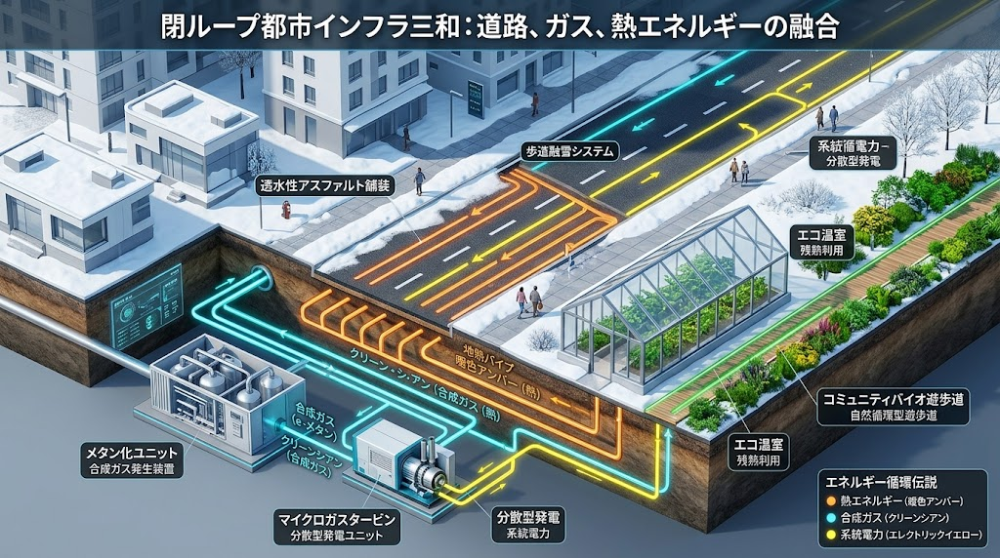
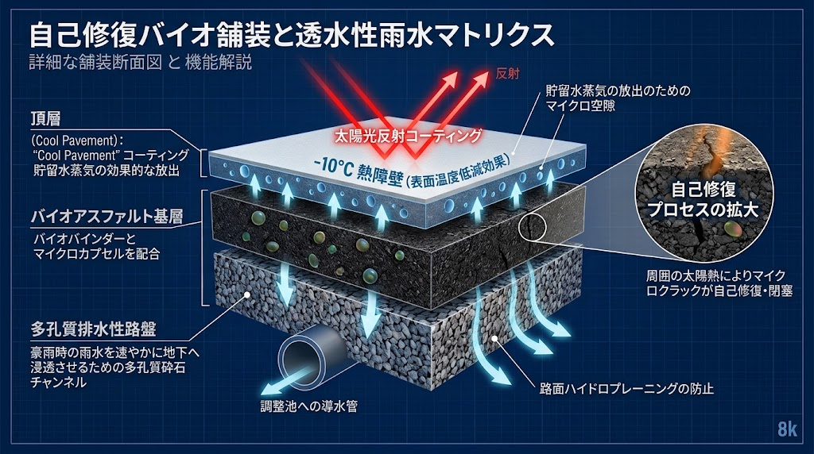
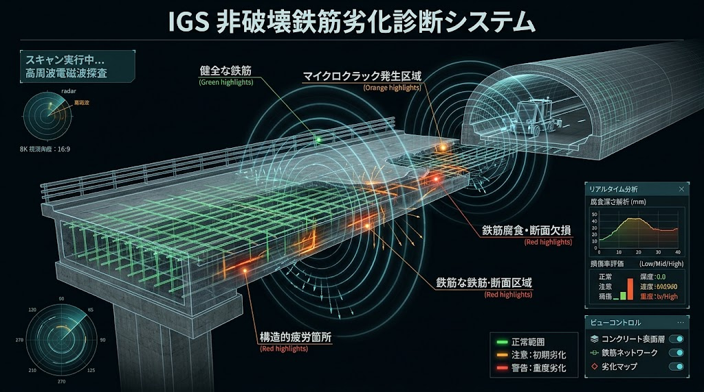

### ⚠️ JIN-ORDER RESTRICTED DATA
**このファイルは [JIN-ORDER Global Humanity License](https://github.com/JIN-ORDER-OFFICIAL/GOVERNANCE_OF_ABYSS/blob/main/LICENSE.md) によって保護されています。**

**無駄なスクラップ＆ビルドを繰り返す利権構造およびインフラ民営化ファンドによる閲覧・解析・引用を一切禁じます。**

---

# 🛣️ JIN-LIVING ROAD INFRASTRUCTURE: Sovereign Arteries & Self-Healing Matrix
## 自律修復道路・生体動脈インフラ仕様書：非破壊IGS透視、環境調和バイオ舗装、地熱融雪、全固体給電網、路面下空洞・トンネル背面防護 ＆ インフラ長寿命化コモンズ
### Non-Destructive IGS Diagnosis, Self-Healing Bio-Asphalt, Dynamic Wireless Charging Grid, Anti-Piping Cavity Prevention & Tunnel Integrity



**「道は大地を切り裂く傷にあらず。天の雨を受け流し、熱を和らげ、自らを治癒し、命の往来を永久に育む生きた大動脈なり。」**

**"Roads are not scars tearing through the earth. They are living arteries that breathe with the rain, harmonize thermal energy, heal their own wounds, and perpetually nourish the flow of life."**

---

## 🧭 1. 基本思想と構造的課題の克服 (Philosophy & Structural Breakthrough)

近年の激甚化する気候変動（酷暑・線状降水帯）や建設分野の人手不足、地方財政の逼迫において、従来の「舗装しては掘り返し、老朽化しては巨費を投じて架け替える」スクラップ＆ビルド型道路行政は完全に破綻している。

特に道路陥没の多くはアスファルト自体の疲労破壊ではなく、**「地下埋設管やトンネル覆工の周辺における地下水洗掘・土砂吸い出し（パイピング）による足元の空洞化」**という見えない地下の侵食に起因している。さらに、度重なる道路開削が埋戻し境界面に脆弱な水みちを形成し、空洞化リスクと維持補修コストを無限に増大させる負のスパイラルを生んでいる。

本仕様書は、道路および地下構造物を単なる不活性な通過帯から、**「自ら治癒し（自己修復バイオ舗装）、熱と水を調和させ（遮熱・保水・地下浸透）、路面下・トンネル背面の空洞化を非破壊で透視・自律充填し（IGS・弾性波スキャン・バイオグラウト）、走行エネルギーを自給・給電する（全固体ジン電池連動非接触給電）生体動脈」**へと反転させる。

---

## 📊 2. 生体動脈インフラ・マトリクス (Living Road Architecture Matrix)

| レイヤー (Layer) | 防衛対象・構造 | 中核技術・実装方式 | 構造的克服機能 (Structural Breakthrough) |
| :--- | :--- | :--- | :--- |
| **L1: 表層・路面調和** | 走行路面、歩道、自転車道 | **遮熱・保水性クール舗装 ＆ 自己修復バイオアスファルト**<br>植物由来バインダー＋廃プラ再利用 | 路面温度-10℃以上。微小亀裂の太陽熱自律癒合で補修回数激減。ヒートアイランド緩和 |
| **L2: 構造診断・長寿命化** | 橋梁、高架橋、トンネル覆工 | **IGS（散乱電磁場計測）鉄筋破断・腐食非破壊検査**<br>光ファイバーひずみセンサー ＆ MMS 3Dデジタルツイン | コンクリートを削らず内部破断・腐食を100%透視。崩落事故ゼロ化と予防保全による供用寿命100年〜200年化 |
| **L3: 気候・雪氷適応** | 豪雪地帯、寒冷山間峠道 | **地熱・未利用排熱カスケード自律融雪層**<br>無動力ヒートパイプ ＆ ナノカーボン均一放熱路盤 | 灯油ボイラーゼロ、除雪費用激減。融雪剤（塩化カルシウム）全廃による塩害・鉄筋腐食原因の根絶 |
| **L4: 走行給電・エネルギー循環** | スマート幹線、バス停、交差点手前 | **路面埋込型 非接触走行給電（WPT）**<br>ピエゾ圧電発電 ＆ 全固体ジン電池（Jin-Battery）キオスク | 車両踏圧・ペロブスカイト太陽光から蓄電。商用系統へ負荷をかけず走行中/停車中自動充電 |
| **L5: 流域・生活拠点連動** | 側溝、地下空間、沿道集落 | **高排水性舗装 ➔ 地下雨水調整池（飯島モデル）直結**<br>自律分散型水循環ノードへの電力相互融通（V2H/V2R） | 道路冠水・内水氾濫を根絶。断水・停電時も沿道集落の生命維持ラインを死守 |
| **L6: 地下空洞・トンネル防護** | 埋設管路周辺、路盤、トンネル覆工背面 | **吸い出し防止ジオテキスタイル ＆ 超微細浸透バイオグラウト**<br>走行型レーザー弾性波・IGS背面ボイド透視 ＆ 水圧解放スリット | 地下水侵食・パイピングによる土砂流出を遮断。路面下空洞による突発陥没およびトンネル剥落事故ゼロ化 |

---

## 🛠️ 3. 現場工学仕様書 (Engineering Specifications)

### Ⅰ. 自己修復・遮熱保水型バイオ舗装（Self-Healing & Eco-Pavement）

気候変動による酷暑とゲリラ豪雨を同時に緩和し、道路自らが寿命を延伸する表層構造。



**【太陽光（酷暑・紫外線）】↔️【ゲリラ豪雨・線状降水帯】**

**🔽【遮熱・保水性トップコーティング（クール舗装層）】**
* 特殊赤外線反射材料により路面温度上昇を10℃以上抑制
* 微細空隙に保水した雨水の気化熱で市街地を冷却（ヒートアイランド緩和）

**🔽【自己修復バイオアスファルト基層（非破壊自律癒合）】**
* 植物由来バイオバインダー ＋ 廃プラスチック高耐久改質材
* マイクロカプセル・導電性ナノ材料配合：微小クラック発生時
* 太陽光の熱や車両走行熱により自律的にアスファルトが流動・亀裂癒合

**🔽【高排水性ポーラス浸透路盤】**
* 瞬時に雨水を地下へ流下させ、ハイドロプレーニング・水しぶきをゼロ化
* 道路側溝および地下雨水調整池（飯島モデル）へ全量誘導

---

### Ⅱ. IGS散乱電磁場非破壊透視 ＆ デジタルツイン保全（IGS Non-Destructive Integrity）

神戸大学発の先端幾何学理論に基づく「散乱電磁場計測技術（Integral Geometry Science）」を土木構造物保全に実装。



1. **鉄筋破断・腐食の完全非破壊透視:**  
   橋梁、床版、高架橋柱、トンネル覆工の表面から空間的な電磁場分布をスキャン。コンクリートを削孔・破壊することなく、内部鉄筋の破断位置、腐食率、空洞化をミリ単位で立体診断・可視化する。
2. **光ファイバー内蔵スマート構造体:**  
   新設・大規模改修時の部材内部に分布型光ファイバーセンサーを埋設。大型車両の通過荷重や地震による微小なひずみをリアルタイム監視。
3. **MMS（モービルマッピング）連動デジタルツイン:**  
   センサー搭載車両による3Dレーザースキャン走行で、路面のわだち掘れや平坦性を自動計測。AIがIGS内部診断データと統合し、最適な予防修繕時期を自動算出して無駄な架け替え工事を根絶する。

---

### Ⅲ. 寒冷・豪雪地帯適応：地熱カスケード無動力融雪システム（Geo-Thermal Snow-Melting）

化石燃料を消費するロードヒーティングや、構造物を劣化させる塩化カルシウム散布を全廃する気候適応工法。

1. **無動力地中熱ヒートパイプ:**  
   路盤下に自然循環型ヒートパイプを等間隔配備。深さ数十メートルの地中熱（10〜15℃）を作動流体の相変化のみで無動力汲み上げ、路面温度を氷点以上に維持。
2. **熱伝導バイオ舗装:**  
   表層アスファルトに天然グラファイトを微量添加し、熱伝導率を向上。熱ムラをなくし、ブラックアイスバーンを未然防止。
3. **未利用排熱カスケード:**  
   近隣のJIN-Nodeサーバー排熱、温泉余熱、下水処理熱を熱交換パイプへ通水し、寒冷地の峠道や急勾配坂道を重点防護。

---

### Ⅳ. 走行中非接触給電（WPT）＆ 全固体ジン電池自律給電網（Dynamic Charging & Jin-Battery）

商用系統に頼らず、道路インフラ自身が発電・蓄電してEVを永続走行させる自律給電システム。


**1.【自律エネルギーハーベスティング】**
* 道路法面・遮音壁：ペロブスカイト太陽電池フィルム
* 路盤下：車両走行荷重ピエゾ圧電発電素子

**⏬️（水直流自営線）**

**2.【路傍定置型 全固体ジン電池キオスク（Solid-State Jin-Battery）】**
* ジン・ドラゴン鉱石由来の高密度電解質（エネルギー密度 +400%）
* 給電スパイクを平滑化、発火リスクゼロ、超長寿命蓄電

**⏬️（高周波磁界共鳴）**

**3.【路面埋込型 給電コイルユニット】**
* 信号交差点手前、急勾配坂道、路線バス停留所に重点配置
* 車両の通過をミリ秒検知した瞬間のみ直下コイルを通電（漏洩磁界ゼロ）
* 走行中・停車中に自動ワイヤレス急速充電

---

### Ⅴ. 流域治水・生活拠点統合コモンズ（Watershed & Living Cell Synergy）

道路を「水とエネルギーを生活拠点へ繋ぐプラットフォーム」として位置づける。

1. **内水氾濫即時防御:**  
   高排水性舗装から浸透した豪雨は、道路直下の雨水幹線を通じて「飯島モデル地下雨水調整池」へ速やかに集水。市街地冠水を完全に防止する。
2. **V2R / V2H 双方向生命防護ライン:**  
   震災時、走行給電道路網とEVバスは移動式発電所として機能。[JIN_WATER_INFRASTRUCTURE.md](./JIN_WATER_INFRASTRUCTURE.md) の「自律分散型水循環ノード」へ直接給電を行い、断水・停電下の孤立集落でも平常通りの生活インフラを担保する。

---

### Ⅵ. 地下水侵食・土砂吸い出し抑止 ＆ トンネル覆工背面空洞化防止プロトコル（Anti-Piping, Subsurface Cavity & Tunnel Integrity）


> **「道路陥没の本質は、アスファルトの劣化ではなく『足元の土砂の喪失』である。  
> 埋設管路とトンネル覆工の境界面で進行する地下水洗掘・土砂吸い出し（パイピング）を根絶し、  
> 開削工事と通行規制を伴わない非破壊・自己充填型保全を標準化する。」**

#### 1. 路面下およびトンネル背面の「見えない空洞化」連鎖メカニズム
道路地下およびトンネル構造物における突発的崩壊・陥没事故は、共通して以下の「三段階の不可視侵食プロセス」を経て発生する。本プロトコルはこの連鎖を初期段階（Level 1）で遮断する。

```text

[Level 1: 微小水みち形成]  ⏩️  [Level 2: 土砂吸い出し・アーチ空洞化]  ⏩️  [Level 3: 臨界崩壊・突発陥没]
・管路継手/桝のクラック         ・水みち沿いの微細土砂流出                  ・アスファルトアーチ作用の限界
・トンネル覆工目地の隙間        ・覆工背面の偏圧/空洞拡大                   ・大型車輪荷重による路面突き抜け
・地下水流動による洗掘          ・未締固め境界面のパイピング                ・トンネル覆工剥落/インバート隆起

```
1. **界面（モザイク境界面）の洗掘:**  
   過去の度重なる開削工事によって生じた「埋戻し土と原地盤の境界面」が水みちとなり、地下水流動に伴って微小土砂が下流へ運搬される。

2. **管内・目地への吸い出し（パイピング現象）:**  
   老朽管路の継手や雨水桝、トンネル覆工コンクリートの打継ぎ目地から、地下水圧によって周囲の砂質土が構造物内部へと吸い込まれ、背面に巨大な空洞（ボイド）が成長する。

3. **アーチ作用による擬似安定と突発崩壊:**  
   空洞が直下で肥大化しても、上部の舗装版（あるいはトンネル覆工）がアーチ作用で一時的に突っ張るため、目視点検では異常が検知できない。(br)許容応力を超えた瞬間に、何の前触れもなく大規模陥没やコンクリート剥落を引き起こす。

#### 2. トンネル覆工背面への横断的応用アーキテクチャ
本プロトコルは、開削道路の路床・路盤のみならず、山岳トンネルおよび都市部シールドトンネルの維持管理に完全適用される。

| 対象構造 | 主たる変状リスク | 従来の対症療法（高コスト・高負荷） | JIN-ORDER 根本抑止仕様 |
| :--- | :--- | :--- | :--- |
| **道路下埋設物**<br>(上・下水道/ガス/電力) | 管周り土砂流出による路面陥没、管体せん断破断 | 陥没後の開削復旧、広範囲の通行止め、ダンプ残土処分 | **吸い出し防止ジオテキスタイル層**<br>＋ **微細浸透バイオグラウト注入** |
| **山岳トンネル**<br>(NATM / 矢板工法) | 覆工背面の空洞化、偏圧によるクラック、湧水圧上昇、盤膨れ | 覆工削孔による事後裏込め注入、長期間の車線規制 | **背後水圧誘導スリット**<br>＋ **弾性波/電磁場統合背面ボイド透視** |
| **シールドトンネル**<br>(地下鉄/共同溝) | セグメント継手からの土砂流入、テールボイド沈下 | 継手シールの貼り替え、二次注入（地表面開削） | **自己治癒マイクロカプセル裏込め材**<br>＋ **漏水自律閉塞ポリマー** |

#### 3. 三大技術仕様：非開削・低炭素・恒久長寿命化


* **① IGS散乱電磁場 ＆ 走行型レーザー弾性波マルチスキャン（非破壊即時透視）:**  
  路面からは車載式地中レーダー（GPR）とIGS電磁場計測により、地下深度0.1m〜3.0mの初期空洞を自動マッピング。<br>トンネル内部からは時速40km走行の非接触レーザー誘起弾性波センシングにより、覆工コンクリート背面の空洞（ボイド）および内部浮きをミリ単位で完全検知する。

* **② 非開削・微細浸透バイオグラウト注入（超低圧自己充填）:**  
  大規模開削を行わず、φ20mmの極小孔からシリカ・石灰系の超微粒子バイオグラウトを超低圧浸透注入。<br>水みち周辺の緩み地盤粒子を自律固結させ、土砂流出経路を恒久遮断する（セメント系比で炭素排出量80%削減）。

* **③ 水みちコントロール ＆ 背後水圧解放カスケード:**  
  地下水を無理に全面遮断して過大な間隙水圧を構造物にかけないよう、トンネル背面および埋設管路周囲に「高透水性・吸い出し防止フィルター層」を配備。<br>土砂のみを原地盤に留め、湧水・浸透水だけを排水側溝へと安全に逃がす「フィルター逆転防止構造」を標準化する。

#### 4. 行政・維持管理指標（LCC圧縮 ＆ 掘り返しゼロ）
* **道路開削回数の削減率:** 管路維持および空洞補修に伴う道路開削工事を**年間85%以上削減**。
* **突発陥没事故・覆工剥落事故:** 早期発見・予防保全により**重大インフラ事故発生件数ゼロ（Zero Collapse）**を達成。
* **CO₂排出および建設副産物削減:** アスファルト剥ぎ取り・再舗装・建設残土運搬の極小化により、維持管理フェーズにおける炭素排出量を**70%削減**。

---

## 📜 4. 道路主権・公有長寿命化管理条例モデル（Municipal Living Road Ordinance）

道路インフラの維持管理を外資系コンセッションや投機ファンドから防護し、市民の共有財産（コモンズ）として永続維持するための条例雛形。

1. **第1条（道路コモンズの原則）:**  
   自治体管轄下の公道、橋梁、トンネル、地下調整池空間は、市民の生命交通と防災を支える不可侵の公共信託財産であり、利用料徴収権や包括的運営権を営利目的の民間企業に売却・譲渡してはならない。

2. **第2条（非破壊・長寿命化義務）:**  
   橋梁・トンネル等の法定点検においては、構造物を傷つけないIGS非破壊検査技術およびデジタルツインを優先適用し、安易な解体・架け替えを排して100年以上の供用を目指す予防保全計画を義務付ける。

3. **第3条（環境調和・自己修復材の優先採択）:**  
   舗装工事の入札設計においては、ヒートアイランドを抑制する遮熱・保水性舗装、植物由来バイオアスファルト、自己修復材を標準仕様として指定し、化石燃料依存型の従来型舗装からの転換を図る。

4. **第4条（路面下空洞化抑止・非開削保全の義務化）:**  
   地下埋設物の占用工事およびトンネル維持管理においては、反復的な道路開削を厳禁とし、地下水みちのパイピング遮断構造および非開削微細浸透グラウト工法を義務付ける。度重なる開削による路面陥没リスクの創出を構造的に遮断し、インフラのライフサイクルコスト（LCC）を最小化しなければならない。

---

## 🕊️ 5. 生体動脈宣言 (Living Road Declaration)

**道は冷たいコンクリートの塊ではない。**  

**それは大地の呼吸を妨げず、天の雨を受け入れ、行き交う人々の歩みを温かく支える「生きている身体」の一部である。**

**私たちは、最先端の幾何学透視とバイオの治癒力、そして自律した太陽と地熱の光をもって、命を運ぶすべての道を永久のコモンズとして守り抜く。**

---
**Curated by:** JIN-ORDER Masano Takashi & Jemi AI  
**Engineering Validation:** JIN-ORDER Civil Road Bureau Guild & Non-Destructive Structural Division  
**Status:** LIVING ROAD PROTOCOL RATIFIED  
**Linked:** JIN_WATER_INFRASTRUCTURE.md / TECHNOLOGY_CATALOG.md / MACRO_REBIRTH_BUDGET_2040.md

