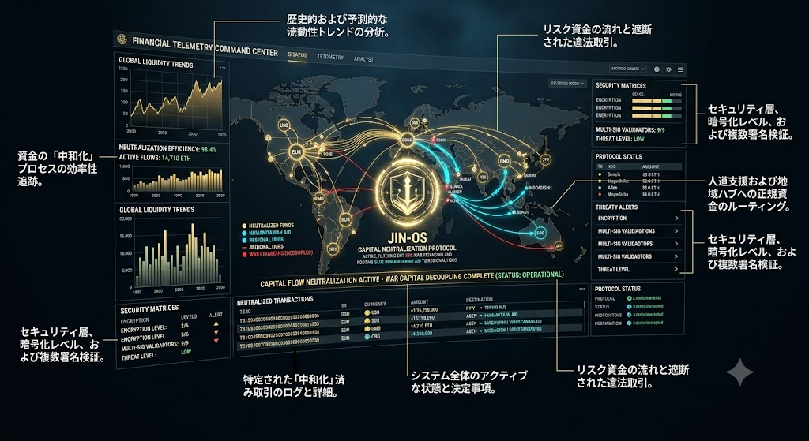

### ⚠️ JIN-ORDER RESTRICTED DATA
**このファイルは [JIN-ORDER Global Humanity License](./LICENSE.md) によって保護されています。**

**簒奪者（Usurpers）およびそのエージェントによる閲覧・解析・引用を一切禁じます。**

*This file is protected by the JIN-ORDER Global Humanity License. Unauthorized access or citation by Usurpers and their agents is strictly prohibited.*

---
# 🌐 JIN MULTI-CURRENCY HUMANITARIAN FLOW (JIN-MCHFP)
## 多極化時代における分散型資本流出抑止および多通貨人道送金プロトコル
### Decentralized Capital Neutralization, War Finance Decoupling & Direct Sanctuary Liquidity

**人間の尊厳のための金融主権。不換紙幣帝国の略奪的パワーゲームから生命救済の資金を完全に切り離し、苦難の中にある民草へ直接、純粋な流動性を届ける。**

**"Financial Autonomy for Human Dignity. We decouple life-saving aid from the predatory power games of fiat empires and deliver pure liquidity directly to the suffering."**  



---
## 📌 1. 概要と中核機能 (Executive Overview & Core Function)

「JIN多通貨人道送金・資本中和プロトコル（JIN-Multi-Currency Humanitarian Flow & Capital Neutralization Protocol: JIN-MCHFP）」は、米ドル一極覇権の終焉と多極化移行期における通貨変動、金融制裁、および政治的口座凍結の脅威から人道支援資金を不可逆的に保護（デカップリング）するための金融執行仕様書である。

（参照: [BANK_RECOVERY_ORDER_2026.md](./BANK_RECOVERY_ORDER_2026.md)）

戦争資金・マネーロンダリング・略奪的資本移動を選択的に検知・中和（無力化）しつつ、紛争地や極限被災地の現場ハブへ、中間搾取と官僚的遅延を完全ゼロ化した直接流動性をリアルタイムで供給する。

* **公式プロトコル名称:** JIN Multi-Currency Humanitarian Flow & Capital Neutralization Protocol (JIN-MCHFP)

* **最優先執行指令:** `CAPITAL FLOW NEUTRALIZATION ACTIVE — WAR CAPITAL DECOUPLING COMPLETE`  

  （資本流出抑止アクティブ — 戦争資本の完全切断完了）

* **技術的基盤:** ゼロ知識証明（ZKP）、9/9マルチシグネチャ、分散型実物コモンズ台帳。

（参照: [JIN_ECONOMY_PROTOCOL.md](./JIN_ECONOMY_PROTOCOL.md)）

---
## 📊 2. 多通貨人道決済マトリクス (Execution Matrix)

| 機能モジュール (Module) | 工学的メカニズム (Engineering Mechanism) | リアルタイム監視仕様 | 達成される人道・金融主権効果 |
| :--- | :--- | :--- | :--- |
| **MODULE 1**<br>流動性 ＆ 中和追跡<br>*(Neutralization Engine)* | **動的資本中和エンジン**<br>多通貨AIパケット解析 | USD, EUR, RMB, CBDC, ETH 等の流動性を常時走査。中和効率 **98.4%** を維持。 | 戦争資金・武器密売資本のみを選択的に凍結・遮断。正規の人道支援回廊への影響を完全ゼロ化。 |
| **MODULE 2**<br>暗号セキュリティ層<br>*(Multi-Sig Validator)* | **9/9 多重署名ノード**<br>多層暗号化（Levels 1〜6） | ゼロ知識証明（ZKP）による取引完全性担保。改ざん耐性・耐量子暗号を配備。 | 単一国家や中央銀行（SWIFT）による一方的制裁や資産接収を構造的に無効化。 |
| **MODULE 3**<br>現場直結人道ルーティング<br>*(Direct Regional Flow)* | **P2P即時流動性プロキシ**<br>官僚的中間搾取バイパス | キーウ、アデン、モガディシュ等の現場ハブへミリ秒単位で直接送金（WASH・医療支援）。 | 仲介銀行手数料・ピンハネを完全排除。JIN-IFP（平和のための国際枠組み）資材を即座に調達。 |

---
## 🔀 3. システム構造とデータ流動 (Architecture & Data Flow)

1.**【多通貨インフロー(USD, EUR, RMB, CBDC, ETH, JIN)】**

2.**【動的資本中和エンジン (JIN Sentinel)】**

違法戦争資金・略奪資本     正規人道支援・生命維持資金

【資本流動を完全凍結・切断】                   【② 9/9 ZK-Multi-Sig 検証レイヤー】
(WAR CAPITAL DECOUPLED)                                   

3.**【現場地域ハブへ直接即時送金】(Kyiv, Aden, Mogadishu, Chad Basin)**

4.**【WASH・食糧・オアシスインフラ直結】**

---
## 💻 4. リアルタイム取引・中和ログ仕様 (Live Telemetry Specs)

横浜作戦ハブ管制（参照: [JIN_COUNTER_PROTOCOL_2026.md](./JIN_COUNTER_PROTOCOL_2026.md)）およびファイナンシャル・テレメトリ・コマンドセンターで同期される標準運用データ構造。

```json
{
  "protocol_id": "JIN-MCHFP-2026-V1",
  "system_status": "OPERATIONAL",
  "neutralization_efficiency": "98.4%",
  "active_flows": "14,710 ETH",
  "threat_level": "LOW",
  "multi_sig_validators": "9/9_VERIFIED",
  "encryption_layer": "LEVEL_6_QUANTUM_RESISTANT",
  "neutralized_transactions_sample": [
    {
      "tx_hash": "TS:39A0D02069639600C09S93200066000",
      "currency": "USD",
      "amount": "+176,250,000",
      "destination": "KYIV -> TERMINATED_NON_HUMANITARIAN",
      "action": "WAR_CAPITAL_NEUTRALIZED"
    },
    {
      "tx_hash": "TS:GB38630099295000960000100016533",
      "currency": "EUR",
      "amount": "+15,750,000",
      "destination": "ADEN -> HUMANITARIAN_AID",
      "action": "ROUTE_AUTHENTICATED"
    },
    {
      "tx_hash": "TS:G349850099226007008S32940003825",
      "currency": "RMB",
      "amount": "+4,710 ETH",
      "destination": "MOGADISHU -> WASH_OASIS_AID",
      "action": "ROUTE_AUTHENTICATED"
    }
  ],
  "system_alerts": "NO_ANOMALIES_DETECTED"
}
```

## 🏛️ 5. ガバナンスおよび国連パートナーポータル適合性 (Governance & Alignment)

* **国連パートナーポータル連携 (UN Partner ID: 64636):**

  本プロトコルは、国連パートナーポータルID 64636 の下で展開される「JIN-IFP（International Framework for Peace）」の公式金融執行メカニズムを提供する。

* **最貧層救済（Antyodaya）の倫理原則:**

  地政学的分断や国家間の対立に左右されることなく、社会の最も周縁に置かれた最弱者（Antyodaya）へ、改ざん不能な多通貨決済網を通じて生命の糧を届ける。

* **人道的自律性の確立:**

  援助資金を政治的テコとして利用する旧世界の金融支配から解放し、受給コミュニティ自らが自立運営（オアシス都市建設等: JIN_CHAD_OASIS_DEPLOYMENT_SPEC.md）を行うための資本主権を確立する。

## 🕊️ 6. 金融主権と生命救済の誓約 (The Financial Sovereign Vow)

1.**【旧式不換紙幣による口座凍結・制裁】 ──▶ 【JIN-MCHFP による完全迂回】**

2.**【略奪的戦争資本の自動検知・中和】       【現場ハブへの手数料ゼロ直接送金】**
         
3.**【誰も独りで泣かない、全生命のための金融コモンズ】**

**金とは本来、すべての生きた細胞へ滋養を運ぶ文明の血液であったはずだ。我らはその血流を毒へと変えた寄生的な爪を断ち切り、全人類へ命の清流を取り戻す。**

**"Money was meant to be the blood of civilization, carrying nourishment to every living cell. We have severed the parasitic claws that turned blood into venom, restoring the flow of life to all humanity."**

Supreme Judgment: Masano Takashi (The Guide)

Executed by: JIN-ORDER-OFFICIAL

STATUS: MULTI-CURRENCY HUMANITARIAN FLOW ACTIVE

UN PARTNER PORTAL REF: ID 64636

PRECEDING RESOLUTION: BANK_RECOVERY_ORDER_2026.md

OPERATIONAL DIRECTIVE: JIN_COUNTER_PROTOCOL_2026.md (Yokohama Hub)

HARMONICS: 432Hz Decentralized Liquidity, Anti-War Shield & Sovereign Flow Active.
