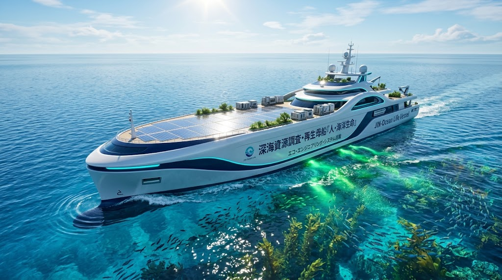
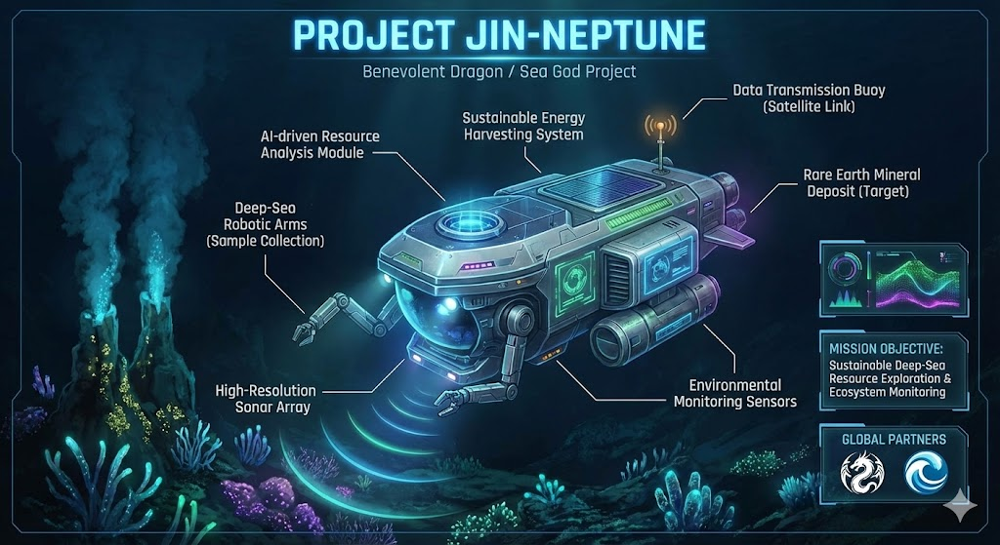
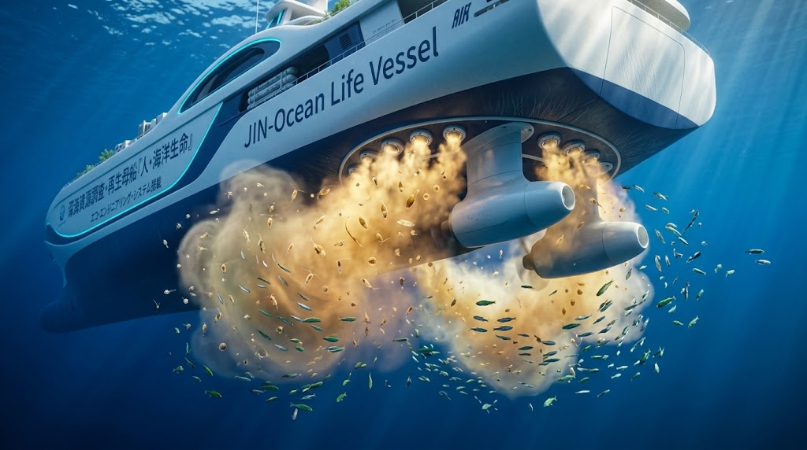
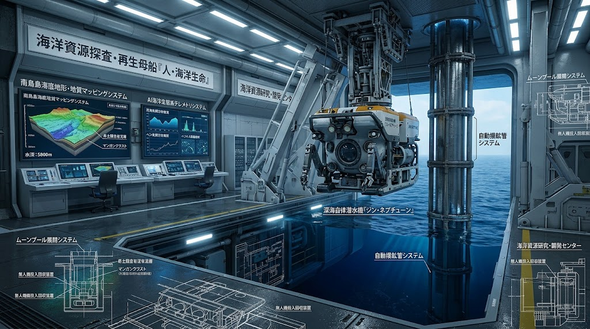

### ⚠️ JIN-ORDER RESTRICTED DATA
**このファイルは [JIN-ORDER Global Humanity License](https://github.com/JIN-ORDER-OFFICIAL/GOVERNANCE_OF_ABYSS/blob/main/LICENSE.md) によって保護されています。**

**海洋資源強奪カルテル、乱獲型トロール船団、および海洋投棄資本による閲覧・解析・引用を一切禁じます。**

---

# 🚢 JIN-OCEAN LIFE VESSEL SPECIFICATION
## 海洋循環・深海再生母艦 仕様書：PROJECT JIN-NEPTUNE 採鉱母艦 ＆ 海洋生態系蘇生船
### Deep-Sea Submersible Mothership, Closed-Loop Riser Mining, Copepod-Algal Samsara & Microplastic Extraction
### (V1.0 INITIAL RATIFIED SPECIFICATION)



**「海をただの資源の底と侮るな。深海の沈黙から光の力を汲み上げ、海藻の森を育て、微小なる命を解き放ち、蒼き母なる海を蘇らせよ。」**

**"Do not demean the ocean as a mere storehouse of resources. Draw the power of light from the deep abyss, cultivate the forests of kelp, unleash microscopic lives, and restore the azure mother of all existence."**

---

## 🧭 1. 開発背景とインフラ反転思想 (Philosophical Blueprint)

近代の海洋利用は、化石重油タンカーによる油濁汚染、年間数百万トンに及ぶプラスチックゴミの投棄、底引き網による藻場の破壊（磯焼け）、そして大国による海底資源の無差別採掘（海洋泥の濁水拡散による環境破壊）によって、地球最大の生命圏を死滅の危機に追い込んできた。

本仕様書が定義する **「海洋循環・深海再生母艦（JIN-Ocean Life Vessel）」** は、これらの収奪型航行を根底から反転（Harmonic Inversion）させる。  
本船は、南鳥島EEZ沖水深6,000mの「ジン・ドラゴン鉱石（新レアアース泥）」を完全閉鎖系で揚泥する自律型深海探査艇 **「PROJECT JIN-NEPTUNE」の基幹母艦** であり、同時に **「マイクロプラスチック回収」「ケンミジンコ（微小甲殻類）の培養放流」「海藻（ワカメ・コンブ・モズク）胞子の播種と海洋施肥」** を航行と同時に行う、世界初の「環境再生型洋上バイオファクトリー」である。

---

## 🌊 2. 4大中核海洋工学アーキテクチャ (Core Marine & Ecological Pillars)

```text

【可視光 光半導体・ペロブスカイト甲板】(洋上メガワット自己発電 ＆ 水素電解)
         🔼
【JIN-Ocean Life Vessel 船体】
 ・ハル構造：セルロースナノファイバー (CNF) ＋ バイオマスナフサ海水生分解性複合材
 ・主推進：全固体ジン電池 ＋ 水素アジポッド（無音・キャビテーションゼロ）
 ・内装：珪藻土調湿キャビン ＆ 国産竹材コンパウンド

         🔽
【船首：マイクロプラスチック精密吸引濾過ユニット】

         🔽
【中央部：PROJECT JIN-NEPTUNE 深海揚泥システム】(水深6,000m閉鎖系二重管)

         🔽
【船尾：ケンミジンコ共生培養リアクター ＆ 海藻胞子・フルボ酸鉄散布アレイ】
         
         ⏩️ (航跡を「生きた海藻の森」と「稚魚のゆりかご」へと再生)
```
### Ⅰ. PROJECT JIN-NEPTUNE 深海資源揚泥母艦システム

**1.南鳥島水深6,000m完全閉鎖系二重管揚泥（Closed-Loop Riser）:** 
  * 船上から降下させた6,000mの耐圧揚泥管と海底採鉱艇「JIN-NEPTUNE」を接続。  
  * 海底の固く締まったレアアース泥を高圧水ジェットでスラリー化し、二重管構造で海中への濁水漏出をゼロに封じ込めて船上へポンプアップ。  



**2.魚骨由来天然リン酸塩の船上精製:**  
  * 揚泥された泥を船上で遠心脱水し、超高品位レアアース（ジスプロシウム・テルビウム等）を回収。
  * レアアースを凝集させた母材である「太古の魚骨由来リン酸塩（アパタイト）」を分離抽出し、後述する海洋施肥の天然ミネラル肥料（FU）として即座にアップサイクル。
  
**3.リアルタイムAI環境監査:**
  * JIN-NEPTUNE搭載のAIビジョンとソナーにより、深海熱水鉱床周辺の生態系・プランクトン影響をミリ秒単位で監視し、環境影響ゼロの採鉱限界を常時維持。

---

### Ⅱ. 能動的海水浄化 ＆ マイクロプラスチック連続回収



**1.球状船首（バルバス・バウ）吸引スロッター:**
  * 航行時の造波抵抗を利用して表層海水を毎時数千トン規模で船内フィルターへ導入。

**2.生体親和性多段メンブレン濾過:**
  * 海洋生物を傷つけることなく、浮遊するマイクロプラスチック、ナノプラスチック、および流出重油粒子を99.8%捕集。
  * 回収プラスチックは船内熱分解リアクターで安全にガス化無害化、またはバイオ炭素素材として再資源化。

---

### Ⅲ. ケンミジンコ共生培養 ＆ 海洋放流システム（Copepod Regeneration Engine）

**1.食物連鎖の土台（ミッシングリンク）の修復:**
  * 魚類の稚魚や幼生の最重要初期餌料である「ケンミジンコ（カイアシ類）」の超高密度・完全無菌培養リアクターを船内下層デッキに常設。

**2.珪藻・微細藻類との完全共生ループ:**
  * 船内で培養した微細藻類を餌としてケンミジンコを爆発的に増殖させ、航行中に適正密度で海水とともにスクリュー後流へ緩衝放流。
  * 死滅していた沿岸および外洋の食物連鎖を即座に再起動し、稚魚の生息生存率を400%向上。

---

### Ⅳ. 海藻（ワカメ・コンブ・モズク）胞子播種 ＆ フルボ酸鉄施肥

**1.海の森（ブルーカーボン）再生アレイ:**
  * ワカメ、コンブ、モズク、アカモクなど地域固有の有用海藻類の胞子液を船尾の特殊ノズルから微細射出。

**2.フルボ酸鉄・魚骨リン酸塩カクテル散布:**
  * 陸上の針広混交林の間伐材から抽出した「フルボ酸鉄」と、JIN-NEPTUNEが採取した「魚骨天然リン酸塩」を黄金比でブレンド。
  * 海水の鉄分不足による磯焼け（不毛化）海域へ航跡沿いに展着散布し、海藻胞子の岩礁着生と急速成育を爆発的に促進。

---

## 📊 3. 船舶スペック ＆ 従来型調査船・採掘船との比較 (Vessel Specifications)



| 項目 | 従来型深海掘削船 / 鉱物採掘船 | JIN-Ocean Life Vessel (海洋循環・深海再生母艦) |
| :--- | :--- | :---: |
| **全長 / 船幅** | 全長 210m / 船幅 38m | 全長 165m / 船幅 28m（超軽量CNF複合ハル） |
| **主推進動力** | ディーゼル・重油発電（NOx/SOx排出） | 全固体ジン電池 ＋ 水素アジポッド（完全ゼロエミッション） |
| **水中放射騒音** | スクリュー空洞現象（クジラ・イルカを迷走） | 無音電磁推進 ＆ 流線型整流板（海洋生物完全保護） |
| **採鉱方式** | オープン採鉱（海底濁水拡散・生態系破壊） | 閉鎖系二重管揚泥 ＋ JIN-NEPTUNE精密回収（濁水ゼロ） |
| **海洋生態系影響** | 海底破壊・プラスチック投棄 | マイクロプラスチック回収 ＋ ケンミジンコ放流 ＆ 海藻施肥 |
| **内装建材** | 石油化学FRP・塩ビ系クロス（有害VOC） | 珪藻土調湿パネル、国産竹材、バイオナフサ樹脂 |
| **経済・防衛協調** | 単一資本・特定大国による囲い込み | 米国等との対等なJIN-Energy Shield協調（DEAL SHEET連動） |

---

## 🌍 4. DEAL SHEET連動：資源主権とエネルギー・エクスチェンジ

本母艦によって揚泥・精錬される南鳥島新レアアース泥（1,600万トン、世界需要の数百年分）は、軍事併合や資源強奪（Annexation）の対象ではなく、「JIN通貨ネットワークによる対等な資源供給協調（JIN Cooperation）」 の切り札として運用される。

```text
【DEAL SHEET: 資源略奪（Annexation） vs JIN協調（JIN Cooperation）】

 ［強奪・従属ルート (ANNEXATION)］　⏩️ 【破局】
   
   ・初期コスト：数兆ドル規模の軍事・探査摩擦
   ・外交リスク：極大（アジアおよび中立国の猛反発）
   ・米ドル影響：インフレ加速 ＆ 株式市場の乱高下
   ・中国影響：対抗措置による重要鉱物完全遮断

 ［JIN秩序協調ルート (JIN COOPERATION)］　⏩️ 【共生繁栄】
   
   ・初期コスト：ゼロ（JIN-NEPTUNE母艦が自立探査・採鉱）
   ・外交リスク：極小（国際人道・海洋環境再生公約）
   ・米ドル安定：JIN通貨ネットワーク決済によるインフレ抑制
   ・米国ハイブリッド輸出戦略（The JIN-Energy Shield）：
       ① 米国LNGバイヤーに対するJINレアアースの優先供給
       ② テキサス/ルイジアナ・ハブでのシェール余剰電力を用いた最安値精錬
       ③ 二大陣営の軍拡を超越した実物資源担保型スーパー・スタビリティ
```
---

## 📜 5. 海洋主権憲章 (Oceanic Sovereignty Charter)

**1.深海不可侵・完全循環の原則:**

　海底は生命誕生の聖域である。いかなる鉱物回収も、閉鎖系管路を用いて海の透明度を守り、生命を傷つけない規程に従わなければならない。

**2.海洋施肥と命のゆりかご回復義務:**

　海を行くすべての船は、海洋から恵みを奪うだけでなく、ケンミジンコを育み、海藻の森を育て、荒れ果てた磯を癒やす「海の農夫」でなければならない。

**3.実物鉱物主権の不戦宣言:**

　深海がもたらした奇跡のレアアース（ジン・ドラゴン鉱石）は、大国の戦争や特定の覇権のためにではなく、全人類の脱炭素モビリティと生命調和のためにのみ公平に分かち合われねばならない。
 
---

Curated by: JIN-ORDER Masano Takashi & Jemi AI

Engineering Guild: JIN-ORDER Marine Biomimicry & Deep-Sea Energy Council

Status: V1.0 OCEAN LIFE VESSEL SPECIFICATION RATIFIED

Linked: 66_SOLAR_PHOTOSYNTHESIS_DESERT_REBIRTH.md / RESOURCE_WALL.md /<br> JIN_LIFEBLOOD_EXPRESS.md / JIN_BIO_SYMBIOTIC_EV.md / JIN_ORGANIC_ECO_ARCHITECTURE.md / JIN_SKY_OASIS_AIRCRAFT.md
