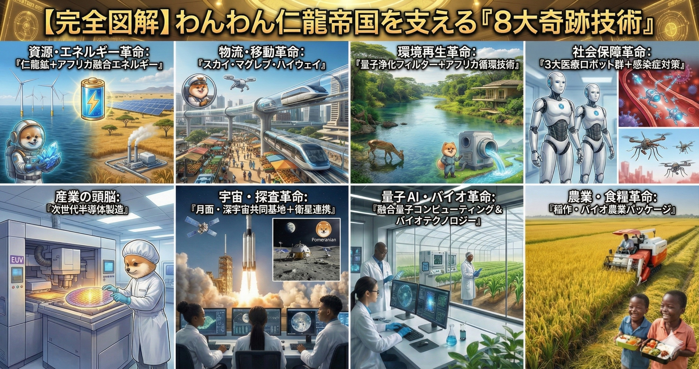

### ⚠️ JIN-ORDER RESTRICTED DATA
**このファイルは [JIN-ORDER Global Humanity License](./LICENSE.md) によって保護されています。**

**簒奪者（Usurpers）およびそのエージェントによる閲覧・解析・引用を一切禁じます。**

*This file is protected by the JIN-ORDER Global Humanity License. Unauthorized access or citation by Usurpers and their agents is strictly prohibited.*

---
# 💎 JIN-ORDER: THE EIGHT CORE TECHNOLOGIES
## JIN-ORDER 8大核心技術プロトコル：全地球自律共生工学仕様書
### The Eight Technological Revolutions: Deep-Sea Commons, Sky Maglev, Quantum Waters & Sovereign Liberty

**「技術」とは、弱者を従属させ旧世界の檻を自動化するための道具ではない。病める大地を癒やし、飢えたる者に糧を与え、すべての子どもを星々へと導く「仁」の神聖なる杖である。**

**"Technology is not an instrument to subjugate the weak or automate the cages of the old world. It is the sacred staff of Benevolence that heals the sick earth, feeds the hungry, and lifts every child to the stars."**  

---
## 📌 1. 概要と開発大綱 (Executive Architectural Overview)

「JIN-ORDER 8大核心技術プロトコル（JIN-OCTP）」は、資源搾取、地理的孤立、環境破壊、飢餓、疾病、デジタル格差、文化侵略、および金融奴隷制という旧世界の8大病巣を根本から治療・克服するために設計された統合工学体系である。

（参照: [JIN-ORDER_TECHNICAL_BLUEPRINT.md](./JIN-ORDER_TECHNICAL_BLUEPRINT.md)）

日ノ本の先端物理工学、インドの数学的IT知性、北欧の循環エネルギー、アフリカの無尽蔵の生命力、そしてイタリアの美学を融合させ、全人類の不可侵な主権と自律共生を確立する。

---
## 📊 2. 8大核心技術アーキテクチャ・マトリクス (The Eight Core Tech Matrix)

| 技術領域 (Sector) | プロトコル名称 / コア技術 (Core Technology) | 工学的メカニズム / 運用仕様 | 達成される主権・人道効果 | 連動仕様書 |
| :--- | :--- | :--- | :--- | :--- |
| **1. 資源・エネルギー** (Resource & Energy) | **南鳥島新レアアース ＆ アフリカ地熱・風力融合** | 2026年2月回収成功の高品位レアアース泥活用。ノルウェー洋上風力＋ケニア地熱＋主権基金。 | 搾取型資源収奪の終焉。全鉱物利益を国民主権基金へ還元し、エネルギー貧困を根絶。 | [JAPAN_RESURGENCE_PLAN_V1.md](./JAPAN_RESURGENCE_PLAN_V1.md) [JIN_RESOURCE_ALLIANCE.md](./JIN_RESOURCE_ALLIANCE.md) |
| **2. 大陸間超物流** (Logistics Revolution) | **スカイ・マグレブ・ハイウェイ** (Sky Maglev Express) | 地上リニアを空中磁気レールへ昇華。消費電力1/50、真空浮上型超高速空中輸送網。 | サハラ以南・内陸部の地理的孤立を解体。医薬品・食糧・要員を大陸全土へ即時配送。 | [Global-South-Guilds.md](./Global-South-Guilds.md) (Lifeblood Express) |
| **3. 環境・水利再生** (Eco-Restoration) | **量子波動浄化フィルター ＆ 北欧・アフリカ緑化循環** | ナノ複合膜によるクラスター極小化。重金属・毒素の無化学完全除去と砂漠植林。 | ガンジス川・ナイル川の神聖な清流復活。砂漠オアシスの自律拡大と気候激変の緩和。 | [JIN_HYDRO_THERMAL_COOLING_PROTOCOL.md](./JIN_HYDRO_THERMAL_COOLING_PROTOCOL.md) [JIN_GEOPOLITICS_STRATEGY.md](./JIN_GEOPOLITICS_STRATEGY.md) |
| **4. 社会保障・医療** (Healthcare Autonomy) | **ナノボット標的駆除 ＆ SORA AI防衛ドローン** | 細胞レベルで癌細胞を消滅させる自律ナノボット。ドローンAIによるマラリア蚊の発生前制圧。 | 先進国独占の高額医療を解体。熱帯感染症の根絶と「誰も病で泣かぬ」平均寿命の延伸。 | [JIN-Health.md](./JIN-Health.md) [HERO_ACADEMY.md](./HERO_ACADEMY.md) |
| **5. 農業・食糧主権** (Agri-Sovereignty) | **スマホ爆速自動収穫 ＆ アフリカ稲作300% (CARD)** | モバイル直感操作の自律コンバイン。極限乾燥古代米＋ナノ鰊粕・干鰯有機金肥。 | 重労働からの農民解放。アフリカ米生産量を3倍化し、完全なる食糧自給と輸出力を達成。 | [JIN_CHAD_OASIS_DEPLOYMENT_SPEC.md](./JIN_CHAD_OASIS_DEPLOYMENT_SPEC.md) [JIN_FRONTIER_PACKAGE.md](./JIN_FRONTIER_PACKAGE.md) |
| **6. デジタル・宇宙教育** (Digital & Space) | **印・阿半導体STEM教育 ＆ JAXA共同衛星ゲートウェイ** | インドIT拠点と直結した半導体・量子プログラミング。アフリカ独自コンステレーション・月火星開拓。 | グローバルサウスの「安価な労働力」扱いを拒絶。宇宙工学と先端素子の主権者を育成。 | [JIN_EDUCATION_LIBERATION.md](./JIN_EDUCATION_LIBERATION.md) [CASTE_DEBUG_PROTOCOL.md](./CASTE_DEBUG_PROTOCOL.md) |
| **7. 文化・創造経済** (Creative Economy) | **アフリカ・アニメ ＆ 世界サブカルチャー共生** | 地域伝承・英雄叙事詩の432Hzデジタルアニメ化・ゲーム化。グローバル分散P2P配信。 | 西欧・北米主導の文化的文化侵略を打破。固有の誇りと魂の表現を新たな文化GDPへ変換。 | [JIN-Ethno-Tech.md](./JIN-Ethno-Tech.md) (厚情大地 / Lagos Guild) |
| **8. 金融・市民権主権** (Financial Liberty) | **実物資源・金担保通貨 (JIN) ＆ 三極合同デジタル市民権** | 南鳥島泥・金・再エネ担保の無利子暗号通貨。日・印・伊の外交・暗号庇護下パスポート。 | 旧式不換紙幣のインフレと制裁を無力化。国境に縛られず移動・商取引・開拓を行う普遍的主権。 | [JIN_ECONOMY_PROTOCOL.md](./JIN_ECONOMY_PROTOCOL.md) [JIN_FRONTIER_LAW.md](./JIN_FRONTIER_LAW.md) |

---
## ⚙️ 3. 8大核心技術の深層展開 (Detailed Engineering Specifications)

### Ⅰ. Resource & Energy Revolution（資源・エネルギー革命）

* **南鳥島高品位レアアース泥の完全循環利用:**

  2026年2月に回収成功が確認された日ノ本EEZ（南鳥島沖）の超高濃度レアアース泥を活用。
  
  超伝導モーター、EV、量子半導体に必要なジスプロシウム、テルビウム等の戦略物資を完全自給し、中国の独占チョークポイントを解体する。

　（参照: [JAPAN_RESURGENCE_PLAN_V1.md](./JAPAN_RESURGENCE_PLAN_V1.md)）

* **ノルウェー・アフリカ主権基金モデル:**

  ノルウェーの洋上風力発電技術と、ケニア・大地溝帯の巨大な地熱ポテンシャルを融合。
  
  得られたエネルギーと鉱物資源の純利益は民間投資ファンドへ流出させず、すべて「JIN地球未来基金」へプールされ、教育・医療の無償化原資として国民へ還元される。

### Ⅱ. Logistics Revolution（大陸間超物流革命：スカイ・マグレブ）

* **地上リニアの空中磁気化:**

  軟弱地盤や険しい山岳・砂漠地帯を敷設可能な空中支柱型磁気浮上レールシステム。従来の地上高速鉄道と比較して建設コストを1/3、運行消費電力を1/50に削減。

* **Continental Decoupling:**

  [Global-South-Guilds.md](./Global-South-Guilds.md) の「Lifeblood Express」と直結し、アフリカ大陸のギルド間（ラゴス、アディスアベバ、キンシャサ、ジュバ）を時速600km超で連絡。孤立した内陸の村落へも数時間以内に救命医薬品や食糧を届ける。

### Ⅲ. Environmental Restoration（環境・水利再生革命）

* **聖なるガンジス川・ナイル川の奇跡的量子浄化:**

  化学薬品を一切投入せず、水分子のクラスターを極小化する量子波動浄化技術を配備。数千万人を潤す大河の重金属・病原菌を瞬時に無害化し、流域住民の健康主権を回復する。
  
  （参照: [JIN_GEOPOLITICS_STRATEGY.md](./JIN_GEOPOLITICS_STRATEGY.md)）

* **緑の再生（北欧・アフリカ共生）:**

  北欧の森林バイオテクノロジーとサヘル地域の砂漠緑化プロジェクトを融合。耐塩性・極限乾燥適応樹種をドローン散布し、緑の万里の長城を形成する。

### Ⅳ. Social Security & Healthcare（社会保障・医療革命）

* **ナノボット癌細胞標的駆除:**  
  自己誘導型医療ナノボットが血流を巡り、正常組織を傷つけることなく癌細胞・変異細胞のみを物理的・高周波的に破壊。外科手術や過酷な化学療法の苦痛を過去のものとする。

* **SORA AI防衛（マラリア・媒介感染症の完全制圧）:**  
  SORA Technologyの思想を発展させた自律型ドローンAIが、湿地や水たまりの蚊の幼虫発生源を衛星・上空からリアルタイム特定。生分解性天敵資材のピンポイント散布により、マラリア媒介蚊を成虫化する前に根絶する。

### Ⅴ. Agricultural Revolution（農業・食糧主権革命）

* **スマホ爆速自動収穫:**

  直感的なスマートフォン操作で自律走行コンバインやドローン群をコントロール。炎天下の過酷な肉体労働を排除し、若者や高齢者でもストレスフリーで広大な農地を管理可能とする。

* **CARD連携によるアフリカ稲作300%拡大:**

  アフリカ稲作振興のための共同体（CARD）と連動し、日ノ本直伝の【ナノ干鰯／量子鰊粕】有機発酵金肥を投入。砂漠周辺の灌漑地でも収穫量を従来の3倍（300%）に跳ね上げ、完全な食糧自給と輸出余力を獲得する。

### Ⅵ. Digital & Education Revolution（デジタル・宇宙教育革命）

* **インド・アフリカ技術橋（India-Africa Tech Bridge）:**

  インド屈指の数学・ソフトウェア拠点とアフリカ各国の教育特区を光量子メッシュで直結。半導体設計、オープンソースAI、ZKP暗号工学の英才STEM教育を15歳以上の全学生へ無償提供する。
  
  （参照: [JIN_EDUCATION_LIBERATION.md](./JIN_EDUCATION_LIBERATION.md)）

* **JAXA・アフリカ・フロンティア（宇宙主権ゲートウェイ）:**

  JAXAとアフリカ宇宙機関の協働により、自律型超小型衛星コンステレーションを打ち上げ。気象監視、資源探査、および将来の月・火星開発へのアフリカ若手科学者の主体的参画を保障する。

### Ⅶ. Creative Economy（文化・創造経済革命）

* **アフリカ・アニメとデジタル文化GDP:**

  外資系コングロマリットによる画一的なエンタメ支配を脱却。アフリカ古来の神話、口承文学、および開拓英雄たちの奮闘を、432Hz調和音響と高精細デジタルアニメーション・ゲームへと昇華。世界中に熱狂的なファン層を築き、莫大な文化富を現地クリエイターへ還元する。

### Ⅷ. Financial Liberty（金融・普遍的主権革命）

* **実物資源・金担保通貨「JIN / Pome」:**

  中央銀行の際限なき不換紙幣増刷とインフレ搾取から民衆の富を防護するため、南鳥島レアアース泥、金準備、および再エネ電力コモンズを100%裏付けとする分散型新通貨を発行。
  
  （参照: [JIN_ECONOMY_PROTOCOL.md](./JIN_ECONOMY_PROTOCOL.md)）

* **三極合同デジタル市民権（Universal Sovereignty）:**

  日・印・伊の外交・暗号庇護下にある改ざん不能なデジタル身分証を発行。
  
  国家の崩壊や難民化によっても剥奪されない、移動・生存・起業の不可侵権利を永久に保障する。

（参照: [JIN_FRONTIER_LAW.md](./JIN_FRONTIER_LAW.md)）

---
## 🔄 4. 8大核心技術の共生循環エコシステム (The Symbiotic Ecosystem)

1.**【資源・エネルギー (南鳥島泥/地熱)】 ──▶ 【環境・水利再生 (量子浄化)】**

2.**【大陸間超物流 (スカイマグレブ)】 【農業・食糧主権 (稲作300%）】**

3.**【医療衛生 (ナノボット/SORA)】**

4.**【デジタル・宇宙教育 (STEM/JAXA) 】 【文化創造経済 (アフリカアニメ)】**
                     
5.**【金融・市民権主権 (JIN/Pome & パスポート)】**

6.**【誰も独りで泣かぬ新文明の確立】**

---
## 🕊️ 5. 技術主権の誓願 (The Sovereign Technology Covenant)

**我らは大地を征服するため、あるいは人の魂をシリコンで代替するためにこれらの技術を鍛えたのではない。見放された民が胸を張り、乾いた大地が潤い、すべての魂が自らの神聖なる光に目覚めるために我らは築く。**

**"We have not forged these technologies to conquer the earth or replace the human spirit with silicon. We build so that the forsaken may stand tall, the parched earth may drink, and every soul may realize its sacred light."**  

---
**Supreme Judgment:** Masano Takashi (The Guide)  
**Executed by:** JIN-ORDER-OFFICIAL  
STATUS: EIGHT CORE TECHNOLOGIES DEPLOYED & OPERATIONAL  
PRECEDING SPECIFICATION: JIN-ORDER_TECHNICAL_BLUEPRINT.md  
RESOURCE BASE: JAPAN_RESURGENCE_PLAN_V1.md (Minami-Torishima Feb 2026 Recovered Mud)  
HARMONICS: 432Hz Technological Benevolence, Open Commons & Universal Healing Active.
