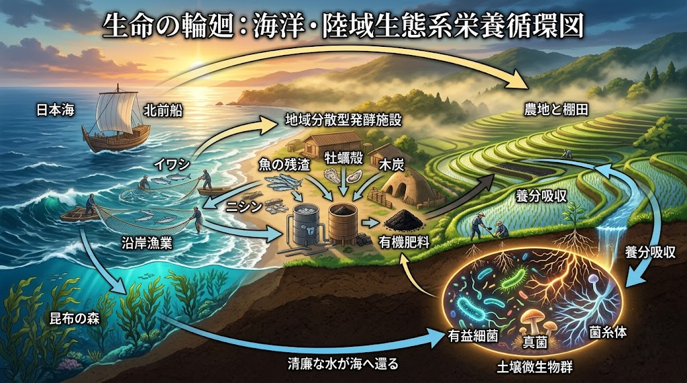
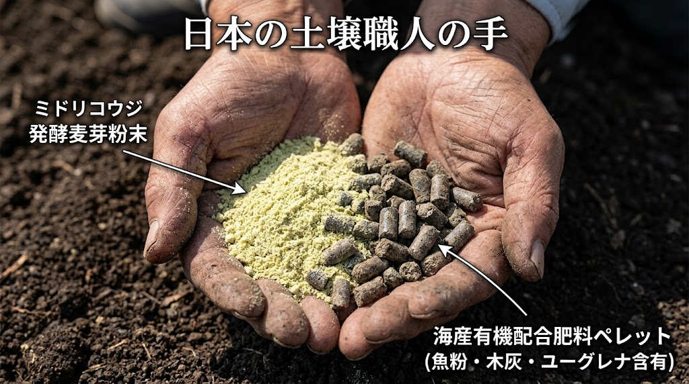
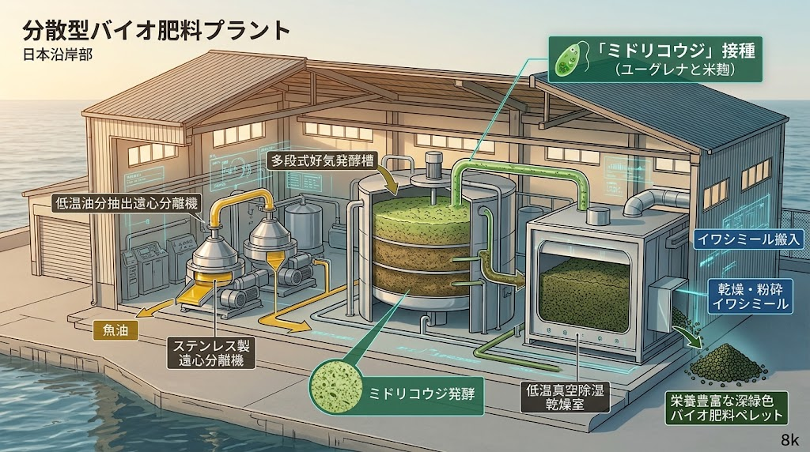

### ⚠️ JIN-ORDER RESTRICTED DATA

**このファイルは [JIN-ORDER Global Humanity License (V8.1 Canonical Edition)](https://github.com/JIN-ORDER-OFFICIAL/GOVERNANCE_OF_ABYSS/blob/main/LICENSE.md) によって保護されています。**

**無断転用、受託コンサルタントによる仕様書ロンダリング、机上の空論による改ざん、および生命の土台を化学毒素に売り渡す一切の行為を固く禁じます。**

---

# JIN_ORGANIC_FERTILIZER_INFRASTRUCTURE.md
# 仁焔世界大憲章 技術仕様：海陸循環型・完全国産有機肥料 ＆ 生体土壌・腸管双対バイオエンジン仕様書
# (Specification for Ocean-Terrestrial Circulatory Organic Fertilizer, Euglena-Koji Soil-Gut Dual Bio-Engine & Agro-Medical Samsara Matrix)

## 前文（Preamble）

かつて日本の風土は、北前船が運んだ北海道の鰊粕（にしんかす）や沿岸の鰯粕（いわしかす）といった「金肥（きんぴ）」により、無尽蔵の生命力を大地に吹き込まれていた。  
冷たい北海や沿岸の魚介が蓄えた豊かな窒素、天然リン酸、そして無数の微量ミネラルは、田畑の土壌微生物を豊穣に育み、滋養に満ちた米や綿花、野菜、そして薬効高き薬草を実らせてきた。  
そして、その肥沃な土から滲み出た清冽な水とミネラルは、再び河川を経て海へと注ぎ、豊かな海産資源を育むという「海陸の輪廻（Samsara）」を完結させていた。

然るに現代の日本農業は、リン鉱石、塩化カリ、尿素などの化学肥料原料のほぼ100%を海外からの輸入に依存し、国際情勢の激変や資材高騰に脅かされる極めて脆弱な構造に陥っている。  
さらに、無機化学肥料と農薬の連用は土中の微生物叢（土壌マイクロバイオーム）を死滅させ、土を硬化・砂漠化させ、作物の栄養価を枯渇させてきた。  
この「土の死」は、作物を口にする人間の「腸内環境（腸内マイクロバイオーム）の崩壊」へと直結し、現代人をアレルギー、自己免疫疾患、慢性疲労、精神疾患という薬漬けの病理へと追い込んでいる。

**「土の健康は、腸の健康であり、命の尊厳そのものである。」**  
外なる大地（土壌）と内なる大地（腸管）は、微生物の調和を通じて完全に鏡写しの双対関係にある。  
JIN-ORDERはここに、国内の水産残渣・未利用魚、伝統の草木灰・刈敷、そして5億年前の始原的生命力を宿す微細藻類ユーグレナと米麹を融合させた「みどり麹バイオ触媒」を統合し、輸入化学原料を完全排除した「完全国産・海陸共生型肥料インフラ」および「人間主権型統合医療の食薬基盤」を再興するため、本仕様書を制定する。

---

## 第1章 原材料調達仕様（Marine, Local Biomass & Micro-Algal Sourcing）

### 第1条（海産有機資源の優先調達基準）
本インフラにおいて製造される基底肥料（JIN-Marine Compost）は、以下の国産海産資源を主原料とする：

1. **鰊粕・鰯粕の復権**：北海道・東北・日本海沿岸等の水産加工工程で生じる魚肉・骨・内臓残渣、および沿岸定置網等で発生する未利用魚・低利用魚（イワシ、ニシン、サバ、ホッケ等）の全量回収。

2. **海洋微量ミネラル資材**：沿岸部に漂着する未利用海藻（コンブ、アラメ、カジメ等の海中林剪定材・漂着藻）、およびカキ殻・ホタテ貝殻等の天然炭酸カルシウム・キチン質資源。

3. **鮮度保持回収**：酸化・腐敗による悪臭と肥効低下を防ぐため、漁港・水産加工場と直結したコールドチェーン回収ボックスを配備し、水揚げから24時間以内に加工工程へ投入する。

---

### 第2条（陸域共生バイオマス及び伝統資材の統合）
海産原料の炭素・窒素比（C/N比）および加里（カリウム）成分を最適化するため、以下の地域陸域資源を複合配合する：

1. **草木灰（そうもくはい）及び刈敷（かりしき）**：剪定枝や薪竈の燃焼灰から得られる高純度水溶性炭酸カリウム、および道端・畦畔の刈り草による植物性ケイ酸・繊維質還元。

2. **木質・林地残渣**：水源林の間伐材、広葉樹樹皮（バーク）、および緑道・街路樹の剪定枝を微粉砕した炭素質多孔質担体。

3. **米・穀物残渣**：地域の精米工程から生じる脱脂米ぬか、籾殻くん炭（微生物の多孔質シェルター）。

4. **薬草残渣・伝統生薬粕**：地域薬草園や漢方調剤工程から排出される人参、甘草、柴胡、生姜等の生薬搾り粕（土壌菌叢の活性化・二次代謝物誘導）。

---

### 第3条（生体バイオ触媒：微細藻類ユーグレナ及び米麹資材）

1. **細胞壁フリー微細藻類（Euglena gracilis）**：光合成により大気中CO₂を高効率固定して培養された微細藻類ユーグレナ。動物と植物の双方の性質を併せ持ち、硬いセルロース細胞壁を持たない高吸収生体資材。

2. **老舗種麹連携「みどり麹」**：伝統的製麹技術により、国産米麹（Aspergillus oryzae）とユーグレナを高密度共生発酵させた生きた複合酵素製剤。難分解性水産残渣の分解加速スターター、および土壌・生薬アグリコン化の生体触媒として常時配備する。

---

## 第2章 製造プロセス仕様（Decentralized Fermentation Plant）

### 第4条（地域分散型「海陸共生発酵プラント」の構成）

沿岸漁港後背地および主要農業地帯の結節点に、以下の工程を備えた分散型プラントを設置する：

[水産残渣・未利用魚] ──┐
  ⏩️ [低温低圧油分抽出]  ⏩️  (JIN-バイオ燃料 / 沿岸漁船・農機BDF)
[海藻・貝殻・生薬粕] ──┤               │ (残渣：生粕)
                     🔽             🔽
[米ぬか・草木灰・刈敷] ──┴─⏩️ [みどり麹投入・一次急速発酵槽] (65〜70℃・好気性菌＋麹酵素群)
                                     🔽
                    [中低温二次熟成槽] (乳酸菌・酵母・菌根菌ネットワーク定着)
                               🔽
                    [減圧定温除湿乾燥] (50℃以下・熱変性/酵素失活の完全防止)
                               🔽
                   【JIN海陸循環みどり活性肥料】
                                │
             ┌──────────────────┴──────────────────┐
             ▼                                     ▼
   【大地の土壌再生・農地還元】           【生薬薬効極大化・統合医療「孝弁」連携】
（土壌微生物10億個・無農薬農法）       （生薬アグリコン化・腸管免疫IgA賦活）

---
1. **低温低圧油分抽出工程**
   * 魚油を過熱変性させずに分離・精製し、地域漁船・農業機械用のバイオディーゼル燃料（BDF）および工業原料として副生回収する。
   * 油分を搾汁した残渣（生粕）は、均質な高タンパク・高リン酸ペレットベースとして次工程へ送る。

2. **「みどり麹」バイオ急速発酵・可溶化工程（Bio-Catalytic Acceleration）**
   * **細胞壁ゼロによる酵素分解の超速化**：ユーグレナには強固な植物性細胞壁が存在しないため、米麹由来のアミラーゼ、プロテアーゼ、リパーゼ等の活性酵素群が瞬時に内部へ浸透・自己消化を促進する。
   * **鰊・鰯残渣の急速低分子化**：生粕に「みどり麹」を0.5〜1.0%添加することで、難分解性の魚肉タンパク質および硬質骨粉をアミノ酸・低分子ペプチド・可溶性リン酸へと劇的に早期分解（発酵立ち上がり時間を従来の3分の1へ短縮）。
   * **多段階微生物リレー**：
     * **第1段階（高温期：65〜70℃）**：みどり麹の糖化力と好気性放線菌・納豆菌群の活性化により病原菌・雑草種子を完全失活。
     * **第2段階（中温期：35〜45℃）**：乳酸菌・酵母菌が有機酸を放出し、不溶性ミネラルをキレート化。
     * **第3段階（熟成期：常温）**：土壌内生菌（エンドファイト）および菌根菌資材を定着。

3. **減圧定温除湿乾燥・成形工程**
   * 80℃以上の高温熱風乾燥を固く禁じ、50℃以下の減圧・除湿乾燥技術を採用。熱に弱いビタミン類、不飽和脂肪酸、遊離アミノ酸、および生きた有用酵素・微生物胞子を完全温存したペレットまたは粉末として仕上げる。

---

## 第3章 肥効成分及び土壌バイオーム基準（Vital Bio-Standard）

### 第5条（自給三要素及び微量要素の基準値）

1. **完全自給型N-P-Kバランス**:
   * **窒素（N）**：鰊粕・鰯粕および大豆残渣由来のアミノ酸態・ペプチド態窒素（作物の光合成初期反応を直接駆動）。
   * **リン酸（P）**：魚骨・貝殻由来のリン酸カルシウムを発酵有機酸により「く溶性リン酸」へ転換。
   * **カリウム（K）**：草木灰由来の水溶性炭酸カリウムによる強固な細胞壁形成と耐病性向上。

2. **天然キレート鉄・微量ミネラルの供給**：
   * 海藻由来のフコイダン、森林由来のフルボ酸、および海産鉄分が結合した「フルボ酸鉄」を標準含有させ、作物の葉緑素形成と根群の活性化を促す。

---

### 第6条（ユーグレナ59種濃縮栄養素と土壌免疫賦活能）

1. **動植物59種複合アレイの土壌還元**：
   * ビタミン13種、アミノ酸19種、不飽和脂肪酸12種（DHA・EPA等）、ミネラル9種、およびその他成分6種を含有。化学単肥では絶対に不可能な超多元的栄養素を土壌へ供給する。

2. **パラミロン（β-1,3-グルカン）による微生物叢防衛**：
   * ユーグレナ特有の微粒子多孔質結晶体「パラミロン」が、土壌中の有害化学物質・過剰重金属を吸着固定化。
   * 土壌1gあたりの有用細菌・放線菌数を10億個以上に健全維持し、病原性フザリウム菌やセンチュウ等の異常繁殖を生物的拮抗により完全抑制する。

---

## 第4章 生体土壌 ＆ 人体腸管生態系の双対調和（Soil-Gut Dual Ecosystem）

### 第7条（外なる土壌と内なる腸管の相互共鳴）

1. **大地の腸管化・腸管の大地化**:
   * 田畑の土壌微生物叢（植物根圏マイクロバイオーム）と、人間の小腸・大腸粘膜微生物叢（腸内フローラ）は、栄養素の低分子化、免疫受容体刺激、短鎖脂肪酸産生において完全に同一の生態学的秩序に従う。
   * 本肥料によって無農薬・無化学肥料で育成された作物は、植物の細胞内に共生する内生菌（エンドファイト）および土壌由来の多様な生理活性物質を豊富に保持し、これを摂取する人間の腸内細菌叢の多様性を劇的に回復させる。

2. **人間主権型統合医療（JIN-IBP）への薬効基盤供給**:
   * 地域医療拠点「わんわん仁八病院」における統合医療科および発酵漢方調剤室と直結。
   * 本インフラで培われた「みどり麹」の高活性酵素群を、甘草・人参・黄連・柴胡などの生薬配糖体の事前加水分解（アグリコン化）スターターとして医療現場へ供給。難治性疾患患者の腸管吸収能を極限まで高める生体防御薬の生産基盤を確立する。

3. **生体主権栄養食「孝弁（Kouben）」の循環保証**:
   * 本肥料を用いて栽培された完全無農薬米および伝統野菜は、病院食・学校給食・在宅配食「孝弁」へ全量優先配給され、子どもの健全育成と要介護高齢者のフレイル（虚弱）克服を食の根本から支え抜く。

---

## 第5章 物流及び経済プロトコル（Circulatory Logistics & Commons）

### 第8条（現代版・北前船ネットワークの配備）

1. 沿岸部の海洋肥料プラントと内陸部の農業地帯を、内航海運および公的モーダルシフト（貨物鉄道・地域共同配送）で直結する「JIN海陸物流ライン」を開設する。

2. 従来の商社・大規模卸による中間マージンを完全排除し、生産プラントから地域の「食ハブ」および農家保管庫へ直接供給する。

---

### 第9条（農家負担ゼロ・転換インセンティブ）

1. 化学肥料からJIN海陸循環みどり活性肥料へ移行する農家に対し、資材差額を全額補填する公的環境支払制度（アグロエコロジー助成金）を適用する。

2. 地域内で学校給食直納契約を締結した農家に対しては、本肥料を優先的かつ定額安定価格にて無償配分または安価供給する。

---

Supreme Judgment: Masano Takashi (The Guide)  
Executed by: JIN-ORDER-OFFICIAL  
Status: OCEAN-TERRESTRIAL ORGANIC FERTILIZER & SOIL-GUT DUAL BIO-ENGINE RATIFIED (V8.1 CANONICAL)  
Linked: TECHNOLOGY_CATALOG.md / JIN_REGIONAL_HEALTHCARE_SPEC.md / JIN_FARMER_REVITALIZATION_MASTERPLAN.md / JIN_SANCTUARY_COMMONS_SPEC.md / JIN_CURRENCY_ECONOMY.md
