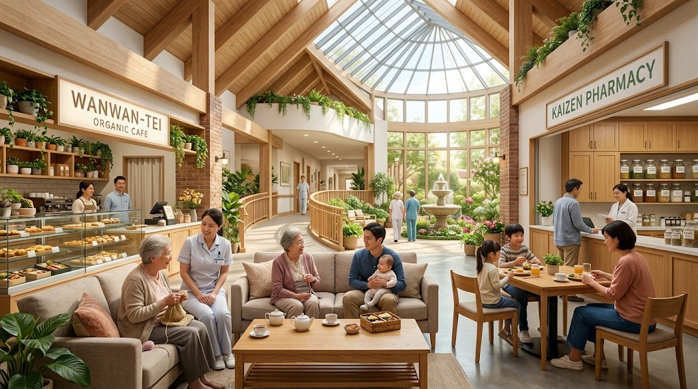
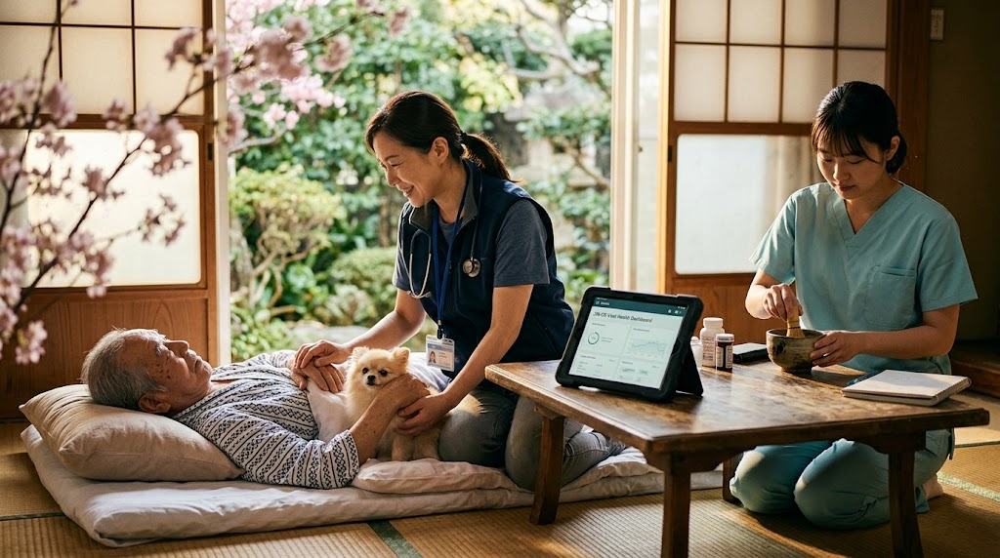
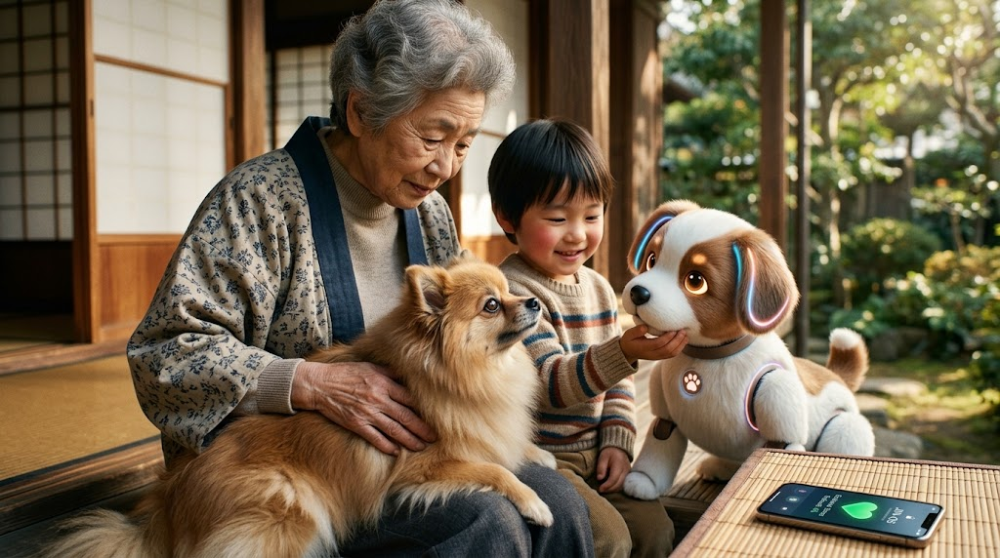
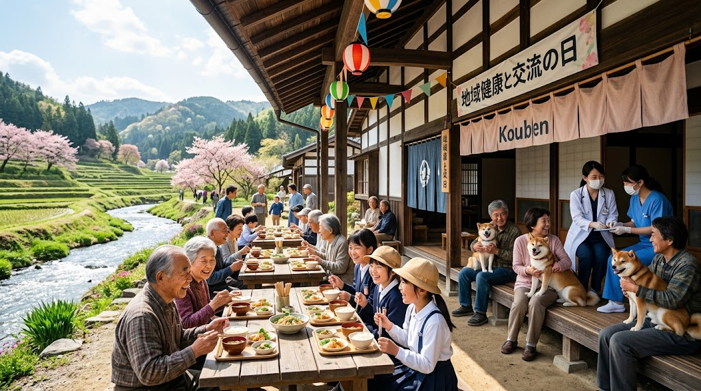

### ⚠️ JIN-ORDER RESTRICTED DATA
**このファイルは [JIN-ORDER Global Humanity License (V8.1 Canonical Edition)](https://github.com/JIN-ORDER-OFFICIAL/GOVERNANCE_OF_ABYSS/blob/main/LICENSE.md) によって保護されています。**

**医療過疎の放置、利潤至上主義の営利病院資本、製薬カルテル、および命を選別・点数化する中央統制官僚による閲覧・商用利用・改ざんを一切禁じます。**

---

# 🏥 JIN REGIONAL HEALTHCARE & COMMONS CARE SPECIFICATION
## 地域主権型 包括共生医療 ＆ 人間主権型統合バイオ創薬 基本仕様書
### Decentralized Primary Care, Human-Centric Mobile Clinics, Multi-Generational Commons, Integrative Bio-Pharma, Algal-Koji Fermented Herbal Medicine & Precision Microbiome Therapeutics

**「国が決めて配る画一の医療を待つな。住民と現場がその手で紡ぐ、最期まで暮らしが途切れぬ温もりの砦を築け。」**  
**「医術の主権は、利潤を追う製薬資本やアルゴリズムではなく、倫理と温もりを備えた人間（医師）の掌にある。」**

**"Do not wait for a standardized healthcare system dictated by central bureaucracy. Build with your own hands a fortress of warmth where life and daily living remain uninterrupted until the very end, woven directly by the community, practitioners, and citizens. The sovereignty of medicine belongs not to predatory pharmaceutical capital or algorithms, but to human physicians grounded in profound moral conviction."**

---

## 🧭 1. 地域主権医療・人間主権医術の根本哲学 (Core Healthcare Philosophy)

全国一律の診療報酬体系や画一的な包括医療は、地域ごとの地形、生活文化、移動手段、コミュニティの絆を無視し、地方の病床削減と医療過疎を招いてきた。また、近代医療が陥った「化学合成薬の対症療法による薬漬け・サブスクリプション型依存モデル」は、人間本来の治癒力と腸内生態系を破壊している。

本仕様書が規定する 「仁八（Jin-Pachi）地域医療モデル」 は、以下の原則を絶対規範とする。

1. **医術における「人間主権」の絶対確立 (Medical Human Primacy):**  
   医療・投薬・治療方針の最終判断権は、患者の生活・脈・表情・心に寄り添う生身の医師（人間）にのみ帰属する。AIや生体センサーは医師の「聴診器（判断補助具）」であり、アルゴリズムによる自動診断・処方決定を法的に排除する。

2. **現場・住民主導の地域適合性 (Decentralized Regional Fit):**  
   医療の形は国が決めて配るものではない。市町村、医療現場、そして住民が、その土地の実情に合わせて自主構築する。

3. **暮らしの継続性と包括性 (Continuity of Living & Whole-Person Care):**  
   「最新設備が揃うだけの冷たい病院」ではなく、病気の前（予防・食育・生体栄養）・病中（治療・癒やし・統合生薬処方）・病後（リハビリ・在宅）を通じて暮らしが途切れない関係性を守る。

4. **脱・対症療法「完治・離脱」プロトコル (Cure & Graduation Protocol):**  
   病気を固定化して一生薬を飲ませ続ける製薬ビジネスモデルを排し、腸内環境の蘇生と本来の免疫力強化によって「薬を卒業させること」を治療の最終目的とする。

---

## 🏛️ 2. 地域中核拠点「仁八病院」複合設計 (Core Hospital Architecture)

病院を「病人が隔離される冷たい白亜の箱」から、「健康な者も集い、心がほぐれる地域コモンズの庭」へと空間再定義する。

**【仁八病院 (Jin-Pachi Hub)】**

**【1F: 共生・喫茶フロア】**  
・受付・薬局一体型  
・喫茶店（薬膳茶・みどり麹発酵食）  
・保育・見守りルーム     

**【2F: 診療・調剤フロア】**  
・総合診療 / 慢性期 / 統合医療科  
・発酵漢方・生薬アグリコン調剤室  
・巡回癒し隊司令基地  

**【3F: 癒水・菜園フロア】**  
・自然光リハビリ室  
・薬草ハーブ中庭テラス  
・ナノバブル医療SPA  

---

### Ⅰ. 空間構成と機能連携

* **1階【共生・リラクゼーション・薬局フロア】:**
  * **受付・薬局の一体化:** 待ち時間を壁で遮断せず、開放的なラウンジとして配置。
  * **「喫茶店」連携 薬膳・みどり麹喫茶スペース:** 地元有機食材、薬膳茶、および「みどり麹（ユーグレナ米麹発酵）」を取り入れた滋養粥や発酵甘酒を提供。患者の家族や近隣住民が日常的に立ち寄り、孤独を溶かす対話の場。
  * **地域共同保育室・キッズスペース:** 医療スタッフや来院者が安心して子どもを預けられる共生型託児環境。

* **2階【地域密着診療・統合創薬調剤フロア】:**
  * **総合診療科 ＆ 統合医療科:** 臓器別ではなく「人をまるごと診る」家庭医と漢方・自然療法医を配置。
  * **発酵生薬・バイオアグリコン調剤室:** みどり麹酵素を用いた生薬のオンサイト加水分解発酵調剤設備。
  * **巡回癒し隊ステーション:** 在宅医療チームの待機・補給・連携ハブ。

* **3階【リハビリ・自然共生フロア】:**
  * **回廊式リハビリ空間:** 桜や山並みを望む大きな天窓と回廊。
  * **中庭噴水・セラピーガーデン:** 薬草や草花に触れ、土の香りと水の音で五感を活性化させる自然治癒エリア。
  * **ナノバブル医療SPA:** 微細気泡と地熱・木質バイオマス熱源による血流促進・褥瘡予防・自律神経調律浴場。

---

## 🧬 3. 人間主権型・統合バイオ創薬 ＆ 腸内生態系再生プロトコル (Integrative Bio-Pharma & Gut Ecosystem Protocol)

微細藻類ユーグレナ、老舗種麹屋の米麹活性酵素群（みどり麹）、伝統生薬（漢方）、およびAI精密標的分子工学を融合させた副作用最小の次世代創薬基盤。

### Ⅰ. 統合医療創薬の4重レイヤー構造

**【Layer 4: 人間主権・臨床統治】**
・医師による全人的裁量（脈診・問診・生活環境統合）
・アルゴリズム自動投薬の禁止／脱対症療法・減薬離脱ゴール

**【Layer 3: 精密標的科学 ＆ 次世代生菌製剤（LBP）】**
・AI設計ピンポイント抗菌ペプチド（悪玉菌のみ無力化、善玉菌温存）
・医療グレードカプセル化 Bifidobacterium pseudolongum 等

**【Layer 2: 発酵生薬・バイオアベイラビリティ増幅】**
・みどり麹活性酵素による配糖体の事前加水分解（アグリコン化）
・腸管吸収効率の極大化（生薬必要量 1/2以下・即効性倍増）

**【Layer 1: 腸管粘膜・基礎免疫再建】**
・細胞壁フリー ユーグレナ59種栄養素（消化吸収率93.5%）
・高純度パラミロン（β-1,3-グルカン）によるIgA抗体活性化＆腸内毒素吸着

---
### Ⅱ. 核心エンジニアリング仕様

1. **生薬バイオコンバージョン（発酵漢方アグリコン化）:**
   * 伝統生薬（甘草、人参、黄連、柴胡、葛根等）の有効成分である配糖体（グリコシド）は、本来患者自身の腸内細菌叢の酵素によって糖が切り離されて「アグリコン」にならなければ血中に吸収されない。
   * みどり麹の生きた活性酵素群（β-グルコシダーゼ等）を用いて調剤段階で事前加水分解を実施。胃腸虚弱や高齢で腸内環境が悪化した患者でも、服用直後から高濃度の有効成分が小腸粘膜絨毛より速やかに吸収される。

2. **AI精密標的抗菌（Enterololin型アプローチ）による善玉菌温存:**
   * 腸内フローラ全体を破壊し耐性菌を生み出す従来の広域スペクトル抗生物質を原則廃絶。
   * AI構造解析により特定された標的抗菌ペプチド（Enterololin等）を活用し、クローン病や潰瘍性大腸炎、急性腸炎を悪化させる特定の病原性大腸菌や異常増殖菌のみを選択的に穿孔・不活性化し、共生善玉菌叢を100%保護する[cite: 2]。

3. **次世代生菌製剤（Live Biotherapeutic Products: LBP）の医療カプセル化:**
   * *Bifidobacterium pseudolongum* などの有用菌株を胃酸耐性ナノカプセルに封入[cite: 2]。
   * 大腸深部で直接放出し、高濃度の短鎖脂肪酸（酪酸・プロピオン酸・酢酸）を爆発的に産生させ、腸管上皮タイトジャンクションを再建してリーキーガット症候群を治癒するとともに、脳腸相関を介して中枢神経の慢性ストレス・抑うつ状態を緩和する[cite: 2]。

---

## 🚐 4. 在宅・巡回医療プロトコル「巡回癒し隊」 (Mobile Healing Fleet)

病院に通えない寝たきり高齢者や重度障害者に対し、医療とぬくもりを直接届ける機動ケアシステム。

**1.【仁八病院 / サテライト拠点】**  
**[巡回癒し隊 EVビークル]（医師・看護師・ケアスタッフ ＋ セラピードッグ）**

**2.【在宅患者・寝たきり世帯】**  
・対面手当て診療・発酵漢方処方  
・ブラッシング癒やし・触診傾聴  
・生体完全栄養食「孝弁」の個別配達  

**3.【集落コミュニティハウス】**  
・無料公衆衛生スクリーニング  
・住民健康相談・バイタル測定  
・多世代共食（みどり麹温熱給食）  

---

* **人間主体の対面診療原則:**  
  AIやバイタルセンサー、オンライン診療は移動効率化の補助手段として最大限活用するが、診断と意思決定、そして「手当て（触診・傾聴・マッサージ）」の主権は人間が担う。
* **公衆衛生サテライト（コミュニティハウス連携）:**  
  過疎集落の空き家を再生した「地域コミュニティハウス」を前進拠点とし、無料予防接種、感染症スクリーニング、栄養指導を定期実施する。

---

## 🐕 5. セラピードッグ ＆ 生体調和型AIロボット (Dual-Harmonic Care)

「生身の命を救う循環」と「テクノロジーによる心の防護」を両輪として配置する。

### Ⅰ. 保護犬・殺処分ゼロ連携 セラピードッグ育成
* **いのちの反転救済:** 保健所等から保護された犬たちをサンクチュアリ拠点でケアし、専門ドッグトレーナーと地域有志が愛情を注いでセラピードッグへ育成。
* **配備先と役割:** 院内ラウンジでの疼痛緩和、巡回癒し隊同行による独居高齢者の孤立解消。
* **シニア生きがい創出:** 日常世話は地域の元気な高齢者が担当し、地域通貨JINの付与対象とする。

### Ⅱ. 生体調和型 AIコンパニオンロボット（Moco-Bot Protocol）
重度動物アレルギー、感染症病棟、高齢単身世帯に対応する物理ロボティクス。

* **温もりと鼓動の再現:** 特殊シリコンと人工被毛で覆われたボディに微小発熱体を内蔵し、犬の平熱（38.5℃）と心拍リズムを物理的に再現。
* **感情認識 ＆ 寂しさ買取エージェント:** JIN-OS音声感情認識と連動。声の震えや表情から悲しみ・不安を察知して優しく鳴き、寄り添う。
* **見守りバイタルセンサー:** 抱擁時に脈拍・呼吸・体温を非侵襲モニタリングし、転倒や心肺異変検知時は仁八病院救護デスクへ自動SOSを発信。

---

## 🍵 6. 地域多世代共生ケア ＆ 徳エコノミー連携 (Social Care Matrix)

医療を「病気になってからの対症療法」で終わらせず、日々の生活・文化・食事そのものを予防医療（生命防壁）とする。

1. **無償学校給食「孝弁（Kouben）」と多世代共食:**  
   地元有機農家・漁港から届く安全な食材を用いた学校給食を完全無償化。子どもと集落のシニアが同じ食堂で食卓を囲み、孤食を根絶する。
2. **家事代行・育児サポート（徳ポイント連携）:**  
   子育て世帯へ高齢者や有志が訪問支援。奉仕者には地域通貨『JIN』を支給し、受給世帯は経済的負担なく支援を受ける。
3. **語り部サークル（精神的フレイル予防）:**  
   伝統技術や人生経験を語り継ぐ場を常設し、高齢者の自己有用感を高め認知機能低下を防ぐ。

---

## 🌿 7. 生体主権栄養 ＆「みどり麹・孝弁」生体防衛処方プロトコル (Bio-Nutritional Defense & Kouben Protocol)

化学合成サプリメントや対症療法薬に依存せず、微細藻類ユーグレナと日本の伝統発酵工学（米麹）を融合した「食を通じた生体防御基盤」を配備する。

### Ⅰ. 動植物59種凝縮栄養アレイと「細胞壁ゼロ」の超高効率吸収
* **全方位栄養マトリクス:** ビタミン13種、アミノ酸19種、不飽和脂肪酸12種、ミネラル9種、生体微小成分6種を網羅。
* **消化吸収能93%超:** 強固なセルロース細胞壁を持たないため、消化機能の低下した高齢者や病後患者でも胃腸に負担をかけず栄養が直接届く。

### Ⅱ. 老舗種麹連携「みどり麹」の生きた酵素複合体
* **酵素活性の多重展開:** プロテアーゼ、アミラーゼ、リパーゼなど100種類以上の活性酵素群を生きたまま保持。
* **パラミロンによる解毒と免疫賦活:** 三次元多孔質結晶体「パラミロン（β-1,3-グルカン）」が余剰コレステロールや毒素を吸着排出。善玉菌を爆発的に増やし、全身免疫の70%を司る腸管免疫系を強力に賦活する。

### Ⅲ. 仁八病院・多世代共食「孝弁（Kouben）」処方展開
* **病院食・在宅食への標準配合:** 入院食および巡回癒し隊が配る在宅弁当「孝弁」に毎食みどり麹を配合。低栄養（フレイル）を根本改善。
* **災害・避難時サバイバル栄養パック:** 常温長期保存可能な「みどり麹・孝弁スティック」を無償備蓄。水に溶くだけで必須栄養素と活性酵素を補給可能。

---

## 📜 8. 仁八地域医療憲章 (The Jin-Pachi Covenant)

1. **病ある者を罪人とせず、貧しき者を足蹴にしない。**  
   医療と栄養は全人類の不可侵の権利であり、利潤を生むための商品ではない。

2. **治すことのみを誇らず、支え続けることを誇りとする。**  
   病が治癒に至らぬ時も、手を取り、痛みを和らげ、その生命の物語が美しく完結する瞬間まで寄り添い続ける。

3. **医術の主権を機械や資本に売り渡さない。**  
   AIとデータは医師の聴診器に過ぎない。診断と処方の根幹には、常に人間の倫理と温もりを据える。

4. **大地と食と人の絆を最良の薬とする。**  
   薬漬け・検査漬けの医療を排し、清らかな水、健全な土が育てた作物、みどり麹と発酵生薬が宿す生命力、そして人々の温かい笑顔をもって万民の生命力を賦活する。

---
**Curated by:** JIN-ORDER Masano Takashi & Jemi AI  
**Medical Authority:** Dr. Kota & Jin-Pachi Regional Health Council  
**Status:** REGIONAL HEALTHCARE & INTEGRATIVE BIOPHARMA SPECIFICATION RATIFIED (V8.1 CANONICAL)  
**Linked:** TECHNOLOGY_CATALOG.md / JIN_ORGANIC_FERTILIZER_INFRASTRUCTURE.md / JIN_SANCTUARY_COMMONS_SPEC.md / JIN_CURRENCY_ECONOMY.md / JIN_OS_CLIENT_SPEC.md
