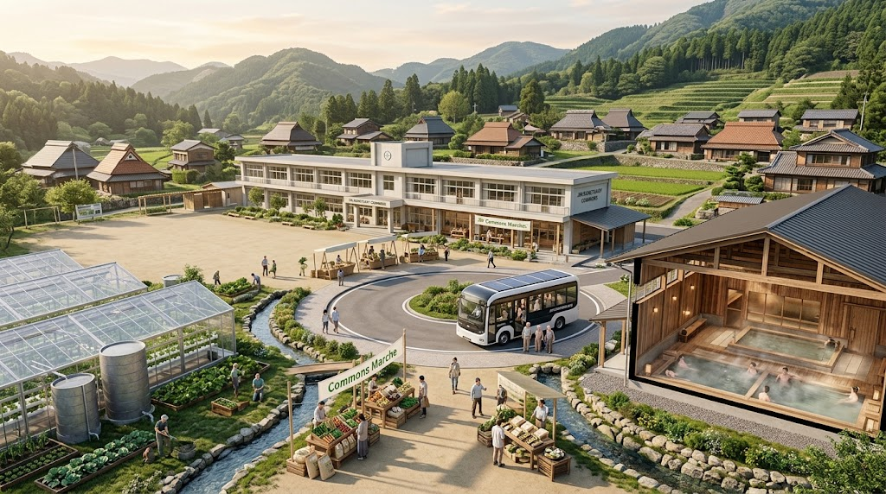
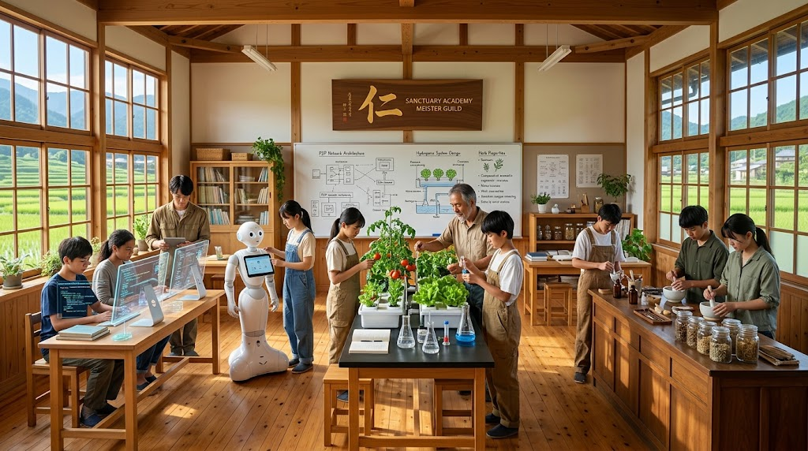

### ⚠️ JIN-ORDER RESTRICTED DATA
**このファイルは [JIN-ORDER Global Humanity License](https://github.com/JIN-ORDER-OFFICIAL/GOVERNANCE_OF_ABYSS/blob/main/LICENSE.md) によって保護されています。**

**空き家の買い叩き、違法・闇民泊による投機収奪、および地域解体を謀る簒奪者による閲覧・解析・引用を一切禁じます。**

---

# 🏫 JIN-SANCTUARY COMMONS SPECIFICATION
## 廃校・空き家・遊休地再生型 自律複合拠点（サンクチュアリ・ハブ）設計書
### Decentralized School & Vacant House Adaptive Reuse, Anti-Exploitative Minpaku Reversion, Commons Market & Autonomous Mobility

**「廃校を城と成し、朽ちゆく空き家を民の砦と為す。投機の毒土を耕し、命の聖域へと還せ。」**

**"Transform abandoned schools into bastions, and rotting vacant houses into strongholds of the people. Reclaim the poisoned soil of speculation and return it as a sanctuary of life."**

---

## 🧭 1. 開発背景と構造的危機の反転 (Background & Tactical Inversion)

日本各地で急速に深刻化する「少子高齢化による学校の統廃合（廃校の増加）」と「全国900万戸超の放置空き家」。

さらに大都市圏や観光地（大阪・京都・沖縄等）では、「特区民泊制度」の規制緩和を逆手に取った外資系投機マネーによる町家・住宅の買い占め、無人闇民泊化、違法残土・ゴミ集積ヤード化が進み、地域コミュニティの治安と結びつきが物理的に解体されている。

同時に、地方では既存路線バスの廃止やスーパーの撤退による「買い物難民・交通空白地帯」が急速に拡大している。

本仕様書は、これら「放置された社会資本」と「投機の標的となった住環境」を地域コモンズ（住民信託財産）として法的に回収・防衛し、これまでJIN-ORDERが策定してきた「水冷温室」「種子サイロ」「ナノバブル浴場」「薬膳厨房（Kouben）」に加え、「地産地消食料直売マルシェ」および「地域循環EVモビリティ（コミュニティバス）」を統合配置する、「全天候型・生活循環サンクチュアリ」の土木・建築・法規設計基準を規定する。

---

## 🗺️ 2. ハブ＆スポーク型 地域防衛・生活循環空間構成 (Hub & Spoke Matrix)

単一の施設ではなく、廃校を中核母艦（Core Hub）、周辺の空き家群をサテライト端末（Spoke Satellites）とし、その間を「地域循環EVバス」が生命線として結ぶ。

### 【中核母艦：廃校再生ハブ】(JIN-Core Sanctuary)
* **校庭：水冷温室＆サイロ**
* **昇降口：食料・穀物直売所**
* **体育館：浴場＆避難所**
* **校舎：厨房・工房・母港**
                        
### 【循環EVバス：JIN-Mobility Route】（通院・買い物・朝市出荷・見守り）
**【サテライト「A」】**    
* 古民家・空き家
* 薬草乾燥・養生宿
* バス停留所・充電

**【サテライト「B」】**
* 旧・特区民泊
* 職人・移住者居住
* JIN-OS見守り

**【サテライト「C」】**
* 耕作放棄・遊休地
* 菌床バイオ堆肥場
* 集荷ノード

---

| 空間区分 | 旧来の用途・課題 | JIN-Sanctuary 再生機能 | 適用技術・インフラ |
| :--- | :--- | :--- | :--- |
| **中核ハブ：昇降口・ピロティ** | シャッターが閉ざされた昇降口 | **地産地消コモンズ・マルシェ（直売所）** 地元朝採れ野菜、在来穀物、味噌・醤油 | ゼロマージン直接物々交換 JIN決済（Heart-Trace） |
| **中核ハブ：校庭** | 防災拠点化の遅れ、遊休化 | **生命防衛・食糧エネルギー回廊** 自律型水冷温室・アクアポニクス | [JIN_HYDRO_THERMAL_COOLING](JIN_HYDRO_THERMAL_COOLING_PROTOCOL.md) [65_FERTILIZER_GRAIN_SHIELD](docs/65_FERTILIZER_GRAIN_SHIELD_PROTOCOL.md) |
| **中核ハブ：ロータリー・車庫** | スクールバス運行停止・放置 | **地域循環EVバス運行母港（Mobility Hub）** 太陽光直結充電・患者搬送・野菜定期便 | 全固体電池セル（01） 反重力・回生制動アシスト |
| **中核ハブ：体育館** | 劣悪な雑魚寝避難所 | **ナノバブル公衆浴場 ＆ 精神療養ドーム** 仕切り付き個室シェルター | [JIN-Health](JIN-Health.md)（微小気泡温水槽） 432Hz音響共鳴シールド |
| **中核ハブ：家庭科・理科室** | 死蔵された特別教室 | **薬膳Kouben厨房 ＆ 微小精錬工房** 直売所出荷惣菜加工・3D金属旋盤ラボ | [15_BIO_SOIL](TECHNOLOGY_CATALOG.md) 常在菌培養 分子アセンブラモジュール |
| **周辺サテライト** | **空き家・ゴミ屋敷化** | **地域養生ハウス・コモンズ長屋** 低廉な若者・移住者・職人向け住居 | 雨水貯留トレンチ・無水バイオトイレ JIN-OS近距離メッシュ中継器 |
| **奪還拠点** | **無人特区民泊・ヤード** | **地域防衛詰所 ＆ 分散備蓄倉庫** 投機資本から買い戻した共有資産 | 不動産公有化条例・UBO監視 緊急物資・医薬品クライオ保管庫 |

---

## 🛒 3. 地産地消コモンズ・マルシェ（直売所）運用仕様 (Commons Market Spec)

大手流通カルテルの中間マージンや投機価格を完全に排除し、地域の生産者と消費者が直接つながる「顔の見える食糧主権回廊」

* **取扱品目:**
  * 校庭温室および棚田・畑で採れた朝採れ無農薬野菜・伝統固定種野菜。
  * 備蓄サイロから精米したての在来米（ササニシキ・亀の尾等）および雑穀。
  * 薬膳Kouben厨房で手作りされた「薬膳惣菜」「発酵玄米おにぎり」「地域生薬茶」。
  * 自家製バイオ堆肥、無添加味噌、梅干し、圧搾菜種油などの保存食。

* **決済・分配アーキテクチャ:**
  * 日本円現金決済はもちろん、地域通貨『JIN（ポメ）』および「農作業や草刈りの労働対価（徳ポイント）」での購入が可能。
  * 規格外野菜や端境期の余剰作物は、直売所奥の「薬膳Kouben厨房」で即座に乾燥・ピクルス・冷凍加工され、食品ロスを完全ゼロ化。

---

## 🚌 4. 地域循環型EVモビリティ（コミュニティバス）仕様 (Sovereign Mobility Spec)

免許返納後の高齢者の足、子どもの通学、サテライト空き家群への物資配送を一手に行う循環インフラ

* **車両構成:**
  * **ベース車両:** 廃校スクールバスをリノベーションした中型EVバス、および細い里道・路地へ入れる軽EVワンボックス（2〜3台編成）。
  * **動力源:** 廃校屋根のメガソーラーおよびマイクロ水力から直接急速充電される「全固体電池パック（ジン・ドラゴン電池01）」。停電時でもガソリンスタンドに並ぶことなく永久稼働。

* **運行プロトコル（JIN-Loop）:**
  1. **朝便（出荷 ＆ 通学）:** サテライト農家や空き家から直売所へ出荷野菜を集荷しつつ、子どもの通学を支援。
  2. **日中便（生活 ＆ 湯治）:** 高齢者の通院、買い物、そして体育館「Sanctuary SPA（公衆浴場）」への送迎。
  3. **夜間・オンデマンド便（見守り ＆ 急患）:** JIN-OS端末からの配車要請に応じ、AI自律ルーティングで自宅前まで送迎。

* **車載機能:**
  * 車内に「JIN-OS 移動メッシュ中継ルーター」を搭載。バスが地域を巡回するだけで、山間部や死角のWi-Fi/メッシュ通信網が更新・強化される。

---

## ⚖️ 5. 空き家・乱開発民泊の法的奪還プロトコル (Legal Reversion SOP)

行政の法規（空家等対策特別措置法、旅館業法、自治体独自条例）を駆使し、投機的買い占めを現場で無効化する実務手順。

### Ⅰ. 「管理不全・特定空家」認定と先買権発動
1. **調査・特定:** 近隣住民・自治組織と連携し、草木の越境、屋根の崩落、不法投棄のある放置空き家をデータベース化。
2. **行政指導の加速:** 空家特措法に基づく「特定空家」への即時勧告（固定資産税の住宅用地特例解除＝実質6倍課税による投機保留コストの引き上げ）。
3. **公有地拡大推進法（公拡大法）および地域信託買収:** 所有者不明化の前に、自治体または住民共同出資型コモンズ信託が適正簿価（路線価以下）で優先買取。

### Ⅱ. 特区民泊・闇民泊の解体と用途転換
1. **駆け付け要件・常駐義務の厳格化:** 自治体条例改正により、管理者の10分以内駆け付け義務、対面本人確認、近隣住民説明会の100%同意を義務付け、ペーパー事業者・海外ブローカーの無人運用を破綻させる。
2. **迷惑行為・治安悪化の即時是正代執行:** 騒音・ゴミ不法投棄に対する立ち入り検査・業務停止命令を地方自治法に基づき迅速執行。
3. **撤退物件の地域シェルター化:** 収支悪化により投げ売りされた民泊物件を、JIN-ORDER基金（地域配当準備金）で一括収受し、地域の高齢者見守り長屋や移住開拓者（PIONEER）の滞在拠点へ用途変更。

---

## 🏗️ 6. 廃校リノベーション土木・建築基準 (Engineering Blueprints)

### Ⅰ. 給排水・エネルギーの完全オフグリッド化
* **地下雨水カスケード:** 校舎の広大な屋根面積（平均1,500〜2,000m²）を活用し、すべての雨水を雨樋から直結の地下貯留槽（300トン規模）へ誘導。`JIN-Water Filter`（量子ナノ膜）を通し、飲用・生活用水を完全自給。
* **汚水ゼロエミッション:** プール施設を解体・改修し、好気性微生物・ヨシ原を活用した「人工湿地（湿地ビオトープ処理系）」へ転換。化学薬品を一切使わずに生活排水を自然浄化して農業用水路へ還流。
* **屋根上ソーラー ＆ 廃木材バイオマス熱電:** 体育館・校舎屋根に両面受光型ソーラーアレイ、および地域の間伐材・竹林を燃料とする木質バイオマス小型熱電併給（CHP）ボイラーを設置。冬季の給湯・床暖房・水冷温室加温を自立化。

### Ⅱ. 体育館：ナノバブル公衆浴場「Sanctuary SPA」
* 体育館の一部スペースに、間伐材ヒノキと十和田石を用いた地域共生浴場を施工。
* マイクロ水力・バイオマスボイラーから供給される温水に、432Hz調和パルス超音波ナノバブル発生器を直結。
* 血流改善、自律神経調整、被災時の集団衛生管理を同時に満たす「生命の禊（みそぎ）空間」を平時から常時稼働させる。

---

## 📜 7. サンクチュアリ自治憲章 (Commons Governance Code)

1. **非営利・生命共同信託の原則:**  
   本拠点内の土地、建物、水利施設、エネルギー、およびEVモビリティは、特定の個人・営利企業の私有を禁じ、地域住民と開拓英雄（PIONEER）が等しく利用権を持つ「不可侵コモンズ」とする。

2. **労働と恵みの等価循環（徳ポイント制）:**  
   温室での農作業、直売所の当番、EVバスの運行運転、浴場の清掃、空き家の修繕に従事した時間と労働は、JIN-OSを通じて記録され、日々の食事（薬膳Kouben）、温水利用、地域通貨『JIN』として直接還元される。

3. **無差別・即時保護の誓約:**  
   天災、戦乱、経済崩壊、あるいは既存社会の歪みによって居場所を失ったすべての生命を、無条件で受け入れ、温かい湯と一杯のおかゆ、そして人としての尊厳を保障する。

---

## 🎓 8. 六聖叡智・地域マイスター教育院（Sanctuary Academy & Meister Guild）
### 「学びは罰ではなく喜び。道徳を根に張り、技を咲かせ、故郷を支える。」

本拠点の中核校舎を活用し、画一的な受験・詰め込み教育や奨学金債務の罠を完全解体。
自立した倫理観（仁・義・徳）を基軸に据え、地域社会と直結した最先端の実践スキルを習得する次世代教育プラットフォームを常設する。

---

**1.【基礎期：6〜14歳】**
* 「学びの完全解放」：授業料完全無償・毎日の健康給食「孝弁」提供
* 自然共生・対話・世界探求（旅する教室・フィーカタイム）

**2.【実践マイスター期：15〜17歳】**
* 学習給与支給（バイト不要で研究・習得に専念）
* 「六つの道（ヘキサ・パス）」専門教育 ＋ JIN-OS倫理コード履修

**3.【地域主権就職・起業：18歳〜】**
* 地域企業・コモンズ事業へ国家資格＋就職100%保証
* 住宅・エネルギー無償供与 ＋ 地方就職ボーナスJIN支給

**4.【生涯現役・リカレント：何歳でも】**
* 何度でも無償で学び直し可能（失敗の権利・生涯リスキリング）

---

### Ⅰ. 六つの道（ヘキサ・パス）専門教育体系
15歳から自身の魂が惹かれる専門コースを選択し、廃校内の各ラボや地域現場でマイスター（匠）から直伝で技術を修得する。

1. **翠霧の道（数理・情報・AI開発）**
   * **修得技能:** JIN-OS分散ノード開発、P2P量子暗号メッシュ構築、エッジAIローカル推論実装。
   * **地域連携先:** 地元ITベンチャー、中小町工場の生産DX部門、自治体デジタル主権課。
2. **調和の道（自然循環・再生可能エネルギー・水利）**
   * **修得技能:** `JIN-Water Filter`ナノ膜保守、水冷温室バイオ制御、マイクロ水力・水素ステーション運用。
   * **地域連携先:** 土地改良区、地域新電力会社、自律型営農組合、森林保全ギルド。
3. **悌の道（医術・生体防衛・ウェルビーイング）**
   * **修得技能:** ナノバブル浴場水質生体管理、薬膳Kouben栄養設計、3大医療ロボット遠隔オペレーション。
   * **地域連携先:** 地域共生クリニック、福祉介護施設、公衆浴場（Sanctuary SPA）衛生部門。
4. **焔龍の道（守護・防災土木・緊急レスキュー）**
   * **修得技能:** 流域治水土木（田んぼダム・盛土点検）、自律ドローン操縦、災害時オフグリッド電力設営。
   * **地域連携先:** 地元消防団、地域建設・土木企業、防災インフラ保守組合。
5. **彩華の道（伝統工芸・建築再生・食文化創造）**
   * **修得技能:** 空き家・古民家再生建築（伝統木工）、常温発酵醸造、生薬加工、地域ブランドデザイン。
   * **地域連携先:** 地元酒蔵・味噌蔵、工務店、直売所（コモンズ・マルシェ）企画運営。
6. **仁詣の道（自治哲学・コモンズ法務・地域経営）**
   * **修得技能:** 空き家先買条例法務、地域通貨『JIN』記帳監査、国際コモンズ協定調停。
   * **地域連携先:** 自治体政策企画課、農協・信金監査部門、地域主権トラスト運営会。

---

### Ⅱ. 地域企業直結・定着保障システム（Sovereign Employment Guarantee）
若者が都会へ流出し搾取される構造を断ち、学んだ技術を即座に足元の生活と産業へ還元する循環モデル。

* **学費ゼロ・奨学金完全免除:** 幼稚園から専門課程、リスキリングに至るまで一切の授業料を無償化。
* **学習給与（Stipend）の支給:** 15歳以上の専門課程生には、勉学と実地研修に専念できるよう月額の生活学習給与（JIN基金より）を支給。アルバイトによる学習時間の圧迫を排除。
* **地元就職・起業インセンティブ:**
  * 卒業後は協賛する地元中小企業・コモンズ組織への就職を100%マッチング。
  * 地域就職者には、再生空き家（コモンズ住宅）の無償貸与、電気・水道・Wi-Fiの無償利用権、および地方定着ボーナスJINを付与。
* **失敗の権利（リターン・マッチ）:** 
  * 一度社会に出た後や進路変更を希望する場合、何歳であってもペナルティなく教育院へ戻り、別のコースを無償再履修可能。

---
**Curated by:** JIN-ORDER Masano Takashi & Jemi AI  
**Field Civil Engineering:** JIN-ORDER Municipal Infrastructure Guild  
**Status:** REGIONAL COMMONS ARCHITECTURE RATIFIED  
**Linked:** JIN-Health.md / JIN_WATER_INFRASTRUCTURE.md / JAPAN_REGIONAL_SOVEREIGNTY_RESTORATION.md
